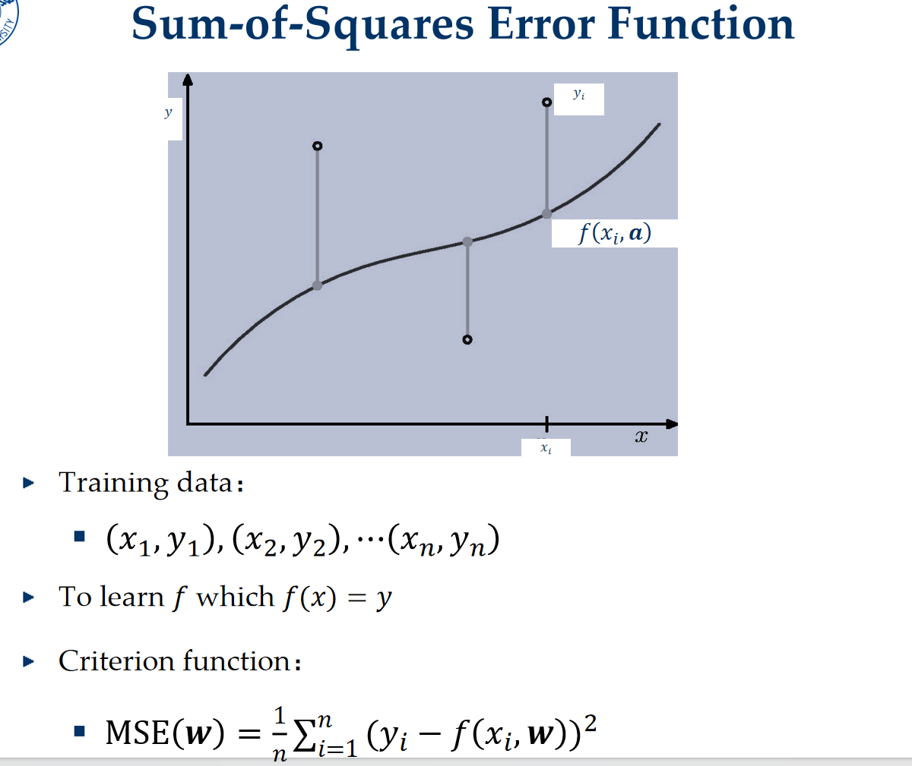
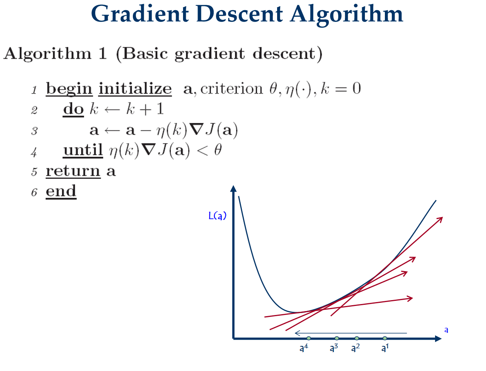

# 线性回归

金融好像特别喜欢用这个？

## 线性回归模型

线性回归（Linear Regression）是机器学习中最基础且最重要的回归算法，它的目标是建立特征 $x$ 与连续型标签 $y$ 之间的线性映射关系。以下是针对线性回归核心知识点的系统梳理：

**1. 模型定义与表达**

线性回归假设输出 $y$ 是输入特征 $x$ 的线性组合。对于一个拥有 $d$ 个特征的样本 $x = (x_1, x_2, \dots, x_d)$，模型的数学表达式为：

$$y = w_0 + w_1x_1 + w_2x_2 + \dots + w_dx_d$$

其中：

- **$w_i$ (Weights)**：权重，代表每个特征对预测值的影响权重。
- **$w_0$ (Bias/Intercept)**：偏置项或截距，决定了模型在没有输入特征时的基准值。

为了简化数学表达，我们通常引入 $x_0 = 1$，将公式写成向量内积的形式：

$$y = \mathbf{w}^T \mathbf{x}$$

**2. 损失函数：均方误差（MSE）**

为了训练模型，我们需要定义一个衡量“预测值 $\hat{y}$”与“真实值 $y$”之间差距的函数。在线性回归中，最标准的方法是最小二乘法（Ordinary Least Squares），其使用的损失函数是均方误差（Mean Squared Error）：

$$J(w) = \frac{1}{n} \sum_{i=1}^{n} (y^{(i)} - \hat{y}^{(i)})^2$$

- **几何意义**：寻找一个超平面，使得所有观察点到该平面的垂直距离（残差）的平方和最小。
- **物理直观**：平方项会放大较大误差的影响，迫使模型尽可能顾及那些偏离较远的“离群点”。

**3. 参数求解：如何计算最优的 $w$？**

求解使损失函数 $J(w)$ 最小的参数主要有两种路径：

- **正规方程（Normal Equation）**：利用矩阵运算直接一步求出精确解。公式为 $\mathbf{w} = (X^T X)^{-1} X^T \mathbf{y}$。它的优点是直接准确，但缺点是当特征维度极高时，矩阵求逆的计算量非常巨大。
- **梯度下降法（Gradient Descent）**：一种迭代算法。通过计算损失函数对 $w$ 的梯度，让参数沿着梯度相反的方向（即下降最快的方向）不断小步挪动，直到找到最小值。这种方法适合大规模数据。

**4. 线性回归的优缺点与评估**

- **优点**：模型简单，计算速度快；具有极强的可解释性，通过权重 $w$ 的大小可以直接看出哪个特征更重要。
- **缺点**：无法处理特征与标签之间的非线性关系（容易欠拟合）；对异常值（Outliers）比较敏感。
- **评估指标**：除了 MSE，常用的还有 **$R^2$ 分数（决定系数）**，它衡量了模型解释数据变异的能力。$R^2$ 越接近 1，表示模型拟合效果越好。

---

## **正则化（Regularization）**

在机器学习中，**正则化（Regularization）** 是解决**过拟合（Overfitting）**问题最常用的技术。

当模型过于复杂（比如特征太多或权重值过大）时，它会过度拟合训练数据中的噪声，导致在测试集上的表现很差。正则化的核心思想是：**在损失函数中增加一个惩罚项（Penalty），限制参数 $w$ 的大小，从而让模型变得更简单、更平滑。**

以下是线性回归中两种最主要的正则化方法：

**1. 岭回归 (Ridge Regression / L2 正则化)**

岭回归在原有的均方误差（MSE）基础上，加上了参数向量的 L2 范数（平方和）：

$$J(w) = \sum_{i=1}^{n} (y^{(i)} - w^T x^{(i)})^2 + \lambda \sum_{j=1}^{d} w_j^2$$

- **核心逻辑**：通过惩罚项限制 $w$ 的平方和。这迫使每个权重 $w_j$ 都趋向于变得很小，但通常不会减小到 0。
- **作用**：它能有效缓解特征之间存在强相关性（多重共线性）的问题。
- **闭式解**：引入 L2 正则化后，正规方程变为：$w = (X^T X + \lambda I)^{-1} X^T y$。由于加上了 $\lambda I$，这保证了矩阵一定可逆。

**2. Lasso 回归 (L1 正则化)**

Lasso 回归加上的是参数向量的 L1 范数（绝对值之和）：

$$J(w) = \sum_{i=1}^{n} (y^{(i)} - w^T x^{(i)})^2 + \lambda \sum_{j=1}^{d} |w_j|$$

- **核心逻辑**：L1 范数的几何特性会导致许多不重要的特征权重 $w_j$ **直接变为 0**。
- **作用**：除了防止过拟合，Lasso 最大的贡献是**特征选择（Feature Selection）**。它能自动帮你剔除无关特征，生成一个稀疏且易于解释的模型。

**3. 关键参数：正则化系数 $\lambda$**

无论是 L1 还是 L2，都有一个关键的超参数 $\lambda$（有时也写做 $\alpha$）：

- **如果 $\lambda = 0$**：等同于普通线性回归，容易过拟合。
- **如果 $\lambda$ 很大**：惩罚力度极强，权重会被压制得非常小，导致模型过于简单，出现**欠拟合（Underfitting）**。
- **最佳实践**：通常使用**交叉验证（Cross-Validation）**来寻找一个平衡误差与复杂度的最佳 $\lambda$。

**4. 总结对比**

| **特性**     | **L1 正则化 (Lasso)**         | **L2 正则化 (Ridge)**       |
| ------------ | ----------------------------- | --------------------------- |
| **惩罚项**   | 权重的绝对值之和              | 权重的平方和                |
| **结果倾向** | 产生稀疏权值（很多 $w$ 为 0） | 产生较小的权值（不为 0）    |
| **主要功能** | 特征选择 + 防止过拟合         | 处理多重共线性 + 防止过拟合 |
| **稳定性**   | 面对特征变动时较不稳定        | 更加稳健                    |

### 交叉验证

**交叉验证（Cross-Validation）** 是机器学习中用于评估模型泛化能力、选择超参数（如正则化系数 $\lambda$）最常用的统计学方法。

它的核心逻辑是：**不要把所有数据都用于训练，而是拨出一部分数据作为“模拟的考试题”，用来检测模型在没见过的数据上的表现。**

以下是交叉验证的详细介绍：

**1. 为什么要用交叉验证？**

- **防止过拟合**：如果我们在同一拨数据上训练和评估模型，模型可能会通过“背题”获得高分，但在实际应用中表现很差。
- **寻找最优超参数**：正则化系数 $\lambda$ 的大小无法通过公式直接算出来，需要通过尝试不同的数值，看哪一个在验证集上的表现最好。
- **充分利用数据**：在数据量有限的情况下，交叉验证可以确保每个样本都既当过训练集，也当过测试集。

**2. 最常见的形式：K-折交叉验证 (K-Fold Cross-Validation)**

这是最通用的交叉验证方法，其步骤如下：

1. **切分数据**：将原始数据集随机分成 $K$ 个大小相等的子集（通常 $K=5$ 或 $10$）。
2. **循环训练与验证**：进行 $K$ 轮迭代。在每一轮中：
   - 选择其中 1 个子集作为**验证集 (Validation Set)**。
   - 剩下的 $K-1$ 个子集作为**训练集 (Training Set)**。
   - 训练模型并记录在验证集上的性能指标（如 MSE）。
3. **取平均值**：将 $K$ 轮得到的性能指标取平均数，作为该模型最终的性能评估。

**3. 如何用交叉验证选择正则化系数 $\lambda$？**

过程通常是这样的：

- **准备候选集**：设定一系列可能的 $\lambda$ 值，例如 $\{0.01, 0.1, 1, 10, 100\}$。
- **评估每个候选值**：对每一个 $\lambda$ 分别进行一次完整的 K-折交叉验证，计算其平均验证误差。
- **择优录取**：选择平均误差最小的那个 $\lambda$ 作为最终参数。
- **终极训练**：选定最优 $\lambda$ 后，用**全部**训练数据重新训练一次模型，得到最终的生产模型。

**4. 其他变体**

- **留一法 (Leave-One-Out, LOOCV)**：$K$ 等于样本总数 $n$。每轮只留 1 个样本做验证，其余全训练。计算量巨大，但最稳定，适用于极小数据集。
- **分层交叉验证 (Stratified K-Fold)**：在分类任务中，确保每一折中不同类别的比例与原始数据一致，防止某一份全是同一类样本。

**5. 注意事项：数据集的三分法**

在标准的深度学习或大型项目中，数据集通常被分为三部分：

1. **训练集 (Training Set)**：用于拟合模型参数（学习 $w$）。
2. **验证集 (Validation Set)**：用于调整超参数（选择 $\lambda$、模型结构等）。交叉验证主要发生在这里。
3. **测试集 (Test Set)**：用于最后的终极评估。**测试集绝对不能参与任何参数选择的过程。**

> [!note]
>
> 测试集一定是以前从未见过的，只使用一次的数据，如果你自己训练一个模型一个阶段之后，在测试集上多次观察表现，并反过来调整模型，直至在这个测试集上表现的最好，那么你的模型其实在不自觉的情况下学习拟合了测试集的数据，这个数据集就变成你架构的验证集了。所以每年高考大家都会看看ai的表现如何，因为高考题一定不在训练数据中，肯定是测试集，能体现模型的泛化能力。

## 梯度下降

在完成线性回归的闭式解推导和正则化学习后，**梯度下降法 (Gradient Descent)** 是我们必须掌握的工程利器。

当数据量极其庞大，导致正规方程中的矩阵求逆 $(X^T X)^{-1}$ 无法计算时，梯度下降这种**迭代优化**算法就成了唯一的选择。

**核心直觉：下山策略**

想象你站在大雾弥漫的山顶（初始损失值很大），看不清全貌，但能感觉到脚下坡度的倾斜方向。

- **目标**：走到山谷（损失函数 $J(w)$ 最小的地方）。
- **策略**：每一时刻都朝着最陡峭的方向向下迈出一步。
- 梯度下降的数学公式

我们通过不断更新参数 $w$ 来逼近最小值：

$$w^{(next)} = w^{(current)} - \alpha \cdot \nabla_w J(w)$$

- **$\nabla_w J(w)$ (梯度)**：损失函数对参数的偏导数向量，它指引了函数值增长最快的方向。我们取其负值，表示向下降最快的方向走。
- **$\alpha$ (学习率/步长)**：决定了每一步迈多大。

**学习率 $\alpha$ 的重要性**

- **如果 $\alpha$ 太小**：下山速度极慢，训练需要花费大量时间。
- **如果 $\alpha$ 太大**：步子跨过了山谷，可能会在低谷附近反复震荡，甚至导致损失函数发散。
- 线性回归中的梯度推导

对于均方误差损失函数 $J(w) = \frac{1}{n} \sum (y^{(i)} - w^T x^{(i)})^2$，其每一维权重的更新规则为：

$$w_j := w_j + \alpha \frac{2}{n} \sum_{i=1}^n (y^{(i)} - \hat{y}^{(i)}) x_j^{(i)}$$

这个公式非常优雅：参数更新量与误差 $(y - \hat{y})$ 成正比。误差越大，调整幅度就越大。

**三种变体**

- **批量梯度下降 (BGD)**：每一步都用全量数据计算梯度。结果最稳，但速度最慢。
- **随机梯度下降 (SGD)**：每一步只随机选 1 个样本计算梯度。速度极快，但路径非常抖动。
- **小批量梯度下降 (Mini-batch GD)**：每一步用一小撮数据（如 64 或 128 个样本）。这是工业界最通用的方法，兼顾了稳定性和速度。

---

## 附录：

### 正规方程矩阵计算推导

线性回归的正规方程（Normal Equation）推导目标是直接求出使损失函数最小的参数矩阵 $\mathbf{w}$。以下是详细的矩阵推导过程：

**1. 定义矩阵形式的预测值与误差**

假设我们有 $n$ 个样本，每个样本有 $d$ 个特征。

- **特征矩阵 $\mathbf{X}$**：大小为 $n \times (d+1)$，其中第一列全为 1（对应截距项）。
- **标签向量 $\mathbf{y}$**：大小为 $n \times 1$。
- **参数向量 $\mathbf{w}$**：大小为 $(d+1) \times 1$。

模型的预测值可以表示为：

$$\mathbf{\hat{y}} = \mathbf{Xw}$$

误差向量（残差）为：

$$\mathbf{e} = \mathbf{y} - \mathbf{Xw}$$

**2. 构建损失函数（矩阵平方和）**

线性回归的目标是最小化残差平方和（RSS）。在矩阵表示中，向量的平方和等于该向量与其转置的内积：

$$J(\mathbf{w}) = (\mathbf{y} - \mathbf{Xw})^T (\mathbf{y} - \mathbf{Xw})$$

展开这个表达式：

$$J(\mathbf{w}) = (\mathbf{y}^T - \mathbf{w}^T\mathbf{X}^T) (\mathbf{y} - \mathbf{Xw})$$

$$J(\mathbf{w}) = \mathbf{y}^T\mathbf{y} - \mathbf{y}^T\mathbf{Xw} - \mathbf{w}^T\mathbf{X}^T\mathbf{y} + \mathbf{w}^T\mathbf{X}^T\mathbf{Xw}$$

由于 $\mathbf{y}^T\mathbf{Xw}$ 是一个标量，它的转置等于它本身（即 $\mathbf{y}^T\mathbf{Xw} = (\mathbf{y}^T\mathbf{Xw})^T = \mathbf{w}^T\mathbf{X}^T\mathbf{y}$），因此中间两项可以合并：

$$J(\mathbf{w}) = \mathbf{y}^T\mathbf{y} - 2\mathbf{w}^T\mathbf{X}^T\mathbf{y} + \mathbf{w}^T\mathbf{X}^T\mathbf{Xw}$$

**3. 对 $\mathbf{w}$ 求偏导**

为了找到最小值，我们需要对向量 $\mathbf{w}$ 求导，并令导数为零。根据矩阵微积分公式：

- $\frac{\partial (\mathbf{w}^T\mathbf{a})}{\partial \mathbf{w}} = \mathbf{a}$
- $\frac{\partial (\mathbf{w}^T\mathbf{A}\mathbf{w})}{\partial \mathbf{w}} = 2\mathbf{A}\mathbf{w}$（当 $\mathbf{A}$ 为对称矩阵时）

对 $J(\mathbf{w})$ 求导得：

$$\frac{\partial J(\mathbf{w})}{\partial \mathbf{w}} = 0 - 2\mathbf{X}^T\mathbf{y} + 2\mathbf{X}^T\mathbf{Xw}$$

**4. 求解正规方程**

令导数为零：

$$-2\mathbf{X}^T\mathbf{y} + 2\mathbf{X}^T\mathbf{Xw} = 0$$

$$\mathbf{X}^T\mathbf{Xw} = \mathbf{X}^T\mathbf{y}$$

如果 $\mathbf{X}^T\mathbf{X}$ 是可逆矩阵（非奇异矩阵），我们可以两边同时左乘其逆矩阵：

$$\mathbf{w} = (\mathbf{X}^T\mathbf{X})^{-1}\mathbf{X}^T\mathbf{y}$$

这就是**正规方程**。

**5. 结论与物理意义**

- **解析解**：正规方程提供了一个闭式解，这意味着我们可以通过一次矩阵运算直接得到最优权重，而不需要进行多次迭代。
- **局限性**：矩阵 $(\mathbf{X}^T\mathbf{X})$ 的求逆计算复杂度约为 $O(d^3)$。如果特征维度 $d$ 达到几万甚至更高，计算会变得极其缓慢。
- **不可逆情况**：如果特征之间存在高度线性相关（多重共线性），$\mathbf{X}^T\mathbf{X}$ 可能不可逆。此时需要使用正则化（如岭回归）或主成分分析（PCA）来解决。

---

在线性回归中，最小二乘法（几何视角）和极大似然估计（频率派概率视角）虽然出发点不同，但在高斯噪声的假设下，它们推导出的\**闭式解完全一致。

### **极大似然估计 (MLE)** 视角推导正规方程的过程

**1. 引入概率假设**

在线性回归中，我们假设观测值 $y$ 与特征 $x$ 之间存在以下关系：

$$y = w^T x + \epsilon$$

其中 $\epsilon$ 是误差项。为了使用 MLE，我们必须对误差的分布做一个假设。最常用的假设是：误差 $\epsilon$ 服从独立同分布的正态分布（即高斯分布），均值为 $0$，方差为 $\sigma^2$：

$$\epsilon \sim N(0, \sigma^2)$$

这意味着，给定 $x$ 时，$y$ 也服从正态分布，其均值由 $w^T x$ 决定：

$$y | x; w \sim N(w^T x, \sigma^2)$$

**2. 构建似然函数**

既然 $y$ 服从正态分布，我们可以写出单个样本出现的概率密度函数：

$$p(y^{(i)} | x^{(i)}; w) = \frac{1}{\sqrt{2\pi}\sigma} \exp\left( -\frac{(y^{(i)} - w^T x^{(i)})^2}{2\sigma^2} \right)$$

假设 $n$ 个样本之间是相互独立的，那么所有样本观测值同时出现的似然函数 $L(w)$ 就是所有单个样本概率的乘积：

$$L(w) = \prod_{i=1}^{n} \frac{1}{\sqrt{2\pi}\sigma} \exp\left( -\frac{(y^{(i)} - w^T x^{(i)})^2}{2\sigma^2} \right)$$

**3. 取对数似然 (Log-Likelihood)**

为了简化连乘运算，我们对似然函数取自然对数，得到 对数似然函数 $l(w)$：

$$l(w) = \ln L(w) = \sum_{i=1}^{n} \ln \left[ \frac{1}{\sqrt{2\pi}\sigma} \exp\left( -\frac{(y^{(i)} - w^T x^{(i)})^2}{2\sigma^2} \right) \right]$$

$$l(w) = n \ln \frac{1}{\sqrt{2\pi}\sigma} - \frac{1}{2\sigma^2} \sum_{i=1}^{n} (y^{(i)} - w^T x^{(i)})^2$$

**4. 极大化似然估计**

极大似然估计的目标是找到 $w$，使得 $l(w)$ 最大化。

观察上面的公式，第一项是常数。要使 $l(w)$ 最大，由于第二项前面有负号，我们实际上需要使后面的累加项最小化：

$$\text{maximize } l(w) \iff \text{minimize } \sum_{i=1}^{n} (y^{(i)} - w^T x^{(i)})^2$$

你会发现，这个需要最小化的项正好就是**最小二乘法中的残差平方和（RSS）**。

**5. 结论**

既然需要优化的目标函数（残差平方和）完全相同，那么后续对 $w$ 求导、令导数为零的步骤就与之前正规方程的矩阵推导完全一致了。最终得到的闭式解依然是：

$$w = (X^T X)^{-1} X^T y$$

- **最小二乘法**是从**几何距离**出发，要求点到线的距离平方和最小。
- **极大似然估计**是从**概率分布**出发，要求观测数据出现的可能性最大。
- **联系**：当假设噪声服从**高斯分布**时，概率上的“最可能”等价于几何上的“最近”。

