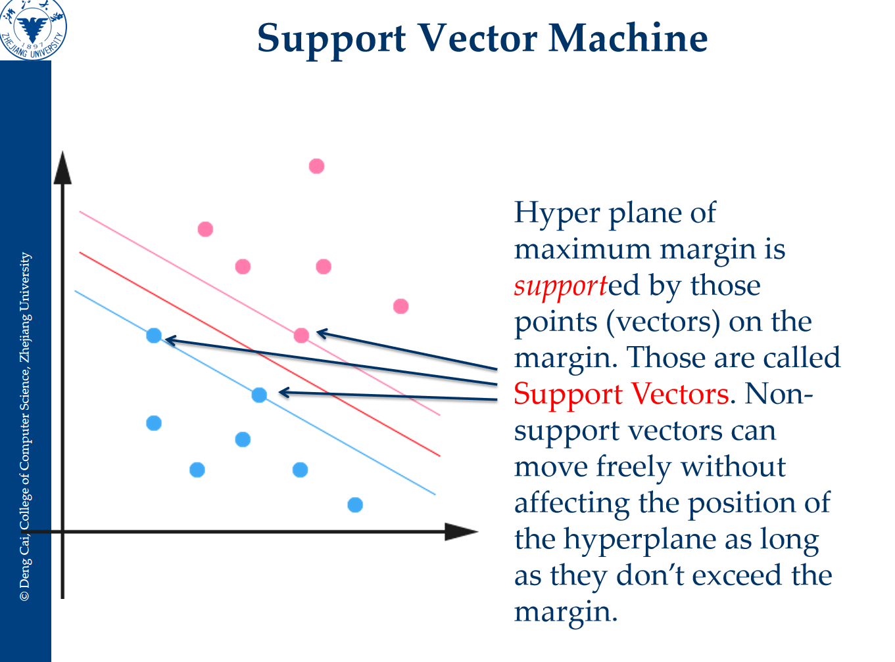

# 线性分类器

## 基本知识

线性分类器（Linear Classifier）是机器学习中处理分类任务最基础的模型。虽然它的名字里有“回归”的影子（比如逻辑回归），但其核心目标是寻找一个**超平面（Hyperplane）**，将不同类别的数据在特征空间中隔开。

以下是关于线性分类器的核心知识梳理：

**核心思想：决策边界**

线性分类器的基本假设是：不同类别的数据可以通过特征的线性组合进行划分。

- **数学表达**：模型通过计算 $f(x) = \mathbf{w}^T \mathbf{x} + b$ 的值来做决策。
- **决策边界**：当 $f(x) = 0$ 时，对应的就是在特征空间中的一个超平面。
- **判别逻辑**：
  - 如果 $\mathbf{w}^T \mathbf{x} + b > 0$，则判定为类别 A。
  - 如果 $\mathbf{w}^T \mathbf{x} + b < 0$，则判定为类别 B。

**典型的线性分类模型**

虽然形式相似，但不同的线性分类器有不同的优化目标：

- **逻辑回归 (Logistic Regression)**：虽然名字叫回归，但它是一个分类模型。它通过 Sigmoid 函数将线性输出映射到 $[0, 1]$ 之间，表示样本属于某一类的概率。
- **线性判别分析 (LDA)**：其核心思想是“投影”。它寻找一个方向，使得数据投影后，**类内方差最小，类间方差最大**。
- **感知机 (Perceptron)**：神经网络的最基本单元。它的目标是尽可能减少分类错误的点，直到找到一个能完美分开数据的平面（如果数据是线性可分的）。
- **支持向量机 (SVM)**：它的目标不仅是“分开”，而且要“分得最开”。它寻找的是具有**最大间隔 (Maximum Margin)** 的超平面，从而提高模型的泛化能力。

**线性分类器的几何意义**

在二分类问题中：

- **参数向量 $\mathbf{w}$**：它是决策平面的**法向量**，决定了平面的方向。
- **偏置项 $b$**：决定了平面距离原点的远近。
- **距离**：样本点到决策平面的距离代表了分类的“置信度”。点距离平面越远，模型对该样本属于该类的判断就越有把握。

**判别函数 (Discriminant Functions)**

在多分类场景下，我们会为每个类别 $\omega_i$ 学习一个判别函数 $g_i(\mathbf{x})$。

- 分类规则是：将 $\mathbf{x}$ 分配给使 $g_i(\mathbf{x})$ 最大的那一类。
- 对于线性分类器，这个函数的形式通常是 $g_i(\mathbf{x}) = \mathbf{w}_i^T \mathbf{x} + w_{i0}$ 。

**优缺点总结**

- **优点**：计算效率极高，模型简单，不易过拟合（尤其是在特征维度很高时），且权重 $\mathbf{w}$ 具有明确的物理含义（代表特征的重要性）。
- **缺点**：只能处理**线性可分**的数据。如果数据分布像“太极图”一样互锁，简单的线性分类器就失效了，此时需要引入核技巧（Kernel Tricks）或深度神经网络。

## 逻辑回归

**逻辑回归的预测模型**

逻辑回归通过 Sigmoid 函数将线性结果映射到 $(0, 1)$ 区间，输出的是样本属于正类的概率：

$$\hat{y} = \sigma(z) = \frac{1}{1 + e^{-(w^T x + b)}}$$

其中 $\hat{y}$ 表示 $P(y=1|x)$。

**交叉熵损失函数公式**

对于单个样本，交叉熵损失（也称为对数损失，Log Loss）的公式为：

$$L(\hat{y}, y) = -[y \ln \hat{y} + (1-y) \ln (1-\hat{y})]$$

我们可以分情况来直观理解这个公式：

- **当真实标签 $y = 1$ 时**：损失为 $-\ln \hat{y}$。如果预测值 $\hat{y}$ 越接近 $1$，损失越趋近于 $0$；如果 $\hat{y}$ 越接近 $0$，损失会趋向正无穷。
- **当真实标签 $y = 0$ 时**：损失为 $-\ln (1-\hat{y})$。如果预测值 $\hat{y}$ 越接近 $0$，损失越小；如果 $\hat{y}$ 越接近 $1$，损失会趋向正无穷。

**代价函数（Cost Function）**

对于包含 $n$ 个样本的整个训练集，我们的目标是最小化所有样本的平均损失，即代价函数 $J(w, b)$：

$$J(w, b) = -\frac{1}{n} \sum_{i=1}^{n} \left[ y^{(i)} \ln \hat{y}^{(i)} + (1-y^{(i)}) \ln (1-\hat{y}^{(i)}) \right]$$

**概率论视角的推导：极大似然估计 (MLE)**

交叉熵公式并不是凭空产生的，它有着严谨的统计学背景。

假设 $y$ 服从伯努利分布（二项分布的单次实验）：

- $P(y=1|x) = \hat{y}$
- $P(y=0|x) = 1 - \hat{y}$

这两个式子可以合并成一个概率质量函数：$P(y|x) = \hat{y}^y (1-\hat{y})^{1-y}$。

为了让观测到的所有样本出现的概率最大，我们构建似然函数并取对数：

$$\ln L(w) = \sum_{i=1}^{n} \ln \left[ (\hat{y}^{(i)})^{y^{(i)}} (1-\hat{y}^{(i)})^{1-y^{(i)}} \right]$$

$$\ln L(w) = \sum_{i=1}^{n} \left[ y^{(i)} \ln \hat{y}^{(i)} + (1-y^{(i)}) \ln (1-\hat{y}^{(i)}) \right]$$

极大化对数似然函数 $\ln L(w)$，等价于极小化这个式子的相反数。你会发现，这正好就是交叉熵损失函数。

> [!note]
>
>  $P(y|x) = \hat{y}^y (1-\hat{y})^{1-y}$ 的本质是将二分类（0 或 1）的概率分布整合进一个统一的数学表达式中。
>
> - **当 $y = 1$ 时**：公式变为 $\hat{y}^1 \cdot (1-\hat{y})^0 = \hat{y}$。结果正是正类的概率。
> - **当 $y = 0$ 时**：公式变为 $\hat{y}^0 \cdot (1-\hat{y})^1 = 1 - \hat{y}$。结果正是负类的概率。

**梯度下降更新规则**

虽然损失函数比线性回归复杂得多，但对 $w$ 求偏导后的更新步长在形式上却是统一的：

$$w_j := w_j - \alpha \frac{\partial J}{\partial w_j} = w_j - \alpha \frac{1}{n} \sum_{i=1}^{n} (\hat{y}^{(i)} - y^{(i)}) x_j^{(i)}$$-

这个优美的特性归功于 Sigmoid 函数与交叉熵损失函数在数学上的完美结合（梯度计算时相互抵消了复杂的项）。

> [!note]- 公式推导
>
> 这个公式之所以如此简洁，是因为 **Sigmoid 函数的导数特性** 与 **交叉熵损失函数的梯度特性** 在相乘时产生了极其完美的“抵消效应”。
>
> 我们可以通过链式法则（Chain Rule）一步步拆解这个推导过程，看看那些复杂的项是如何消失的：
>
> **1. 定义三个关键环节**
>
> 假设我们的目标是计算损失函数 $J$ 对权重 $w_j$ 的偏导数 $\frac{\partial J}{\partial w_j}$。根据链式法则，我们可以将其拆解为：
>
> $$\frac{\partial J}{\partial w_j} = \frac{\partial J}{\partial \hat{y}} \cdot \frac{\partial \hat{y}}{\partial z} \cdot \frac{\partial z}{\partial w_j}$$
>
> 其中：
>
> - $z = w^T x + b$（线性组合输出）
> - $\hat{y} = \sigma(z) = \frac{1}{1 + e^{-z}}$（Sigmoid 后的预测概率）
> - $J = -(y \ln \hat{y} + (1-y) \ln(1-\hat{y}))$（交叉熵损失）
>
> **2. 第一部分：损失函数对预测值的导数**
>
> 对交叉熵损失函数 $J$ 求关于 $\hat{y}$ 的导数：
>
> $$\frac{\partial J}{\partial \hat{y}} = - \left( \frac{y}{\hat{y}} - \frac{1-y}{1-\hat{y}} \right)$$
>
> 合并分母后得到：
>
> $$\frac{\partial J}{\partial \hat{y}} = \frac{\hat{y} - y}{\hat{y}(1 - \hat{y})}$$
>
> 注意： 这里分母出现了 $\hat{y}(1 - \hat{y})$ 项。
>
> **3. 第二部分：Sigmoid 函数的导数（关键点）**
>
> Sigmoid 函数 $\sigma(z)$ 有一个非常著名的特性：它的导数可以用它自己来表示。
>
> $$\frac{\partial \hat{y}}{\partial z} = \sigma(z)(1 - \sigma(z)) = \hat{y}(1 - \hat{y})$$
>
> 发现了吗？ 这个导数项正好与上面损失函数导数的分母一模一样。
>
> **4. 第三部分：线性组合对权重的导数**
>
> 这一步非常简单：
>
> $$\frac{\partial z}{\partial w_j} = \frac{\partial (w_0 x_0 + \dots + w_j x_j + \dots)}{\partial w_j} = x_j$$
>
> **5. 最终的“合体”与抵消**
>
> 现在我们将这三部分乘起来：
>
> $$\frac{\partial J}{\partial w_j} = \underbrace{\frac{\hat{y} - y}{\hat{y}(1 - \hat{y})}}_{第一部分} \cdot \underbrace{\hat{y}(1 - \hat{y})}_{第二部分} \cdot \underbrace{x_j}_{第三部分}$$
>
> 此时，$\hat{y}(1 - \hat{y})$ 在分子和分母中完全抵消了
>
> 最终结果简化为：
>
> $$\frac{\partial J}{\partial w_j} = (\hat{y} - y) x_j$$

> [!note]
>
> - **线性回归**：MSE 损失 + 极大似然（正态分布噪声）
> - **逻辑回归**：交叉熵损失 + 极大似然（伯努利分布噪声）

## SVM 支持向量机

support vector machine支持向量机，目标依旧是找到一个超平面，让离他最近的正负样本点到超平面距离最大。正负样本点到他的距离称为间隔。如图可以看到图中有三个这样的点，而图中其他的点距离超平面非常远，不会影响超平面的选择，也就是说模型确信他们是正样本或者负样本。只有在超平面旁边的这些点，他们的移动或者删除会影响超平面的选择，所以说这几个点支撑起了超平面，所以叫支持向量机，这几个点叫做支持向量。

------

### 1 原始问题构建

1. 距离公式

我们在空间里找一个超平面 $w^T x + b = 0$。

任意一点 $x_i$ 到这个平面的垂直距离 $d$ 是：

$$d = \frac{|w^T x_i + b|}{||w||}$$

2. 缩放技巧（关键点）

SVM 的一个核心假设是：因为 $w$ 和 $b$ 同时扩大或缩小倍数（例如变成 $2w, 2b$），超平面是不变的。为了消除这个不确定性，我们强制规定离超平面最近的那个点（支持向量），其函数值 $|w^T x + b|$ 刚好等于 1。

这样一来：

- 对于支持向量（最近的点）：$|w^T x + b| = 1$
- 对于其他点（较远的点）：$|w^T x + b| > 1$
- 这就得出了我们常见的约束条件：$y_i(w^T x_i + b) \ge 1$ ($y_i$ 是用来表达绝对值的，等于±1)
- 优化目标

此时，间隔（Margin）的宽度就是两个异类支持向量之间的距离：

$$\text{Margin} = \frac{2|w^T x* + b|}{||w||} = \frac{|1| + |-1|}{||w||} = \frac{2}{||w||}$$

要把 $\frac{2}{||w||}$ 变大，等价于要把 $||w||$ 变小。为了方便后续求导（去除根号），我们在数学上将其转化为：

$$\min \frac{1}{2}||w||^2$$

------

### 2 拉格朗日函数

现在的原始问题（Primal Problem）是：

- **Minimize:** $\frac{1}{2}||w||^2$
- **Subject to:** $1 - y_i(w^T x_i + b) \le 0$ （移项变号）

为了解这个带约束的优化问题，我们引入拉格朗日乘子 (Lagrange Multipliers) $\alpha_i \ge 0$。

构造拉格朗日函数 $L(w, b, \alpha)$：

$$L(w, b, \alpha) = \underbrace{\frac{1}{2}||w||^2}_{\text{原目标}} - \sum_{i=1}^{n} \alpha_i \underbrace{(y_i(w^T x_i + b) - 1)}_{\text{约束项}}$$

> **逻辑解释**：我们的目标变成了寻找一个“鞍点”——即对 $w, b$ 求极小，对 $\alpha$ 求极大。

> [!note]
>
> 为什么约束α ≥ 0 ？
>
> **几何解释：梯度的方向对齐**
>
> 让我们看具体的数学向量：
>
> 1. **目标下降方向**：为了让函数变小，我们想顺着负梯度方向走，即 $-\nabla f(x)$。
> 2. **约束边界方向**：约束函数 $g(x) \le 0$ 的梯度 $\nabla g(x)$ 总是指向 $g(x)$ 增大的方向（即指向**可行域外部**，也就是“墙外”）。
>
> 在最优解点（被墙挡住的点）：
>
> 你之所以停下来，是因为你“想去的方向”（$-\nabla f$）和“墙的法线方向”（$\nabla g$）是完全同向的。
>
> $$-\nabla f(x) = \alpha \cdot \nabla g(x)$$
>
> 移项得到：
>
> $$\nabla f(x) + \alpha \nabla g(x) = 0$$
>
> 这里必须要求 **$\alpha \ge 0$**。
>
> - 如果 $\alpha$ 是负数，那就变成了 $-\nabla f$ 和 $\nabla g$ 反向。这意味着你想往回走（回房间中心），既然想回房间，那你根本就不会被墙挡住，你会直接离开墙壁回到内部。那就矛盾了。

------

### 3 求导并代换

为了求极小值，我们要让 $L$ 对 $w$ 和 $b$ 的偏导数为 0。

1. 对 $w$ 求偏导

$$\frac{\partial L}{\partial w} = \frac{\partial}{\partial w}(\frac{1}{2}w^T w) - \frac{\partial}{\partial w}\sum_{i=1}^{n} \alpha_i y_i (w^T x_i)$$

$$\Rightarrow w - \sum_{i=1}^{n} \alpha_i y_i x_i = 0$$

得到关键关系式 ①：

$$\mathbf{w} = \sum_{i=1}^{n} \alpha_i y_i \mathbf{x}_i$$

(这一步说明：最优的法向量 $w$ 其实就是样本向量 $x$ 的加权和！)

2. 对 $b$ 求偏导

$$\frac{\partial L}{\partial b} = - \frac{\partial}{\partial b} \sum_{i=1}^{n} \alpha_i y_i b = - \sum_{i=1}^{n} \alpha_i y_i$$

得到关键关系式 ②：

$$\sum_{i=1}^{n} \alpha_i y_i = 0$$

------

### 4 推导对偶形式

这是最容易晕的地方。我们要把关系式 ① 和 ② **代回** 到拉格朗日函数 $L$ 中，消去 $w$ 和 $b$，只留下 $\alpha$。

原函数：

$$L = \frac{1}{2}||w||^2 - \sum_{i=1}^{n} \alpha_i y_i w^T x_i - \sum_{i=1}^{n} \alpha_i y_i b + \sum_{i=1}^{n} \alpha_i$$

**操作 1：代入 $w$**

将 $w = \sum \alpha_i y_i x_i$ 代入第一项 $\frac{1}{2}||w||^2$：

$$\frac{1}{2}w^T w = \frac{1}{2} (\sum_{i=1}^{n} \alpha_i y_i x_i)^T (\sum_{j=1}^{n} \alpha_j y_j x_j) = \frac{1}{2} \sum_{i=1}^{n}\sum_{j=1}^{n} \alpha_i \alpha_j y_i y_j (x_i^T x_j)$$

**操作 2：处理中间项**

观察 $L$ 的第二项 $\sum \alpha_i y_i w^T x_i$，这里的 $w$ 同样代换掉：

$$\sum_{i=1}^{n} \alpha_i y_i (\sum_{j=1}^{n} \alpha_j y_j x_j)^T x_i = \sum_{i=1}^{n}\sum_{j=1}^{n} \alpha_i \alpha_j y_i y_j (x_i^T x_j)$$

**操作 3：消去 $b$**

观察 $L$ 的第三项 $- \sum \alpha_i y_i b$。

提取 $b$ 出来：$- b \sum_{i=1}^{n} \alpha_i y_i$。

根据之前的关系式 ② $\sum \alpha_i y_i = 0$，这一项直接变成了 0！

合并所有项

现在的 $L$ 变成了：

$$L(\alpha) = \underbrace{\frac{1}{2} \sum \sum \dots}_{\text{第一项}} - \underbrace{\sum \sum \dots}_{\text{第二项}} + \underbrace{\sum \alpha_i}_{\text{第四项}}$$

$$L(\alpha) = \sum_{i=1}^{n} \alpha_i - \frac{1}{2} \sum_{i=1}^{n}\sum_{j=1}^{n} \alpha_i \alpha_j y_i y_j (x_i^T x_j)$$

这就是最终的**对偶问题**。

------

### 我们得到了什么

通过这一通操作，我们把求 $w$ 的问题（可能有无限维，取决于特征维度）转化为了求 $\alpha$ 的问题（维度等于样本数量 $n$）。

**最终的数学形态：**

- **Max:** $\sum \alpha_i - \frac{1}{2} \sum_{i,j} \alpha_i \alpha_j y_i y_j (x_i^T x_j)$
- **Subject to:**
  1. $\sum \alpha_i y_i = 0$
  2. $\alpha_i \ge 0$

为什么这么做？

你看最后那个公式里，样本 $x$ 是以 $x_i^T x_j$ （内积）的形式出现的。

这意味着，如果我们想把数据映射到高维空间 $\phi(x)$，我们根本不需要算出具体的 $\phi(x)$ 是什么，只需要算出它们的内积 $K(x_i, x_j) = \phi(x_i)^T \phi(x_j)$ 即可。这就是**核函数（Kernel Trick）**的数学接口。

> [!tip]
>
> 这后面求解α直接丢给数学库了，核方法求解

## KKT 条件

**KKT 条件 (Karush-Kuhn-Tucker Conditions)** 其实就是我们在拉格朗日乘子法中找到最优解时，**必须同时满足的五条“铁律”**。

对于 SVM 来说，KKT 条件不仅是求解的工具，更是**定义“什么是支持向量”的法律依据**。

------

### 1. SVM 的五条 KKT 铁律

回顾一下，我们的原始约束是 $y_i(w^T x_i + b) \ge 1$，拉格朗日乘子是 $\alpha_i$。

在最优解点 $(w^*, b^*, \alpha^*)$ 处，必须满足以下条件：

1. 梯度为零 (Stationarity)：

   $\nabla_w L = 0$ 和 $\nabla_b L = 0$。

   （这就是我们之前推导出 $w = \sum \alpha_i y_i x_i$ 和 $\sum \alpha_i y_i = 0$ 的来源）。

2. 原始可行性 (Primal Feasibility)：

   所有样本必须分类正确，且在间隔之外：

   $$y_i(w^T x_i + b) - 1 \ge 0$$

3. 对偶可行性 (Dual Feasibility)：

   拉格朗日乘子必须非负：

   $$\alpha_i \ge 0$$

4. 互补松弛性 (Complementary Slackness)

   $$\alpha_i \cdot [y_i(w^T x_i + b) - 1] = 0$$

------

### 2. 互补松弛性如何定义“支持向量”

让我们死死盯着第四条公式：

$$\underbrace{\alpha_i}_{\text{权重}} \times \underbrace{[y_i(w^T x_i + b) - 1]}_{\text{距离边界的余量}} = 0$$

两个数的乘积等于 0，这意味着**至少有一个数必须为 0**。这直接把所有训练样本划分成了两类：

#### 情况 A：普通样本（The Silent Majority）

- **状态**：这些点离分类线很远，分类非常确信。
- **数学特征**：$y_i(w^T x_i + b) > 1$。
- **推论**：既然方括号里的项不等于 0，为了保证乘积为 0，**$\alpha_i$ 必须严格等于 0**。
- **物理意义**：这些样本对模型**没有任何贡献**。在计算 $w = \sum \alpha_i y_i x_i$ 时，它们的权重是 0。你可以把这些数据删掉，决策边界纹丝不动。

#### 情况 B：支持向量（The VIPs）

- **状态**：这些点恰好卡在间隔的边缘线上。
- **数学特征**：$y_i(w^T x_i + b) = 1$。
- **推论**：方括号里的项等于 0。此时，**$\alpha_i$ 可以大于 0**。
- **物理意义**：这些点就是**支持向量 (Support Vectors)**。它们“支撑”起了决策平面。如果你移动或删除这些点，决策边界就会发生改变。

------

### 3. KKT 条件的实际用途：求解 $b$

你可能注意到了，我们在对偶问题里求出了所有的 $\alpha$，从而求出了 $w$。但是 **$b$ (截距)** 去哪了？

KKT 条件就是找回 $b$ 的钥匙。

1. 我们随便找一个**支持向量**（即 $\alpha_j > 0$ 的样本 $(x_j, y_j)$）。

2. 根据 KKT 条件，它必须在边界上，所以：

   

   $$y_j(w^T x_j + b) = 1$$

3. 两边同时乘以 $y_j$（因为 $y_j^2 = 1$）：

   

   $$w^T x_j + b = y_j$$

4. 移项解出 $b$：

   

   $$b = y_j - w^T x_j$$

（在实际工程中，为了数值稳定性，我们通常会把所有支持向量求出的 $b$ 取平均值）。

------

### 4. 总结：SVM 的稀疏性

KKT 条件揭示了 SVM 最美妙的特性——**稀疏性 (Sparsity)**。

虽然我们要处理成千上万的数据，但最终的模型只与极少量的“支持向量”有关（$\alpha_i > 0$）。

- **非支持向量**：$\alpha_i = 0$（不起作用）。
- **支持向量**：$\alpha_i > 0$（决定模型）。

这就是为什么 SVM 在那个年代（内存和算力有限）如此流行，因为它在数学上自动帮你“扔掉”了那些冗余的数据。

至此，硬间隔（Hard Margin）SVM 的完整推导就结束了。**接下来，你是想了解如果数据不是完美线性可分的怎么办（引入松弛变量 $\xi$ 和惩罚参数 $C$），还是想进入“核函数”的魔法世界？**

## 软间隔

**并不是所有的 SVM 都必须通过对偶问题（Dual Problem）来解。**

事实上，在现代大规模线性分类任务中（比如文本分类，特征维度极高），直接求解**原始问题（Primal Problem）**往往比对偶问题快得多。

我们先讲清楚**软间隔（Soft Margin）**，因为它直接引出了原始问题的求解形式——**Hinge Loss**。

------

### 第一部分：软间隔 (Soft Margin) —— 容忍犯错

现实世界的数据往往充满了噪声，或者干脆就是像“太极图”一样有些许重叠，根本找不到一个完美的超平面能把数据 100% 分开。如果强行用硬间隔（Hard Margin），模型会为了照顾那一两个噪声点而把间隔弄得特别窄，导致过拟合。

1. 引入“松弛变量” (Slack Variables)

我们允许某些样本“犯错”，即跑进间隔带内部，甚至跑到对面去。

我们在数学上给每个样本引入一个松弛变量 $\xi_i \ge 0$（读作 xi）：

- **$\xi_i = 0$**：样本分类正确且在间隔外（乖孩子）。
- **$0 < \xi_i < 1$**：样本分类正确，但跑进了间隔带里面（有点越界）。
- **$\xi_i > 1$**：样本跑到了分界线的另一边（完全分错了）。
- 新的约束条件

$$y_i(w^T x_i + b) \ge 1 - \xi_i$$

（意思是：你不用非得大于 1 了，大于 $1 - \xi_i$ 也就放过你了。）

3. 新的目标函数

我们既想保持间隔宽（$\min \|w\|^2$），又想让犯错的总量少（$\min \sum \xi_i$）。于是目标变成了：

$$\min_{w, b, \xi} \frac{1}{2}\|w\|^2 + C \sum_{i=1}^{n} \xi_i$$

- **$C$ (惩罚系数)**：这是一个超参数，你需要手动调。
  - **$C$ 很大**：对错误零容忍（逼近硬间隔），容易过拟合。
  - **$C$ 很小**：允许更多错误，追求更宽的间隔，模型更简单。

------

### 第二部分：原始问题求解 (Primal Solver)

现在回答你的核心问题：**为什么非要转对偶？如果不转，原始问题怎么解？**

转对偶的主要目的是为了使用 Kernel Trick（核技巧） 解决非线性问题。

但是，如果你不需要用核函数（即只做线性 SVM），或者你的数据量 $n$ 极大（百万级），解对偶问题反而慢（因为核矩阵是 $n \times n$ 的）。

此时，直接解原始问题是最佳选择。

1. 将约束转化为损失函数

我们要把上面那个带约束的软间隔问题，变成一个无约束的优化问题。

观察 $\xi_i$ 的性质：

- 如果样本分类正确且在间隔外（$y_i(w^T x_i + b) \ge 1$），则需要的松弛 $\xi_i = 0$。
- 如果样本违规了（$y_i(w^T x_i + b) < 1$），则需要的松弛 $\xi_i = 1 - y_i(w^T x_i + b)$。

这可以合并为一个著名的函数——合页损失 (Hinge Loss)：

$$\xi_i = \max(0, 1 - y_i(w^T x_i + b))$$

2. 无约束的目标函数

我们将 $\xi_i$ 代回原目标函数，就得到了 SVM 的原始形式（Primal Form）：

$$J(w, b) = \underbrace{\frac{1}{2}\|w\|^2}_{\text{正则化项 (L2)}} + C \sum_{i=1}^{n} \underbrace{\max(0, 1 - y_i(w^T x_i + b))}_{\text{Hinge Loss 损失项}}$$

你看，这不就是一个标准的机器学习套路吗？

总损失 = 正则化项 + 经验损失项。

这种形式和逻辑回归非常像，区别只在于逻辑回归用的是对数损失（Log Loss），SVM 用的是合页损失（Hinge Loss）。

3. 如何求解：次梯度下降 (Sub-gradient Descent)

因为 Hinge Loss 在 $1 - y(w^T x + b) = 0$ 这个转折点是不可导的（有个尖角），我们不能用标准的梯度下降，而要用次梯度（Sub-gradient）。

但在实际操作中（比如 Pegasos 算法），这非常简单。我们对 $w$ 求导：

- **情况 A：样本被正确分类且在间隔外（安全）**
  - Loss 是 0，导数也是 0。
  - 梯度只剩下正则项：$\nabla J = w$（忽略常数系数变化）。
  - 更新：$w \leftarrow w - \eta \cdot w$ （其实就是权重衰减）。
- **情况 B：样本在间隔内或分错（违规）**
  - Loss 是 $1 - y_i(w^T x_i)$，导数是 $-y_i x_i$。
  - 总梯度：$\nabla J = w - C y_i x_i$。
  - 更新：$w \leftarrow w - \eta (w - C y_i x_i)$。

这就是著名的 **Pegasos 算法** 的核心逻辑。它不需要解复杂的二次规划，也不需要存巨大的矩阵，只需要像随机梯度下降（SGD）一样，一轮轮喂数据更新 $w$ 即可。

------

### 第三部分：总结与对比

| **特性**       | **对偶问题 (Dual)**                          | **原始问题 (Primal)**                        |
| -------------- | -------------------------------------------- | -------------------------------------------- |
| **求解变量**   | 拉格朗日乘子 $\alpha$                        | 权重向量 $w, b$                              |
| **核心算法**   | SMO 算法                                     | 随机梯度下降 (SGD / Pegasos)                 |
| **擅长场景**   | **非线性分类**（强依赖核函数），中小型数据集 | **线性分类**，超大规模数据集（如文本、广告） |
| **时间复杂度** | 介于 $O(n^2)$ 到 $O(n^3)$                    | $O(n)$ （线性时间！）                        |

**小结：**

- **软间隔**：引入 $\xi$ 和 $C$，承认“水至清则无鱼”，允许模型犯错以换取泛化能力。
- **原始求解**：SVM 本质上就是 **L2 正则化 + Hinge Loss**。如果我们放弃核函数，直接用梯度下降解这个损失函数，速度会快得飞起。

## 核函数

核函数（Kernel Function）是 SVM 最迷人、也是威力最大的部分。它的核心任务非常简单：**解决“线性不可分”的问题**。

想象一下，桌子上放了一堆红豆和绿豆，它们混杂在一起（像同心圆一样），你手里只有一根笔直的木棍（线性分类器），无论你怎么摆这根棍子，都无法把红豆和绿豆完全分开。

这时候该怎么办？

------

**核心思想：升维打击 (Feature Mapping)**

如果我们不仅能在桌面上操作，而是有了“上帝视角”呢？

假设我们猛拍一下桌子，利用红豆和绿豆密度的不同，让所有的红豆都飞到半空中，而绿豆还留在桌面上。

此时，我们只需要拿一张平整的纸（超平面），水平插入红豆和绿豆之间，就能完美地把它们分开了。

这就是核函数的几何直觉：**低维空间里分不开的数据，映射到高维空间后，往往就变得线性可分了。**

- **原始空间**：二维平面，数据像“太极”一样纠缠，分不开。
- **映射函数 $\phi(x)$**：将数据 $x$ 映射到高维空间（比如 3 维、100 维甚至无穷维）。
- **高维空间**：数据变得稀疏且层次分明，我们可以轻松找到一个超平面进行切割。

------

**计算陷阱：维度灾难**

既然升维这么好用，那我们直接把所有数据都映射成无穷维向量 $\phi(x)$，然后再算 SVM 不就行了吗？

不行，算不动。

还记得对偶问题里的公式吗？我们需要计算样本之间的内积：

$$\text{Dual Objective: } \dots - \frac{1}{2} \sum \alpha_i \alpha_j y_i y_j \underbrace{\phi(x_i)^T \phi(x_j)}_{\text{高维内积}}$$

如果映射后的维度是 1 亿维，或者是无穷维，计算两个向量的点积 $\phi(x_i)^T \phi(x_j)$ 会消耗极大的计算资源和存储空间，甚至根本算不出来。

------

**核技巧 (The Kernel Trick)**

**核技巧的奇迹在于：** 我们不需要显式地算出高维向量 $\phi(x)$ 长什么样，我们可以直接在低维空间里算出一个数，而这个数**恰好等于**高维空间里的内积。

我们定义核函数 $K(x_i, x_j)$：

$$K(x_i, x_j) = \phi(x_i)^T \phi(x_j)$$

举个最简单的数学例子（多项式核）：

假设 $x = (x_1, x_2)$ 是 2 维向量。

我们需要一个映射 $\phi(x)$ 把 data 变成 3 维，包含二次项。

- **笨办法（先映射后点积）**：

  1. 映射：$\phi(x) = (x_1^2, \sqrt{2}x_1x_2, x_2^2)$。
  2. 计算 $\phi(x)^T \phi(z)$：非常繁琐。

- 核技巧（直接算）：

  我们发现，如果我们直接计算 $(x^T z)^2$，展开后：

  $$(x_1 z_1 + x_2 z_2)^2 = x_1^2 z_1^2 + 2x_1 z_1 x_2 z_2 + x_2^2 z_2^2$$

  这恰好等于 $\phi(x)^T \phi(z)$！

**结论**：我们根本不需要知道 $\phi(x)$ 具体是什么，也不用去算那个 3 维向量，只需要在原空间里算一下 $(x^T z)^2$，就等同于在高维空间做了内积。这就是“**隐式映射**”。

------

**真正的主角：高斯核 (RBF Kernel)**

在实际应用中，最常用的是 径向基函数（RBF）核，也叫高斯核：

$$K(x, z) = \exp\left(-\frac{||x - z||^2}{2\sigma^2}\right)$$

或者写成 $K(x, z) = \exp(-\gamma ||x - z||^2)$。

**RBF 核的牛逼之处：**

1. **无穷维映射**：通过泰勒展开可以看出，RBF 核相当于把数据映射到了**无穷维**的空间。如果不用核技巧，计算机永远无法处理无穷维向量。
2. **物理直觉（相似度衡量）**：
   - 如果 $x$ 和 $z$ 很近（距离趋近 0），$K(x, z) \approx 1$。
   - 如果 $x$ 和 $z$ 很远，$K(x, z) \approx 0$。
   - 这相当于在每个支持向量的位置“隆起”一个小山包。判别函数本质上就是把这些小山包加权叠加起来。

**决策边界的形状：**

- **线性核**：切一刀，边界是直的。
- **RBF 核**：像是像皮泥一样，边界可以扭曲成任意形状，包围住所有的正类样本。

------

**总结：SVM 的完全体**

到现在，你已经掌握了 SVM 的全部精髓：

1. **最大间隔（Max Margin）**：为了泛化能力强，我们要找最宽的街道。（这是目标）
2. **对偶问题（Dual Problem）**：通过拉格朗日乘子法，把问题转化为样本内积运算，并发现只有少数点（支持向量）有用。（这是手段）
3. **软间隔（Soft Margin）**：引入松弛变量，允许个别点捣乱，防止过拟合。（这是妥协）
4. **核函数（Kernel Trick）**：把内积运算替换成核函数，不动声色地解决了非线性分类。（这是升华）

这套理论极其完备且优美，这也是为什么在深度学习爆发之前，SVM 统治了机器学习领域长达十几年的原因。

------

