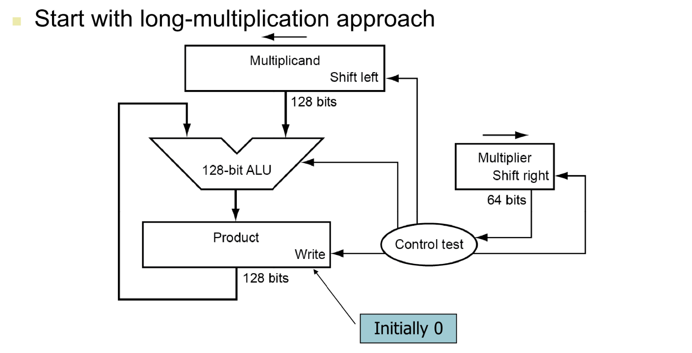
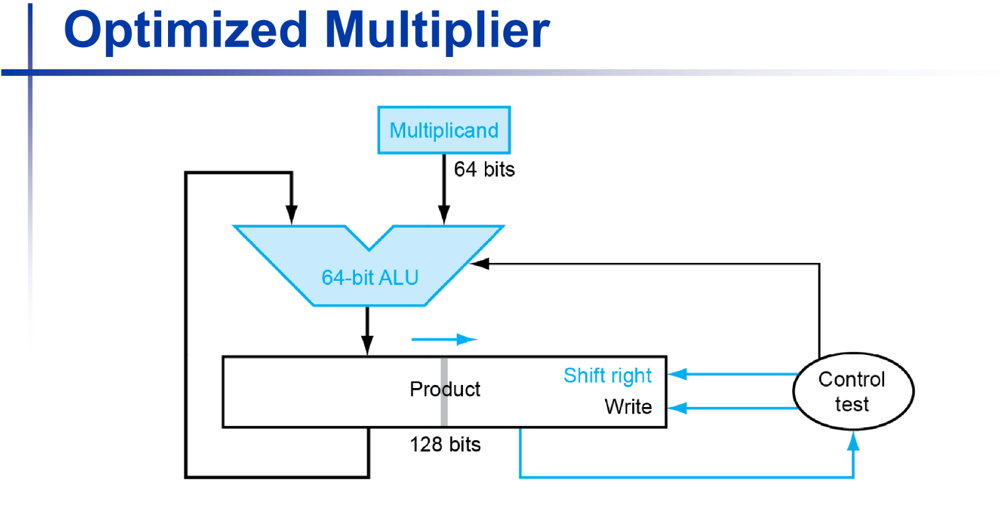
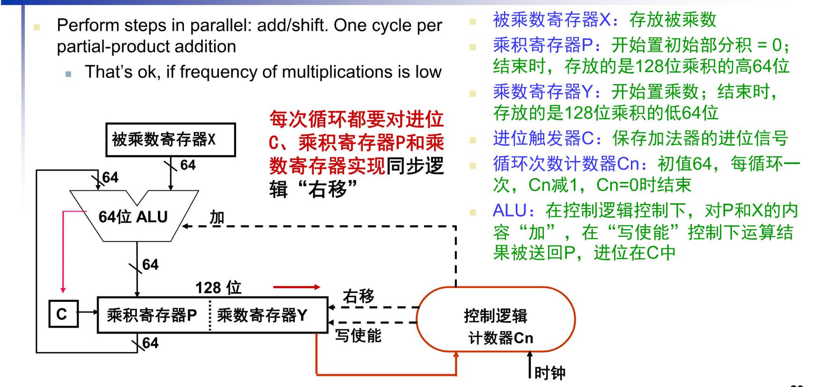
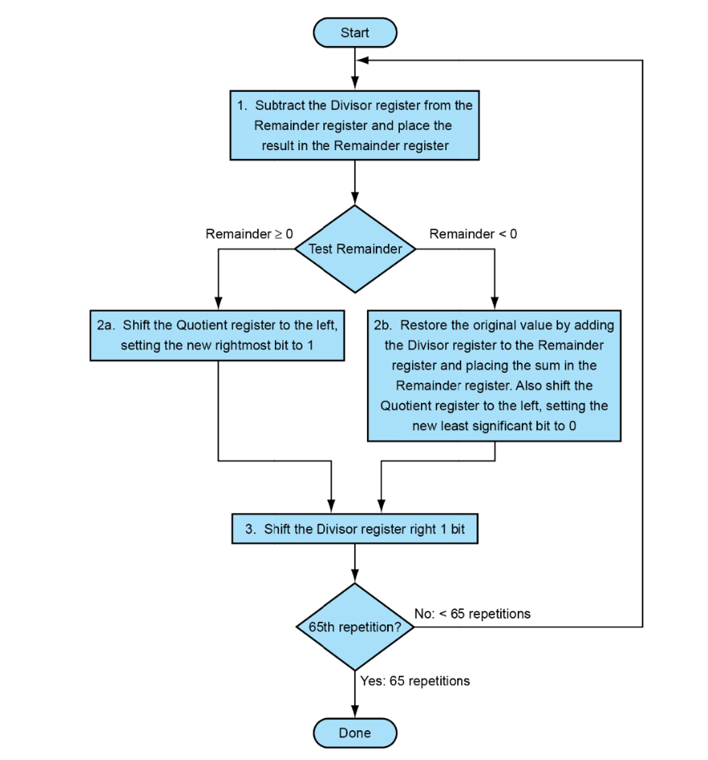
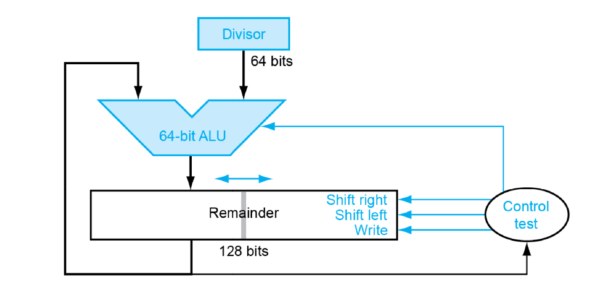

# Chapter2 计算机的算数运算

要理解计算机如何进行算术运算，首先要明白计算机是个“一根筋”的机器：它**只会做加法**，且**存储空间有限**。为了用加法代替减法，并处理正负号，人类设计了一套精妙的编码系统。

------

## 1. 整数的存储编码

### 原码 (Sign-Magnitude)

- **规则**：最高位为符号位（0正1负），其余位表示数值的绝对值。
- **例子**（以 8 位为例）：
  - $+1 = [0000 0001]$
  - $-1 = [1000 0001]$
- **缺点**：**0 有两种表示**（$+0$ 和 $-0$），且加减法运算逻辑不统一，硬件设计极其复杂。

### 反码 (Ones' Complement)

- **规则**：正数与原码相同；负数符号位不变，数值位逐位取反。
- **例子**：
  - $-1$ 的反码 = $[1111 1110]$
- **意义**：它是原码转补码的中间状态，目前极少直接用于存储。

### 补码 (Two's Complement) —— **计算机的核心**

- **规则**：正数与原码相同；负数在反码的基础上 **+1**。
- **例子**：
  - $-1$: 原码 `10000001` $\to$ 反码 `11111110` $\to$ 补码 `11111111`
- **为什么要用补码？**
  1. **统一加减法**：$A - B$ 可以看作 $A + (2^n -B) \mod 2^n$。使用补码运算，符号位直接参与计算，结果依然正确。
  2. **消灭了 $-0$**：$0$ 只有一种表示 `0000 0000`。
  3. **多出一个数**：8位补码可以表示 $-128$ 到 $127$（比原码多表示一个 $-128$）。

### 移码 (Excess/Biased)

- **规则**：在数值上加上一个固定的“偏置常数”（Bias）。通常用于表示浮点数的**阶码**。
- **例子**：8 位移码偏置 127，则 $0$ 表示为 `0111 1111`（即 $0+127$）。
- **好处**：保持了数轴的线性顺序，**全 0 为最小值，全 1 为最大值**，方便硬件直接比较大小。

### 计算补码

**“绝对值按位取反 + 1”** 确实是计算补码最通用、最不会出错的方法，它背后的本质正是**同余（取模）**。

在数学上，按位取反（逻辑非）操作其实是用全 $1$ 的数减去原数。

对于 $n$ 位二进制数，全 $1$ 的数就是 $2^n - 1$。

当你把绝对值 $X$ 按位取反时，你实际上是在计算：

$$\text{反码} = (2^n - 1) - X$$

当你再 $+1$ 时：

$$\text{补码} = (2^n - 1) - X + 1 = \mathbf{2^n - X}$$

这正是取模的定义！ 在 $2^n$ 的模系统中，$-X$ 的等价正数就是 $2^n - X$。

比如在时钟（模 12）上，倒拨 3 小时（$-3$）和顺拨 9 小时（$12 - 3 = 9$）效果是一样的。

> [!tip]
>
> 分享一个比“取反加一”更快的**眼神观察法**，它不需要你真的去做加法。
>
> **规则：从右往左看，找到第一个“1”，保持这个“1”和它右边的“0”不变，把这个“1”左边的所有位全部取反。**
>
> - **例子：计算 -8 (8位二进制)**
>   1. 8 的原码：`0000 1000`
>   2. 从右往左看，第一个 `1` 在第四位。
>   3. 保持右边的 `1000` 不变。
>   4. 把左边的 `0000` 全部取反，变成 `1111`。
>   5. 结果：`1111 1000`（这就是 -8 的补码）。
>
> 这个方法其实就是“按位取反 + 1”在逻辑上的合并，非常适合手动草稿。
>
> 学过数逻的同学可能知道，数逻里面补码电路就可以这么设计

------

## 2. IEEE 754 浮点数表示

如果说补码是为了解决整数的正负问题，IEEE 754 就是为了解决“天文数字”和“微观数字”的存储问题。它类似**科学计数法**。

一个浮点数被拆分为三部分：

$$V = (-1)^S \times M \times 2^E$$

### 结构组成（以 32 位单精度 float 为例）：

1. **符号位 (Sign, 1 bit)**：0 代表正，1 代表负。
2. **阶码 (Exponent, 8 bits)**：
   - 使用**移码**存储。偏置值（Bias）为 **127**。
   - 如果你看到的阶码二进制值是 128，实际指数 $E = 128 - 127 = 1$。
3. **尾数 (Fraction/Mantissa, 23 bits)**：
   - 采用规格化表示，即隐藏开头的“1.”。例如 $1.011...$ 只存储 $011...$。
   - 这样可以多省出 1 位的精度。

> [!example] 将 $5.0$ 转换为浮点数
>
> 1. **转二进制**：$5.0 = 101_2$
> 2. **规格化**：$1.01 \times 2^2$
> 3. **确定参数**：
>    - 符号 $S = 0$
>    - 指数 $E = 2$，存储值 = $2 + 127 = 129$ (`1000 0001`)
>    - 尾数 $M = 01$（后面补 0）
> 4. **最终存储**：`0 | 10000001 | 01000000000000000000000`

------

### **特殊数值**

IEEE 754 还规定了一些特殊情况，方便程序处理错误：

- **阶码全 0，尾数全 0**：表示 $\pm 0$。
- **阶码全 1，尾数全 0**：表示 $\pm \infty$ (无穷大)。
- **阶码全 1，尾数非 0**：表示 **NaN** (Not a Number，如 $0 \div 0$ 的结果)。

---

### **非规格数**

在 IEEE 754 标准中，**非规格化数（Denormalized numbers / Subnormal numbers）** 的引入是为了解决一个致命的问题：**渐进式下溢（Gradual Underflow）**。

如果没有非规格化数，浮点数在靠近 $0$ 的时候会突然“跳水”，导致巨大的计算误差。

> [!tip]
>
> 为什么需要非规格化数？（填补“零点真空”）
>
> 在**规格化数**（Standard Normalized numbers）的规定下：
>
> - 尾数前面必须隐含一个 `1.`。
> - 指数位（阶码）不能全为 $0$。
>
> 这会导致一个现象：**最小的规格化正数**是多少？
>
> - 阶码存储值为 `1`（即实际指数为 $1-127 = -126$）。
> - 尾数全为 $0$（隐含 $1.0$）。
> - 数值为：$1.0 \times 2^{-126}$。
>
> **问题来了**：在 $0$ 和 $1.0 \times 2^{-126}$ 之间，存在一个巨大的“真空地带”。如果两个很小的数相减，结果落在这个区间，硬件只能将其强制转为 $0$。这种“突然变成 $0$”的情况会引发严重的数学错误。

当**阶码（Exponent）全为 0** 时，这个数就进入了“非规格化”模式。它的规则发生了两个关键变化：

1. **隐含位由 `1.` 变为 `0.`**：尾数不再是 $1.f...$，而是 $0.f...$。
2. **指数固定为 $-126$（对于单精度）**：注意！虽然阶码存储值是 $0$，但它的实际指数**不是** $0 - 127 = -127$，而是强制规定为 **$-126$**。

------

为什么要强制规定指数为 $-126$？

这是为了实现从规格化数到非规格化数的**平滑平移**。

我们可以对比一下：

- **最小的规格化数**：$1.000... \times 2^{-126}$
- **最大的非规格化数**：$0.111... \times 2^{-126}$（尾数全为 $1$）

你看，它们的指数都是 $-126$！

通过这种设计，非规格化数就像是一把“接力棒”，在数值小于 $1.0 \times 2^{-126}$ 时，通过减小尾数开头的 $0.$ 后面的有效位，一点点地靠近 $0$。

------

### 浮点数的完整分类表

现在我们可以总结出 IEEE 754 的全貌了：

| **阶码 (E)**         | **尾数 (M)** | **表示含义**   | **数值计算公式**                       |
| -------------------- | ------------ | -------------- | -------------------------------------- |
| `00...0`             | `00...0`     | **真 0**       | $\pm 0$                                |
| `00...0`             | **非全 0**   | **非规格化数** | $(-1)^S \times (0.M) \times 2^{-126}$  |
| `01..01` 到 `11..10` | 任意         | **规格化数**   | $(-1)^S \times (1.M) \times 2^{E-127}$ |
| `11...1`             | `00...0`     | **无穷大**     | $\pm \infty$                           |
| `11...1`             | **非全 0**   | **NaN**        | 不是一个数字（无效运算）               |

------

> [!note]
>
> 代价是什么？
>
> 虽然非规格化数在数学上很完美，但在早期计算机硬件中，处理非规格化数的逻辑非常复杂，速度通常比普通浮点运算**慢几十甚至上百倍**。
>
> 因此，在一些对性能要求极高的领域（如 3D 游戏渲染、深度学习），程序员有时会开启一个叫 **Flush-to-Zero (FTZ)** 的模式，直接把非规格化数当 $0$ 处理，牺牲一点点精度来换取巨大的速度提升。

**总结一下：**

- **规格化数**：$1.xxxxx \times 2^{Exp}$，用于处理常规数值。
- **非规格化数**：$0.xxxxx \times 2^{-126}$，用于在靠近 $0$ 的极小区间内提供“缓冲”，避免计算结果突然崩塌。

---

## 3. IEEE 754 浮点数运算

浮点数的运算比整数复杂得多，因为整数的权值是固定的，而浮点数就像是带了“缩放比例”的数字。在进行加法或乘法时，硬件必须像拆解零件一样，先处理指数，再处理尾数。

------

### 1. 浮点数加法：必须先“对齐”

浮点数加法最麻烦的地方在于：**指数不同，尾数不能直接相加**。这就像你不能直接把 $1.2 \times 10^2$ 和 $3.4 \times 10^3$ 的尾数相加（$1.2+3.4$）一样，必须先统一指数。

**步骤一：对阶 (Alignment)**

- **原则**：**小阶向大阶看齐**。
- **原因**：右移尾数会导致低位丢失（精度下降），而左移尾数会导致高位溢出，所以只能选择右移。
- **操作**：计算指数差 $\Delta E = E_1 - E_2$。将指数较小的数的尾数向右移 $\Delta E$ 位，指数加 $\Delta E$。

**步骤二：尾数求和 (Addition)**

- 将对齐后的两个尾数（记得算上隐含的“1”）按整数补码方式相加。

**步骤三：规格化 (Normalization)**

- 如果结果不是 $1.x...$ 的形式，需要调整。
- **右规**：如果求和导致进位（如变成 $10.x...$），尾数右移，指数加 1。
- **左规**：如果相减导致高位变 0（如变成 $0.001...$），尾数左移，指数相应减小。

**步骤四：舍入 (Rounding)**

- 移位过程中掉出去的位，需要根据 IEEE 754 规定的模式（如“向最接近的值舍入”）进行补偿。

**步骤五：溢出检测**

- 检查最终指数是否超出了 8 位阶码能表示的范围（上溢到 $\infty$ 或下溢到 $0$）。

------

### 2. 浮点数乘法：简单但“宽”

相比加法，乘法反而不需要对阶，因为它遵循指数相加、尾数相乘的逻辑。

**步骤一：计算符号位**

- 使用异或运算：$S_{res} = S_1 \oplus S_2$（同号得正，异号得负）。

**步骤二：指数相加**

- **注意**：由于指数是移码存储（带 Bias），直接相加会重复计算偏移量。
- **公式**：$E_{res} = (E_1 - 127) + (E_2 - 127) + 127 = E_1 + E_2 - 127$。

**步骤三：尾数相乘**

- 两个 24 位（含隐含位）的尾数相乘，得到一个 48 位的积。
- 这是硬件中最耗资源的部分，通常需要大量的乘法阵列。

**步骤四：规格化、舍入与溢出检测**

- **规格化**：由于 $1.x \times 1.y$ 的结果范围在 $[1.0, 4.0)$ 之间，结果最多只需要右规一次（如果积 $\ge 2.0$）。
- **舍入**：将 48 位的中间结果截断回 23 位。

------

### 3. 为什么乘法有时比加法“快”？

在现代 CPU 中，你可能会发现浮点乘法的延迟并不比加法高多少，甚至在某些架构下吞吐量更高。原因有二：

1. **无需对阶**：乘法省去了“比较指数-循环移位”的繁琐预处理。
2. **FMA 指令 (Fused Multiply-Accumulate)**：现代处理器通常支持 $A \times B + C$ 一次性完成，只进行一次舍入。这不仅提高了速度，还减少了精度损失。

---

### 4. 舍入模式控制

在 IEEE 754 标准中，舍入（Rounding）是连接“无限精度的数学运算”与“有限位数的计算机存储”之间的桥梁。当浮点运算产生的结果位数（如乘法产生的 48 位尾数）超过了寄存器能定义的位数（如 23 位）时，就必须进行舍入。

IEEE 754 定义了五种主要的舍入模式，分为**常用模式**和**定向模式**两类。

------

 **常用模式（最近舍入）**

这是大多数编程语言（如 C, Python, Java）默认采用的模式。

① 就近舍入，向偶数舍入 (Round to Nearest, Ties to Even)

这是 IEEE 754 的**默认模式**，也常被称为“银行家舍入”。

- **规则**：舍入到最接近的数值。
- **关键点（Ties）**：如果结果正好处于两个数值的正中间（例如想保留整数，结果是 1.5 或 2.5）：
  - 向**偶数**方向舍入。
  - `1.5` $\rightarrow$ `2`
  - `2.5` $\rightarrow$ `2`
- **为什么要这么做？** 如果一律“四舍五入”（0.5 总是向上），在处理海量数据加法时，结果会产生明显的正向偏差（统计漂移）。向偶数舍入使 0.5 有一半概率向上，一半概率向下，从而抵消误差。

② 就近舍入，向远离 0 舍入 (Round to Nearest, Ties to Away from Zero)

- **规则**：舍入到最接近的数值。
- **关键点**：如果正好在中间，选择绝对值更大的那个（即传统的“四舍五入”）。
  - `1.5` $\rightarrow$ `2`
  - `-1.5` $\rightarrow$ `-2`

------

**定向模式 (Directed Rounding)**

这些模式通常用于区间算术（Interval Arithmetic），通过确定结果的上界和下界来控制计算误差。

③ 向零舍入 (Round toward Zero / Truncate)

- **规则**：直接截断多余的位数，不看大小。
- **效果**：正数向下变小，负数向上变大（绝对值都在变小）。
  - `1.9` $\rightarrow$ `1`
  - `-1.9` $\rightarrow$ `-1`

④ 向正无穷舍入 (Round toward $+\infty$ / Ceiling)

- **规则**：结果向数轴右侧靠拢。
- **效果**：
  - `1.1` $\rightarrow$ `2`
  - `-1.9` $\rightarrow$ `-1`

⑤ 向负无穷舍入 (Round toward $-\infty$ / Floor)

- **规则**：结果向数轴左侧靠拢。
- **效果**：
  - `1.9` $\rightarrow$ `1`
  - `-1.1` $\rightarrow$ `-2`

------

**舍入过程中的三个关键位**

为了实现精准的舍入，硬件在运算时会额外保留 3 位信息，被称为 **GRS 位**：

1. **G (Guard bit)**：保护位，紧跟在有效数位之后。
2. **R (Round bit)**：舍入位，在 G 之后。
3. **S (Sticky bit)**：粘滞位。只要 R 之后有任何一位是 1，S 就被置为 1。

这三位的作用：

它们帮助硬件判断中间结果是“刚好 0.5”、“小于 0.5”还是“大于 0.5”。

- 如果 $GRS = 100$：说明恰好在中间（Ties）。
- 如果 $GRS > 100$：说明大于中间值，应进位。
- 如果 $GRS < 100$：说明小于中间值，应舍弃。

------

## 4. ALU 原理 加法器部分

要理解 ALU（算术逻辑单元）的工作原理，加法器是绝对的核心。计算机中的所有算术（减、乘、除）最终都会转化为加法运算。

我们从最基本的“零件”开始，逐步构建到高性能的架构。

------

### 全加器 (Full Adder, FA)

全加器是构建加法器的最小逻辑单位。

与半加器（只加两个位）不同，全加器能处理“低位传过来的进位”。

- **输入**：$A$（操作数1）、$B$（操作数2）、$C_{in}$（低位进位）。
- **输出**：$S$（和 Sum）、$C_{out}$（向高位进位）。
- **逻辑关系**：
  - $S = A \oplus B \oplus C_{in}$
  - $C_{out} = (A \cdot B) + (C_{in} \cdot (A \oplus B)) = A \cdot B + A \cdot C_{in} + C_{in} \cdot B$ 

------

### 串行进位加法器 (Ripple Carry Adder, RCA)

如果你想做一个 4 位或 32 位的加法，最简单的方法就是把全加器“排成一排”。

- **原理**：将前一个全加器的 $C_{out}$ 连接到下一个全加器的 $C_{in}$。
- **缺点：延迟 (Latency)**。
  - 就像多米诺骨牌，第 32 位的计算必须等待第 31 位产生进位，第 31 位又要等第 30 位……
  - **关键瓶颈**：进位链（Carry Chain）太长，电路速度非常慢。

------

### CLU (Carry Look-ahead Unit)

**CLU（进位产生单元）** 是先行进位加法器中的核心硬件模块。

- **CLU 的作用**：它专门接收每一位的 $G_i$ 和 $P_i$，然后瞬间输出所有的进位 $C_i$ 给加法器。

- 多级 CLA：

  在 64 位 CPU 中，如果直接展开 $C_{64}$ 的逻辑式，电路会复杂到无法实现。因此，工程师通常采用分层设计：

  - 每 4 位组成一个小 CLA。
  - 然后再用一个“组间 CLU”去预测这 4 位组与组之间的进位。

------

### 先行进位加法器 (Carry Look-ahead Adder, CLA)

为了解决 RCA 的延迟问题，科学家提出了“先行进位”的思想：**能不能不等低位算出来，直接通过逻辑电路预测出进位？**

它引入了两个关键概念：

1. **生成信号 (Generate, $G$)**：$G = A \cdot B$。如果 $A, B$ 都是 1，那么无论低位进位是什么，本位**一定会产生**进位。
2. **传递信号 (Propagate, $P$)**：$P = A \oplus B$。如果 $A, B$ 中有一个是 1，那么**低位的进位会通过本位传递**到更高位。

通过这两个信号，我们不需要等待实际的加法完成，就可以列出进位的布尔表达式：

- $C_1 = G_0 + P_0 \cdot C_0$
- $C_2 = G_1 + P_1 \cdot G_0 + P_1 \cdot P_0 \cdot C_0$
- ...（以此类推，$C_{31}$ 也可以直接用 $A, B$ 的初值算出）

**为什么是六级门延迟？**

第一阶段：产生 $P_i$ 和 $G_i$（1级延迟）

- **逻辑**：从输入 $X_i, Y_i$ 到产生 $P_i$ 和 $G_i$。
- **门电路**：
  - $G_i = X_i \cdot Y_i$（与门）
  - $P_i = X_i \oplus Y_i$（异或门）
- **耗时**：这两个信号是并行的，所以计为 **1 级门延迟**。

第二阶段：CLU 产生进位 $C_i$（2级延迟）

这是 CLU 内部最精妙的地方。虽然公式很长（如 $C_4 = G_3 + P_3G_2 + \dots$），但如果用**与或式（AND-OR）**实现，它只需要两层：

1. **与门层**：计算像 $P_3G_2$ 这种组合项（**第 2 级**）。
2. **或门层**：将所有项加（OR）在一起，输出 $C_i$（**第 3 级**）。

- **耗时**：无论 $C_1$ 还是 $C_4$，在 CLU 内部都是经过这两级门后**同时**产生的。

第三阶段：产生最终的和 $F_i$（3级延迟）

- **逻辑**：$F_i = X_i \oplus Y_i \oplus C_{i-1}$。
- **注意点**：图中公式写的是 $X_i \oplus Y_i \oplus C_{i-1}$。实际上，$X_i \oplus Y_i$ 就是第一阶段算出来的 $P_i$。
- **门电路**：
  - $F_i = P_i \oplus C_{i-1}$。
  - 在标准的逻辑实现中，一个异或门（XOR）通常被视为 **3 级门延迟**（因为它由多个与/非/或门组成）。
  - *注：有些教材将异或门简记为 1 级，但严谨的考研或硬件教材通常将其拆解。按照“6级”的说法，这里计算 $F_i$ 的异或操作被计为了 **3 级门延迟**。*

---

###  处理Overflow

**核心判断逻辑：异或法**

在硬件电路中，判断溢出最经典、最高效的方法是观察**最高位的进位情况**。

我们需要关注两个进位信号：

- **$C_n$**：最高位产生的进位（即传给外部的 Carry-out）。
- **$C_{n-1}$**：次高位传给最高位的进位。

溢出判断公式：

$$Overflow = C_n \oplus C_{n-1}$$

- **没有溢出**：如果 $C_n$ 和 $C_{n-1}$ 相同（同为 0 或同为 1），则没有溢出。
- **发生溢出**：如果 $C_n$ 和 $C_{n-1}$ 不同，说明发生了溢出。

------

**为什么这个逻辑是正确的？**

我们可以通过正负号的变化来直观理解：

- 正 + 正 = 负（溢出）：

  两个正数相加，最高位（符号位）原本都是 0。如果次高位有进位（$C_{n-1}=1$）进来，符号位变成了 1（结果变负），此时最高位本身不会产生进位（$C_n=0$）。$0 \oplus 1 = 1$，判定溢出。

- 负 + 负 = 正（溢出）：

  两个负数相加，符号位原本都是 1。如果次高位没有进位（$C_{n-1}=0$）进来，符号位相加 $1+1=0$（结果变正），此时最高位产生了一个进位（$C_n=1$）。$1 \oplus 0 = 1$，判定溢出。

- 一正一负相加：

  绝对不可能发生溢出，因为结果的绝对值一定比原先的数小。此时硬件产生的 $C_n$ 和 $C_{n-1}$ 总是相等的。

## 5. ALU原理 乘法器部分

### 基础乘法器

在硬件图中，有三个关键的存储单元：

- **Multiplier (乘数寄存器)**：初始存放乘数（例如 64 位）。每一轮循环，我们会观察它的**最低位（Multiplier0）**。
- **Multiplicand (被乘数寄存器)**：初始存放被乘数。为了防止移位时溢出，这个寄存器的宽度通常是双倍的（例如 128 位）。
- **Product (乘积寄存器)**：初始值为 **0**。它就像一块黑板，用来累加每一轮产生的中间结果。

------

**工作流程**

每一轮乘法运算包含三个核心步骤：

第一步：测试与加法 (Test & Add)

- **动作**：检查乘数的最低位 `Multiplier0`。
- **逻辑**：
  - 如果 `Multiplier0 == 1`：说明这一位对应一个“有效”的被乘数，硬件将 `Multiplicand` 与当前 `Product` 的值相加，并写回 `Product`。
  - 如果 `Multiplier0 == 0`：说明这一位对应的是 0，不进行加法操作（直接跳过）。

第二步：被乘数左移 (Shift Multiplicand Left)

- **动作**：将 `Multiplicand` 寄存器向左移动 1 位。
- **目的**：这模拟了我们在纸上算乘法时，第二行要比第一行**向左缩进一位**的操作。每左移一次，相当于将该数乘以 2。

第三步：乘数右移 (Shift Multiplier Right)

- **动作**：将 `Multiplier` 寄存器向右移动 1 位。
- **目的**：为了在下一轮循环中，让原来的“次低位”变成新的“最低位”，以便再次进行 `Multiplier0` 的测试。

------

**循环停止条件**

- **重复次数**：对于 64 位的乘法，这个循环需要精确执行 **64 次**。
- **结果**：当 64 轮结束，`Multiplier` 中的所有位都被测试完毕，`Product` 寄存器中存放的就是最终的 128 位乘积。

---

### 优化版乘法器

 **核心改进：寄存器的合并与共用**

在优化后的架构中，最巧妙的设计是将 **乘积寄存器（P）** 和 **乘数寄存器（Y）** 拼接成了一个统一的 **128 位移位寄存器**。

- **初始状态**：
  - **高 64 位（P）**：初始化为 0，用于存放部分积（Partial Product）。
  - **低 64 位（Y）**：存入初始的乘数。
- **这种设计的逻辑**： 随着乘法循环的进行，乘数由于不断“右移”而失效的位，正好腾出了空间来存放乘积不断增长的低位。

------

**工作原理与流程**

第一步：检查最低位

控制逻辑测试 **乘数寄存器 Y 的最低位**。

第二步：条件加法（并行操作）

- 如果最低位为 1，则将被乘数寄存器 X 的内容与 **乘积寄存器 P（高 64 位）** 相加。
- 相加产生的**进位信号**保存在进位触发器 **C** 中。

第三步：同步右移（核心提速步）

每一轮循环不再分多次移位，而是实现 **C、P、Y 三者的同步右移**：

- **C 移入 P 的最高位**：保证加法进位不丢失。
- **P 的最低位移入 Y 的最高位**：部分积向下传递。
- **Y 的最低位移出**：丢弃已经处理过的乘数位。

## 6. ALU 原理 除法器部分

### **恢复余数除法（Restoring Division）**

这个除法器的工作原理模拟了我们手动进行**长除法（Long Division）**的过程。它通过一系列的“减法”和“移位”操作，来确定商（Quotient）的每一位以及最终的余数（Remainder）。

------

**核心寄存器的初始状态**

在除法开始前，硬件会自动进行以下初始化：

- **Divisor (除数寄存器)**：初始时，64位的除数放在这个128位寄存器的**左半部分**。
- **Remainder (余数寄存器)**：初始值直接存入**被除数**。
- **Quotient (商寄存器)**：全部清零。

------

**详细工作流程（循环体）**

除法运算是一个不断“试减”的过程，每一轮循环包含以下三个关键步骤：

**第一步：试减 (Subtract)**

- 从 `Remainder`（当前余数/被除数）中减去 `Divisor`（除数），并将结果写回 `Remainder`。
- **目的**：测试当前的余数是否“够减”一个除数。

**第二步：测试与商位确定 (Test Remainder)**

硬件会检查减法后的 `Remainder` 符号：

- **如果 Remainder $\ge$ 0**（够减）：
  - **上商 1**：将 `Quotient` 寄存器左移 1 位，最低位补 **1**。
- **如果 Remainder $<$ 0**（不够减）：
  - **上商 0**：将 `Quotient` 寄存器左移 1 位，最低位补 **0**。
  - **恢复余数 (Restore)**：将被减掉的 `Divisor` **加回到** `Remainder` 中，使其恢复到减法之前的状态。

**第三步：除数右移 (Shift Divisor Right)**

- 将 `Divisor` 寄存器**向右移动 1 位**。
- **目的**：这相当于在长除法中，把除数往后挪一位，准备在下一轮对比被除数的更低位。

------

**循环与结束**

- **重复次数**：对于64位除法，这个过程通常需要执行 **65次** 循环（多出的一次是为了处理对齐和最终余数的修正）。
- **最终结果**：
  - `Quotient` 寄存器中存放的就是计算出的**商**。
  - `Remainder` 寄存器中存放的就是计算出的**余数**。

------

> [!note]
>
> - **为什么叫“恢复余数”？** 因为这种算法比较“鲁棒”，它先假设能减去，如果减完发现不够（结果变负），就必须通过加法把余数还原。
> - **有符号除法**：上述逻辑是针对无符号数的。如果是**有符号除法**，通常的做法是先取操作数的**绝对值**进行运算，最后根据“同号得正，异号得负”的原则调整商的符号，并使余数的符号与被除数一致。
> - **0除检查**：在硬件开始工作前，必须先检查除数是否为0，如果是0，硬件会直接报错（Divide by zero error）。

### 优化版除法器

这个优化后的除法器（Optimized Divider）与优化乘法器的思路非常相似，其核心目标是**减少寄存器的浪费**并**缩小 ALU 的位宽**。通过将“余数”和“商”合并存储，硬件资源得到了极大的简化。

以下是该优化除法器的具体工作机制：

**寄存器结构的优化**

在基础版除法器中，我们需要 128 位的余数寄存器和 128 位的除数寄存器。优化版将其改造为：

- **除数寄存器 Y**：仅需 **64 位**，存放固定不变的除数。
- **余数/商合并寄存器 (R+Q)**：这是一个 **128 位** 的移位寄存器。
  - **高 64 位 (R)**：初始存放被除数的高位，运算结束时存放最终的**余数**。
  - **低 64 位 (Q)**：初始存放被除数的低位，随着运算进行，商位从右侧逐位移入，结束时存放 **64 位商**。

**工作原理：左移与试减**

优化后的除法器采用的是**左移**逻辑（与优化乘法器的右移相反），每一步都在模拟手工长除法“向后借位”的过程：

1. **同步左移**：寄存器 R 和 Q 同时向左移动一位。这时，Q 的最高位移入 R 的最低位，而 Q 的最低位空出了一个位置。
2. **试减运算**：ALU 将 **R (高 64 位)** 减去 **Y (除数)**。
3. **上商决策**：控制逻辑根据减法的结果决定商的值：
   - **如果结果 $\ge 0$ (减成功)**：说明够减，将结果写回 R，并在 Q 的空出的最低位**上商 1**。
   - **如果结果 $< 0$ (减失败)**：说明不够减，不写回结果（或执行“加法”以**恢复余数**），并在 Q 的最低位**上商 0**。

**为什么它更高效？**

- **ALU 减小**：从 128 位精简到了 **64 位**，因为每一步只需要对当前“部分余数”进行计算。
- **资源合并**：被除数、余数和商共用一个 128 位空间。随着被除数被逐渐处理（移出），腾出的空间刚好用来存放新生成的商位。

---

### 有符号除法

有符号除法比无符号除法复杂，因为硬件不仅要计算数值，还要严格遵循数学上关于**符号**的规定。

在计算机组成原理中，有符号除法通常遵循以下核心原则和处理流程：

### 1. 符号的基本准则

根据数学定义和 IEEE 754 等标准，有符号除法的运算结果需满足：

- **商的符号**：遵循“同号得正，异号得负”的原则。
  - 即：$Sign(商) = Sign(被除数) \oplus Sign(除数)$。
- **余数的符号**：在大多数现代计算机架构（包括 RISC-V 和 x86）中，**余数的符号必须与被除数保持一致**。
  - 例如：$-7 \div 2 = -3 \dots -1$（余数 $-1$ 与被除数 $-7$ 同号）。
  - 例如：$7 \div -2 = -3 \dots 1$（余数 $1$ 与被除数 $7$ 同号）。

------

### 2. 有符号除法的处理步骤

由于直接对补码进行除法逻辑（试减、移位）非常复杂，硬件通常采用“**取绝对值运算**”的策略：

1. **预处理（取绝对值）**：
   - 检查被除数和除数的符号位。
   - 如果是负数，通过求补操作（取反加1）将其转换为正数（绝对值）。
   - 记录原始符号，用于后续判断。
2. **核心运算（无符号除法）**：
   - 使用你之前看到的**优化除法器**逻辑（左移、减法、试商）对绝对值进行运算。
   - 得到无符号的商和余数。
3. **后处理（符号还原）**：
   - **商的还原**：如果被除数与除数异号，将商的结果取反加 1（转回负数补码）。
   - **余数的还原**：如果原始被除数是负数，则将余数的结果取反加 1。

------

