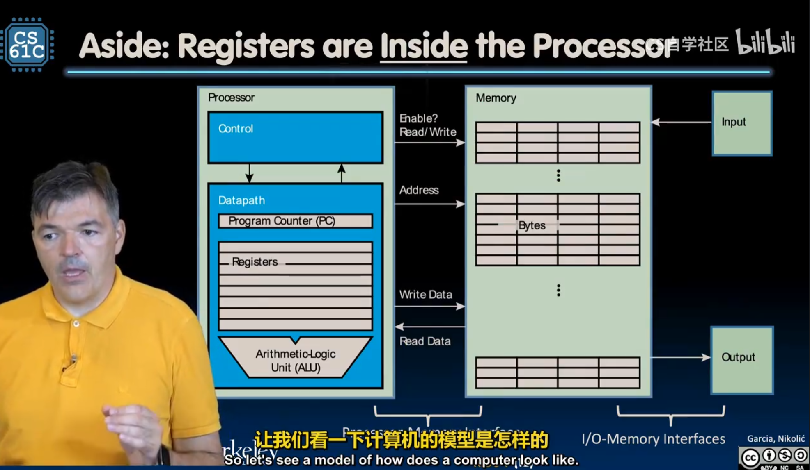

# Chapter 3 RISC-V

这一章主要是讲riscv汇编的内容，汇编做的事情很简单，从Memory读入数据到寄存器，在内部进行计算，写回Memory，因此我们需要以下知识：

- 内存是什么
- 寄存器是什么
- 读写指令有哪些
- 计算指令有哪些
- 指令的每一位是怎么控制cpu的
- 怎么写汇编语言
- 怎么把高级语言转换为机器看得懂的指令


## **0 基础知识**


### 1. 内存寻址基础

在 RISC-V 中，内存就像一排排整齐的储物柜，每个柜子都有一个唯一的**地址**。

- **最小单位：** 每个地址对应 **1 字节 (8 bits)**。
- **字长 (Word)：** 在 RV32（32 位版本）中，一个“字”是 **32 位（4 字节）**。
- **寻址方式：** RISC-V 使用 **Load/Store 架构**。这意味着：
  - CPU 不能直接对内存里的数做加法。
  - 必须先用 `lw` (Load Word) 把数据从内存搬到寄存器。
  - 算完后再用 `sw` (Store Word) 把结果搬回内存。

#### 边界对齐 (Alignment)

虽然 RISC-V 支持非对齐访问（比如从地址 1 开始读 4 字节），但**对齐访问**（地址能被 4 整除）的速度要快得多。如果地址没对齐，硬件可能需要跑两趟才能把数据取完整。

------

### 2. 大端序 vs 小端序

当你往内存里存一个超过 1 字节的数据（比如一个 32 位的整数 `0x12345678`）时，问题来了：这 4 个字节在内存的 4 个格子房里该**怎么排队**？

#### **小端序 (Little-Endian)**

- **规则：** 低位字节存在低地址（左侧），高位字节存在高地址。
- **记忆法：** “小端在前”。
- **例子：** 存储 `0x12345678`
  - 地址 `N`   : `0x78` (最低位字节)
  - 地址 `N+1` : `0x56`
  - 地址 `N+2` : `0x34`
  - 地址 `N+3` : `0x12` (最高位字节)
- **特点：** 现代主流架构（x86, ARM, RISC-V）默认都偏向小端序，因为它在处理类型转换（如 32 位转 8 位）时逻辑更简单。

#### **大端序 (Big-Endian)**

- **规则：** 高位字节存在低地址，就像我们平时写字的习惯。
- **例子：** 存储 `0x12345678`
  - 地址 `N`   : `0x12` (最高位字节)
  - 地址 `N+1` : `0x34`
  - ...
- **特点：** 常见于网络协议（如 TCP/IP）和一些老的架构（如 PowerPC）。


## **1 精简指令集与复杂指令集**

指令集架构（ISA）在历史上主要分为两大阵营分别被称为 **RISC** 和 **CISC**。

------

### 1. 指令集的两大分类

| **类别** | **全称**                                          | **核心理念**                                                 | **代表作**                       |
| -------- | ------------------------------------------------- | ------------------------------------------------------------ | -------------------------------- |
| **RISC** | **Reduced** Instruction Set Computer (精简指令集) | 指令**简单且长度固定**。每条指令只做一件小事，通过多条指令组合完成复杂任务。 | **RISC-V**、ARM (手机芯片)、MIPS |
| **CISC** | **Complex** Instruction Set Computer (复杂指令集) | 指令**丰富且长度不固定**。一条指令可以完成非常复杂的任务（比如直接把内存里的两个数相加）。 | x86 (Intel, AMD 电脑处理器)      |

------

### 2. 为什么 RISC-V 属于 RISC？

名字里的 **RISC** 已经揭示了它的身份。RISC-V 的设计目标就是**极简**。

- **定长指令：** 在 RISC-V 中，基础指令通常都是 32 位长。这让 CPU 处理起来非常快，就像在标准化的流水线上组装零件。
- **Load/Store 架构：** 这是一个非常关键的特征。在 RISC-V 中，你不能直接对内存里的数据进行加减法。你必须：
  1. 把数据从内存**加载**（Load）到寄存器。
  2. 在寄存器里进行**运算**。
  3. 把结果**存储**（Store）回内存。
- **模块化：** 这是 RISC-V 最独特的地方。它有一个很小的“基础指令集”（只有几十条指令），如果你需要更强的功能（比如浮点运算、乘法），可以像搭积木一样加上对应的扩展模块。



可以参考cs61c的架构介绍

这个计算机模型的图非常重要。如果学过数逻的同学可能有一些印象。

左侧是数据加工部分，包括；

- 组合电路控制信号
- PC记录下一条指令的地址
- 通用寄存器
- ALU计算单元

右侧是存放数据的内存

大概的交互流程是，左侧的控制模块读入指令，组合电路根据指令计算一些控制信号，然后计算地址，用于去内存中对应的单元读回数据到寄存器，接着在ALU中完成计算，然后如果需要的话，再次写回内存。

---


## **2 通用寄存器**

在 RISC-V 架构中，不管是 32 位（RV32）还是 64 位（RV64），最核心的就是那 **32 个通用寄存器**。

为了方便记忆和编程，每一个寄存器都有两个名字：

1. **硬件名（x0 - x31）：** 物理上的编号，CPU 只认这个。
2. **ABI 别名（如 zero, ra, sp）：** 方便程序员理解其用途的“外号”。

------

### RISC-V 通用寄存器一览表

| **硬件名**  | **别名**    | **用途描述**                                          | **谁负责保存** |
| ----------- | ----------- | ----------------------------------------------------- | -------------- |
| **x0**      | **zero**    | **硬连线 0**：读永远是 0，写会被忽略。非常常用！      | -              |
| **x1**      | **ra**      | **返回地址** (Return Address)：保存函数结束要跳回哪。 | 调用者         |
| **x2**      | **sp**      | **栈指针** (Stack Pointer)：管理内存里的栈空间。      | 被调用者       |
| **x3**      | **gp**      | 全局指针 (Global Pointer)：加速全局变量访问。         | -              |
| **x4**      | **tp**      | 线程指针 (Thread Pointer)：用于多线程数据。           | -              |
| **x5**      | **t0**      | 临时寄存器 (Temporary)：随便用，不用保存。            | 调用者         |
| **x6-x7**   | **t1-t2**   | 临时寄存器。                                          | 调用者         |
| **x8**      | **s0 / fp** | **保存寄存器 / 帧指针**：函数内必须保护好的数据。     | 被调用者       |
| **x9**      | **s1**      | 保存寄存器。                                          | 被调用者       |
| **x10-x11** | **a0-a1**   | **参数/返回值**：传参给函数，也带回返回值。           | 调用者         |
| **x12-x17** | **a2-a7**   | **函数参数**：用于传递第 3 到 第 8 个参数。           | 调用者         |
| **x18-x27** | **s2-s11**  | 保存寄存器 (Saved)：长期存放需要跨函数保存的数据。    | 被调用者       |
| **x28-x31** | **t3-t6**   | 临时寄存器。                                          | 调用者         |

------

### 三个最重要的角色

可以先重点记住这三个寄存器：

1. **`x0 (zero)`：它的存在让指令集变得极简。**
   - 比如 RISC-V 没有专门的“复制”指令（MOV）。
   - 如果你想把 `x1` 的值给 `x2`，就用加法：`add x2, x1, x0`（即 $x2 = x1 + 0$）。
2. **`x1 (return address)`：函数的“回迁地址”。**
   - 当程序跳进一个子函数时，它会偷偷记下当前位置到 `ra`。等函数跑完了，执行 `ret` 指令，其实就是跳回 `ra` 指向的地方。
3. **`x2 (stack pointer)`：程序运行的“地基”。**
   - 所有的局部变量、函数调用的嵌套全靠 `sp` 指向的内存栈来维护。

### 谁负责保存

- **调用者保存 (Caller-saved, t0-t6)：** 就像你借别人的车，还回去前不用洗车，对方默认你会弄脏。如果你（调用者）还要用里面的旧数据，得自己先备份。因为顾名思义，这几个寄存器里面存的是临时值，如果你要调用其他函数，这些函数可能会破坏寄存器里的值。
- **被调用者保存 (Callee-saved, s0-s11)：** 就像你租别人的房子，走的时候必须打扫干净（还原寄存器原值）。这几个寄存器里的是saved，保存的变量，默认不会更改。所以被调用的函数如果要借用寄存器进行运算，需要先把原来的值存到栈上，退出时恢复。

------


## **3 RISC-V 六大基础指令类型**

在 RISC-V 中，指令格式的设计非常优雅且规整。为了让硬件解码（Decoding）尽可能简单，所有的基础指令长度都是 **32 位**，并根据功能需求划分为 **6 种核心类型**。

这些类型的命名非常直观，主要取决于指令需要多少个**寄存器**或**立即数**（即指令中直接嵌入的常数）。

#### 1. R-type (Register) - 寄存器型

- **用途：** 纯粹的寄存器与寄存器之间的运算。
- **特点：** 需要 3 个寄存器（2 个源寄存器 `rs1`, `rs2` 和 1 个目标寄存器 `rd`）。
- **例子：** `add rd, rs1, rs2` ($rd = rs1 + rs2$)。

#### 2. I-type (Immediate) - 立即数型

- **用途：** 寄存器与**常数**（立即数）的运算，或者从内存**读取**数据（Load）。
- **特点：** 包含一个 12 位的立即数。
- **例子：** * `addi rd, rs1, 10` ($rd = rs1 + 10$)。
  - `lw rd, offset(rs1)` (从内存装载数据到寄存器)。

#### 3. S-type (Store) - 存储型

- **用途：** 将寄存器的数据**写入**内存（Store）。
- **特点：** 没有目标寄存器（因为是写内存），它的 12 位立即数被拆成了两部分，分散在指令中（为了保持硬件解码时 `rs1` 和 `rs2` 的位置固定）。
- **例子：** `sw rs2, offset(rs1)` (将 `rs2` 的值存入内存)。

#### 4. B-type (Branch) - 分支跳转型

- **用途：** 条件判断跳转（如果...就跳到...）。
- **特点：** 比较两个寄存器，如果条件成立，根据 12 位立即数（表示偏移量）进行跳转。
- **例子：** `beq rs1, rs2, label` (如果 `rs1 == rs2`，跳到 label)。

#### 5. U-type (Upper Immediate) - 高位立即数型

- **用途：** 用于处理**大常数**（32 位中的高 20 位）。
- **特点：** 包含一个 20 位的立即数，直接加载到目标寄存器的高位。
- **例子：** `lui rd, 0x12345` (Load Upper Immediate)。

#### 6. J-type (Jump) - 无条件跳转型

- **用途：** 函数调用或直接跳转。
- **特点：** 包含一个 20 位的立即数作为跳转目标。
- **例子：** `jal rd, label` (Jump and Link，跳转并将返回地址存入 `rd`)。

------

### 为什么设计这么多类型？

RISC-V 这样设计的精妙之处在于：**所有指令的 `rs1`, `rs2` 和 `rd` 都在固定的位置。**

- **对硬件友好：** CPU 的解码器不需要复杂的逻辑去寻找“谁是源寄存器”，它永远看那几个固定的位（Bits）就行了。
- **节省功耗：** 这种一致性降低了电路的复杂度和运行时的功耗。

------

### 快速总结对比表

| **类型** | **主要用途**           | **关键操作数**      |
| -------- | ---------------------- | ------------------- |
| **R**    | 算术逻辑运算           | `rs1`, `rs2`, `rd`  |
| **I**    | 加常数、Load、系统调用 | `rs1`, `rd`, `imm`  |
| **S**    | 写内存 (Store)         | `rs1`, `rs2`, `imm` |
| **B**    | 判断跳转 (Branch)      | `rs1`, `rs2`, `imm` |
| **U**    | 加载大常数             | `rd`, `imm`         |
| **J**    | 直接跳转 (Jump)        | `rd`, `imm`         |

课本上介绍的 RISC-V 指令（ `lr.d` ,  `sc.d` 被省略了）列表如下：


> 在 RISC 指令集中，只有 load 系列和 store 系列指令能够访问内存。

RISC-V 的跳转指令的 offset 是基于当前指令的地址的偏移；这不同于其他一些汇编是基于下一条指令的偏移的。即如果是跳转语句 `PC` 就不 +4 了，而是直接 +offset。

`lw` ,  `lwu` 等操作都会清零高位。


## 4 伪指令

### 1. 什么是 RISC-V 伪指令

RISC-V 设计哲学是 **精简 (RISC)**。为了保持硬件简洁，RISC-V 的基础指令集非常小。但为了让程序员写代码更方便，汇编器提供了一系列“伪指令”。

- **本质**：伪指令并不存在于硬件的指令解码器中。
- **转化**：当你写下一条伪指令时，汇编器（如 GCC）会自动将其翻译成一条或多条**基础指令**。

------

### 2. 常见的伪指令分类

#### A. 数据传输与加载

这是最常用的部分，用来简化内存地址的操作。

| **伪指令**      | **含义**       | **等效的基础指令** | **描述**           |
| --------------- | -------------- | ------------------ | ------------------ |
| `li rd, imm`    | Load Immediate | `addi rd, x0, imm` | 加载立即数到寄存器 |
| `la rd, symbol` | Load Address   | `auipc` + `addi`   | 加载全局变量的地址 |
| `mv rd, rs`     | Move           | `addi rd, rs, 0`   | 寄存器间数值复制   |

#### B. 条件跳转

RISC-V 基础指令只提供“大于等于”、“小于”等基本比较。

| **伪指令**          | **含义**                 | **等效的基础指令**               |
| ------------------- | ------------------------ | -------------------------------- |
| `beqz rs, label`    | Branch if Equal Zero     | `beq rs, x0, label`              |
| `bnez rs, label`    | Branch if Not Equal Zero | `bne rs, x0, label`              |
| `ble rs, rt, label` | Branch if $\le$          | `bge rt, rs, label` (交换操作数) |

#### C. 无条件跳转与函数调用

| **伪指令**    | **含义**      | **等效的基础指令** | **描述**                   |
| ------------- | ------------- | ------------------ | -------------------------- |
| `j label`     | Jump          | `jal x0, label`    | 无条件跳转，不保存返回地址 |
| `jr rs`       | Jump Register | `jalr x0, 0(rs)`   | 跳转到寄存器指向的地址     |
| `ret`         | Return        | `jalr x0, 0(ra)`   | 从子程序返回               |
| `call symbol` | Call          | `auipc` + `jalr`   | 调用远程函数               |

------

### 3. 为什么需要 `x0` 

在 RISC-V 中，很多伪指令能够实现，全靠 x0 寄存器（其值恒为 0）。

例如，RISC-V 没有专门的 NOT (取反) 指令，它是通过 XORI 实现的：

> 伪指令：not rd, rs
>
> 翻译后：xori rd, rs, -1

再比如清零操作：

> **伪指令**：`fcvt.s.w fa0, x0` (将整数0转为浮点0)

------


## **5 指令32位具体如何分配**

这是一个非常核心的问题。RISC-V 的设计师们在分配这 32 位（Bit）时，展现了极高的“强迫症”——**为了让硬件电路连线最简单，他们尽可能让相同功能的位出现在固定的位置。**

------

### 1. 核心布局图示

在看具体分配前，先记住这个规则：**Opcode（操作码）永远在最低的 7 位。**

------

### 2. 六种类型的详细位分配

我们将 32 位从高到低编号为 `[31]` 到 `[0]`。

#### **R-type (寄存器-寄存器)**

用于 `add`, `sub`, `and` 等运算。

- `[31:25]` (7位): **funct7** —— 辅助操作码（比如区分加法和减法）。
- `[24:20]` (5位): **rs2** —— 第二个源寄存器编号。
- `[19:15]` (5位): **rs1** —— 第一个源寄存器编号。
- `[14:12]` (3位): **funct3** —— 辅助操作码（区分不同类型的运算）。
- `[11:7]`  (5位): **rd** —— 目标寄存器编号（运算结果存哪）。
- `[6:0]`   (7位): **opcode** —— 基本操作码。


#### **I-type (寄存器-立即数 / Load)**

用于 `addi`, `lw`, `jalr` 等。

- `[31:20]` (12位): **imm[11:0]** —— 一个 12 位的立即数（常数）。
- `[19:15]` (5位): **rs1** —— 源寄存器。
- `[14:12]` (3位): **funct3**。
- `[11:7]`  (5位): **rd** —— 目标寄存器。
- `[6:0]`   (7位): **opcode**。


其中 `I` 型指令有两个条目；这是因为立即数移位操作 `slli` , `srli` , `srai` 并不可能对一个 64 位寄存器进行大于 63 位的移位操作，因此 12 位 imm 中只有后 6 位能实际被用到，因此前面 6 位被用来作为一个额外的操作码字段，如上图中第二个 `I` 条目那样。其他 `I` 型指令适用第一个 `I` 条目。

#### **S-type (Store 存储)**

用于 `sw`, `sb`（存入内存）。

- `[31:25]` (7位): **imm[11:5]** —— 立即数的高 7 位。
- `[24:20]` (5位): **rs2** —— 要存入内存的那个数据源。
- `[19:15]` (5位): **rs1** —— 内存地址的基址寄存器。
- `[14:12]` (3位): **funct3**。
- `[11:7]`  (5位): **imm[4:0]** —— 立即数的低 5 位。
- `[6:0]`   (7位): **opcode**。

> **注意：** S-type 把立即数拆开了！这是为了让 `rs1` 和 `rs2` 的位置和 R-type 保持一致。


---

#### **B-type (Branch 分支)**

用于 `beq`, `bne`（条件跳转）。

- 布局与 S-type 类似，但 12 位立即数经过了打乱重组（为了处理跳转地址的特殊性，比如地址总是 2 字节对齐，所以不存最低位的 0）。


B-type（分支指令）之所以把立即数（Immediate）搞得像乱码一样，是为了**压榨硬件效率**。

------

> [!question] **为什么忽略最低位？**

B-type指令是**PC Relative** PC相关的，也就是说，相对于当前的指令，向前或者向后跳转多少条指令。而RISC-V中每条指令都是32位，也就是4字节的，那么我们是不是可以忽略最后两位，来记录跳转了k * 4B的地址呢？然而实际上，B-type仅忽略了最低位。

如果是 4 字节对齐，地址应该永远能被 4 整除（即最后两位二进制是 `00`）。但 RISC-V 的设计者在这里做了一个折中：

- **支持压缩指令集 (C 扩展)：** RISC-V 有一个可选的扩展叫 **RVC**，它允许指令长度为 **16 位**（2 字节）。
- **半字对齐：** 为了兼容这种 16 位的指令，所有的跳转目标地址（包括分支指令）必须至少是 **2 字节（半字）对齐**的。
- **多出一倍范围：** 如果地址是 2 字节对齐，那么地址的最后一位二进制 **永远是 0**。既然永远是 0，那我在指令的 32 位代码里就不存这个 0，而是把剩下的位数往左挪一位。
  - **结果：** 原本 12 位的立即数，通过省掉最后那个 0，实际上可以表示 13 位的范围（$-4096$ 到 $+4094$ 字节）。这让跳转范围扩大了一倍。

**纠正一个误解：** 即使 RISC-V 基础指令是 32 位（4 字节），但跳转的目标地址并不一定要跳到 4 的倍数上（为了兼容 16 位指令），所以它只敢忽略**最后 1 位**，而不是 2 位。

------

> [!question] **为什么立即数要“乱序重组”？**

如果你看 B-type 的立即数分布，会发现它非常凌乱，位（bit）的顺序是：`[12][10:5]` 和 `[4:1][11]`。

这看起来像是个灾难，但对电路设计者来说却是福音。请对比 **S-type (Store)** 和 **B-type (Branch)**：

| **类型**   | **31位 (最高位)** | **30:25位**   | **24:21位**  | **11:8位**          | **7位**     |
| ---------- | ----------------- | ------------- | ------------ | ------------------- | ----------- |
| **S-type** | imm[11]           | imm[10:5]     | imm[4:1]     | imm[4:1] 里的后半部 | imm[0]      |
| **B-type** | **imm[12]**       | **imm[10:5]** | **imm[4:1]** | **imm[4:1]**        | **imm[11]** |

**原因只有两个字：对齐。**

1. **符号位对齐：** 无论什么类型的指令，立即数的**最高位（符号位）永远在指令的第 31 位**。这样硬件在做符号扩展时，只需要从第 31 位拉一根电线就行，不需要判断指令类型。
2. **大部分位固定：** 你注意看，`imm[10:5]` 和 `imm[4:1]` 在 S-type 和 B-type 中的位置是**完全一样**的。
3. **减少硬件选择器（Mux）：** 如果为了让立即数在指令里看起来“顺眼”而打乱位置，那么 CPU 硬件就需要增加很多“多路选择器”来决定要把哪一位送到哪。RISC-V 宁愿让软件编写者（汇编器/编译器）麻烦一点，也要让硬件电路简单到极致。

------

> [!tip]
>
> 把指令从内存读进 CPU 时，硬件就像一个流水线工人：
>
> - **工人 A：** 负责从固定的 `[31]` 位取符号。
> - **工人 B：** 负责从固定的 `[24:21]` 位取立即数的中段。
> - **工人 C：** 只有在极少数位（比如 B-type 的第 7 位和第 11 位）需要根据指令类型稍微调换一下手里的线。
>
> 这种设计让 RISC-V 的**译码器（Decoder）**异常简单，从而实现更高的主频和更低的功耗。

---

#### **U-type (Upper Immediate)**

用于 `lui`, `auipc`（大立即数）。

- `[31:12]` (20位): **imm[31:12]** —— 20 位的大常数。
- `[11:7]`  (5位): **rd** —— 目标寄存器。
- `[6:0]`   (7位): **opcode**。


#### **J-type (Jump)**

用于 `jal`（无条件跳转）。

- `[31:12]` (20位): 立即数的打乱组合。
- `[11:7]`  (5位): **rd**（保存返回地址）。
- `[6:0]`   (7位): **opcode**。


------

### 为什么这么分

你可以发现几个非常有意思的共同点，这就是 RISC-V 的美学所在：

1. **寄存器位置固定：**
   - `rs1` 永远在 `15-19` 位。
   - `rs2` 永远在 `20-24` 位。
   - `rd`  永远在 `7-11` 位。
   - **好处：** CPU 硬件可以在还没弄清楚指令到底要干嘛时，就开始并行读取寄存器堆的数据了。
2. **立即数符号位固定：**
   - 所有类型的立即数，其最高位（符号位）永远在指令的第 **31 位**。
   - **好处：** 硬件做符号扩展（Sign-extension）极其简单，一根电线直接连过去就行。
3. **Opcode 固定：**
   - 低 7 位永远是主意图识别区。

------

> [!Note]
>
> 举个例子：`addi x5, x6, 10` (I-type)
>
> 如果我们要把这条指令转换成二进制：
>
> - **opcode:** I-type 的算术运算通常是 `0010011`。
> - **rd:** `x5` $\rightarrow$ `00101`。
> - **funct3:** `addi` 对应 `000`。
> - **rs1:** `x6` $\rightarrow$ `01110`。
> - **imm:** `10` $\rightarrow$ `000000001010`。
>
> 组合起来就是：`000000001010 01110 000 00101 0010011`。


## **6 编写汇编**

学习 RISC-V 汇编最快的方法是理解 **寄存器是如何传递数据** 的。我们从最基础的数组操作开始，一步步进阶到递归。

------

### 1. 数组取数 (Array Access)

假设我们要取数组 `A[3]` 的值。已知数组首地址在 `x10`，结果存入 `x11`。

- **核心逻辑：** 地址 = 基址 + (索引 × 元素大小)。
- **注意：** 32位整数占 4 字节，所以 `A[3]` 的偏移量是 $3 \times 4 = 12$。

代码段

```
# x10 存放数组首地址
lw x11, 12(x10)    # x11 = Memory[x10 + 12]
```

------

### 2. 条件分支 (Conditional Branch)

实现逻辑：if (a == b) { a = a + 1; } else { a = a - 1; }

假设 a 在 x10，b 在 x11。

一般条件分支和你写的if是相反的条件，因为相反的时候才会跳转，不然就顺着执行，记得执行完之后要跳转到结束，不然会把else的部分再执行一遍。

代码段

```
    bne x10, x11, else_part  # 如果 x10 != x11，跳转到 else_part
    addi x10, x10, 1         # if部分: a = a + 1
    j end_if                 # 跳过 else 部分

else_part:
    addi x10, x10, -1        # else部分: a = a - 1

end_if:
    # 继续执行...
```

------

### 3. 循环 (Loop)

实现逻辑：计算 $1+2+...+10$ 的和。

使用 x10 存结果（sum），x11 存计数器（i）。

代码段

```
    li x10, 0        # sum = 0
    li x11, 1        # i = 1
    li x12, 10       # 上限 = 10

loop:
    add x10, x10, x11      # sum = sum + i
    addi x11, x11, 1       # i = i + 1
    ble x11, x12, loop     # 如果 i <= 10，跳回 loop
```

------

### 4.从数组循环取数

尝试从数组中循环去数字，假定数组元素为long long int，在 RISC-V 中，`long long int`（通常是 64 位，即 8 字节）的数组操作会比 32 位整数（4 字节）稍微复杂一点点，主要体现在**地址偏移量**和**指令选择**上。

为了让例子更具代表性，我们假设是在 **RV64** 指令集下（64 位架构），因为这是处理 `long long` 最自然的场景。

------

**核心逻辑分析**

- **元素大小：** 每个 `long long` 占 **8 字节**。
- **指令：** * 读取数据使用 `ld` (Load Double-word，加载 64 位)。
  - 如果是 32 位机器（RV32）处理 64 位数，则需要用两条 `lw` 分两次读。
- **指针移动：** 每次循环，数组指针需要 **+8**。

------

**汇编代码：数组求和**

假设：

- 数组首地址存放在 `a0`。
- 数组长度存放在 `a1`。
- 我们要计算总和，结果存放在 `a2`。

代码段

```
# 输入: a0 = 数组首地址, a1 = 数组长度(n)
# 输出: a2 = 累加和

array_sum_long:
    li  a2, 0               # 初始化 sum = 0
    li  t0, 0               # 初始化 计数器 i = 0

loop:
    # 1. 检查循环条件：if (i >= n) 退出
    bge t0, a1, end_loop

    # 2. 计算当前元素的地址：addr = base + (i * 8)
    # 在 RISC-V 中，可以用位移指令实现快速乘法 (i << 3 等于 i * 8)
    slli t1, t0, 3          # t1 = t0 * 8 (左移3位)
    add  t2, a0, t1          # t2 = 数组首地址 + 偏移量

    # 3. 取出数据
    ld   t3, 0(t2)          # 从内存加载 8 字节到 t3 (Load Double-word)

    # 4. 累加并更新计数器
    add  a2, a2, t3         # sum += t3
    addi t0, t0, 1          # i++

    # 5. 跳回循环开头
    j    loop

end_loop:
    ret                     # 返回，结果在 a2 中
```

------

**这里的关键细节**

**(1) 为什么是 `slli t1, t0, 3`？**

在底层编程中，我们很少用 `mul` 指令来算地址，因为乘法比较慢。

- `int` (4字节) $\rightarrow$ 左移 2 位 ($2^2 = 4$)
- `long long` (8字节) $\rightarrow$ 左移 3 位 ($2^3 = 8$)

**(2) 关于 `ld` 指令**

- 如果你是在 **RV32**（32位系统）上运行，是没有 `ld` 指令的。你必须用两条 `lw` 分别读取低 32 位和高 32 位，然后用 `add` 指令处理进位（carry）。
- 但在 **RV64** 上，`ld` 可以一步到位。

**(3) 数组访问的另一种写法（更高效）**

其实在循环里，我们不需要每次都从 `a0` 开始算地址，可以直接“移动指针”：

代码段

```
loop_optimized:
    beq  a1, zero, end      # 如果长度为0直接结束
    ld   t3, 0(a0)          # 直接读取 a0 指向的数据
    add  a2, a2, t3         # 累加
    addi a0, a0, 8          # 指针直接向后挪 8 字节
    addi a1, a1, -1         # 长度 n--
    bne  a1, zero, loop_optimized
```

这种写法减少了循环内的指令数量，是性能优化的常用手段。

---

### 5. 使用栈来保护和恢复

理解函数调用中的栈操作，关键在于理解**“租房协议”**：你租用了 CPU 寄存器这段空间，但在退租（函数返回）时，必须把里面的家具摆回原样。

我们通过一个简单的场景演示：函数 A 调用函数 B。

假设函数 A 正在使用 s1 寄存器存一个重要数据，而函数 B 进来后也要用 s1

**第一阶段：开辟空间与保存 (Prologue)**

函数 B 开始时，先在栈上“挖个坑”，把 A 的数据埋进去。

代码段

```
# 函数 B 开始
func_b:
    addi sp, sp, -16    # 1. 栈指针下移，分配 16 字节空间（必须是16的倍数）
    sw   ra, 12(sp)     # 2. 保存返回地址（如果不存，你就回不去函数 A 了）
    sw   s1, 8(sp)      # 3. 保存调用者 A 正在使用的 s1
```

**第二阶段：执行任务**

现在函数 B 可以放心地“蹂躏” `s1` 了。

代码段

```
    li   s1, 100        # B 随意修改 s1 的值
    add  a0, a0, s1     # 做一些计算
```

**第三阶段：恢复与释放 (Epilogue)**

函数 B 结束前，必须把 A 的东西挖出来还回去。

代码段

```
    lw   s1, 8(sp)      # 1. 把 A 之前存的旧 s1 读回来，覆盖掉 B 的值
    lw   ra, 12(sp)     # 2. 把 A 的返回地址读回来
    addi sp, sp, 16     # 3. 栈指针上移，释放空间（还掉内存）
    ret                 # 4. 跳回到 ra 指向的地方（即回到 A）
```

------

#### 为什么一定要存 `ra` 和 `s` 寄存器？

这是 RISC-V 的 **ABI (应用程序二进制接口)** 规定的义务：

**`ra` (Return Address):**

- 如果你在函数 B 里又调用了函数 C，执行 `jal` 指令时硬件会自动把当前地址覆盖到 `ra`。

- **后果：** 如果你不先存起旧的 `ra`，函数 B 执行完 `ret` 时，会直接跳回 B 的中间，而不是跳回 A，导致**死循环**。

**`s0 - s11` (Saved Registers):**

- 这些被称为“被调用者保存”寄存器。

- **义务：** 谁弄乱的，谁负责打扫。

**`t0 - t6` (Temporary Registers):**

- 这些不需要在函数开头保存。

- **逻辑：** 默认它们是“易碎品”。函数 A 调用 B 时，A 应该默认 B 会弄坏 `t` 寄存器。如果 A 觉得 `t0` 里的数很重要，A 得在调用 B 之前自己把它存到栈里。

------

**完整的对比示例**

假设我们要实现：$f(x, y) = (x + y) \times (x - y)$。

代码段

```
# 主函数调用 test(5, 3)
main:
    li a0, 5
    li a1, 3
    jal ra, test
    # 此时 a0 应该等于 16

# --- 函数开始 ---
test:
    # --- 准备阶段 ---
    addi sp, sp, -16
    sw   s1, 8(sp)      # 我们打算用 s1 存 (x+y) 的结果
    sw   s2, 4(sp)      # 我们打算用 s2 存 (x-y) 的结果

    # --- 核心逻辑 ---
    add  s1, a0, a1     # s1 = 5 + 3 = 8
    sub  s2, a0, a1     # s2 = 5 - 3 = 2
    mul  a0, s1, s2     # a0 = 8 * 2 = 16 (返回值放 a0)

    # --- 恢复阶段 ---
    lw   s2, 4(sp)      # 还原 s2
    lw   s1, 8(sp)      # 还原 s1
    addi sp, sp, 16     # 释放栈
    ret
```

> [!question]- **你发现了吗？在上面的 `test` 函数中，并没有保存 `ra`。你能猜到为什么这次可以不存 `ra` 吗？**
>
> 这是因为在test内部没有调用其他的函数，自然就不用担心寄存器的值被破坏

---

### 6. 递归 (Recursion) —— 斐波那契数列

递归是汇编中最难的部分，因为你需要**手动管理栈（Stack）**来保存返回地址 ra。

逻辑：fib(n) = fib(n-1) + fib(n-2)，基准情况：n < 2 返回 n。

代码段

```
# 函数输入 n 在 a0，返回值存入 a0
fib:
    # 1. 基准情况判断
    li t0, 2
    blt a0, t0, fib_exit   # 如果 n < 2，直接返回 n (a0)

    # 2. 准备递归：保存现场
    addi sp, sp, -16       # 在栈上开辟 16 字节空间
    sw ra, 12(sp)          # 保存返回地址
    sw s0, 8(sp)           # 保存 s0 (我们要用它存中间结果)
    sw a0, 4(sp)           # 保存当前的 n

    # 3. 计算 fib(n-1)
    addi a0, a0, -1        # n = n - 1
    jal ra, fib            # 递归调用 fib(n-1)
    mv s0, a0              # 将 fib(n-1) 的结果暂存到 s0

    # 4. 计算 fib(n-2)
    lw a0, 4(sp)           # 从栈里找回原来的 n
    addi a0, a0, -2        # n = n - 2
    jal ra, fib            # 递归调用 fib(n-2)

    # 5. 合并结果
    add a0, s0, a0         # a0 = fib(n-1) + fib(n-2)

    # 6. 恢复现场并返回
    lw s0, 8(sp)           # 恢复 s0
    lw ra, 12(sp)          # 恢复返回地址
    addi sp, sp, 16        # 释放栈空间

fib_exit:
    ret                    # 返回 (等同于 jr ra)
```

------

#### 为什么递归需要 `sw ra, 12(sp)`？

这是新手最容易踩的坑：

1. 当你执行 `jal ra, fib` 时，`ra` 会被覆盖为当前指令的下一条地址。
2. 如果你不先把原来的 `ra` 存到内存（栈）里，当你执行完子函数想回到“上一层”时，你会发现原来的地址找不到了，程序会陷入死循环。
3. 这就像进入森林时沿途撒下的小石子（栈），没有它你就找不到回家的路。

---

### 7. 为什么用栈保存的时候要用16的倍数？

在很多 RISC-V 汇编代码里，即使只存一个 4 字节的数据，程序员也会写 `addi sp, sp, -16`，而不是 `-4`。

这并不是因为硬件强制要求（硬件其实能处理），而是为了遵守 **RISC-V 调用规范（ABI, Application Binary Interface）**。以下是必须是 16 字节倍数的三个核心原因：

------

**数据对齐的性能需求**

现代处理器访问内存时，并不是一个字节一个字节读的，而是以“块”为单位（比如 128 位，即 16 字节）。

- **对齐访问：** 如果一个 16 字节的数据（比如复杂的浮点数或向量数据）正好存储在 16 字节对齐的地址上，CPU 只需要**一次**内存访问就能取到。
- **跨行访问：** 如果 `sp` 指向了一个奇怪的地方（比如 0x1004），那么一个 16 字节的数据就会跨越两个内存管理单元。CPU 必须读两次，然后再把它们拼接起来。这会大幅降低性能。

**软硬件的“契约”**

在 RISC-V 的标准 ABI 规范中，明确规定了 **`sp` 在任何时候（特别是函数调用时）都必须保持 16 字节对齐**。

- **编译器信任：** 编写 C 语言编译器的工程师默认 `sp` 是对齐的。如果你在写汇编时破坏了这个对齐（比如只移动了 4 字节），当你调用 C 语言编写的库函数时，那个函数可能会直接崩溃或者产生难以排查的 Bug。
- **SIMD 指令支持：** 许多高级指令集（如 RISC-V 的 V 向量扩展）要求操作的数据必须是对齐的。保持 16 字节对齐为这些高性能指令预留了空间。

------

**为什么是 16，不是 4 或 8？**

你可能会问：既然 RV32 一个字才 4 字节，为什么不按 4 对齐？

- **兼容性：** 16 字节（128 位）是目前主流架构（如 ARM64, x86_64）公认的黄金对齐标准。它足以容纳绝大多数复杂数据类型。
- **RV64 兼容：** 在 64 位 RISC-V 中，寄存器本身就是 8 字节。如果只按 8 字节对齐，面对某些 128 位的数据类型（如 `long double` 或向量数据）依然不够用。所以统一规定为 16 字节，可以通杀 32 位和 64 位系统。

------

**如果我不遵守会怎样？**

如果你写的是完全独立的裸机（Bare-metal）程序，且不调用任何外部库，你确实可以 `addi sp, sp, -4`。

但一旦你的程序变大：

1. **调试极其痛苦：** 某些调试工具可能会因为 `sp` 不对齐而无法正确回溯调用栈。
2. **调用 C 函数崩溃：** 比如 C 库里的 `printf` 可能会在内部使用需要对齐的指令，导致你的程序触发“非法指令”或“对齐异常”。


## 7 其他细节

### lui 和 addi 加载32位立即数

简单来说，`lui` 和 `addi` 配合使用是为了解决一个物理限制：**在 32 位的固定长度指令中，无法直接塞下一个 32 位的立即数。**

而 `li`（Load Immediate）伪指令的存在，就是为了让程序员不需要去算这些复杂的位移和符号位补偿，把这个脏活累活交给编译器。

在 RISC-V 中，所有的基础指令都是 **32 位**长。

- 一条指令里必须包含：**Opcode（操作码）**、**rd（目标寄存器号）**、**rs1（源寄存器号）** 等。
- 留给“立即数（常数）”的空间通常只有 **12 位**（I-type 指令，如 `addi`）。如果你想把一个 32 位的常数（比如 `0x12345678`）存入寄存器，12 位的空间显然放不下。

------

**解决方案：拆分加载 (LUI + ADDI)**

为了拼凑出一个 32 位数，RISC-V 采用了“高 20 位 + 低 12 位”的策略：

1. lui (Load Upper Immediate)：

   加载立即数到目标寄存器的 高 20 位，并将低 12 位置零。

2. addi (Add Immediate)：

   将一个 12 位的立即数 加 到寄存器上，从而填满低 12 位。

------

**为什么需要 `li` 伪指令处理“坑”？**

加载一个大常数看似简单（拼起来就行），但实际操作中有两个棘手的问题：

坑 A：符号位扩展 (Sign Extension)

这是最麻烦的地方。RISC-V 的 `addi` 里的 12 位立即数是**有符号数**。

- 如果第 11 位（低 12 位的最高位）是 **1**，`addi` 会认为这是一个负数。
- 在执行加法时，它会先进行符号扩展，导致高 20 位原本加载好的数值被破坏。

> [!example] **例子：** 加载 `0x00002800`
>
> - 高 20 位是 `0x00002`，低 12 位是 `0x800`。
> - `0x800` 的最高位是 1。如果你直接 `lui a0, 2` 然后 `addi a0, a0, 0x800`，
> - `addi` 会把 `0x800` 扩展成 `0xFFFFF800` 再进行加法。
> - 结果变成了：`0x00002000 + 0xFFFFF800 = 0x00001800`（出错了！）。
>
> **`li` 的作用：** 汇编器会自动检测低 12 位。如果发现会触发符号扩展，它会自动给 `lui` 的值 **加 1**，来抵消加法带来的减法效应。

坑 B：代码精简

并不是所有数都需要两条指令。

- 如果数很小（-2048 到 2047），`li` 会自动只用一条 `addi`。
- 如果数刚好低 12 位全是 0，`li` 会自动只用一条 `lui`。

---

### 符号扩展

在 RISC-V 汇编中，**符号扩展（Sign Extension）**是一个让初学者非常头疼的“物理特性”。它源于一个矛盾：硬件需要用固定长度（如 32 位）进行运算，但指令里给出的数字（立即数）往往只有 12 位。

当硬件把一个 **12 位** 的立即数（存放在指令码中）取出来，准备加到一个 **32 位** 的寄存器上时，它必须先把这 12 位“拉长”到 32 位。

- **规则**：看这 12 位数的**最高位（即第 11 位）**。
  - 如果是 **0**（正数）：高 20 位全部补 0。
  - 如果是 **1**（负数）：高 20 位全部补 1（即 `0xFFFFF`）。

------

**为什么它会破坏 `LUI` 的结果？**

我们来看一个具体的例子。假设你想把 `0x00012800` 加载到寄存器 `a0`。

理想的逻辑（如果你不考虑符号扩展）：

**第一步**：`lui a0, 0x00012`

此时 `a0 = 0x00012000`（低 12 位自动补 0）。

**第二步**：`addi a0, a0, 0x800`

你希望结果是 `0x00012000 + 0x800 = 0x00012800`。

硬件的真实行为：

1. 执行 `addi a0, a0, 0x800` 时，硬件检查立即数 `0x800`。
2. `0x800` 的二进制是 `1000 0000 0000`。**最高位是 1！**
3. 硬件认为这是一个**负数**，于是进行符号扩展，将其变成了 `0xFFFFF800`（这其实是十进制的 -2048）。
4. 计算发生：

$$0x00012000 + 0xFFFFF800 = 0x00011800$$

结果错了！ 比你预想的小了 0x1000。

------

**汇编器（伪指令 `li`）是如何“暗箱操作”的？**

当你写 `li a0, 0x00012800` 时，汇编器非常聪明。它通过预判，发现低 12 位的最高位是 1，会导致结果变小，所以它会**提前给高位加 1**。

它会把你的代码翻译成：

代码段

```
lui  a0, 0x00013      # 注意：这里变成了 13，而不是 12！
addi a0, a0, 0x800    # 虽然 addi 依然会加上 0xFFFFF800
```

数学上的奇迹发生了：

$$0x00013000 + 0xFFFFF800 = 0x00012800$$

结果完全正确！

---

### 算术右移和逻辑右移

逻辑右移 (Logical Right Shift)

- **RISC-V 指令**：`srl` (Shift Right Logical) / `srli` (Immediate 版)
- **规则**：无论原有数值的正负，左侧空出的位**一律补 0**。
- **应用场景**：处理**无符号数**或纯二进制位操作（如掩码抽取、颜色通道提取）。
- **效果**：如果对负数进行逻辑右移，结果会变成一个很大的正数，因为符号位（1）被移走了。

------

算术右移 (Arithmetic Right Shift)

- **RISC-V 指令**：`sra` (Shift Right Arithmetic) / `srai` (Immediate 版)
- **规则**：左侧空出的位**填充原有的符号位**（即 MSB，最高有效位）。
  - 如果原数是正数（符号位 0），补 0。
  - 如果原数是负数（符号位 1），补 1。
- **应用场景**：处理**有符号数**的数学运算。
- **效果**：**保持数值的符号不变**。它是除以 $2^n$ 的快速实现（向下取整）。