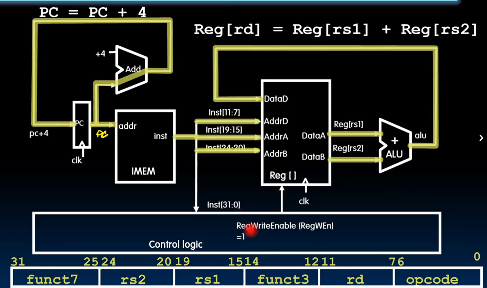
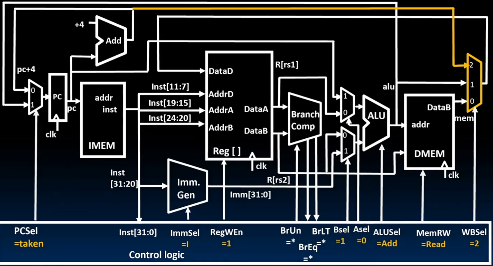
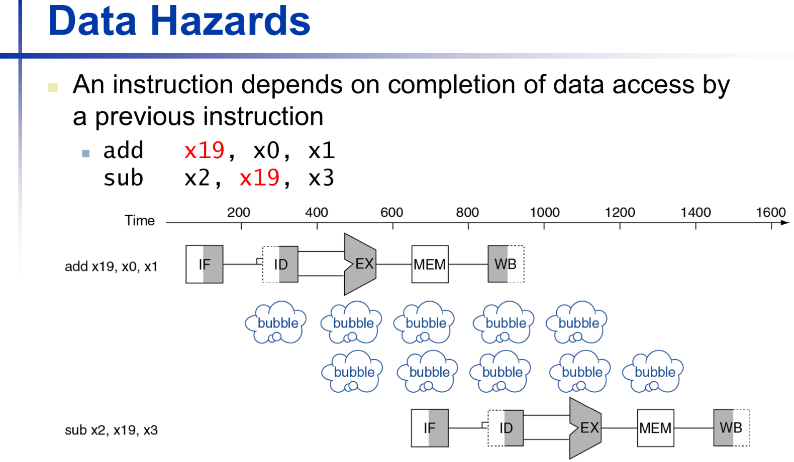
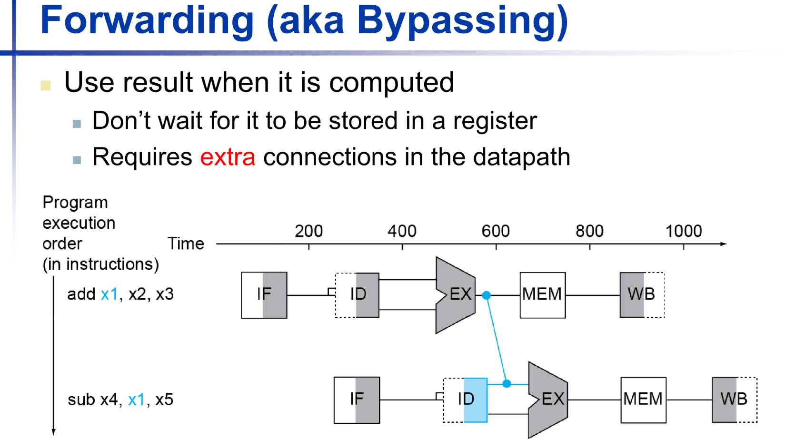
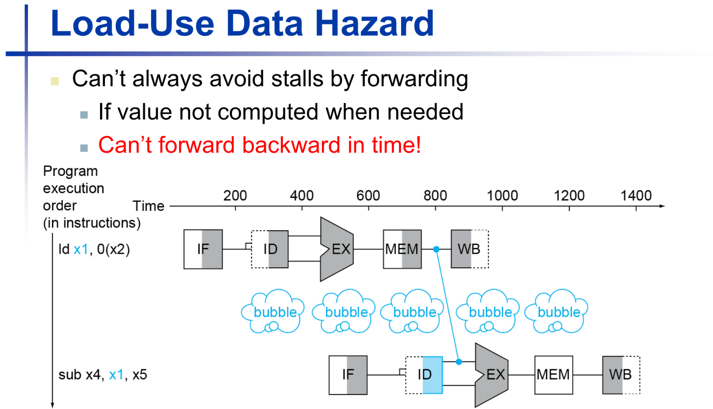
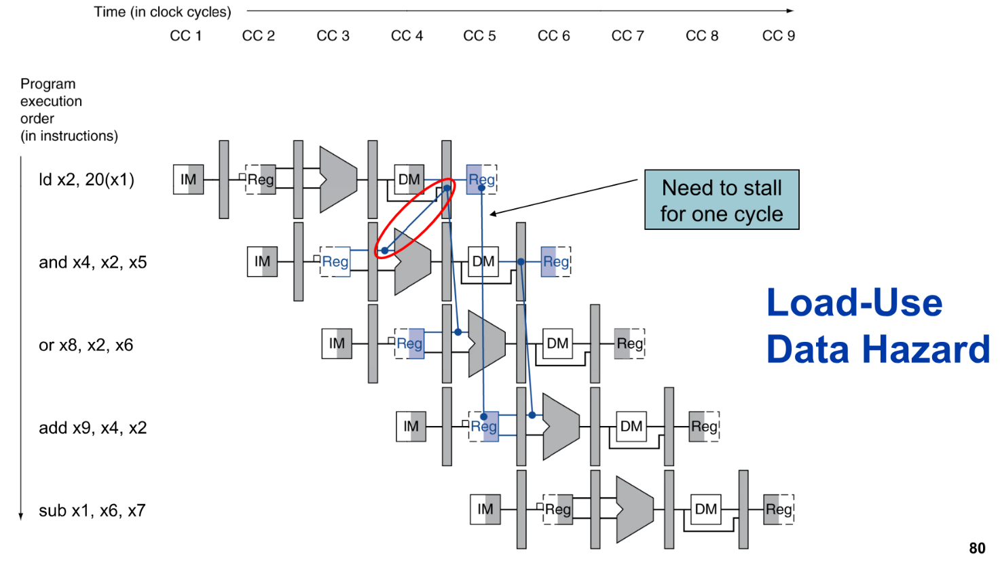

# chapter4 处理器

这章主要分为两部分，第一部分是单周期cpu为了执行指令，如何构建DataPath。第二部分是如何用流水线提升性能

## 1 总览

学习 CPU 的构造，最核心的切入点就是**数据通路 (Datapath)**。如果把 CPU 比作一个工厂，数据通路就是生产线上的传送带和加工机器，而**控制信号 (Control Signals)** 就是指挥中心发出的调度指令。

在 RISC-V 架构中，一个基础的单周期 CPU 数据通路主要由以下几个部分组成：

------

### 数据通路的核心组件

数据通路是指指令执行过程中，数据所流经的路径及处理单元。

- 程序计数器 (PC, Program Counter)：

  一个寄存器，存放当前正在执行指令的地址。

- 指令存储器 (Instruction Memory)：

  根据 PC 提供的地址，读出对应的指令机器码。

- 寄存器堆 (Register File)：

  包含 x0~x31 寄存器。它有两个读端口和一个写端口，负责存放运算的操作数和中间结果。

- 立即数生成单元 (Imm Gen)：

  负责将指令中分散的立即数位（如 addi 中的 12 位）提取并扩展成 32 位或 64 位。

- 算术逻辑单元 (ALU)：

  数据通路的核心加工厂，负责执行加、减、与、或等实际运算。

- 数据存储器 (Data Memory)：

  用于执行访存指令（如 lw, sw），读写内存中的数据。

------

### 什么是控制信号？

控制信号是控制单元 (Control Unit) 根据指令的 **Opcode (操作码)** 和 **Funct (功能位)** 生成的电平信号。它们决定了数据通路中各组件的“动作”。

你可以把控制信号想象成一组开关。常见的关键信号包括：

**选路类信号 (Multiplexer Selectors)**

这些信号控制多路选择器 (MUX)，决定数据从哪里来：

- **ALUSrc**：决定 ALU 的第二个输入是来自寄存器（R-type 指令），还是来自立即数（I-type 指令）。
- **MemtoReg**：决定写回寄存器的数据是来自 ALU 的运算结果，还是来自数据存储器的读出结果。

**写使能类信号 (Write Enable)**

这些信号决定是否要修改硬件状态：

- **RegWrite**：如果该信号为 1，在时钟上升沿时，数据会被写入目标寄存器。
- **MemWrite**：如果为 1，数据会被写入数据存储器（如 `sw` 指令）。
- **MemRead**：是否允许读取数据存储器。

**运算类信号 (ALU Control)**

- **ALUOp**：告知 ALU 应该执行哪种运算（如加法、减法、异或等）。

**跳转类信号 (Branch/Jump)**

- **Branch**：指示当前是否是一条分支指令。它会结合 ALU 的比较结果（如 Zero 位）来决定 PC 是跳向新地址还是继续顺序执行。

------

> [!example] 举例：执行一条 `add x1, x2, x3` 指令
>
> 当这条指令进入 CPU 时，控制信号会进行如下编排：
>
> 1. **RegWrite = 1**：因为我们需要把结果存入 x1。
> 2. **ALUSrc = 0**：选择寄存器 x3 作为输入，而不是立即数。
> 3. **ALUOp = "Add"**：指挥 ALU 做加法运算。
> 4. **MemWrite = 0**：不写内存。
> 5. **MemtoReg = 0**：写回寄存器的数据来源于 ALU 结果。

---

### 五级流水线结构

这部分是后面的内容，但是可以感受一下在单周期CPU中对指令的处理分别对应哪部分

#### IF (Instruction Fetch) - 取指阶段

- **核心任务**：根据程序计数器（PC）中的地址，从指令存储器中取出机器码。
- **主要部件**：PC 寄存器、指令存储器、加法器（用于 PC+4）。
- **控制信号**：
  - **PCSrc**：决定下一条指令的地址。是顺序执行（PC+4），还是跳转执行（Branch/Jump 目标地址）。

#### ID (Instruction Decode) - 译码阶段

- **核心任务**：翻译指令的意思；从寄存器堆（Register File）中读取操作数；扩展立即数。
- **主要部件**：控制单元（Control Unit）、寄存器堆、立即数生成单元（Imm Gen）。
- **控制信号**：
  - 这个阶段是**控制信号的产源地**。控制单元根据指令的 `Opcode` 产生本条指令后续阶段所需的所有信号。

#### EX (Execute) - 执行阶段

- **核心任务**：进行实际的算术逻辑运算、计算访存地址或计算分支跳转目标。
- **主要部件**：ALU、分支地址加法器。
- **关键控制信号**：
  - **ALUSrc**：选择 ALU 的第二个输入是寄存器数据还是立即数。
  - **ALUOp**：决定 ALU 具体做什么动作（加、减、与、或等）。

#### MEM (Memory Access) - 访存阶段

- **核心任务**：如果是加载指令（Load），则从内存读数据；如果是存储指令（Store），则向内存写数据。
- **主要部件**：数据存储器（Data Memory）。
- **关键控制信号**：
  - **MemRead**：是否读取内存。
  - **MemWrite**：是否写入内存。
  - **Branch**：结合 ALU 的比较结果，最终触发跳转逻辑。

#### WB (Write Back) - 写回阶段

- **核心任务**：将计算结果或从内存读出的数据写回到寄存器堆中。
- **主要部件**：寄存器堆。
- **关键控制信号**：
  - **RegWrite**：允许将数据写回目标寄存器（rd）。
  - **MemtoReg**：选择写回的数据来源（是来自 ALU 的运算结果，还是来自内存的读出数据）。

------

**为什么要把 CPU 拆成这五部分？**

这种拆分最大的好处就是**并行化（Parallelism）**。 就像工厂流水线一样：

- 当第一条指令在 **WB** 级写回时；
- 第二条指令可以在 **MEM** 级访存；
- 第三条指令可以在 **EX** 级运算；
- 第四条指令可以在 **ID** 级译码；
- 第五条指令可以在 **IF** 级取指。

**理想情况下，每个时钟周期都能完成一条指令**

## 2 CPU 结构

这部分我感觉按照cs61c逐步添加部件更好理解

这一段将从支持R型指令的电路开始，为了支持新的指令，逐渐加入新的组件，以及对应的控制信号。

> [!tip]
>
> 为了兼容多种指令，我们一般使用添加一个多路选择器MUX，以及添加对应控制信号的方法

### R-type

要完成一条 **R指令**（以add为例），CPU 的数据通路需要经历一个完整的闭环过程：从获取指令地址开始，到最后将计算结果存回寄存器。

完成 R 型指令主要涉及以下五个关键部分：

------

**程序计数器 (PC) 与取指逻辑**

- **PC 寄存器**：保存当前 `add` 指令在内存中的地址。
- **PC + 4 加法器**：由于单条指令占用 4 个字节，计算出下一条指令的地址（`pc+4`）并传回 PC，为下一次取指做准备。

**指令存储器 (IMEM)**

- **输入**：由 PC 提供的地址。
- **输出**：读出 `add` 指令的 32 位机器码（即底部的 `funct7 | rs2 | rs1 | funct3 | rd | opcode`）并传送给控制逻辑和寄存器堆。

**控制逻辑 (Control Logic)**

- **译码**：识别出这是一条 R 型指令（通过 `opcode`）且具体操作是加法（通过 `funct3` 和 `funct7`）。
- **信号生成**：产生关键的控制信号，例如将 **RegWriteEnable (课本上叫RegWrite)** 置为 **1**，允许最终结果写入寄存器。

**寄存器堆 (Register File / Reg[])**

- **读取操作数**：

  根据指令中的 `Inst[19:15]` (rs1) 地址，从 **AddrA** 读出第一个操作数到 **DataA**。

  根据指令中的 `Inst[24:20]` (rs2) 地址，从 **AddrB** 读出第二个操作数到 **DataB**。

- **准备写入地址**：指令中的 `Inst[11:7]` 指定了目标寄存器 **rd** 的地址，用于最后阶段存放结果。

**算术逻辑单元 (ALU)**

- **核心运算**：接收来自寄存器堆的两个操作数（`Reg[rs1]` 和 `Reg[rs2]`），并根据控制逻辑的指令执行“加法”运算。
- **结果写回**：计算出的结果（`alu` 输出端）通过数据总线直接绕回到寄存器堆的 **DataD** 输入端口。在时钟上升沿（clk），由于 `RegWEn=1`，该结果被正式写入到 `Reg[rd]` 中。

---

> [!note]
>
> 对于 R 型指令，数据通路是一个**纯粹的寄存器到寄存器**的过程：
>
> **PC** $\rightarrow$ **IMEM** (取指) $\rightarrow$ **Reg[]** (读 $rs1, rs2$) $\rightarrow$ **ALU** (计算) $\rightarrow$ **Reg[]** (写回 $rd$)

---

### I-type（计算指令）

为了能够处理 `addi` 这类 **I型指令**（Immediate Type），我们需要在原本支持 R型指令的数据通路上进行扩展。核心挑战在于：I型指令的操作数不再是两个寄存器，而是一个**寄存器**和一个嵌入在指令中的**立即数**。

**立即数生成器 (Imm. Gen)**

这是 I型指令数据通路中最重要的变化。

- **功能**：由于 I型指令的机器码（如 `Inst[31:20]`）中只包含 12 位的立即数，**立即数生成器**负责提取这些片段，并将其扩展为 32 位（或 64 位）的完整数据，以便 ALU 进行运算。
- **输入/输出**：它接收完整的 32 位指令作为输入，并根据指令类型输出扩展后的立即数 `Imm[31:0]`。

**控制逻辑信号**

为了指挥硬件在“寄存器模式”和“立即数模式”之间切换，控制逻辑需要增加以下信号：

- **ImmSel (Immediate Select，课本上忽略了此信号)**：告知立即数生成器当前指令的类型（例如 I型），以便它从正确的位置提取位段。

- **BSel (ALU Source B Select， 课本上称为ALUSrc)**：这是一个关键的**多路选择器（MUX）信号**。

  当 `BSel = 0` 时，ALU 的第二个输入来自寄存器 `rs2`（对应 R型指令）。

  当 `BSel = 1` 时，ALU 的第二个输入来自扩展后的**立即数 Imm**（对应 I型指令）。

  ---

> [!example] 
>
> 以 `addi x1, x2, 10` 为例，数据流转如下：
>
> 1. **取指与译码**：从 IMEM 取出指令，控制逻辑识别出这是 I型指令，将 `ImmSel` 设为 I，并将 `BSel` 设为 1。
>
> 2. **操作数准备**：
>
>    从寄存器堆读出 `x2` 的值（`Reg[rs1]`）。
>
>    **Imm. Gen** 同步产生立即数 `10` 的扩展值。
>
> 3. **ALU 运算**：由于 `BSel = 1`，ALU 接收的是 `Reg[rs1]` 和 `Imm[31:0]`。
>
> 4. **写回**：计算结果 `Reg[rs1] + Imm` 通过 `DataD` 写回到目标寄存器 `rd`（即 `x1`），此时 `RegWEn = 1`。

---

### I-type Load

为了支持 I-Type 指令中的 `load`（例如 `lw` 指令），我们必须在计算类指令（如 `addi`）的基础上，打通从 **ALU 计算地址** 到 **内存读取数据**，再到 **写回寄存器** 的完整路径。

我们需要增加以下组件和控制信号：

**数据存储器 (DMEM)**

在 I-Type 计算指令中，数据流在 ALU 之后直接返回寄存器。但对于 `load` 指令，ALU 的结果被视为**内存地址**。

- **数据存储器 (Data Memory / DMEM)**：这是 CPU 访问外部数据的接口。
- **连接方式**：ALU 的输出连接到 DMEM 的 `addr` 输入端。
- **功能**：当执行 `lw` 时，CPU 将 ALU 计算出的目标地址传给 DMEM，DMEM 从该地址读出 32 位数据并从 `DataR` 端口输出。

**写回选择器 (WB Mux)**

寄存器堆（Reg File）的写入端口 `DataD` 现在面临两个选择：是写入 ALU 的计算结果，还是写入内存读出的数据？

- **WB Mux**：在 ALU 和 DMEM 之后增加一个多路选择器。
- **功能**：它决定了最终写回寄存器的数据源。

---

**控制信号**

**MemRW (Memory Read/Write)**：

- 当执行 `load` 指令时，该信号设为 **Read**，指示 DMEM 进行读取操作。
- 当执行 `store` 指令时，设为 **Write**；而对于普通的 `addi`，该信号通常设为无效或读取（取决于设计）。

**WBSel (Write Back Select)**：

- 这是一个关键的选择信号。
- 对于 `addi` 指令，`WBSel = 1`（选择 ALU 结果）。
- 对于 `lw` 指令，**`WBSel = 0`**（选择从 DMEM 读出的数据）。

> [!example] **`lw` 指令下的完整数据流 (Load Word)**
>
> 执行 `lw x1, 4(x2)` 的通路如下：
>
> 1. **地址计算**：ALU 接收 `Reg[x2]` 和立即数 `4`，计算出**内存有效地址**。
> 2. **内存访问**：`MemRW = Read`，DMEM 根据地址取出数据。
> 3. **结果写回**：`WBSel = 0` 使得内存数据通过 Mux 传向 `DataD`。
> 4. **保存**：由于 `RegWEn = 1`，数据在时钟上升沿被存入 `Reg[x1]`。

支持 `load` 指令的本质是：**增加了一个存储器（DMEM）并用一个新的 Mux 重新定义了“写回寄存器”的数据来源。**

---

### S-type

为了支持 S型指令（如 `sw`，即 Store Word），我们需要在原有的加载指令（`lw`）数据通路基础上，打通从**寄存器到内存**的数据传输路径。

支持 `sw` 指令需要进行以下调整：

**数据通路的物理连接：DataB 到 DataW**

在执行 `sw` 指令时，我们需要将寄存器中的数据写入内存，因此必须建立一条从**寄存器堆（Reg File）**到**数据存储器（DMEM）**的通路。

- **物理连接**：寄存器堆的 `DataB` 端口（输出 `Reg[rs2]`）连接到 DMEM 的 `DataW` 输入端口。
- **作用**：`rs1` 和立即数经过 ALU 计算出内存的**写入地址**（`addr`），而 `rs2` 中的实际数据则通过这条新通路送到内存的**待写入数据端**。

---

**控制信号的改变**

为了指挥硬件执行存储操作而不是读取操作，控制逻辑需要发出不同的指令：

**MemRW = Write**：

- 这是执行 `sw` 指令的核心信号。
- 它通知 DMEM 这是一个**写周期**，将 `DataW` 上的数据存入 `addr` 指定的地址。

**RegWEn = 0**：

- 不同于加载或计算指令，`sw` 指令**不修改寄存器**。
- 因此，必须将寄存器写使能信号设为 `0`，防止数据意外写回寄存器堆。

**ImmSel = S**：

- S型指令的立即数在机器码中的位置与 I型不同。
- 控制信号 `ImmSel` 设为 `S`，指挥立即数生成器（Imm. Gen）按照 S型格式拼接立即数（偏移量）。

`WBSel` 的特殊性

在执行 `sw` 时，由于 `RegWEn = 0`，数据通路末端的 WB Mux 选哪一路都无所谓（Don't Care），因为数据根本不会被写进寄存器。

------

**`sw` 指令下的完整流向**

1. **取指与译码**：从 IMEM 取指令，控制逻辑识别出 `sw`，将 `RegWEn` 关掉，并将 `MemRW` 开向 **Write**。
2. **地址计算**：ALU 接收 `Reg[rs1]` 和立即数（S型扩展），计算出**目标内存地址**。
3. **数据传输**：寄存器 `Reg[rs2]` 的数据通过 `DataB` 支线，直接送达 DMEM 的 **DataW**。
4. **存储动作**：在时钟上升沿，数据正式写入内存地址，指令执行完毕。

---

### B-type

为了支持 **B-Type 指令**（如 `beq`, `bne`），数据通路面临最大的挑战是：指令不再是单纯地顺序执行（PC+4），而是要根据**比较结果**来决定 PC 是跳转到某个目标地址，还是继续执行下一条。

为了实现 B-Type 指令，我们需要增加以下核心组件和控制信号：

**核心组件**

**分支比较器 (Branch Comp / Branch Comparator)**：

- **输入**：直接接收来自寄存器堆的两个操作数 `R[rs1]` 和 `R[rs2]`。
- **功能**：在不经过 ALU 的情况下，快速判断两个数是否相等（Eq）、是否小于（LT）等条件。

**PC 选择多路选择器 (PC Mux)**：

- 位于 PC 寄存器的输入端。
- **作用**：在“PC+4”和“ALU 计算出的跳转目标地址”之间做出选择。

**ALU 输入 A 选择器 (Asel Mux)**：

- **改变**：在 B-Type 指令中，跳转地址是相对于当前 PC 的偏移量（PC-relative），因此 ALU 的第一个输入需要从 `Reg[rs1]` 切换为 **PC**。

---

**新增的控制信号**

控制单元需要通过一套复杂的信号组合来管理跳转逻辑：

- **PCSel (taken/not taken)**：这是最核心的信号。如果分支条件达成（taken），则选择跳转地址；否则选择 PC+4。
- **BrUn (Branch Unsigned)**：告知比较器当前进行的是有符号比较还是无符号比较。
- **Asel = 1**：强制 ALU 选择 **PC** 作为第一个操作数，以便计算 `PC + Offset`。
- **Bsel = 1**：选择立即数生成器产生的 **B-Type 立即数** 作为 ALU 的第二个操作数。
- **ImmSel = B**：指挥立即数生成器按照 B-Type 格式提取并扩展指令中的 12 位跳转偏移量。

**B-Type 指令的具体执行流 (以 `beq` 为例)**

1. **比较逻辑**：`Branch Comp` 接收 `rs1` 和 `rs2`，产生 `BrEq` 信号给控制逻辑。

2. **地址计算**：同时，ALU 执行 `PC + Imm`（此时 `Asel=1`, `Bsel=1`），算出潜在的跳转目标地址。

3. **决策触发**：控制逻辑检查 `BrEq`。

   若相等，设置 **PCSel = 1 (taken)**，PC 在下一个周期变为跳转地址。

   若不相等，设置 **PCSel = 0 (not taken)**，PC 变为正常的 PC+4。

4. **状态保护**：设置 **RegWEn = 0** 和 **MemRW = read**，确保跳转指令不会意外修改寄存器或内存数据。

B-Type 指令的引入使数据通路从“直线型”变为了“带分支的环型”。它通过 **Branch Comp** 进行决策，通过 **ALU** 计算目标，最后通过 **PCSel** 改变整个程序的执行流。

---

### JALR

为了支持 `jalr`（Jump and Link Register）指令，我们需要让 CPU 具备“跳得远”且“能跳回来”的能力。与 `beq` 指令不同，`jalr` 的跳转目标不是基于 PC 的相对偏移，而是基于**寄存器的绝对地址**。

支持 `jalr` 需要添加或调整以下组件和信号：

**核心功能的改变：计算跳转目标**

`jalr rd, offset(rs1)` 的功能是将 PC 设置为 `Reg[rs1] + offset`。

**数据通路调整**：

- **ALU 的输入 A**：必须选回 **Reg[rs1]**（即 `Asel = 0`）。
- **ALU 的输入 B**：选择扩展后的**立即数**（即 `Bsel = 1`）。
- **最终目标**：ALU 计算出的结果（`Reg[rs1] + offset`）会被直接送往 **PC Mux**，用于更新 PC。

**“Link”功能的实现：保存返回地址**

`jalr` 中的 "Link" 意味着我们需要把“下一条指令的地址”（即 **PC + 4**）存入目标寄存器 `rd`（通常是 `ra` 寄存器），以便函数执行完后能跳回来。

- **新增组件/连接**：我们需要建立一条从 **PC + 4 加法器** 到 **WB Mux（写回选择器）** 的通路。
- **WB Mux 扩展**：原本的 WB Mux 只有两个输入（ALU 结果和 Memory 结果），现在需要增加第三个输入端，专门接收 **PC + 4**。

---

**新增/调整的控制信号**

为了指挥这一系列复杂的动作，控制逻辑需要做出如下配置：

- **WBSel = 2 (或相应索引)**：指挥 WB Mux 选择 **PC + 4** 作为写回数据。这样，虽然 ALU 在算跳转地址，但最后写进寄存器堆的数据是返回地址。
- **PCSel = 1 (Jump)**：强制 PC 选择来自 ALU 输出的跳转地址，而不是 PC + 4。
- **ImmSel = I**：jalr` 虽然是跳转指令，但它的编码格式其实是 **I-Type**（因为它需要一个 rs1 和一个 12 位立即数）。
- **RegWEn = 1**：因为要保存返回地址到 `rd`，所以寄存器写使能必须开启。

**`jalr` 执行流总结**

1. **算目标**：ALU 计算 `Reg[rs1] + Imm`，并将此值通过 `PCSel` 信号拨给 PC。
2. **存返回**：此时 `PC + 4` 的值顺着新加的通路，通过 `WBSel` 选择器。
3. **写寄存器**：由于 `RegWEn = 1`，`PC + 4` 被存入目标寄存器 `rd`。

------

**`jal` 与 `jalr` 的微小区别**

- **`jal` (J-Type)**：跳转目标是 `PC + Offset`。
- **`jalr` (I-Type)**：跳转目标是 `Reg[rs1] + Offset`。
- **共同点**：都要通过 WB Mux 把 **PC + 4** 塞回寄存器堆。

### J-type

为了支持 **JAL (Jump and Link)** 指令，数据通路需要在 B-Type 分支指令的基础上进行关键调整，以实现“无条件远程跳转”并“保存返回地址”的双重功能。

支持 `jal` 指令主要进行了以下改变：

**核心功能的改变：计算跳转目标**

`jal rd, offset` 指令会将 PC 设置为当前 `PC + offset`。

- **ALU 输入 A 的调整**：与 B-Type 指令一致，ALU 的第一个输入端需要通过 **Asel Mux** 选择 **PC**（即 `Asel = 1`）。
- **ALU 输入 B 的调整**：通过 **Bsel Mux** 选择来自立即数生成器（Imm. Gen）的跳转偏移量（即 `Bsel = 1`）。
- **立即数扩展**：控制信号 **ImmSel** 设置为 **J**，指挥立即数生成器按照 J-Type 格式拼接 20 位的跳转偏移量。

**“Link”功能的实现：保存返回地址**

这是 `jal` 与分支指令最大的区别——它必须把跳转后的“返回地址”（即当前指令的下一条地址 **PC + 4**）存入目标寄存器 `rd`。

- **建立 PC+4 路径**：数据通路中建立了一条从 **PC + 4 加法器** 直接连向 **WB Mux（写回选择器）** 的支线（JALR图中橙色高亮线路）。
- **WB Mux 扩展**：写回多路选择器增加了一个输入端口（输入端 2），专门接收这个 **PC + 4** 的值。

**控制信号的配置**

为了完成上述逻辑，控制单元（Control Logic）发出了以下指令：

- **PCSel = taken**：无条件强制 PC 选择来自 ALU 计算出的跳转目标地址。
- **RegWEn = 1**：开启寄存器写使能，因为需要将返回地址写入寄存器堆。
- **WBSel = 2**：指挥 WB Mux 忽略 ALU 的运算结果，而是选择输入端 2 上的 **PC + 4** 写回寄存器 `rd`。
- **MemRW = Read**：保持内存为读取状态（不修改内存）。

**`jal` 执行流总结**

1. **跳转目标**：ALU 计算 `PC + Offset`，结果直接传给 PC。
2. **保存现场**：同时，`PC + 4` 的值顺着橙色路径传到 WB Mux。
3. **写回 Link**：由于 `WBSel = 2` 且 `RegWEn = 1`，这个返回地址在时钟上升沿被存入目标寄存器（通常是 `ra`），完成函数调用的准备工作。

支持 `jal` 的关键在于：**复用 ALU 计算 PC 相对地址**，并**新增一条将 PC+4 绕回寄存器堆的“快速通道”**。

---

### U-type 

没啥好说，把立即数生成器添加一个U-type模式

## 3 Pipeline 

进入流水线（Pipelining）的学习，意味着我们从“原理”跨向了“性能优化”。流水线的五个部分在前面已经有介绍，包括IF,ID,EX,MEM,WB。

### 为什么要使用流水线？

在单周期 CPU 中，时钟周期由**最慢的一条指令**（通常是 `lw`）决定。无论简单的 `add` 还是复杂的 `lw`，都必须等一整个周期，这导致了严重的硬件闲置。

**流水线的核心目标是提高吞吐量（Throughput）**，即单位时间内完成的指令数。

- **并行工作**：将指令处理分为多个阶段（如 IF, ID, EX, MEM, WB），让不同的硬件部分同时处理不同的指令。
- **缩短周期**：由于每个阶段的电路变得简单，时钟频率可以大幅提升。
- **类比**：就像洗衣服。与其等一桶衣服洗完、烘干、叠好再洗下一桶，流水线方式是第一桶进烘干机时，第二桶就进洗衣机。

------

### 三大冒险 (Hazards)

流水线虽然快，但由于多条指令同时在跑，会产生各种冲突，这些冲突被称为**冒险**。

**A. 结构冒险 (Structural Hazards)**

- **原因**：多条指令在同一时刻争抢**同一个物理硬件资源**。
- **例子**：如果指令存储器（IMEM）和数据存储器（DMEM）合二为一。取指阶段（IF）要读它，访存阶段（MEM）也要读它，此时就会撞车。
- **解决方法**：增加资源。例如采用哈佛架构，将指令和数据存储器分开。

**B. 数据冒险 (Data Hazards)**

- **原因**：指令需要的数据还没有被前面的指令写回寄存器。
- **例子**：
  1. `add x1, x2, x3` （在第 5 阶段 WB 才会写回 x1）
  2. `sub x4, x1, x5` （在第 2 阶段 ID 就需要读 x1）
- **解决方法**：
  - **旁路/前推 (Forwarding/Bypassing)**：不等写回寄存器，直接从 EX 或 MEM 阶段把结果“拉”到后面指令的输入端。
  - **阻塞 (Stall)**：如果数据还没算出来（如 `lw` 后紧跟 `add`），硬件必须停一拍，产生一个“空泡”（Bubble）。

**C. 控制冒险 (Control Hazards)**

- **原因**：处理器在还没确定分支跳转（如 `beq`）是否成功前，就已经把后面的指令取进来了。
- **后果**：如果最后发现要跳转，那么已经取进来的后续指令就是错的，必须全部作废（Flush）。
- **解决方法**：
  - **分支预测 (Branch Prediction)**：预测跳还是不跳。
  - **延迟分支 (Delayed Branch)**：编译器调整指令顺序，放一条总是需要执行的指令在跳转后面。

------

### 数据冒险

在流水线设计中，**数据冒险（Data Hazard）**是最常见的性能瓶颈。当一条指令依赖于前面尚未完成写回指令的结果时，冒险就会发生。

**什么是数据冒险？**

数据冒险源于指令间的数据依赖。例如：

1. `add x19, x0, x1`：在第5阶段（WB）才将结果写入 `x19`。

2. sub x2, x19, x3：在第2阶段（ID）就需要读取 x19。

   如果不加处理，sub 指令会读到 x19 的旧值，导致逻辑错误。

**使用前推（Forwarding/Bypassing）解决**

**前推**的核心思想是：**一旦结果被计算出来，就立即投入使用，而不必等待它存入寄存器**。

- **实现原理**：在数据通路中增加额外的连接。
- **具体路径**：
  - **EX到EX前推**：将 `add` 指令在 EX 阶段计算出的结果，直接拉回到下一条指令的 ALU 输入端。
  - **MEM到EX前推**：如果依赖项隔了一条指令，则从 MEM 阶段的结果前推回 EX 阶段。

**前推的局限性：Load-Use 冒险**

前推并不能解决所有数据冒险，典型的例外是 **Load-Use 数据冒险**。

- **冲突点**：`ld x1, 0(x2)` 指令的数据直到 **MEM 阶段结束**才从内存中取回。

- **无法前推的原因**：如果紧跟的指令 `sub x4, x1, x5` 在 EX 阶段就需要这个值，那么前推线必须“穿越时空”回到过去，这在物理上是不可能的。

- 硬件对策：阻塞（Stall/Bubble）：

  硬件会自动检测到这种冲突，并强行让 sub 指令及其后的指令停止一拍，产生一个“空泡（Bubble）”，直到 ld 结果可用。

**通过代码调度（Code Scheduling）消除阻塞**

除了硬件上的努力，编译器或程序员可以通过**重排指令顺序**来避免阻塞，从而提高程序运行效率。

- **策略**：在 `load` 指令和使用该结果的指令之间插入不相关的指令。
- **实例对比**：
  - **未优化代码**：指令紧跟依赖项，触发 2 次阻塞（Stall），共消耗 **13 个周期**。
  - **优化后的代码**：将其他的 `ld` 指令穿插在计算指令中间，消除了所有阻塞，仅需 **11 个周期** 即可完成相同任务。

------

**总结**：前推解决了大部分运算指令间的冒险，但对于 `load` 指令，硬件必须通过阻塞来等待数据。而最极致的优化方案是利用代码调度，让流水线始终保持满载。

---

### 控制冒险

在流水线中，**控制冒险（Control Hazard）**是指处理器在根据分支指令（如 `beq`, `bne`, `jal`）确定下一条指令的地址之前，就已经将后续指令取入流水线的现象。如果分支跳转成功，那么已经进入流水线的指令就是错误的，必须被废弃，这会导致性能损失。

**为什么会产生控制冒险？**

在五级流水线中，分支决策通常在 **ID（译码）** 或 **EX（执行）** 阶段才能做出。

- **延迟效应**：当 `beq` 指令在执行时，由于流水线的重叠，后续的一到两条指令可能已经处于取指（IF）或译码（ID）阶段了。
- **路径错误**：如果最终决定跳转，流水线里这些“不该出现”的指令就会造成错误执行。

------

**解决方案：硬件与软件的配合**

针对控制冒险，业界主要有以下几种解决方法：

A. 流水线阻塞 (Stalling / Bubble)

- **原理**：最简单粗暴的方法。一旦检测到分支指令，流水线立刻“停一拍”或“停两拍”，直到分支结果确定。
- **缺点**：这会产生明显的“空泡”（Bubble），降低了流水线的吞吐量。

B. 分支预测 (Branch Prediction)

这是现代 CPU 提高效率的核心技术：

- **静态预测**：简单假设。例如，假设所有的分支都“不跳转”（Predict Not Taken）。如果猜对了，流水线全速前进；如果猜错了，则丢弃（Flush）错误指令并重新取指。
- **动态预测**：硬件维护一个“分支历史表”。根据该指令过去跳没跳，来预测这次跳不跳。

C. 缩短分支延迟 (Reducing Branch Delay)

- **优化策略**：将分支结果的判断逻辑从 **EX 阶段**提前到 **ID 阶段**。
- **效果**：这样可以将猜错时的损失从 2 个周期减少到 1 个周期。

D. 延迟分支 (Delayed Branch)

- **原理**：这是一种软件/编译器方案。编译器会在分支指令后面放置一条**无论跳转与否都要执行**的有用指令（Slot）。
- **现状**：这种方法在早期的 MIPS 架构中很流行，但在追求超深流水线的现代处理器中已不多见。

------

**指令清除 (Flushing)**

当预测失败时，硬件必须执行“清除”动作：

- 将 IF、ID 阶段中由于错误预测而取进来的指令控制信号全部置为 0（变成 `nop` 指令）。
- 重新根据正确的目标地址更新 PC 值。

---

## 4流水线中的控制信号

在流水线（Pipeline）架构中，处理不同指令具有不同控制信号问题的核心方法是：**将控制信号随指令一起“流动”，并利用流水线寄存器（Pipeline Registers）进行同步。**

以下是详细的实现逻辑：

**控制信号的集中生成**

在五级流水线中，控制信号是在 **ID（译码）阶段** 一次性生成的。

- **译码器（Control Unit）** 根据指令的操作码（Opcode）和功能位（Funct），生成该指令在后续所有阶段（EX, MEM, WB）所需的全部开关信号。
- 由于每一时刻流水线里有 5 条不同的指令，如果直接全局控制，信号就会互相打架。

**控制信号的“随存随行”**

为了解决不同指令信号不同的问题，硬件在每一级流水线之间加入了**流水线寄存器**（如 IF/ID, ID/EX, EX/MEM, MEM/WB）。

- **数据通路与控制通路并行**：流水线寄存器不仅存储数据（如寄存器值、地址），还专门开辟了空间来存储**控制信号总线**。
- **同步移动**：当一条指令从 ID 进入 EX 阶段时，它所属的控制信号也会从 ID/EX 寄存器同步搬移到 EX/MEM 寄存器。这确保了信号与指令在物理位置上始终对齐。

**按阶段“拆包”使用**

控制信号并不是在某一瞬间全部起作用，而是根据指令所处的阶段**按需取用**：

| **流水线阶段** | **使用的控制信号示例**                | **信号去向**                             |
| -------------- | ------------------------------------- | ---------------------------------------- |
| **EX (执行)**  | **ALUSrc**, **ALUOp**                 | 驱动 ALU 及其输入多路选择器              |
| **MEM (访存)** | **MemRead**, **MemWrite**, **Branch** | 驱动数据存储器和分支跳转逻辑             |
| **WB (写回)**  | **RegWrite**, **MemtoReg**            | 传递到流水线最末端，控制结果写回寄存器堆 |

**解决“写回阶段”的特殊挑战**

**WB 信号**是处理中最特殊的一环。

- **问题**：指令在 WB 阶段才需要修改寄存器，但此时该指令已经运行到流水线的最后一级，而控制单元还在第一级忙着译码新指令。
- **解法**：WB 级的信号（如 `RegWrite`）必须一直存放在流水线寄存器中，伴随指令走完 EX 和 MEM，最后才在 WB 阶段释放，控制目标寄存器的写入。

**异常情况处理：信号清零（Flush）**

当发生**控制冒险**（如分支预测失败）时，流水线需要清除错误的指令：

- 硬件会将 ID/EX 寄存器中的所有控制信号强制置为 **0**。
- 这本质上是将这条指令变成了一条 **nop（空操作）**，因为它不再具有任何写内存（MemWrite=0）或写寄存器（RegWrite=0）的能力，从而保护了状态不被破坏。

------

### 前推的控制信号

前推（Forwarding）逻辑的本质，其实是一个实时运行的**“地址比对器”**。它的任务是在每一条指令执行时，观察后面阶段的指令是否会产生它现在需要的数据。

为了实现自动化前推，我们需要引入一个专门的硬件单元：**前推单元（Forwarding Unit）**。

**比对逻辑：谁需要？谁拥有**

前推单元通过不断比对**寄存器编号**来做出决策：

- **需求方**：当前处于 **EX阶段** 的指令，其操作数寄存器编号为 `rs1` 和 `rs2`。
- **供给方**：
  - 处于 **MEM阶段** 的指令，其目标寄存器编号为 `EX/MEM.RegisterRd`。
  - 处于 **WB阶段** 的指令，其目标寄存器编号为 `MEM/WB.RegisterRd`。

**触发前推的条件**

前推单元会检查以下条件。如果成立，就立刻拨动 ALU 前端的多路选择器（MUX）：

情况 A：从 MEM 阶段前推（最快路径）

如果 `EX/MEM.RegWrite` 为真（说明前序指令要写回），且 `EX/MEM.RegisterRd` 等于当前指令的 `rs1` 或 `rs2`，则触发前推。

> **逻辑**：数据还没进内存或寄存器，直接从 ALU 输出口拉回输入口。

情况 B：从 WB 阶段前推（稍远的路径）

`MEM/WB.RegWrite` 为真，且 `MEM/WB.RegisterRd` 等于当前指令的 `rs1` 或 `rs2`。

> **逻辑**：数据刚从内存读出或刚从 ALU 传到写回级，赶在写进寄存器堆之前截获它。

------

**修改 Mux 信号：三选一**

为了支持前推，ALU 的两个输入端（A 和 B）各自增加了一个 **3 选 1 多路选择器**。其控制信号（如 `ForwardA`）的取值含义如下：

- **00**：**正常路径**。使用从寄存器堆读出的原始值。
- **10**：**来自 MEM 级的前推**。使用前一条指令在 ALU 算出的结果。
- **01**：**来自 WB 级的前推**。使用前前条指令的结果。

------

### Load Use控制信号

当“前推（Forwarding）”逻辑发现数据无法通过物理连线及时送到时，就需要**冒险检测单元（Hazard Detection Unit）**介入。Load-Use 冒险之所以特殊，是因为数据是从内存中读取的，它在流水线中产生的时刻太晚，无法满足紧随其后的指令在 EX 阶段的需求。

以下是硬件如何检测并处理这种“即便前推也救不回来”的情况：

**硬件检测的触发逻辑**

冒险检测单元位于 **ID（译码）阶段**。它会像监视器一样，通过对比当前指令和上一条指令的寄存器使用情况来判断是否需要“刹车”。

检测条件（伪代码逻辑）：

当满足以下所有条件时，判定为 Load-Use 冒险：

- **前一条指令（处于 EX 阶段）是 Load 指令**：其控制信号 `ID/EX.MemRead` 为真。
- **数据存在依赖关系**：前一条指令的目标寄存器 `ID/EX.RegisterRd` 等于当前指令（处于 ID 阶段）的源寄存器 `IF/ID.RegisterRs1` 或 `IF/ID.RegisterRs2`。

------

**处理冒险的三大动作：阻塞（Stalling）**

一旦检测到上述条件，硬件会强行让流水线进入“待机”状态。为了让 Load 指令能够跑完 MEM 阶段拿到数据，检测单元会同步执行以下三个动作：

1. 停在原地（IF/ID 保持不变）：

   禁止 IF/ID 流水线寄存器更新。这意味着当前正在译码的指令（需要数据的指令）会在 ID 阶段停留一个周期。

2. 不取新指（PC 保持不变）：

   禁止程序计数器（PC）自增。这保证了流水线最前端不会取进新的指令。

3. 注入“空泡”（Bubble/NOP）：

   将 ID/EX 流水线寄存器中的所有控制信号清零（如 RegWrite=0, MemWrite=0）。这相当于在流水线中间插入了一个 NOP（空操作），它会随着时钟周期向后流动，直到自然消失。

------

**时间轴上的变化**

- **不阻塞的情况**：指令 2 会尝试在指令 1 的 MEM 阶段之前就使用数据，导致错误。
- **阻塞之后**：指令 2 被向后推迟了一个时钟周期。此时，指令 1 已经完成了 MEM 阶段（数据已准备好），现在可以通过正常的**前推逻辑**将数据直接送到指令 2 的 ALU 输入端了。

---

### 分支中的冒险

在分支指令（B-Type）中，数据冒险和控制冒险往往是交织在一起的。由于分支指令需要比较两个寄存器的值来决定是否跳转，如果这两个寄存器的值还没有被前面的指令写回，就会产生数据冒险。

**分支指令中的数据冒险 (Data Hazard in Branches)**

为了减少控制冒险带来的损失，现代流水线通常将分支比较逻辑（Branch Comparator）提前到 **ID（译码）阶段**。但这会带来更严峻的数据依赖问题：

- **冲突点**：分支指令在 ID 阶段就需要寄存器的值进行比较，而前序指令可能还在 EX 或 MEM 阶段。
- **解决方案**：
  - **前推 (Forwarding)**：如果前序指令是 ALU 运算，数据可以从 EX/MEM 或 MEM/WB 级前推到 ID 级的比较器输入端。
  - **阻塞 (Stall)**：如果前序指令是 `load` 且紧跟分支，或者前序 ALU 指令的结果还没算出来，流水线必须在 ID 阶段阻塞，直到数据就绪。

------

**分支预测 (Branch Prediction)**

为了不让流水线频繁阻塞，CPU 会“猜测”分支是否跳转。

1-bit 动态分支预测 (1-bit Predictor)

这是最简单的动态预测机制，它使用一个位（Bit）来记录该分支上一次执行的情况。

- **逻辑**：如果上次跳了（Taken），这次就猜跳；如果上次没跳（Not Taken），这次就猜不跳。
- **缺点**：在循环（Loop）结构中表现不佳。例如，一个执行 10 次的循环，在最后一次退出循环和下一次重新进入循环时，它都会猜错。这种“双倍错误”会导致流水线频繁清空。

动态分支预测 (2-bit Predictor)

为了解决 1-bit 预测器的灵敏度过高问题，引入了 2-bit 饱和计数器。它像是一个有“记性”的开关，只有当分支连续两次改变方向时，预测器才会改变它的预测倾向。

它有四个状态：

1. **Strongly Taken (11)**：极力预测跳转。
2. **Weakly Taken (10)**：倾向跳转，如果错一次，转为弱不跳。
3. **Weakly Not Taken (01)**：倾向不跳转。
4. **Strongly Not Taken (00)**：极力预测不跳转。

- **优势**：它能够容忍偶尔的反向操作。例如在循环结束时，它只会猜错一次，而不会立即改变对下一次循环启动时的预测倾向。

------

**预测失败后的处理：Flush**

无论预测器多么聪明，总会有猜错的时候。一旦在 ID 或 EX 阶段发现实际结果与预测不符，控制逻辑必须：

- **清空流水线 (Flush)**：将 IF、ID 级中错误的指令变成 `nop`（空操作）。
- **修正路径**：从正确的分支目标地址重新取指。

---

## 5 Exception

在流水线中处理**异常（Exception）**或**中断（Interrupt）**是非常棘手的，因为它打破了指令顺序执行的平滑性。你可以把异常看作是一种特殊的“硬件触发的分支”。

处理流水线异常的核心挑战在于**精确异常（Precise Exception）**：即使多条指令在并行，也要保证在异常指令之前的指令全部执行完，而之后的指令好像从未发生过一样。

------

**异常的检测与保存**

异常可能发生在流水线的任何一个阶段。流水线并不会在检测到异常时立刻停下所有动作，而是采取“**标记并后传**”的策略：

- **IF 阶段**：发生访存错误（如指令地址越界、页故障）。
- **ID 阶段**：检测到非法指令。
- **EX 阶段**：发生算术溢出。
- **MEM 阶段**：数据访存错误（如 `lw` 读取了非法地址）。

**处理方式**：硬件会在该指令对应的**流水线寄存器**中添加一个“异常状态位”（Exception Status Register），记录发生了什么异常。这条指令会带着这个“地雷”标记继续向后流动。

------

**异常的正式处理**

只有当这条带有异常标记的指令到达 **WB（写回）阶段**（或在某些设计中是 MEM 阶段）时，控制逻辑才会正式触发异常处理程序。

为什么要等？

为了防止“误杀”。比如指令 A 发生了溢出异常，但它前面有一条指令 B 还没执行完。如果我们立刻处理异常，可能会破坏 B 的执行。只有等到 A 成为流水线中最老的那条指令时，处理它才是安全的。

------

**处理异常的三大动作：Flush, Save, Jump**

一旦决定处理异常，控制逻辑会执行以下操作：

1. **清空流水线 (Flush)**：
   - 将异常指令及其后面所有指令（处于 IF, ID, EX, MEM 阶段的）的控制信号全部清零。
   - 这保证了发生错误的指令不会修改寄存器或内存。
2. **保存状态 (Save Context)**：
   - 将被中断指令的地址存入特殊的寄存器（在 RISC-V 中通常是 **sepc**）。
   - 记录异常原因（存入 **scause**）。
3. **跳转到异常向量表 (Jump to Vector Table)**：
   - 将 PC 设置为异常处理程序（Handler）的起始地址，开始执行操作系统定义的错误处理逻辑。

------

> [!tip]
>
> 异常与控制冒险的相似性
>
> 你会发现，处理异常的逻辑和处理**分支预测失败**（控制冒险）极其相似：
>
> - 都需要 **Flush** 掉后续指令。
> - 都需要 **改变 PC 的流向**。
> - 区别在于：分支是程序主动的跳转，而异常是被动、突发的“意外”。

------

