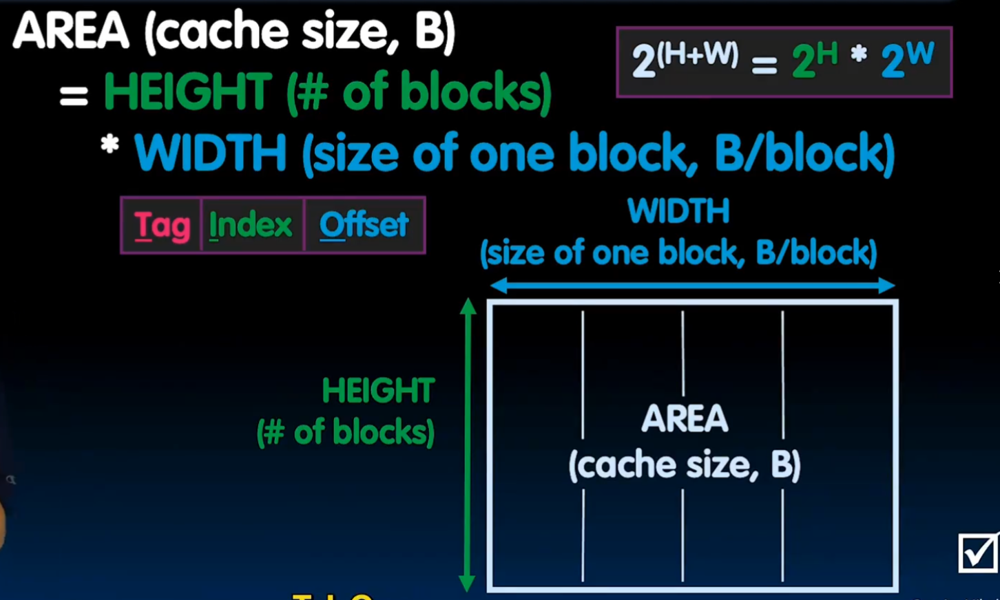
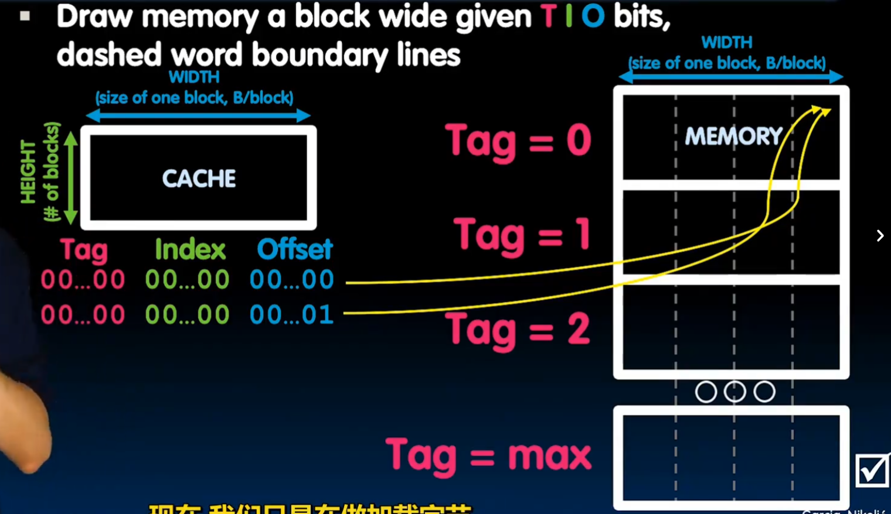
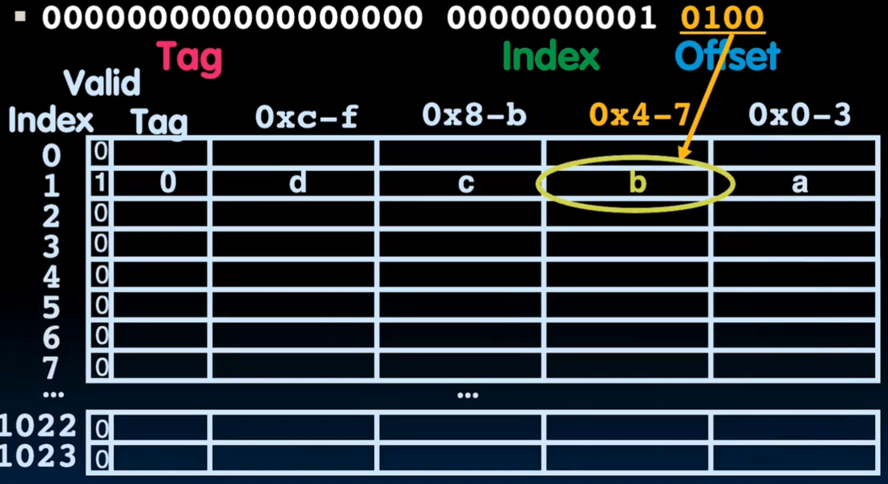
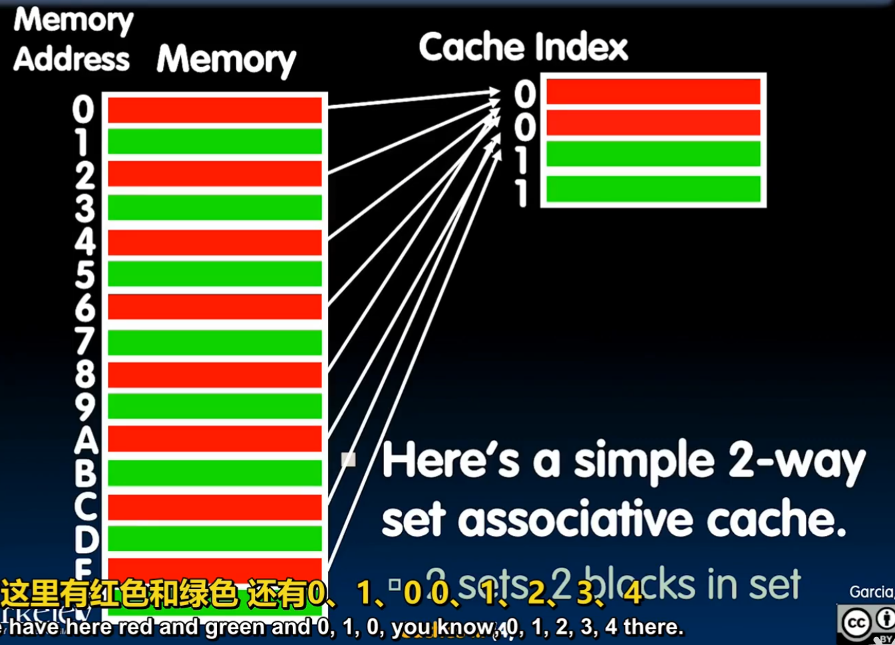

# Chapter5 Cache/Memory

## 1 总览

存储器层次结构（Memory Hierarchy）的设计初衷是为了解决**处理器速度快**与**存储器访问慢**之间的矛盾，也就是常说的“存储墙”问题。其核心思想是利用**局部性原理（Locality of Reference）**，通过构建多层存储空间，在成本、容量和速度之间取得平衡。

------

### 存储器金字塔结构

存储器通常被组织成一个金字塔形，从上到下容量越来越大，速度越来越慢，但单位成本也越来越低：

- **寄存器 (Registers)**：位于 CPU 内部，速度极快（与 CPU 同频），容量极小（通常仅几百字节）。
- **高速缓存 (Cache)**：分为 L1、L2、L3 三级。L1 最快但最小，L3 最慢但容量最大。它存储了 CPU 近期可能访问的数据。
- **主存 (Main Memory/RAM)**：存放当前正在运行的程序和数据。
- **辅存 (Secondary Storage)**：如 SSD 或 HDD，容量巨大且数据掉电不丢失，但访问速度比内存慢数千倍。

------

### 核心原理：局部性原理 (Locality)

存储层次结构之所以有效，是因为程序运行具有以下两个特性：

- **时间局部性 (Temporal Locality)**：如果一个数据被访问了，那么它在不久的将来很可能再次被访问（例如循环中的计数器）。
- **空间局部性 (Spatial Locality)**：如果一个数据被访问了，那么它相邻的数据在不久的将来也很可能被访问（例如遍历数组）。

------

### 关键术语

在学习层次结构时，你会经常遇到以下概念：

- **命中 (Hit)**：CPU 所需的数据在较高级别（较快）的存储器中找到。
- **缺失 (Miss)**：在较快存储器中找不到数据，必须向下一级索取。
- **命中率 (Hit Rate)**：命中次数占总访问次数的比例。
- **缺失惩罚 (Miss Penalty)**：处理一次缺失所需额外消耗的时间（通常包括将数据从低速层搬运到高速层的时间）。

------

### 存储层级间的数据传输

数据在不同层级之间是以固定大小的块（Block/Line）为单位传输的。

- **Cache 与内存之间**：传输单位通常是 **Cache Line**（如 64 字节）。
- **内存与硬盘之间**：传输单位通常是 **页 (Page)**（如 4KB）。

------

## 2 Cache

既然我们已经了解了存储器层次结构的宏观“金字塔”模型，接下来我们需要深入探讨这一体系的核心：**高速缓存（Cache）**。

Cache 的存在是为了在 CPU 和主存之间架起一座桥梁。它利用**局部性原理**，将 CPU 最近可能用到的数据从慢速的主存搬运到快速的 Cache 中。

------

### Cache 的基本操作逻辑

当 CPU 需要访问一个地址时：

1. **命中 (Hit)**：数据已在 Cache 中。CPU 以极快速度读取。
2. **缺失 (Miss)**：数据不在 Cache 中。CPU 必须等待，从主存中将包含该数据的整个**块（Block/Line）**搬运到 Cache 中，然后再读取。

------

**地址映射（Mapping）**

内存很大（GB级别），Cache 很小（MB级别）。如何决定内存中的某个数据存放在 Cache 的哪个位置？主要有三种映射方案：直接映射，全相联映射，组相联映射。

A. 直接映射 (Direct Mapped)

- **规则**：内存中的每个块只能存放在 Cache 中**唯一**确定的位置。
- **计算**：通常使用 `(块地址 % Cache块数)`。
- **优缺点**：硬件设计最简单，成本低；但容易发生**碰撞（Conflict Miss）**，如果两个经常使用的块映射到同一个位置，它们会互相踢出。

B. 全相联映射 (Fully Associative)

- **规则**：内存块可以存放在 Cache 的**任何**空闲位置。
- **优缺点**：空间利用率最高，碰撞概率最低；但硬件搜索极慢且昂贵，因为 CPU 必须同时检查 Cache 中的所有位置。

C. 组相联映射 (Set Associative)

- **规则**：这是前两者的折中方案。将 Cache 分成若干“组”，块映射到固定的组，但在组内可以存放在任何位置（例如“2路组相联”表示每组有两个位置）。
- **现状**：这是目前主流 CPU（如 Intel、AMD、ARM）最常用的方案。

## 3 直接映射 (Direct Mapped)

**直接映射 (Direct Mapped Cache)** 是最简单的一种映射方式。它的核心思想是：内存中的每一个块（Block）在 Cache 中都有一个**固定且唯一**的对应位置。

你可以把它想象成“按门牌号入座”：内存空间被分成了很多个小组，每个小组的成员只能去 Cache 里的那个特定位置。

------

### **映射规则：取模运算**

内存地址到 Cache 位置的对应关系通常通过**取模（Modulo）**运算来实现：

$$Cache 索引 = (内存块地址) \mod (Cache 中的总块数)$$

例如，如果你的 Cache 有 8 个槽位（Index 0-7）：

- 内存第 0 块、第 8 块、第 16 块... 都会映射到 **Cache Index 0**。
- 内存第 1 块、第 9 块、第 17 块... 都会映射到 **Cache Index 1**。

#### 示例一：单字节block

以这个cs61c的示例图为例，此时cache中一共有4个block，每个block大小为1字节。将内存按照block大小分块，然后对4取余，那么余数为0的就到index为0的缓存块中。从颜色可以直观的看出这个映射规律。

#### 示例二：多字节block

在这个例子中，一个block的大小增大到2字节，也就是cache中的一行。但是我们依然可以将内存按照block大小分块，然后对应取余。

这个时候有两个问题：

1. 当我请求一个block中的一个字节时，我会取来一个字节还是这一整个block（一整行）？
2. 当我请求一个block中的字节时，我怎么知道他在这一行的哪个位置？

对于第一个问题：前面的基本操作逻辑已经提到了，我们会取来这一整个block。这是空间局部性原理导致的，如果一个数据块被访问了，那么他相邻的数据块很有可能也会被访问到。而我们去内存取一次数据的开销是十分昂贵的。去cache取数据就像去书桌上拿一本书，而去内存取一次数据就像开车到市中心图书馆取书。此时如果你说我想读一本关于计算机系统原理的书，你就会顺手带两本和他相关的书，避免下一次要再开车来一次。

对于第二个问题，这就引出了我们在cache中是如何给字节标定地址的。

---

### 地址的拆分

为了在 Cache 中快速找到数据并确认它是不是我们要的那一个，CPU 会将 32 位（或 64 位）的内存地址拆解为三个部分：

- **标记 (Tag)**：地址的高位部分。它用来区分映射到同一个 Cache Index 的不同内存块。
- **索引 (Index)**：中间部分。用来确定数据应该存放在 Cache 的哪一行（Row）。
- **块偏移 (Block Offset)**：低位部分。用来确定数据在某一个 Cache 块内的具体字节位置。

> [!example]
>
> 
>
> 这个图演示了Tag是如何确定的，将内存按照Cache的大小分组，我们需要知道这个block是哪个组的block。

> [!example]
>
> 
>
> 这个图演示了Cache中的具体布局，想要计算一个cache到底能存多少字节的数据，就要知道包含多少个block(Height)，一个block（一行）包含多少字节(Width)

#### 示例三：Cache 寻址

以这个图为例，Cache中一个Tag = 0, Index = 0, offset = 0 的字节，对应内存第一个分组，行数为0，offset = 0，也就是从第一行右起第一个位置的字节。offset + 1时，向左移一个字节。

------

### 直接映射的内部结构

每一个 Cache 槽位（Entry）由三部分组成：

1. **有效位 (Valid Bit)**：标记该位置是否有有效数据（1表示有，0表示为空或无效）。
2. **标记 (Tag)**：存储该位置当前存放的内存块的高位地址。
3. **数据 (Data)**：存储从内存搬运过来的实际数据块。

#### 示例四：包含有效位的寻址

根据地址我们可以找到字节在Cache中对应的位置，但是事实是，在找到对应Index之后，我们要做的第一件事不是对比Tag是否一致，而是判断有效位是否为1。如果一个Cache刚被启用，那么所有的数据都是空的，有效位都置0，里面都是垃圾，这时候我们可以说这个cache是“冷的”。

---

### 直接映射的硬件结构

------

### 优缺点分析

- **优点**：
  - **硬件极其简单**：不需要复杂的查找电路，只需要一个比较器检查 Tag 是否匹配即可。
  - **访问速度快**：因为位置是唯一的，CPU 可以直接跳到目标位置。
  - **成本低**：逻辑门数量少。
- **缺点（碰撞问题）**：
  - **冲突缺失 (Conflict Miss)**：这是它的致命伤。如果程序频繁地在内存第 0 块和第 8 块之间切换（它们都映射到 Index 0），Cache 就会不断地发生“踢出-搬运-再踢出”的循环，这被称为 **Cache 抖动 (Thrashing)**。

------

### 写策略

当 CPU 修改了 L1 Cache 中的数据时，主存（Main Memory）里的对应数据就会变得“过期”。如何同步这些修改，主要有两种策略：**写穿透**和**写回**。

------

**写穿透 (Write-Through)**

这是最保守、最简单的做法。

- **操作逻辑**：每次 CPU 往 Cache 里写数据时，数据会**同时**被写入 Cache 和下一级存储（如主存）。
- **优点**：
  - **数据一致性好**：主存里的数据永远是最新的，维护起来非常简单。
  - **实现简单**：发生缺失（Miss）时不需要考虑复杂的写回逻辑。
- **缺点**：
  - **效率极低**：由于内存速度比 CPU 慢百倍，每次写操作都要等内存确认，CPU 会被严重拖慢。
- **优化：写缓冲 (Write Buffer)**：为了缓解速度差，通常会在 CPU 和内存间加一个“小推车”（Buffer）。CPU 把数据扔进缓冲就走，由缓冲慢慢写往内存。

------

**写回 (Write-Back)**

这是现代高性能 CPU（如 Intel、AMD、ARM）普遍采用的方案。

- **操作逻辑**：CPU 修改数据时，**只更新 Cache**，并不立刻写回主存。
- **脏位 (Dirty Bit)**：为了记住哪些数据被改过，Cache 每一行会多加一个 `Dirty bit`。
  - 如果该块被修改过，`Dirty bit` 设为 1。
  - 如果没被修改过，`Dirty bit` 为 0。
- **触发写回**：只有当这个“脏块”因为要给新数据腾位置而被**踢出 (Evict)** 时，硬件才会检查 `Dirty bit` 并将其内容写回主存。
- **优点**：
  - **性能极高**：绝大多数写操作都在极快的 Cache 中完成，大大减少了对总线和内存的占用。
- **缺点**：
  - **逻辑复杂**：需要处理脏位检测和踢出时的写回动作。

------

**写缺失 (Write Miss) 的处理**

如果 CPU 想写一个数据，但它不在 Cache 里，该怎么办？

1. **写分配 (Write Allocate)**：把数据从内存取到 Cache 里，然后再写。通常搭配**写回**策略。
2. **非写分配 (No Write Allocate)**：直接在内存里写，不进 Cache。通常搭配**写穿透**策略。

------

### 性能评价标准

存储器层次结构的好坏主要由 平均访存时间 (AMAT) 决定：

$$AMAT = \text{命中时间} + (\text{缺失率} \times \text{缺失惩罚})$$

- 命中时间 (Hit Time)：

  当数据就在当前层级（如 L1 Cache）时，读取它所需的时间。这通常非常短（例如 1~2 个时钟周期）。

- 缺失率 (Miss Rate)：

  CPU 访问当前层级却找不到所需数据的概率（即 $1 - \text{命中率}$）。

- 缺失惩罚 (Miss Penalty)：

  一旦发生缺失，CPU 为了从更低一级存储（如主存）获取数据并搬运回高速缓存所付出的额外代价。

---

## 4 组关联映射

组相联映射（Set Associative Mapping）是存储器设计中的一种折中方案，它巧妙地结合了直接映射的低成本/高速度与全相联映射的高灵活性/低缺失率。在主流 CPU 中，这是最常采用的 Cache 映射方式。

------

### 基本结构：组 (Set) 与 路 (Way)

组相联将 Cache 划分为若干个“组”（Set），每一组内包含固定数量的“位置”（槽位），每个位置被称为一个“路”（Way）。

- **N 路组相联 (N-way Set Associative)**：意味着每一组里有 $N$ 个槽位。
- **映射规则**：内存中的一个块（Block）根据地址映射到一个**固定的组**，但在该组内部，它可以存放在 **$N$ 个路中的任何一个**位置。

> **比喻**：直接映射就像是“对号入座”的电影院（每人只能坐一个指定座）；组相联就像是“包厢制”餐厅（你被分配到 3 号包厢，但包厢里的 4 把椅子你可以随便挑一把坐）。

#### 示例五：组关联映射

在这个红配绿赛狗史的图中，我们可以理解，就是按照取余分组之后，内存中同一个余数可以对应不同的index了。

这解决了抖动的问题，也就是说，假如我在循环中需要反复把A的值赋给B，而AB恰好在不同组，但是余数相同的块（也就是说在两个不同的绿块中），如果是直接映射，先取A再取B的操作必然会导致缓存中的冲突，一个循环内至少要去内存取一次A，发生冲突再去一次B，造成了严重的时间惩罚，但是只要有两个位置的组关联映射就能完美解决这个问题。

------

### 地址的拆分

与直接映射类似，32 位地址被拆分为三个部分，但由于结构的改变，位数的分配发生了变化：

- **索引 (Index)**：用于定位数据属于哪一个“组”。
- **标记 (Tag)**：用于在选定的组内，通过并行比对来确认哪一路存放的是目标数据。
- **偏移 (Offset)**：用于在块内定位具体的字节。

------

### 工作原理：并行比对

当 CPU 访问组相联 Cache 时，会发生以下动作：

1. **定位组**：根据 **Index** 找到对应的组。
2. **并行比对**：将地址中的 **Tag** 同时发送给该组内的**所有路**。
3. **判定命中**：如果某一路的 **Tag 匹配** 且 **有效位 (Valid bit)** 为 1，则 Cache 命中。

------

> [!note]
>
> 为什么组相联更好？（解决“抖动”问题）
>
> 组相联最大的优势是极大地缓解了**冲突缺失 (Conflict Miss)**。
>
> - **直接映射的弱点**：如果两个频繁使用的内存块映射到同一个 Index，它们会不停地互相踢出（Cache 抖动）。
> - **组相联的解法**：在组相联中，这两个块可以同时存在于同一个组的不同“路”中，互不干扰。实验表明，**2路或4路组相联**就能消除大部分的冲突缺失。

------

### 替换算法 (Replacement Policy)

由于一组内有多个位置，当组满了又要搬进新数据时，硬件必须决定“踢走谁”。常用的算法包括：

- **LRU (Least Recently Used)**：踢走最久没被访问过的那一个。
- **Random**：随机踢走一个（简单但有效）。

------

## 6 Virtual Memory

虚拟内存（Virtual Memory）是计算机系统中最伟大的“幻觉”之一。它在每个程序和物理内存条（DRAM）之间建立了一个抽象层，让程序员觉得自己的程序拥有一个连续、私有且巨大的地址空间。

------

### 为什么需要虚拟内存？

在早期的计算机中，程序直接访问物理内存。这会导致两个严重问题：

- **空间不足**：如果物理内存只有 8GB，你无法运行一个需要 16GB 的大型游戏。
- **安全性差**：一个程序的错误（比如野指针）可能会直接修改另一个程序的数据，甚至破坏操作系统。

**虚拟内存通过以下方式解决这些问题：**

1. **扩展空间**：利用磁盘（HDD/SSD）作为内存的延伸，让程序可以运行在比物理内存更大的空间里。
2. **内存保护**：每个程序都有独立的“虚拟地址空间”，互不干扰。
3. **简化编程**：程序员不再需要担心物理内存的具体分配，只需在统一的虚拟空间里编写代码。

------

### 虚拟地址的结构

无论是 32 位还是 64 位系统，虚拟地址在逻辑上都被划分为两个关键部分：

**A. VPN (Virtual Page Number) —— 虚拟页号**

- **定义**：这是地址的高位部分。它代表该地址属于虚拟地址空间中的**哪一页**。
- **作用**：它是**页表的索引**。CPU 拿着 VPN 去查页表，寻找它对应的物理页（PPN）。
- **特性**：VPN 的位数决定了一个进程最多可以拥有多少个虚拟页。

**B. VPO (Virtual Page Offset) —— 虚拟页内偏移量**

- **定义**：这是地址的低位部分。它代表该地址在某一个 4KB 页面内部的具体位置。
- **作用**：一旦确定了物理页，偏移量直接决定了我们要读的是页内的哪一个字节。
- **特性**：**偏移量的位数由页的大小（Page Size）唯一决定。**

------

> [!example] 实例计算：位数是如何分配的？
>
> 假设我们使用最常见的 **4KB 页大小**（$4KB = 2^{12} \text{ bytes}$）：
>
> **在 32 位系统中（单级页表）：**
>
> - **低 12 位**：是 **VPO**（因为 $2^{12}$ 正好覆盖 4096 个字节）。
> - **高 20 位**：是 **VPN**（$32 - 12 = 20$ 位）。
> - 这意味着一个程序理论上可以有 $2^{20}$（约 100 万）个虚拟页。
>
> **在 48 位虚拟地址系统中（多级页表）：**
>
> - **低 12 位**：依然是 **VPO**。
> - **高 36 位**：是 **VPN**（$48 - 12 = 36$ 位）。
> - **多级划分**：这 36 位的 VPN 会进一步被拆分为 4 段（每段 9 位）

---

### 地址翻译(Address Translation)

CPU 产生的地址是**虚拟地址 (Virtual Address, VA)**，而内存条识别的是**物理地址 (Physical Address, PA)**。

- **MMU (Memory Management Unit)**：这是 CPU 内部的一个硬件单元，负责实时将 VA 翻译成 PA。
- **页 (Page)**：虚拟内存将空间划分为固定大小的块（通常是 **4KB**）。虚拟空间的块叫“虚拟页”，物理空间的块叫“物理页帧”。

------

### 页表 (Page Table)

页表是存储在内存中的一张“转换表”，记录了虚拟页和物理页帧之间的对应关系。

- **页表项 (PTE)**：每一行代表一个映射。它不仅包含物理地址，还包含：
  - **有效位 (Valid Bit)**：标记该页是否已经在物理内存中。
  - **权限位 (R/W/X)**：规定该页是只读、可写还是可执行。
  - **脏位 (Dirty Bit)**：标记该页是否被修改过（用于写回磁盘）。

> [!example] 实例说明：虚拟地址如何映射到物理地址
>
> 假设我们有一个简化的系统：
>
> - **虚拟地址空间**：$2^{32}$ 字节（4GB），地址长度为 **32 位**。
> - **物理内存**：$2^{30}$ 字节（1GB）。
> - **页大小 (Page Size)**：$2^{12}$ 字节（**4KB**）。
>
> 32 位的虚拟地址（VA）被分为两个部分：
>
> 1. **虚拟页号 (VPN)**：高 20 位（$32 - 12 = 20$），用来在页表中找“行”。
> 2. **页偏移 (Offset)**：低 12 位，对应 4KB 内的具体字节位置（映射前后保持不变）。
>
> 假设程序访问虚拟地址 `0x00002005`：
>
> 1. **拆分**：VPN = `0x00002`，Offset = `0x005`。
> 2. **查表**：CPU 查找页表第 **2** 行（PTE 2）。
> 3. **提取**：假设 PTE 2 中存储的**物理页帧号 (PPN)** 是 `0x1AB23`。
> 4. **组合**：物理地址 = PPN + Offset = `0x1AB23005`。

---

### 多级页表

以目前主流的 **x86-64 架构（48 位虚拟地址）** 为例，计算一下为什么不使用多级页表会导致系统直接瘫痪。

在 64 位机器上，硬件通常只物理实现 48 位虚拟地址（剩下的高位用于符号扩展），但这已经足够恐怖了：

- **虚拟地址空间**：$2^{48}$ 字节 = **256 TB**。
- **页大小 (Page Size)**：依然是 **4 KB** ($2^{12}$)。
- **页表项 (PTE) 大小**：在 64 位系统中，物理地址更长，每个 PTE 需要 **8 字节**。

如果使用“一级页表”：

1. **计算页数**：$2^{48} \div 2^{12} = 2^{36}$ 个页表项（约 **687 亿**行）。
2. **计算页表大小**：$2^{36} \times 8 \text{ Bytes} = 2^{39} \text{ Bytes} = \mathbf{512 GB}$。

**结论**：如果你用一级页表，光是存储“地图”本身就需要 **512GB** 的内存。这意味着即使你的电脑插了 32GB 内存条，连一个进程的页表都放不下，系统根本无法启动。

------

**多级页表如何解决这个问题？（以四级页表为例）**

为了处理这 48 位地址，x86-64 采用了 四级页表 结构。它将 48 位地址拆分为：

9位 (L4) + 9位 (L3) + 9位 (L2) + 9位 (L1) + 12位 (Offset)

为什么 4 级页表能跑起来？

1. 按需加载的极致体现：

   虽然总虚拟空间是 256TB，但一个普通的程序（比如记事本）可能只用了 50MB。

   - 在四级结构下，绝大多数“目录项”都是空的。
   - **只有真正存放了代码和数据的地址，硬件才会为其分配下一级的页表页**。
   - 对于这 50MB 的程序，实际占用的页表可能只有几百 KB。

2. 分散存储：

   每一级页表的大小刚好是 $2^9 \times 8 \text{ Bytes} = 4 \text{ KB}$。这非常精妙——一个页表块的大小正好等于一个物理页的大小。这使得操作系统可以像管理普通数据一样，把页表散落在内存的任何角落，而不需要 512GB 的连续空间。

------

**地址翻译**

在1级页表中，satp根页表寄存器直接指向所需的页表，4级页表只是变成一个树形结构，satp依旧指向根页表

当你访问地址 `0x0000 1234 5678 9ABC` 时：

1. **L4 索引**：硬件截取地址的高位（VA[47:39]）。从 `satp` 指向的根页表中找到对应项。如果该项有效，它指向 L3 页表的地址。
2. **L3 索引**：硬件截取 VA[38:30]。在 L3 页表中查找，找到 L2 页表的地址。
3. **L2 索引**：硬件截取 VA[29:21]。在 L2 页表中查找，找到 L1 页表的地址。
4. **L1 索引**：硬件截取 VA[20:12]。在 L1 页表中查找。这一项（PTE）存的是**真实物理页号 (PPN)**。
5. **拼接物理地址**：把拿到的 **PPN** 放在高位，拼接上原始地址最后 12 位的 **Offset**（即 `0xABC`），得到最终的物理地址。

这是一个三级页表的查找过程，可以类比一下

> [!note]
>
> 只有最后一级L1存了真实物理地址，前面都是存的下一级页表的地址。
>
> 如果查询到这一行，这一行是无效的，没有下一级页表（或者对应物理地址），说明这一块内存还没被人用过，这是硬件不负责分配地址，会抛出一个PageFault，让os重新分配页表项。

------

**这种设计的代价：性能损失**

多级页表虽然省了空间，但带来了一个致命问题：**慢**。

- **一级页表**：访存 1 次（查表）+ 访存 1 次（取数）= 2 次。
- **四级页表**：访存 4 次（逐级查表）+ 访存 1 次（取数）= **5 次**。

如果不做优化，你的 CPU 性能会直接下降到原来的 20%。

**这就是为什么 TLB（翻译后备缓冲器）至关重要。**

------

### TLB (Translation Lookaside Buffer)：翻译加速器

由于页表存储在主存中，每次访存都要先查页表再取数据，这会让速度慢一倍。

- **TLB 作用**：它是 MMU 内部的一个小型硬件 **Cache**，专门存放最近用过的页表项。
- **效果**：绝大多数地址翻译都能在 TLB 中瞬间完成（通常只需 1 个周期），极大地提高了效率。

------

### 缺页异常 (Page Fault)

当程序访问一个有效位为 0 的虚拟页时，会触发**缺页异常**：

1. CPU 暂停当前程序，跳转到操作系统的缺页处理程序。
2. 操作系统去磁盘中找到缺失的数据块。
3. 将数据搬运到物理内存中一个空闲的页帧。
4. 更新页表中的物理地址和有效位。
5. 重新执行刚才报错的指令。

---

### Memory Protection

**内存保护（Memory Protection）** 是虚拟内存最强大的副产品。如果说虚拟内存是为了“扩充空间”，那么内存保护就是为了“建立边界”。

在没有内存保护的年代，一个程序的错误（比如野指针）可以直接改写操作系统的核心数据，导致系统彻底崩溃。而现在，操作系统利用**页表项（PTE）**中的“权限位”，给每一块内存都加上了保险锁。

------

**内存保护的核心：页表项中的“权限位”**

每一条页表项不仅记录了物理地址，还额外存储了几个 bit，用来描述这块内存的**访问规则**：

- **V (Valid)**：该页是否在内存中。访问无效页会触发 **Page Fault**。
- **R/W (Read/Write)**：读写控制。如果设为只读（Read-only），尝试写入会触发异常。
- **U/S (User/Supervisor)**：用户/内核特权级。防止普通程序访问操作系统内核的地址空间。
- **NX/XD (No-Execute)**：禁止执行位。标记这块内存只能存数据，不能当代码跑。

------

**常见的保护场景**

**A. 防止程序互扰（地址空间隔离）**

每个进程都有自己独立的页表。进程 A 的虚拟地址 `0x4000` 映射到物理页 `10`，而进程 B 的虚拟地址 `0x4000` 映射到物理页 `20`。

**结果**：两个程序虽然地址一样，但互不透明，完全无法修改对方的数据。

**B. 防止篡改代码（只读保护）**

程序的代码段（Code Segment）在页表中会被标记为 **Read-only**。

**结果**：如果程序试图修改自己的指令，CPU 会立刻拦截并抛出 `Segmentation Fault`。

**C. 防止缓冲区溢出攻击（NX 位）**

黑客常利用漏洞往“栈（Stack）”里写入恶意代码并运行。

**结果**：现代系统将栈内存标记为 **NX (不可执行)**。即便黑客写进去了代码，CPU 也会因为该页禁止执行而拒绝运行。

------

**特权级切换**

虚拟地址空间通常被划分为 **用户空间（User Space）** 和 **内核空间（Kernel Space）**。

- 当 CPU 处于 **User Mode** 时，MMU 会检查页表中的 **U/S 位**。如果用户程序尝试访问标记为 `Supervisor` 的内核地址，硬件会直接切断连接。
- 只有通过特定的“系统调用（System Call）”让 CPU 进入 **Kernel Mode** 后，才能合法访问内核数据。

> [!tip]
>
> **OS 设置规则**：操作系统在创建页表时，决定了哪块内存能写、哪块能跑。
>
> **MMU 强制执行**：CPU 每次访存都会检查这些位。只要不符合规则，硬件立刻停机。

