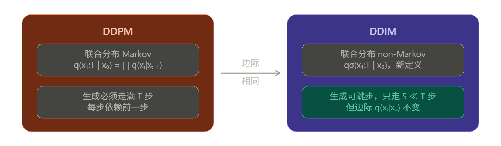
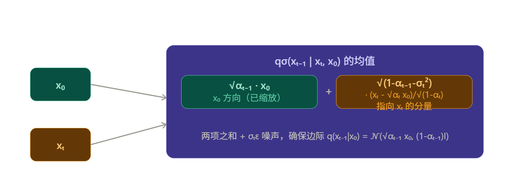
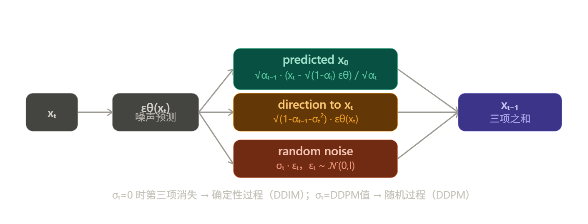
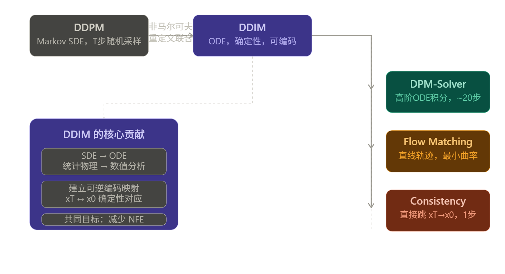

---
tags:
  - 扩散模型

---

# **DDIM**

> [!info]
>
> 创建时间：2026-3-23 | 更新时间：2026-3-23
>
> 原文链接：[Denoising Diffusion Implicit Models](https://arxiv.org/abs/2010.02502)

## DDPM 的根本问题

DDPM 的反向过程必须走 $T$（如 1000）步，因为它逼近的是正向 Markov 链的精确逆过程。核心约束是：

$$q(\mathbf{x}_{t-1} | \mathbf{x}_t) \approx p_\theta(\mathbf{x}_{t-1} | \mathbf{x}_t)$$

每一步都依赖上一步，无法跳过。

DDIM 的洞察是：训练目标 $L_\gamma$ 只依赖于边际分布 $q(\mathbf{x}_t | \mathbf{x}_0)$，而不依赖联合分布 $q(\mathbf{x}_{1:T} | \mathbf{x}_0) $ 的具体形式。 因此可以找到一族新的联合分布，边际相同但联合结构不同，从而解耦生成步数。

## 如何重新定义联合分布

DDIM 定义了一族以 $\sigma \in \mathbb{R}^T_{\geq 0} $ 为参数的推断分布：

$$q_\sigma(\mathbf{x}_{1:T} | \mathbf{x}_0) := q_\sigma(\mathbf{x}_T | \mathbf{x}_0) \prod_{t=2}^{T} q_\sigma(\mathbf{x}_{t-1} | \mathbf{x}_t, \mathbf{x}_0)$$

关键在于**反向条件**的定义（注意这不是 Markov 的，它同时条件在 $\mathbf{x}_t $ 和 $\mathbf{x}_0 $ 上）：

$$q_\sigma(\mathbf{x}_{t-1} | \mathbf{x}_t, \mathbf{x}_0) = \mathcal{N}\!\left(\sqrt{\alpha_{t-1}}\,\mathbf{x}_0 + \sqrt{1 - \alpha_{t-1} - \sigma_t^2} \cdot \frac{\mathbf{x}_t - \sqrt{\alpha_t}\,\mathbf{x}_0}{\sqrt{1 - \alpha_t}},\ \sigma_t^2 \mathbf{I}\right)$$

这个均值由两项构成：

$$\underbrace{\sqrt{\alpha_{t-1}}\,\mathbf{x}_0}_{\text{缩放后的 } x_0 \text{ 方向}} + \underbrace{\sqrt{1 - \alpha_{t-1} - \sigma_t^2} \cdot \frac{\mathbf{x}_t - \sqrt{\alpha_t}\,\mathbf{x}_0}{\sqrt{1-\alpha_t}}}_{\text{指向 } x_t \text{ 的方向分量}}$$

**几何直觉**：在 $x_0$ 和 $x_t$ 的联合空间中，$x_{t-1}$ 的均值是一个精心插值的点，使得边际 $q_\sigma(x_{t-1}|x_0)$ 恰好等于 $\mathcal{N}(\sqrt{\alpha_{t-1}}x_0, (1-\alpha_{t-1})\mathbf{I})$。

## 边际一致性的严格证明（Lemma 1）

这是整个推导的合法性基础。需要证明：

$$q_\sigma(\mathbf{x}_{t-1} | \mathbf{x}_0) = \mathcal{N}(\sqrt{\alpha_{t-1}},\mathbf{x}_0,\ (1-\alpha_{t-1})\mathbf{I})$$

**证明思路**（对 $t$ 从 $T$ 到 $1$ 做归纳）：

对 $t=T$，由定义直接成立：$q_\sigma(\mathbf{x}_T | \mathbf{x}_0) = \mathcal{N}(\sqrt{\alpha_T}\mathbf{x}_0, (1-\alpha_T)\mathbf{I})$。

假设 $t$ 时成立，即 $q_\sigma(\mathbf{x}_t|\mathbf{x}_0) = \mathcal{N}(\sqrt{\alpha_t}\mathbf{x}_0, (1-\alpha_t)\mathbf{I})$，对 $t-1$ 利用全期望：

$$q_\sigma(\mathbf{x}_{t-1}|\mathbf{x}_0) = \int q_\sigma(\mathbf{x}_t|\mathbf{x}_0)q_\sigma(\mathbf{x}_{t-1}|\mathbf{x}_t, \mathbf{x}_0)d\mathbf{x}_t$$

两个 Gaussian 的卷积，计算均值和方差：

**均值**： $$\mu_{t-1} = \sqrt{\alpha_{t-1}}\mathbf{x}_0 + \sqrt{1-\alpha_{t-1}-\sigma_t^2} \cdot \frac{\sqrt{\alpha_t}\mathbf{x}_0 - \sqrt{\alpha_t}\mathbf{x}_0}{\sqrt{1-\alpha_t}} = \sqrt{\alpha_{t-1}}\mathbf{x}_0$$

**方差**（利用条件 Gaussian 的方差传播公式）：

 $$\Sigma_{t-1} = \sigma_t^2 \mathbf{I} + \frac{1-\alpha_{t-1}-\sigma_t^2}{1-\alpha_t}(1-\alpha_t)\mathbf{I} = \sigma_t^2\mathbf{I} + (1-\alpha_{t-1}-\sigma_t^2)\mathbf{I} = (1-\alpha_{t-1})\mathbf{I}$$

归纳完成。$\sigma_t$ 如何取值都不影响边际，这就是 DDIM 可以用 DDPM 的预训练权重的数学根据。

------

## 从 $q_\sigma$ 到生成步骤

实际生成时 $\mathbf{x}*0$ 未知，用模型预测值 $f_\theta^{(t)}(\mathbf{x}_t)$ 替代：

$$f_\theta^{(t)}(\mathbf{x}_t) = \frac{\mathbf{x}_t - \sqrt{1-\alpha_t},\epsilon_\theta^{(t)}(\mathbf{x}_t)}{\sqrt{\alpha_t}} \quad \leftarrow \text{从 Eq. 4 反解 } x_0$$

代入 $q_\sigma$ 的均值公式，整理得到著名的**生成更新公式**：

$$\mathbf{x}_{t-1} = \underbrace{\sqrt{\alpha_{t-1}} \left(\frac{\mathbf{x}_t - \sqrt{1-\alpha_t}\,\epsilon_\theta(\mathbf{x}_t)}{\sqrt{\alpha_t}}\right)}_{\text{"predicted } x_0\text{"}} + \underbrace{\sqrt{1-\alpha_{t-1}-\sigma_t^2}\cdot\epsilon_\theta(\mathbf{x}_t)}_{\text{"direction pointing to } x_t\text{"}} + \underbrace{\sigma_t\epsilon_t}_{\text{random noise}}$$

## 为什么 σₜ=0 时可以跳步

这是 DDIM 最精妙的地方，分两个层次：

**层次一：σₜ=0 使过程确定性**

当 $\sigma_t = 0$，Eq. 12 中随机噪声项消失，$\mathbf{x}_{t-1}$ 完全由 $\mathbf{x}_t$ 决定，没有随机性。因此**同一个 $\mathbf{x}_T$ 始终生成同一张图**（consistency 性质）。

**层次二：训练目标对跳步成立**

关键观察：训练目标 $L_\gamma = \sum_t \gamma_t \mathbb{E}\left[\|\epsilon_\theta(\mathbf{x}_t) - \epsilon_t\|^2\right] $ **只涉及边际 $q(\mathbf{x}_t|\mathbf{x}_0) $**，与推断过程是否 Markov 无关。

定义子序列 $\tau = \{\tau_1, \ldots, \tau_S\} \subset \{1,\ldots,T\} $，只在这些时间步上运行生成过程。对应的边际仍满足：

$$q(\mathbf{x}_{\tau_i} | \mathbf{x}_0) = \mathcal{N}(\sqrt{\alpha_{\tau_i}}\mathbf{x}_0, (1-\alpha_{\tau_i})\mathbf{I})$$

这与完整 $T$ 步时完全相同，因此同一个 $\epsilon_\theta$ 网络可以直接用于跳步生成， **无需重新训练**。更新方程只需把 $\alpha_t \to \alpha_{\tau_i}$，$\alpha_{t-1} \to \alpha_{\tau_{i-1}}$ 即可。

**与 Neural ODE 的联系**

$\sigma_t=0 $ 时，DDIM 迭代等价于对如下 ODE 的 Euler 积分：
$$
d\bar{\mathbf{x}}(t) = \epsilon_\theta^{(t)}\!\left(\frac{\bar{\mathbf{x}}(t)}{\sqrt{\sigma^2+1}}\right) d\sigma(t)
$$
步长越大（跳步越多）→ Euler 误差越大 → 品质略降，但可用更少步数。这就是"用计算换质量"的 tradeoff 的精确含义。

> [!note]
>
> Theorem 1 的核心意义
>
> **Jσ = Lγ + C** 说明：对任意 $\sigma > 0$，DDIM 的变分目标 $J_\sigma$ 与 DDPM 目标 $L_\gamma$（某组权重）等价。由于 $L_\gamma$ 的最优解不依赖于权重 $\gamma$（各 $t$ 独立最优），所以：
>
> > 用 DDPM 的 $L_1$ 目标训练的模型，就是 $J_\sigma$ 的最优解，对**所有** $\sigma$ 都成立。
>
> 这意味着用 DDPM 预训练的 checkpoint，换一个 $\sigma$（或 $\sigma=0$）就得到了质量更好、速度更快的 DDIM，完全不需要重新训练。

## 总结

> [!note]
>
> 总结来说，DDIM构建了一个新的反向去噪过程，在保持前向加噪边缘分布的前提下，使用一种非马尔可夫的方式进行反向去噪，使得中间状态可以通过x0, xt确定的得到，而不需要进行SDE求解，可以直接进行ODE求解，为后续研究优化轨迹，通过确定性求解快速采样打下基础

DDIM 的非马尔可夫体现在推断过程中 $q_\sigma(\mathbf{x}_{t-1}|\mathbf{x}_t, \mathbf{x}_0)$ 显式依赖 $\mathbf{x}_0$——这不是技术细节，而是让中间状态"有了锚点"。DDPM 每一步都在局部随机游走，而 DDIM 每一步都知道自己在往哪个 $\mathbf{x}_0$ 走，所以才能以任意步长跳跃。

**关于 ODE 的深层意义**：从 SDE 到 ODE 的转变不只是"去掉了随机项"，更重要的是**建立了一个可逆映射**——$\mathbf{x}_0 \leftrightarrow \mathbf{x}_T$ 之间存在确定性对应。这使得 DDIM 拥有了 Flow 模型和 VAE 才有的编码能力，可以把真实图像编码回潜变量，再在潜空间做语义插值，这是 DDPM 根本做不到的。

**DDIM 在历史中的位置也值得一提**：它本质上预示了后来整个研究方向的走向——把扩散模型的生成过程理解为一个 ODE/Flow 的积分问题，之后的 DDPM++、DPM-Solver、Flow Matching、Consistency Models 都是沿着这条路：**如何用更少的 NFE（神经网络评估次数）更精确地积分这条轨迹**。DDIM 是这条路的起点，它把一个统计物理问题（Langevin 扩散）重新诠释为一个数值分析问题（ODE 求解）。简单说：DDPM 提出了"用去噪来生成"的范式，DDIM 把这个范式从**随机过程**重新诠释为**确定性积分**，一句话打通了扩散模型与连续 normalizing flow 的理论联系，后续所有快速采样方法本质上都是在问同一个问题：**这条 ODE 轨迹，能不能用更聪明的数值方法走得更准更快？**