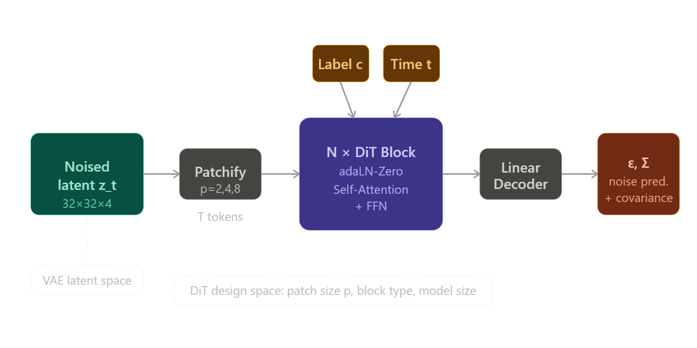
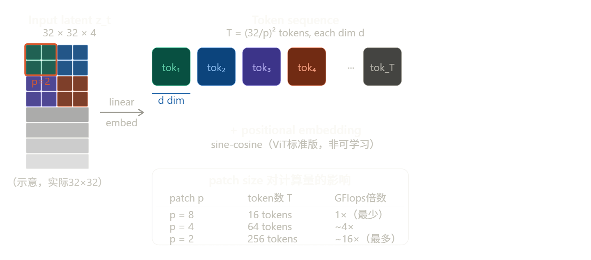
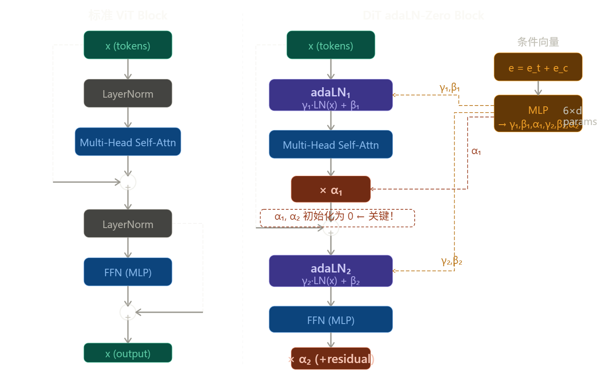
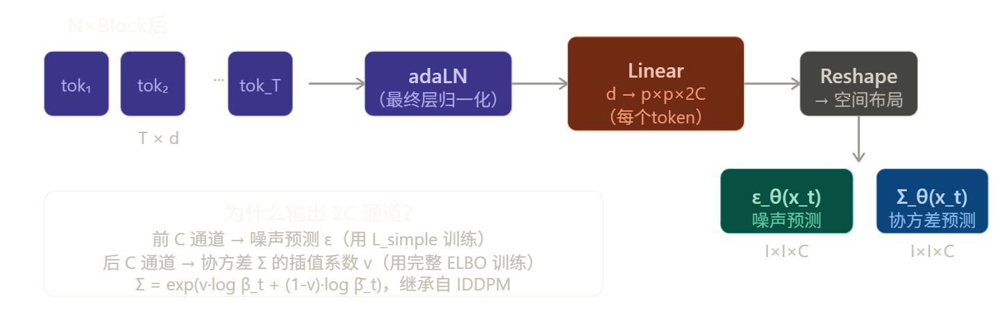
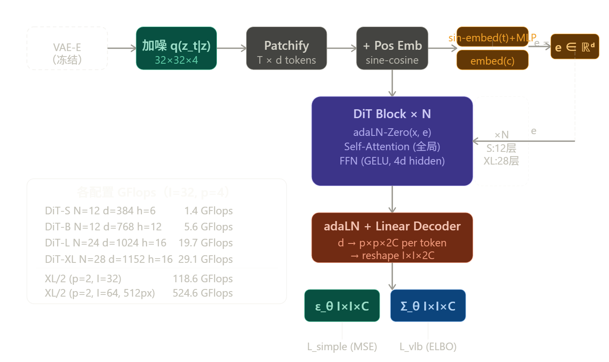
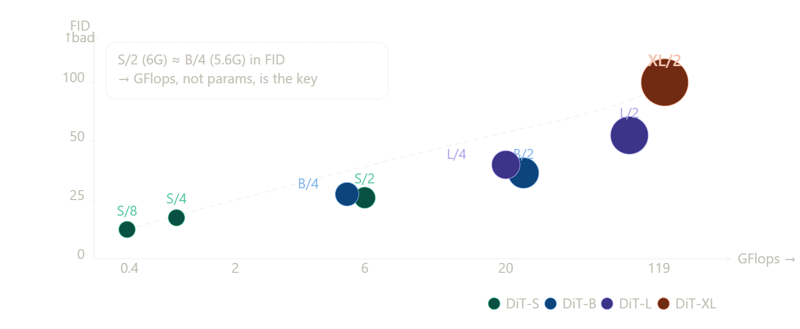

# DiT

## 核心问题与动机

在 DiT 之前，扩散模型（DDPM）的骨干网络几乎清一色是卷积 U-Net。Transformer 在 NLP（GPT、BERT）和视觉识别（ViT）领域已经展现出卓越的 scalability，但在扩散生成模型中却几乎缺席。

本文要回答的问题很简单：**能不能用纯 Transformer 替代 U-Net 来做扩散模型？如果能，它能 scale 吗？**

先来看整体架构：

## 前置知识

**① DDPM 扩散过程**

前向过程加噪：$q(x_t|x_0) = \mathcal{N}(x_t;\sqrt{\bar\alpha_t}x_0, (1-\bar\alpha_t)I)$，通过重参数化 $x_t = \sqrt{\bar\alpha_t}x_0 + \sqrt{1-\bar\alpha_t}\epsilon_t$。

反向过程去噪：神经网络学习 $p_\theta(x_{t-1}|x_t) = \mathcal{N}(\mu_\theta(x_t), \Sigma_\theta(x_t))$，训练损失为预测噪声的 MSE：$\mathcal{L}_{simple} = ||\epsilon_\theta(x_t) - \epsilon_t||_2^2$。协方差 $\Sigma_\theta$ 用完整 ELBO 训练（Nichol & Dhariwal 方法）。

**② Classifier-Free Guidance（CFG）**

条件生成时，引导采样：$\hat\epsilon_\theta(x_t, c) = \epsilon_\theta(x_t, \emptyset) + s \cdot (\epsilon_\theta(x_t, c) - \epsilon_\theta(x_t, \emptyset))$，$s>1$ 增强条件相关性，训练时随机丢弃 $c$ 替换为 null embedding $\emptyset$。DiT 实验中 CFG scale 取 1.25 和 1.5。

**③ Latent Diffusion Model（LDM）**

先用 VAE 编码器 $E$ 压缩图像 → 在 latent 空间跑扩散 → VAE 解码器 $D$ 还原。DiT 使用 Stable Diffusion 的预训练 VAE，下采样因子为 8，256×256×3 的图像变为 32×32×4 的 latent。这大幅降低扩散模型的计算成本。

------

## 架构拆解

整个前向过程分为四个阶段：**Patchify → DiT Blocks → Unpatchify（Linear Decoder）**，条件信号通过 adaLN-Zero 注入每个 Block。

------

### Patchify

**具体操作**：输入 latent $z_t \in \mathbb{R}^{I \times I \times C}$（对于 256×256 图像，$I=32, C=4$），用一个步长为 $p$ 的线性投影层（等价于 kernel=$p$, stride=$p$ 的卷积）将每个 $p \times p \times C$ 的 patch 映射为 $d$ 维向量，得到序列 $\mathbf{x} \in \mathbb{R}^{T \times d}$，其中 $T = (I/p)^2$。

**为什么用 sine-cosine 而非可学习位置编码**：可迁移到不同分辨率（512×512 时 $T$ 变为 4 倍），不需要重新训练位置编码。

------

### 条件信号的准备

在进入 Block 之前，需要把两路条件信号——时间步 $t$ 和类别标签 $c$——嵌入成向量。

**时间步 $t$ 的嵌入**：与 DDPM 一致，用正弦频率嵌入（sinusoidal embedding）将标量 $t \in [0, 1000]$ 编码为向量，再过两层 MLP 得到 $\mathbf{e}_t \in \mathbb{R}^d$。

**类别标签 $c$ 的嵌入**：标准可学习的 embedding table，$\mathbf{e}*c \in \mathbb{R}^d$。CFG 训练时有概率把 $c$ 替换为 null token，对应学习一个 $\mathbf{e}*\emptyset$。

两路信号直接相加：$\mathbf{e} = \mathbf{e}_t + \mathbf{e}_c$，这个求和向量 $\mathbf{e}$ 作为 adaLN 的唯一输入。

------

### DiT Block

这是整个论文最重要的部分。先看标准 ViT Block 的结构，再看 DiT 做了什么改动。

**完整的数学表达**，一个 DiT Block 的前向过程写出来是：

$$\mathbf{x} \leftarrow \mathbf{x} + \alpha_1 \cdot \text{Attn}(\gamma_1 \cdot \text{LN}(\mathbf{x}) + \beta_1)$$ 

$$\mathbf{x} \leftarrow \mathbf{x} + \alpha_2 \cdot \text{FFN}(\gamma_2 \cdot \text{LN}(\mathbf{x}) + \beta_2)$$

其中 $\gamma_1, \beta_1, \alpha_1, \gamma_2, \beta_2, \alpha_2 \in \mathbb{R}^d$ 全部由同一个 MLP 从条件向量 $\mathbf{e}$ 回归得出，每个 Block 有自己独立的 MLP，共 6 组参数，每组维度为 $d$。

**adaLN 与标准 LayerNorm 的区别**：标准 LN 学习固定的 $\gamma, \beta$（对所有样本相同）；adaLN 的 $\gamma, \beta$ 是由条件信号 $\mathbf{e}$ 动态生成的，因此不同时间步、不同类别会得到不同的缩放和偏移。

**为什么 $\alpha$ 初始化为零是关键**：训练开始时，$\alpha = 0$ 意味着残差分支输出为零，整个 Block 退化为恒等映射 $\mathbf{x} \leftarrow \mathbf{x}$。这等价于一开始网络"什么都不做"，梯度从输出可以无阻碍地流到输入，避免了深网络初期的不稳定。随着训练进行，$\alpha$ 逐渐从零增大，Block 才开始贡献变换。这个技巧来自 Goyal et al. 2017 对 ResNet 大规模训练的研究，在 DiT 里是训练稳定性的核心保障——作者提到训练全程没有出现 loss spike。

------

**Self-Attention 内部细节**

DiT 用的是标准 Multi-Head Self-Attention，没有任何修改：

$$\text{Attn}(\mathbf{Q}, \mathbf{K}, \mathbf{V}) = \text{softmax}\left(\frac{\mathbf{Q}\mathbf{K}^\top}{\sqrt{d_k}}\right)\mathbf{V}$$

$\mathbf{Q}, \mathbf{K}, \mathbf{V}$ 均来自同一序列的线性投影（self-attention，不是 cross-attention）。每个 token 都与序列中所有其他 token 做 attention，这是 DiT 和 U-Net 最本质的区别——**U-Net 的卷积只有局部感受野，DiT 从第一层起就有全局感受野**。对于空间相关性强的图像生成，这一点非常重要。

FFN 是标准的两层 MLP，隐层维度为 $4d$，激活函数为 GELU。

------

### Linear Decoder（Unpatchify）

解码器非常简单：对每个 token 过最终的 adaLN，然后用一个线性层把 $d$ 维映射到 $p \times p \times 2C$，再把所有 token reshape 回 $I \times I \times 2C$ 的空间图。**这个线性层初始化为全零**，使得训练最初网络预测为全零噪声，提供稳定的起点。

------

### 完整数据流

---

**几个容易忽略的实现细节**

**关于参数共享**：adaLN 的 6 个参数（$\gamma_1, \beta_1, \alpha_1, \gamma_2, \beta_2, \alpha_2$）由同一个 MLP 一次性生成，这个 MLP 是 per-block 独立的，不跨 block 共享。MLP 结构是：SiLU 激活 + Linear，输入为 $\mathbf{e}$，输出为 $6d$ 维向量再 split。

**关于没有 class token**：ViT 用 `[CLS]` token 做分类，DiT 不需要，因为条件信号直接通过 adaLN 注入，所有 token 都是图像 patch，输出也是所有 token 对应位置的预测。

**关于 FFN 的维度**：隐层维度为 $4d$，这是标准 Transformer 的配置，论文没有做修改。

**关于 p=2 时的 token 数**：对于 256×256 图像，VAE latent 是 32×32×4，p=2 时 $T = (32/2)^2 = 256$ 个 token；对于 512×512 图像，latent 是 64×64×4，p=2 时 $T = (64/2)^2 = 1024$ 个 token。Self-Attention 的计算复杂度是 $O(T^2)$，所以 512 分辨率的计算量是 256 的 4 倍以上。

这就是 DiT 架构的全部。整体设计哲学非常克制：**尽可能忠实地把 ViT 搬到扩散模型里，只在必要处（条件注入）做最小修改**。正是这种克制让它的 scaling 结论具有说服力。

------

## 实验设置

训练设置非常干净：ImageNet 256×256 和 512×512 类别条件生成；AdamW 优化器，lr = 1e-4（constant，无 warmup，无 weight decay）；batch size = 256；水平翻转唯一数据增强；EMA 权重（decay=0.9999）用于评估。VAE 使用 Stable Diffusion 预训练版本（冻结），diffusion 超参数复用 ADM（线性 schedule，$t_{max}=1000$）。

**评估指标**：FID-50K（主指标，用 ADM 的 TensorFlow 评估套件确保可比性）、IS、sFID、Precision/Recall。

------

## 实验结论

### 结论 1：GFlops 是衡量 DiT 性能的关键（不是参数量）

最关键的发现：固定模型大小、缩小 patch size（参数几乎不变，但 GFlops 大幅增加），FID 同样显著提升。这说明 **GFlops 才是驱动质量的核心变量，参数量只是代理指标**。DiT-S/2 和 DiT-B/4 的 GFlops 相近，FID 也相近，尽管它们参数量差异很大。

### 结论 2：Scaling 带来持续收益

无论是 (a) 固定 patch size 增大模型 depth/width，还是 (b) 固定模型大小减小 patch size（增加 token 数），FID 在训练全程都稳定下降，无饱和迹象。

### 结论 3：大模型计算效率更高（相同训练 FLOPs 更优）

在相同的训练总计算量下（GFlops × batch × steps × 3），大模型（DiT-XL）比小模型（DiT-S）达到更低的 FID。因此，应优先训练大模型而非把计算花在更长训练小模型上。

### 结论 4：增加采样步数无法弥补模型容量不足

用 1000 步采样 DiT-L/2 的计算量是 128 步采样 DiT-XL/2 的 5 倍，但 FID 反而更差（25.9 vs 23.7）。这与语言模型 scaling law 的结论一致：推理时算力不能替代训练时算力。

------

## 贡献与影响

**1. 打破了 U-Net 的「信仰」**
 论文证明 U-Net 的归纳偏置（局部卷积、skip connection 的层次结构）对扩散模型并不是必需的。这开放了架构统一的可能性——同一个 Transformer 骨干可以同时用于图像生成、视频生成、3D 生成甚至多模态生成。

**2. 为扩散模型引入可靠的 Scaling Law**
 GFlops 与 FID 的强负相关性提供了一个可预测的设计规律：想要更好的生成质量，就堆更多计算（增大模型或增加 token 数），不需要复杂的架构创新就能提升性能。

**3. adaLN-Zero 的初始化技巧**
 零初始化残差缩放 $\alpha$ 使每个块初始为恒等映射，这是大规模 Transformer 稳定训练的重要技巧，被后续工作广泛沿用。

**4. DiT 作为通用骨干的影响力**
 正如作者在结论中预言，DiT 迅速成为 Sora（视频生成）、Stable Diffusion 3（文生图）、Flux 等几乎所有顶级生成模型的骨干架构。SiT、U-DiT、DiS、PixArt 等大量后续工作都建立在 DiT 之上。

------

**阅读论文时需要特别注意的细节**

做后续研究时，有几个技术细节值得深究：

**协方差学习**：DiT 不仅预测噪声 $\epsilon$，还预测对角协方差 $\Sigma_\theta$（IDDPM 方法），输出通道数是 $2C$ 而非 $C$。这在许多复现代码中容易被忽略。

**EMA 的重要性**：所有报告结果都用 EMA 模型（decay=0.9999），非 EMA 模型的 FID 会明显更差。

**FID 评估的细节**：作者强调使用 ADM 的 TensorFlow 评估套件，不同实现下 FID 数值会有系统性偏差，跨论文比较时要注意。

**positional embedding**：使用标准 ViT 的 sine-cosine 频率编码，不是可学习的位置编码，这使 DiT 更容易迁移到不同分辨率。

**训练的稳定性**：与 ViT 训练不同，DiT 训练不需要 warmup 和 weight decay，说明 adaLN-Zero 初始化对训练稳定性有实质贡献。

------

