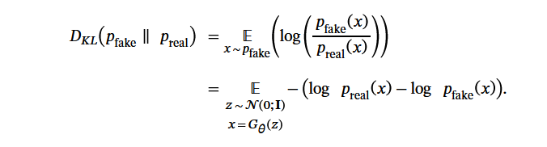

# **[DMD] Distribution Matching Distillation 分布匹配蒸馏**

> [!info]
>
> 创建时间：2025-11-29 | 更新时间：2025-12-3
>
> 本文基于**[One-step Diffusion with Distribution Matching Distillation](https://arxiv.org/abs/2311.18828)** 做笔记

## **主要贡献**

提出了分布匹配蒸馏方法，即我们不需要让模型学习每一次预测的噪声，而是在最终得到的图片上进行损失计算。

因为最终的图片也可以称作是目标数据分布，所以叫做分布匹配蒸馏？

通过最小化一个近似的 KL 散度来强制单步图像生成器在分布层面上与扩散模型匹配。该近似 KL 散度的梯度可以表示为两个评分函数之差，其中一个评分函数对应于目标分布，另一个评分函数对应于我们单步生成器生成的合成分布。

## **核心公式**

核心的分布匹配损失写作：

这种概率密度损失难以估计，幸好我们只需要求他对于参数 θ 的梯度：

其中 $s_{\text{real}}(x) = \nabla_x \log p_{\text{real}}(x) \quad$和$\quad s_{\text{fake}}(x) = \nabla_x \log p_{\text{fake}}(x)$ 代表相应匹配的分数 Score 

使用扩散模型对分数进行建模，得到

$$
s_{\text{real}}(x_t, t) = -\frac{x_t - \alpha_t \mu_{\text{base}}(x_t, t)}{\sigma_t^2} \\
s_{\text{fake}}(x_t, t) = -\frac{x_t - \alpha_t \mu_{\text{fake}}^\phi(x_t, t)}{\sigma_t^2}.
$$

其中 $\mu_{base}$ 是学习到真实分布的基座模型， $\mu_{fake}^{\phi}$ 是我们训练的学生模型，$\alpha_t , \sigma_t$ 都是噪声调度器的参数

## **推导过程**

