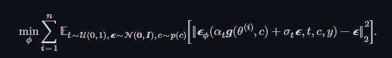

---
tags:
  - 分数匹配
  - 蒸馏
  - 扩散模型
---

# **ProlificDream & DreamDiffusion**

> [!info]
>
> 创建时间：2025-12-16 | 更新时间：2025-12-16
>
> 本文基于**[Prolific Dreamer](https://arxiv.org/abs/2305.16213)**  和 **[Dream Diffusion](https://arxiv.org/abs/2209.14988)** 做笔记

## 主要贡献

Dream Diffusion完成了从2D的text to image迁移到3D的 text to 3D的蒸馏。对于一个3D的生成模型，通过将生成的3D资产，在不同角度下进行拍摄，得到2D的照片。将2D的照片和预训练的2D Text to Image模型进行分数匹配，进行梯度回传。

Prolific Dreamer指出了Dream Diffusion中中间分布塌缩为狄拉克分布，导致生成多样性缺失。通过对在输出分布进行采样，解决了这个问题。

## 核心公式

在DreamDIffusion中，提出了中间分数匹配的损失函数

他的梯度是：

> [!Note]
>
> 在这个推导中，DreamDiffusion的思路是我们要做分数匹配（也可以说噪声匹配，等价的），但是雅可比矩阵偏导回传要经过Unet非常不稳定，然后 *经验性* 地忽略了雅可比项，把他作为一个常数项忽略掉，说这样效果还不错。但是我认为这个是有问题的，从后面的解释证明，以及下一篇Prolific Dreamer来说，忽略了这个雅可比矩阵之后，其实这个梯度公式变为了分布匹配的损失函数的梯度。可以查看[Distribution Matching](./DistributionMatching.md) 笔记中的内容，可以发现两者的损失函数一模一样。
>
> 从行文上看感觉是瞎猫碰到死耗子，当时没有意识到忽略这一项之后其实是在做KL散度的分布匹配。所以之后ProlificDreamer才会改口说，诶，其实我们一开始就想做分布匹配来着。所以中间的公式也有点小问题，分布匹配没有进行中间的分布采样，导致学生模型分布塌缩成狄拉克分布。所以做了采样的修正，让学生模型结果变好了，生成的东西多样化了。
>
> 文中自己也说的这个损失函数的梯度等于加权概率密度蒸馏损失，我没看过这篇文章，但是看这个形式跟KL散度分布损失是一样的
> 

在Prolific中，这个公式的出发点从噪声匹配改为分数匹配

> [!tip]
>
> Polifict Dreamer使用了类似[Diff-Instruct](./Diff-Instruct.md)的方法，训练一个辅助模型，用来学习学生模型中间的分数。因为3D生成模型，中间转2D，这个生成的分数有点难以计算。使用一个辅助模型就能很好的学习到2D分布间的分数，然后和教师模型进行匹配。

辅助模型的损失函数计算：

我的理解就是SDS直接使用模型输出的中间状态作为噪声，而VDS是先采样得出x0，即目标图像。然后通过重参数化，或者说调度器进行一个采样，这样就是在隐状态的生成分布中进行采样，保留了结果的多样性。

最后的梯度使用这个辅助模型的分数代替了原本（应该是）直接使用了目标图像和原图像相减的噪声。

