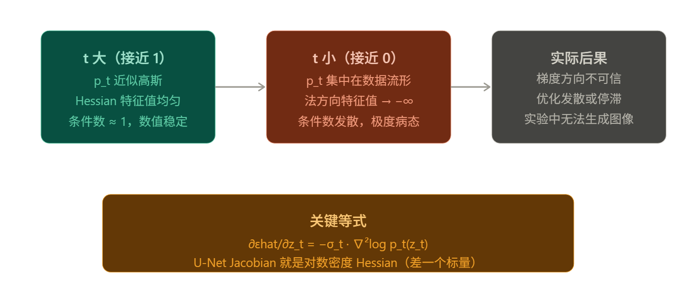
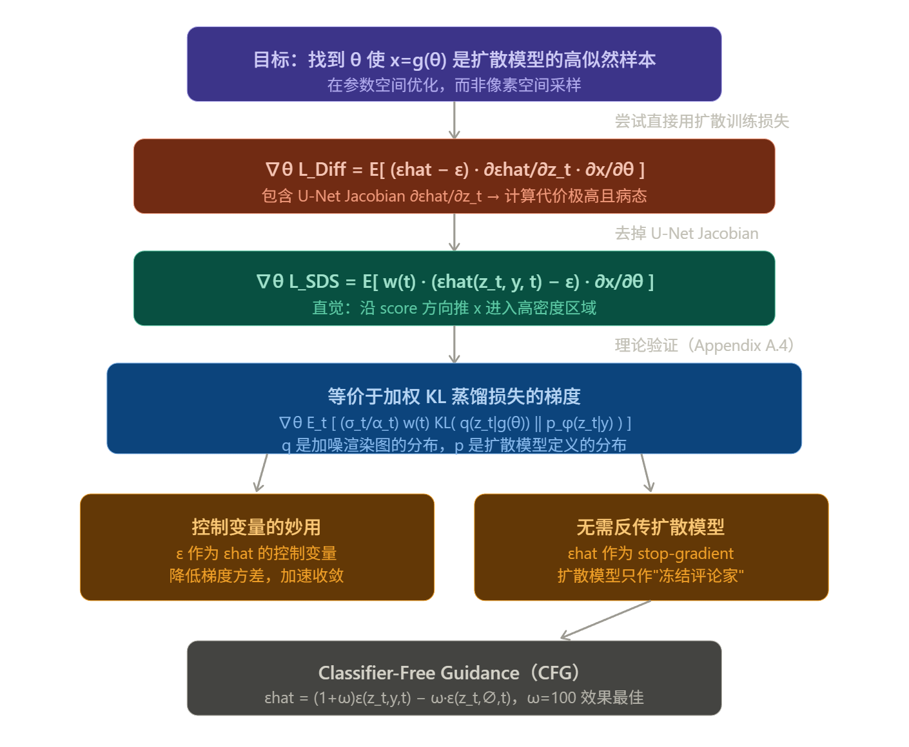
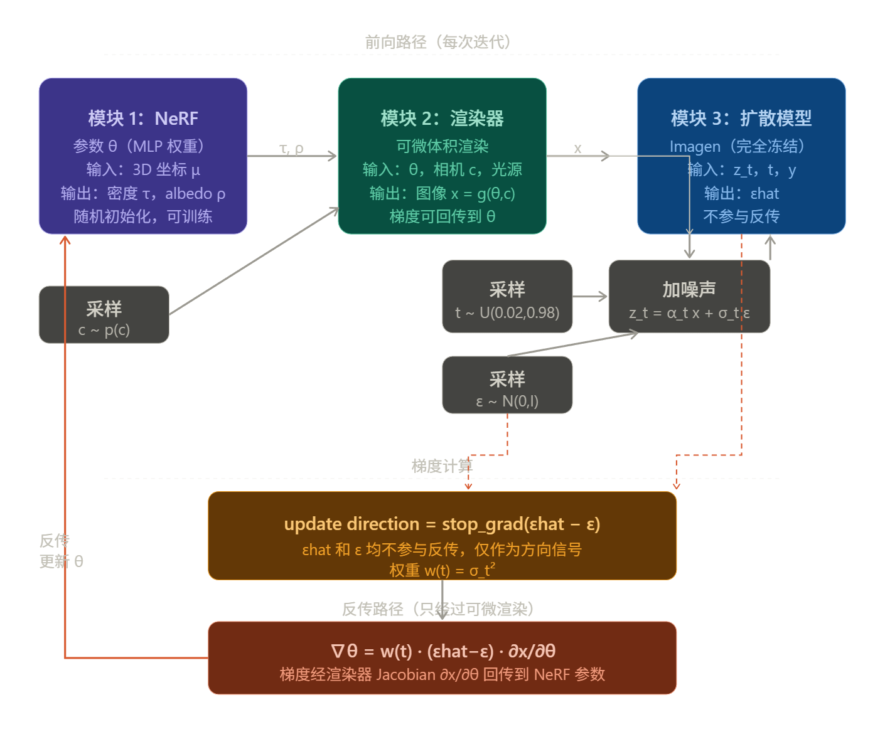
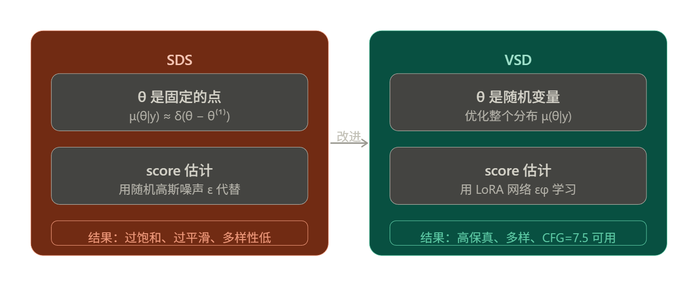
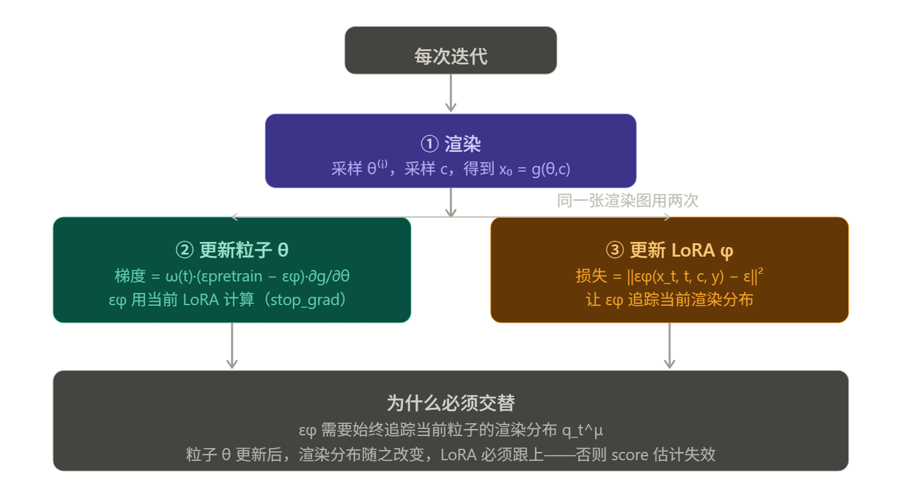

---
tags:
  - 分数匹配
  - 蒸馏
  - 扩散模型
---

# SDS & VSD

> [!info]
>
> 创建时间：2025-12-16 | 更新时间：2026-3-23
>
> 本文基于**[Prolific Dreamer](https://arxiv.org/abs/2305.16213)**  和 **[Dream Diffusion](https://arxiv.org/abs/2209.14988)** 做笔记


## SDS 要解决的根本问题

出发点很简单：我们有一个预训练的 2D text-to-image 扩散模型，想用它来生成 3D 内容。但扩散模型只能在像素空间里采样，而我们想要的是 NeRF 的参数空间里的一个点 θ，使得从任意角度渲染出来的图像都"看起来像真实图像"。

这就是**可微图像参数化（DIP）**的框架：用一个可微渲染函数 g(θ) 把 3D 参数映射到图像，然后设计一个损失函数，让这个图像在扩散模型眼中是高似然的。

------

## 训练损失

最自然的想法是直接最小化扩散模型的训练损失：

$$\mathcal{L}_{\text{Diff}}(\phi, \mathbf{x} = g(\theta)) = \mathbb{E}_{t,\varepsilon}\left[w(t)\|\hat{\varepsilon}_\phi(\mathbf{z}_t; y, t) - \varepsilon\|^2_2\right]$$

对 θ 求梯度展开后得到：

$$\nabla_\theta \mathcal{L}_{\text{Diff}} = \mathbb{E}_{t,\varepsilon}\left[w(t)\underbrace{(\hat{\varepsilon}_\phi - \varepsilon)}_{\text{噪声残差}} \cdot \underbrace{\frac{\partial \hat{\varepsilon}_\phi}{\partial \mathbf{z}_t}}_{\text{U-Net Jacobian}} \cdot \underbrace{\frac{\partial \mathbf{x}}{\partial \theta}}_{\text{渲染 Jacobian}}\right]$$

中间那项 **U-Net Jacobian** 是致命问题：计算代价极高，而且在小噪声水平下条件极差（它近似于边缘密度的 scaled Hessian），实验中根本无法产生合理结果。

### 为什么 U-Net Jacobian 是致命的

先把完整梯度写清楚，明确每一项的来源。从扩散训练损失出发：
$$
\mathcal{L}_{\text{Diff}}(\phi, \mathbf{x}) = \mathbb{E}_{t,\varepsilon}\left[w(t)\|\hat{\varepsilon}_\phi(\mathbf{z}_t; y, t) - \varepsilon\|^2_2\right]
$$
其中 $\mathbf{z}_t = \alpha_t \mathbf{x} + \sigma_t \varepsilon $，$\mathbf{x} = g(\theta) $。对 θ 求梯度，链式法则展开有三层：

$$\nabla_\theta \mathcal{L}_{\text{Diff}} = \mathbb{E}_{t,\varepsilon}\left[w(t) \cdot \underbrace{2(\hat{\varepsilon}_\phi - \varepsilon)^\top}_{\text{①噪声残差}} \cdot \underbrace{\frac{\partial \hat{\varepsilon}_\phi}{\partial \mathbf{z}_t}}_{\text{②U-Net Jacobian}} \cdot \underbrace{\frac{\partial \mathbf{z}_t}{\partial \mathbf{x}} \cdot \frac{\partial \mathbf{x}}{\partial \theta}}_{\text{③渲染链}}\right]$$

注意 $\frac{\partial \mathbf{z}_t}{\partial \mathbf{x}} = \alpha_t \mathbf{I} $，可以并入 $w(t) $，所以问题完全集中在第②项。

**问题一：维度爆炸。** 设图像维度 $d = H \times W \times C $（64×64×3 = 12288），U-Net 的输入输出都是 $\mathbb{R}^d $，则这个 Jacobian 是 $d \times d $ 的矩阵，存储需要约 $12288^2 \times 4\,\text{bytes} \approx 600\,\text{MB} $，每次迭代都需要对整个 U-Net 做完整反传来填满它，代价与预训练扩散模型的一步训练相当。

**问题二：数值病态。** 这是更本质的问题。利用 Tweedie 公式，扩散模型的 score function 满足：
$$
\nabla_{\mathbf{z}_t} \log p_t(\mathbf{z}_t) = -\frac{\hat{\varepsilon}_\phi(\mathbf{z}_t, t)}{\sigma_t}
$$
对两边再关于 $\mathbf{z}_t $ 求导，得到 Hessian：
$$
\frac{\partial^2 \log p_t}{\partial \mathbf{z}_t^2} = -\frac{1}{\sigma_t} \frac{\partial \hat{\varepsilon}_\phi}{\partial \mathbf{z}_t}
$$
因此：
$$
\frac{\partial \hat{\varepsilon}_\phi}{\partial \mathbf{z}_t} = -\sigma_t \cdot \nabla^2_{\mathbf{z}_t} \log p_t(\mathbf{z}_t)
$$
这个 Jacobian **就是对数密度的 Hessian（乘以 $-\sigma_t $）** 。当 $t \to 0 $ 时，$p_t $ 趋向于尖锐的数据分布，Hessian 在数据流形法方向上特征值趋向负无穷，而在流形切方向上趋向零——条件数发散，矩阵极度病态，梯度方向完全不可信。



---

## 训练流程

$z_t$ **不是** 3D 模型本身，而是"3D 模型渲染出的图像，再加上噪声"。整个流程分两步：

**第一步：渲染** — NeRF 参数 θ 在相机位姿 c 下，通过可微渲染函数 g 得到一张 2D 图像：

$$\mathbf{x} = g(\theta, c) \quad \in \mathbb{R}^{H \times W \times 3}$$

**第二步：扩散前向加噪** — 对这张图像加入高斯噪声，模拟扩散过程的第 t 步：

$$\mathbf{z}_t = \alpha_t \mathbf{x} + \sigma_t \varepsilon, \quad \varepsilon \sim \mathcal{N}(0, I)$$

所以 z_t 本质上是一张**被噪声污染的渲染图**，噪声程度由时间步 t 控制。

用伪代码把采样过程写清楚：

```python
# 每次迭代

# ① 三个独立采样
t   = uniform(0.02, 0.98)          # 随机时间步
ε   = randn(image_shape)           # 随机高斯噪声
c   = sample_camera()              # 随机相机位姿

# ② 渲染：3D → 2D
x   = nerf_render(θ, c)            # x = g(θ, c)，干净图像

# ③ 扩散前向加噪：2D → 噪声空间
α_t, σ_t = get_noise_schedule(t)
z_t = α_t * x + σ_t * ε           # z_t，加噪渲染图

# ④ 冻结扩散模型预测噪声
ε_hat = frozen_diffusion(z_t, t, y)   # 无梯度

# ⑤ 计算更新方向并反传
update_dir = stop_grad(ε_hat - ε)     # 方向信号，无需反传扩散模型
grad_θ = w(t) * update_dir · ∂x/∂θ   # 反传只走 NeRF 渲染路径

# ⑥ 更新 NeRF 参数
θ = optimizer.step(θ, grad_θ)
```

> [!note]
>
> `(εhat − ε)` 这个差值的含义非常直观：εhat 是扩散模型"认为图像里应该有的噪声结构"，ε 是我们实际加进去的纯随机噪声。两者之差就是扩散模型在说**"你渲染出的图像，应该往这个方向改"**。
>
> 当 t 较大时，图像被大量噪声掩盖，扩散模型给出的是粗粒度的整体形状方向；当 t 较小时，图像接近干净，扩散模型关注的是细节纹理。对所有 t 加权期望，就同时优化了从粗到细的所有层次，这是 SDS 相比直接优化像素更稳定的核心原因。

---

## SDS 的核心推导

既然 U-Net Jacobian 不可用，DreamFusion 的洞察是：**直接去掉这一项**，只保留噪声残差乘以渲染 Jacobian：

$$\nabla_\theta \mathcal{L}_{\text{SDS}} \triangleq \mathbb{E}_{t,\varepsilon}\left[w(t)\underbrace{(\hat{\varepsilon}_\phi(\mathbf{z}_t; y, t) - \varepsilon)}_{\text{update direction}}\frac{\partial \mathbf{x}}{\partial \theta}\right]$$

这看起来像是凑出来的工程技巧，但论文 Appendix A.4 证明了它有严格的理论基础——它恰好是一个**加权概率密度蒸馏损失**的梯度：

$$\nabla_\theta \mathcal{L}_{\text{SDS}} = \nabla_\theta \mathbb{E}_t\left[\frac{\sigma_t}{\alpha_t}w(t)\,\text{KL}\!\left(q(\mathbf{z}_t \mid g(\theta);\,y,t) \;\big\|\; p_\phi(\mathbf{z}_t;\,y,t)\right)\right]$$



Appendix A.4 的推导要点值得细说一下。对单个 KL 项展开梯度时会出现两部分：

- **(A) 前向过程的熵梯度**：由于前向过程方差固定，熵对参数的梯度为零。但可以用"Sticking-the-Landing"技巧保留路径导数项，它与 (B) 项高度相关，作为控制变量能显著降低方差。
- **(B) log p_φ 的梯度**：通过 Tweedie 公式连接到 score function，最终化简为 −(α_t/σ_t)·εhat·(∂x/∂θ)。

两项合并，正好消掉 U-Net Jacobian，得到最终的 SDS 梯度。

---

## DreamFusion 的完整架构

SDS 的架构本质上只有**三个独立模块**：NeRF、可微渲染器、冻结扩散模型。训练时这三个模块串联成一条前向路径，梯度只从扩散模型的输出反传回 NeRF，扩散模型本身完全不参与反传。



图里有一条需要特别注意的界限：εhat 和 ε 用虚线红箭头接入梯度计算，表示它们只提供方向数值，不传递梯度。实线红箭头才是真正的反传路径，它只走渲染器这一条路回到 θ。

几个容易混淆的点说清楚：

**为什么扩散模型不参与反传？** 因为计算 εhat 这一步用了 `stop_gradient`。扩散模型只是一个"冻结的评论家"，每次迭代告诉渲染图像"应该往哪个方向改"，但它的内部权重和中间计算完全不进入计算图。这也是 SDS 在工程上可行的关键原因——否则每步都要对一个十亿参数的 U-Net 做反传，内存和计算都不可接受。

**t、ε、c 三个采样是完全独立的。** 每次迭代重新采，互不依赖。t 决定加多少噪声，ε 是具体的噪声实例，c 决定从哪个角度看 NeRF。

**梯度真正流过的路径只有一条**：扩散模型输出 → 减去 ε → 乘 w(t) → 乘渲染器 Jacobian ∂x/∂θ → 更新 NeRF 权重。整个系统里唯一被训练的是 NeRF 的 MLP 参数。

> [!note]
>
> y 是**文本 prompt 的嵌入向量**，是扩散模型的条件输入。具体来说，在 DreamFusion 里 y 是用 T5-XXL 文本编码器把用户输入的文字（比如 "a DSLR photo of a peacock on a surfboard"）编码成的向量，这个向量在整个训练过程中**固定不变**，每次迭代都原样传给扩散模型。

------

## 几个关键的工程决策

**视角相关 prompt** 是 DreamFusion 能生成一致 3D 几何的重要原因之一。文本往往描述的是正面视角，如果不加视角信息，模型会把内容"画"在每个面上形成多面 Janus 问题。论文的做法是根据相机仰角和方位角动态拼接 "front view / side view / back view / overhead view"。

**着色 + 无纹理渲染** 是几何质量的保障。如果只优化有颜色的渲染，模型倾向于把内容"贴"在平面上而不是真正建立 3D 几何。引入随机光源着色，并有 50% 概率渲染无纹理（albedo 全白）的结果，迫使几何本身也必须正确。

**CFG=100 的必要性** 来自 SDS 的众数搜索本质。SDS 最小化的是 reverse KL，具有 mode-seeking 性质——它会坍缩到最高概率密度的单一模式。这意味着必须用极大的引导权重来"逼"它走向足够清晰的结果，代价是多样性极差、不同随机种子几乎产生相似结果。这正是 VSD 后来重点解决的问题。

------

## SDS 与 VSD 的承接关系

至此可以清楚地看到 SDS 遗留的核心问题是什么：它用固定的高斯噪声 ε 作为 q 的 score 估计，相当于假设当前渲染图像服从 Dirac delta 分布。这个估计太粗糙——在低密度区域几乎没有方向信息，只能靠 CFG=100 强行放大信号，结果过饱和、过平滑、多样性低。VSD 做的事情，就是把这个粗糙的 ε 换成一个真正学过渲染图像分布的 LoRA 网络 εφ，彻底解决了这个估计误差的根源。


好，现在有了 SDS 的完整基础，我们来看 VSD 如何在每个环节上做出改进。

------

## 从 SDS 的问题出发

SDS 有一个根本性的假设：把 3D 参数 θ 当成一个**固定的点**来优化，其变分分布是 Dirac delta：

$$\mu(\theta|y) \approx \delta(\theta - \theta^{(1)})$$

这导致 score 的估计极度粗糙。回顾 SDS 梯度：

$$\nabla_\theta \mathcal{L}_{\text{SDS}} = \mathbb{E}\left[w(t)\underbrace{(\hat{\varepsilon}_\text{pretrain} - \varepsilon)}_{\text{方向信号}}\frac{\partial \mathbf{x}}{\partial\theta}\right]$$

第二项 ε 是纯随机高斯噪声，它对当前渲染图像的分布**一无所知**。这意味着梯度方向只有第一项在提供信息，必须靠 CFG=100 强行放大才能得到清晰结果，代价是过饱和、过平滑、多样性极低。

VSD 的核心问题是：**能不能用一个真正了解当前渲染分布的网络来替代这个无信息的 ε？**

------

## 从点优化到分布优化

VSD 把 θ 从常量变成随机变量，优化目标从找一个好的 θ，变成找一个好的**分布** μ(θ|y)：

$$\mu^* = \arg\min_\mu \;\mathbb{E}_{t,c}\left[\frac{\sigma_t}{\alpha_t}\omega(t)\,D_{\text{KL}}\!\left(q_t^\mu(\mathbf{x}_t|c,y)\;\|\;p_t(\mathbf{x}_t|y^c)\right)\right]$$

这是在**函数空间** $\mathcal{W}_2(\Theta)$（Wasserstein 空间）上的优化，不再是参数空间里的点优化。它自然容纳了"同一个 prompt 可以对应多个合理 3D 场景"这个事实。



### 粒子化变分推断

直接在函数空间优化 μ 是不可行的。VSD 采用**粒子化变分推断（Particle-based VI）**：用 n 个具体的 3D 参数 ${\theta^{(i)}}_{i=1}^n$ 来代表分布 μ，每个粒子就是一个独立的 NeRF 或 Mesh。

优化目标变成让这些粒子的分布沿 Wasserstein 梯度流演化，理论上当优化收敛时，粒子就是从最优分布 μ* 中采出的样本（Theorem 2）。

由此推导出每个粒子的更新规则（ODE）：

$$\frac{d\theta_\tau}{d\tau} = -\mathbb{E}_{t,\varepsilon,c}\left[\omega(t)\left(\underbrace{-\sigma_t\nabla_{\mathbf{x}_t}\log p_t}_{\approx\,\varepsilon_\text{pretrain}} - \underbrace{(-\sigma_t\nabla_{\mathbf{x}_t}\log q_t^\mu)}_{\approx\,\varepsilon_\phi}\right)\frac{\partial g(\theta,c)}{\partial\theta}\right]$$

整理后得到 VSD 梯度：

$$\nabla_\theta \mathcal{L}_{\text{VSD}} = \mathbb{E}_{t,\varepsilon,c}\left[\omega(t)\underbrace{\left(\varepsilon_\text{pretrain}(\mathbf{x}_t,t,y^c) - \varepsilon_\phi(\mathbf{x}_t,t,c,y)\right)}_{\text{关键：用 εφ 替代 ε}}\frac{\partial g(\theta,c)}{\partial\theta}\right]$$

与 SDS 对比，唯一的差异就是把无信息的 ε 换成了 εφ。但这一换，意义完全不同。

------

## $\epsilon_\phi$ 是什么，为什么用 LoRA 实现

εφ 需要估计的是当前**渲染图像分布** $q_t^\mu$ 的 score function，即：

$$\varepsilon_\phi \approx -\sigma_t \nabla_{\mathbf{x}_t} \log q_t^\mu(\mathbf{x}_t|c,y)$$

它的训练目标是：给定当前所有粒子的渲染图像，学会预测加在这些图像上的噪声：

$$\min_\phi \sum_{i=1}^n \mathbb{E}_{t,\varepsilon,c}\left[\left\|\varepsilon_\phi\!\left(\alpha_t g(\theta^{(i)},c)+\sigma_t\varepsilon,\;t,\;c,\;y\right)-\varepsilon\right\|^2_2\right]$$

这就是标准的扩散去噪目标，只不过训练数据是 NeRF 的渲染图，而不是真实图像。

选择 LoRA 而不是从头训练一个小网络，原因有两个：第一，LoRA 建立在预训练扩散模型权重之上，天然继承了对自然图像的理解，以及对文本 y 的语义对齐能力。第二，当前渲染图像数量极少（只有 n 个粒子，n≤4），独立小网络根本没有足够数据拟合，而 LoRA 的低秩微调只需要极少数据就能收敛。

------

## 训练的交替结构

VSD 有两套参数需要更新，它们**交替进行**：



## SDS 是 VSD 的特例

这是论文的一个优雅结论，值得单独说清楚。

当 VSD 退化为 n=1 个粒子，并且不训练 LoRA、直接用高斯 δ 分布近似 $q_t^\mu$ 时：

$$q_t^\mu(\mathbf{x}_t|c,y) \approx \mathcal{N}(\mathbf{x}_t;\alpha_t g(\theta^{(1)},c),\sigma_t^2\mathbf{I})$$

此时 score 估计退化为：

$$-\sigma_t \nabla_{\mathbf{x}_t} \log q_t^\mu = \frac{\mathbf{x}_t - \alpha_t g(\theta^{(1)},c)}{\sigma_t} = \varepsilon$$

εφ 变成了 ε，VSD 梯度完全变回 SDS 梯度。这说明 SDS 的本质缺陷不是公式本身写错了，而是对渲染分布的 score 估计太过粗糙——用 Dirac delta 近似一个复杂分布，score 估计在低密度区域几乎没有有效信息。

------

## 为什么 VSD 可以用 CFG=7.5

这是 VSD 相对 SDS 最直观的优势之一。SDS 本质是 mode-seeking，只找密度最高的单一模式，需要 CFG=100 来放大信号才能得到清晰结果。VSD 则是**从分布 μ\* 中采样**，这在数学上等价于从预训练扩散模型做祖先采样（ancestral sampling）。

祖先采样在 CFG=7.5 时工作得很好，这是有大量实验验证的先验知识。VSD 继承了这个性质，所以同样可以在 CFG=7.5 下得到高质量、多样的结果——不再需要用极端的 CFG 来补偿估计误差。

------

## VSD 的完整架构

现在可以把所有模块画进一张干净的架构图：


对比 SDS 的架构，VSD 只多了一个模块：LoRA εφ。但这一个模块解决了 SDS 的根本问题——渲染分布的 score 现在被真正估计出来了，而不是用无信息的随机噪声凑数。其他所有东西：NeRF、可微渲染、冻结扩散模型、加噪声、CFG——结构完全相同，只是 εφ 替换了 ε，以及 CFG 从 100 降到了 7.5。

