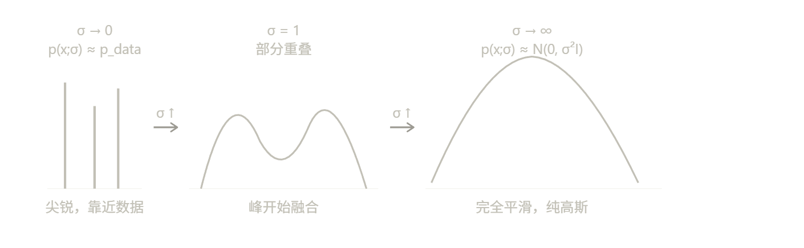
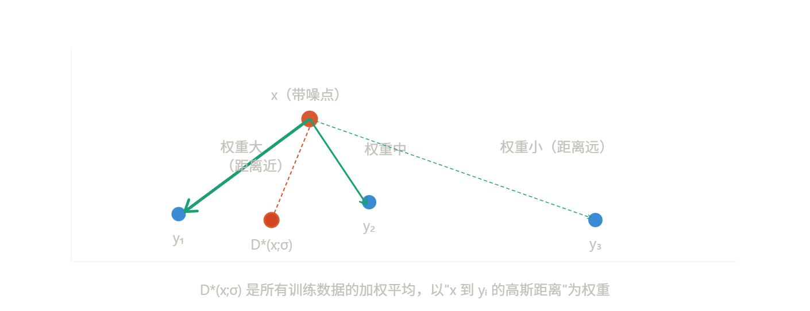
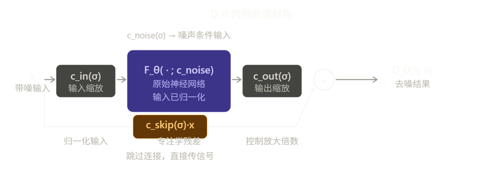

---
tags:
  - 扩散模型
---

# Design Space of Diffusion Model

> [!info]
>
> 创建时间：2026-3-25 | 更新时间：2026-3-25
>
> 原文链接：[Elucidating the Design Space of Diffusion-Based Generative Models](https://arxiv.org/abs/2206.00364)

这篇论文（EDM，即 **Elucidating the Diffusion Models**）的核心思路是：**把扩散模型的混乱理论梳理清楚，暴露出可以独立优化的设计空间，然后逐一改进。**

------

## 出发点

**现有文献的三个问题**

2022年时，扩散模型已经很强大，但论文作者认为整个领域的文献存在一个根本性问题：**理论推导和工程实现被深度绑定在一起**。

具体来说，每个流派（VP、VE、DDIM）都从自己的理论出发，推导出一整套包含采样器、网络结构、训练目标的完整方案。这导致这些方案看起来像是"一体化的黑箱"——你很难判断是某个采样器更好，还是某个训练目标更好，因为它们从来没有被单独测试过。

------

**统一框架的核心：两个函数定义一切**

EDM 的关键洞察是，任何扩散模型本质上都在做同一件事：**从高斯噪声出发，沿着一条路径去噪到数据分布**。这条路径可以完全由两个函数描述：

- **σ(t)**：时刻 t 时图像中噪声的标准差，定义了"噪声日程表"
- **s(t)**：时刻 t 时图像的整体缩放系数

有了这两个函数，概率流 ODE 就可以写成统一的形式：

**为什么 score 函数可以用去噪器表达？**

这是整个框架的数学基础。可以严格证明：如果 D(x; σ) 是在噪声水平 σ 下最小化 L2 去噪误差的最优去噪器，那么：

$$\nabla_x \log p(x; \sigma) = \frac{D(x;\sigma) - x}{\sigma^2}$$

含义很直觉：score 函数指向"把噪声去掉之后的方向"，而去噪器恰好就是在做这件事。这意味着我们只需要训练一个去噪网络 $D_\theta$，就能用它来驱动整个采样过程的 ODE。

**σ(t) = t 为什么是最好的选择？**

当 σ(t) = t 时，ODE 简化为：

$$dx/dt = \frac{x - D(x; t)}{t}$$

这意味着从任意点出发，单步 Euler 到 t=0 直接得到去噪结果 D(x;t)。ODE 的切线方向始终指向去噪器输出，这对应轨迹近似线性，数值积分误差最小。

**统一框架如何验证"正交性"？**

论文做了一个关键实验：拿三个来自不同理论流派的预训练模型（VP、VE、DDIM），**只换采样器，不重新训练**，FID 就大幅提升。这直接证明了采样过程和训练过程确实是独立的。

---

## ODE 统一框架

> [!note]
>
> score、噪声预测、去噪器三者等价，只差常数缩放和方向。这不是 EDM 的新发现，是已知结论，EDM 只是选择了用去噪器 D(x;σ) 作为核心表述对象。

> [!note]
>
> EDM 发表是 2022 年底，之后这个领域发展很快，主流已经不太用 f/g 这套语言了。现在大家更常见的框架是：
>
> **直接用 noise schedule 描述一切**，也就是定义 $\alpha_t $（保留信号的比例）和 $\sigma_t $（噪声标准差），前向过程写成：
>
> $$q(x_t \mid x_0) = \mathcal{N}(x_t;\; \alpha_t x_0,\; \sigma_t^2 I)$$
>
> 然后训练目标、采样器、CFG 这些全都直接从这两个量出发推导，不再绕 SDE 那一层。DDPM、DDIM、DPM-Solver、Flow Matching 的现代实现基本都是这个思路。
>
> **Flow Matching 更进一步**，直接把整件事定义为学一个速度场 $v_\theta(x, t) $，从噪声到数据是一条直线插值，连 SDE 的概念都不需要，形式更干净。现在 Stable Diffusion 3、Flux 这些模型用的就是这套。
>
> 总之知道f,g是由调度器定制的超参数就行

**Step 1：加噪分布 p(x; σ) 是什么**

扩散模型的出发点非常简单：对一张干净图像 y，加上标准差为 σ 的高斯噪声 n，得到带噪图像 x：

$$x = y + n, \quad n \sim \mathcal{N}(0, \sigma^2 I)$$

所以 x 在给定 y 的条件下服从 $\mathcal{N}(y, \sigma^2 I)$。对所有训练数据 y 求边际，得到**加噪边际分布**：

$$p(x; \sigma) = \int p_\text{data}(y) \cdot \mathcal{N}(x;y,\sigma^2 I)dy$$

直觉上这就是"把数据分布用方差 σ² 的高斯核模糊之后的结果"。σ 很小时 p(x;σ) 接近数据分布，σ 很大时接近纯高斯噪声。

**Step 2：Score 函数是什么，为什么重要**

**Score 函数**定义为对数概率密度的梯度：

$$\nabla_x \log p(x; \sigma)$$

它是一个向量场，在空间中每个点 x 处给出一个方向，指向**该噪声水平下数据密度增大的方向**。直觉上：如果你在噪声图像 x 处，score 告诉你"往哪个方向走，图像会更像真实数据"。

Score 函数有一个关键优点：**不需要知道归一化常数**。因为：

$$\nabla_x \log p(x;\sigma) = \frac{\nabla_x p(x;\sigma)}{p(x;\sigma)}$$

归一化常数是一个不依赖 x 的常数，求梯度后直接消掉了。这让 score 在实践中可计算，而直接估计概率密度 p 则因归一化困难而不可行。

------

**Step 3：去噪器的最优解推导**

现在考虑训练一个去噪器 D(x; σ)，目标是最小化 L2 去噪误差：

$$\mathcal{L} = \mathbb{E}_{y \sim p_\text{data}} \mathbb{E}_{n \sim \mathcal{N}(0, \sigma^2 I)} \left\| D(y + n;\sigma) - y \right\|^2$$

**关键技巧**：对每个固定的 x，可以独立求最优的 D(x; σ)。把期望展开写成对 x 的积分：

$$\mathcal{L} = \int \underbrace{\sum_i \mathcal{N}(x; y_i,\sigma^2 I) \cdot \|D(x;\sigma) - y_i\|^2}_{\text{对每个 x 独立最小化}} , dx$$

对固定 x，对 D(x;σ) 求导并令其为零：

$$0 = \sum_i \mathcal{N}(x;, y_i,, \sigma^2 I) \cdot 2\bigl(D(x;\sigma) - y_i\bigr)$$

解出来：

$$\boxed{D^*(x;\sigma) = \frac{\sum_i \mathcal{N}(x;y_i,\sigma^2 I) \cdot y_i}{\sum_i \mathcal{N}(x;y_i, \sigma^2 I)}}$$

这是一个**加权平均**：以 x 到每个训练样本的高斯距离为权重，对所有 $y_i$ 做加权平均。越近的样本权重越大。直觉上非常合理。

**Step 4：Score 函数 = 去噪器**

现在来推导 score 函数的表达式，利用 p(x;σ) 的定义：

$$p(x;\sigma) = \sum_i \frac{1}{Y} \mathcal{N}(x; y_i, \sigma^2 I)$$

对 x 求梯度，用到高斯分布的梯度公式 $\nabla_x \mathcal{N}(x; y, \sigma^2 I) = \mathcal{N}(x; y, \sigma^2 I) \cdot \frac{y - x}{\sigma^2}$：

$$\nabla_x \log p(x;\sigma) = \frac{\nabla_x p(x;\sigma)}{p(x;\sigma)} = \frac{\sum_i \mathcal{N}(x;y_i,\sigma^2 I) \cdot \frac{y_i - x}{\sigma^2}}{\sum_i \mathcal{N}(x;y_i,\sigma^2 I)}$$

把分子分母整理，把 $\frac{-x}{\sigma^2}$ 提出来：

$$= \frac{\sum_i \mathcal{N}(\cdot), y_i}{\sum_i \mathcal{N}(\cdot)} \cdot \frac{1}{\sigma^2} ;-; \frac{x}{\sigma^2} = \frac{D^*(x;\sigma) - x}{\sigma^2}$$

这就得到了那个关键等式：**几何直觉**：score = (D*(x;σ) − x) / σ² 中，分子 D*(x;σ) − x 就是"去噪方向"，即从当前带噪点指向去噪后目标点的向量。除以 σ² 是归一化。所以 score 就是"以 σ² 缩放的去噪方向"。

------

**Step 5：把 Score 代入，推导统一 ODE**

概率流 ODE 的原始形式（Song et al. 2021）是：

$$dx = \left[ f(t)x - \frac{1}{2}g(t)^2 \nabla_x \log p_t(x) \right] dt$$

其中 f(t) 和 g(t) 是 SDE 的漂移和扩散系数，不同流派定义不同，很难比较。EDM 的做法是：**把 f、g 替换成 σ(t) 和 s(t)**，利用它们之间的解析关系（详见论文附录 B.2）：

$$f(t) = \frac{\dot{s}(t)}{s(t)}, \qquad g(t) = s(t)\sqrt{2\dot{\sigma}(t)\sigma(t)}$$

代入后，再把 $p_t(x)$ 用 $p(x/s(t); \sigma(t))$ 表达，最终整理得到：

$$dx = \left[ \frac{\dot{s}(t)}{s(t)} x - s(t)^2 \frac{\dot{\sigma}(t)}{\sigma(t)} \nabla_x \log p\left(\frac{x}{s(t)};\sigma(t)\right) \right] dt$$

最后把 score 换成去噪器（Step 4 的结论）：当 σ(t) = t 时，ODE 变成了极为简洁的 **dx/dt = [x − D(x;t)] / t**。这个形式有一个极好的性质：从任意 x 出发，一步 Euler 到 t=0，得到的正好是 D(x;t)——也就是去噪结果。这说明 ODE 的切线方向始终精确指向去噪器输出，轨迹接近直线，数值积分误差最小，这正是论文推荐 σ(t) = t 的根本原因。

------

**整体逻辑串联**

五个步骤形成了一条完整的逻辑链：

1. 加噪得到 p(x;σ)，是数据分布的高斯模糊版本
2. Score 函数 ∇log p 指向密度增大方向，且不需要归一化常数
3. 最优去噪器 D*(x;σ) 是训练数据的高斯加权平均，有解析解
4. 代数计算直接证明 score = (D* − x)/σ²，两者严格等价
5. 把 score 代入 SDE→ODE 转换，用 σ(t)、s(t) 统一参数化，得到最终 ODE

这就是为什么**训练一个去噪网络 Dθ 就足以驱动整个采样过程**——采样用的 score 函数和训练用的去噪目标，在数学上是完全同一件事。

------

## 三个设计维度

论文把扩散模型拆解为三个可以**独立调整**的模块：

**① 采样过程（Sampling）**

原来大家用 Euler 一阶求解器。作者发现：

- 换成 **Heun 二阶方法**，精度大幅提升，NFE（网络调用次数）可以大幅减少
- 时间步的选取方式（discretization）很关键，提出了基于 $\rho$ 参数的多项式调度
- 噪声调度取 $\sigma(t) = t$，$s(t) = 1$（即 DDIM 的选择）能让 ODE 轨迹更接近直线，截断误差更小

**② 随机采样（Stochastic Sampling）**

在确定性 ODE 之外，引入 Langevin 式的"扰动-去噪"步骤（称为 churn）。随机性的作用是**纠正早期步骤的误差**。但过多随机性会导致图像退化，所以引入了几个超参数（$S_\text{churn}$、$S_\text{tmin}$、$S_\text{tmax}$、$S_\text{noise}$）来控制。

**③ 预处理与训练（Preconditioning & Training）**

这是论文最有系统性的贡献之一。核心想法是：

$$D_\theta(x; \sigma) = c_\text{skip}(\sigma) \cdot x + c_\text{out}(\sigma) \cdot F_\theta(c_\text{in}(\sigma) \cdot x;, c_\text{noise}(\sigma))$$

通过**从第一性原理推导**出 $c_\text{skip}$、$c_\text{in}$、$c_\text{out}$ 的最优形式，使得：

- 网络输入的方差为 1
- 训练目标的方差为 1
- 网络误差的放大尽可能小

同时改进了**训练噪声分布** $p_\text{train}(\sigma)$，从均匀分布换成对数正态分布，集中在"最有用"的中间噪声区间。还借用 GAN 中的**非泄漏数据增强**来防止过拟合。

> [!note]
>
> 作者特别强调这三个维度是**正交的**（orthogonal）。验证方式是：
>
> 1. 先把别人的预训练模型拿来，**只换采样器**，FID 就大幅提升（证明采样和训练无关）
> 2. 再用改进的训练流程**重新训练**，进一步提升
> 3. 每步改动都有消融实验对应

------

## 预处理和训练

**问题的根源：直接训练 D(x;σ) 很难**

回顾一下，我们要训练的是去噪器 $D_\theta(x; \sigma)$，输入是带噪图像 $x = y + n$，目标是输出干净图像 $y$。

问题在于**输入的统计性质随 σ 剧烈变化**：

$$\text{Var}(x) = \text{Var}(y + n) = \sigma_\text{data}^2 + \sigma^2$$

σ 很小时输入方差 ≈ $\sigma_\text{data}^2$，σ 很大时输入方差 ≈ $\sigma^2$，两者可以相差几个数量级。同一个网络要处理方差从 0.002 到 80 的输入，训练极不稳定。

输出也有类似问题：之前的方法（DDPM 系）让网络预测噪声 $\varepsilon$，写成去噪器的形式就是 $D_\theta(x;\sigma) = x - \sigma F_\theta(\cdot)$。当 σ 很大时，网络输出的任何小误差都会被 σ 倍数放大。

------

### 四个预处理函数

EDM 在网络 $F_\theta$ 外面包一层预处理，把去噪器写成：

$$D_\theta(x; \sigma) = c_\text{skip}(\sigma)\cdot x + c_\text{out}(\sigma)\cdot F_\theta\left(c_\text{in}(\sigma)\cdot x;c_\text{noise}(\sigma)\right)$$

四个函数各司其职：$c_\text{in}$ 归一化输入，$c_\text{out}$ 控制输出放大倍数，$c_\text{skip}$ 提供跳连让网络只需学残差，$c_\text{noise}$ 把 σ 映射成网络的条件输入。

------

### 从第一性原理推导四个函数

> [!note]
>
> "第一性原理"（first principles）这个词在物理学里的意思是：**不依赖经验公式或前人结论，直接从最基础的定义和约束出发推导答案**。
>
> EDM 的"第一性原理"具体就是两条约束：
>
> 1. **网络输入的方差 = 1**（训练稳定的标准条件）
> 2. **训练目标的方差 = 1，且网络误差被放大得尽量少**
>
> 有了这两条约束，$c_\text{in}$、$c_\text{skip}$、$c_\text{out}$ 都是解方程解出来的，不是试出来的。

EDM 的做法不是经验调参，而是给每个函数一个明确的优化目标，然后解析求解。

**推导 $c_\text{in}$：让网络输入方差为 1**

$$\text{Var}\left(c_\text{in}(\sigma)\cdot x\right) = 1 \implies c_\text{in}(\sigma)^2(\sigma_\text{data}^2 + \sigma^2) = 1$$

$$\boxed{c_\text{in}(\sigma) = \frac{1}{\sqrt{\sigma^2 + \sigma_\text{data}^2}}}$$

**推导 $c_\text{skip}$ 和 $c_\text{out}$：让训练目标方差为 1，且网络误差放大最小**

把 $D_\theta$ 的定义代入训练损失，网络 $F_\theta$ 实际在学的目标是：

$$F_\text{target} = \frac{y - c_\text{skip}(\sigma)\cdot x}{c_\text{out}(\sigma)} = \frac{(1 - c_\text{skip}),y - c_\text{skip}\cdot n}{c_\text{out}}$$

要让这个目标方差为 1：

$$c_\text{out}^2 = (1 - c_\text{skip})^2\sigma_\text{data}^2 + c_\text{skip}^2\sigma^2$$

同时希望 $c_\text{out}$ 尽量小（网络误差放大最少），对 $c_\text{skip}$ 求导令其为零：

$$\boxed{c_\text{skip}(\sigma) = \frac{\sigma_\text{data}^2}{\sigma^2 + \sigma_\text{data}^2}, \qquad c_\text{out}(\sigma) = \frac{\sigma\cdot\sigma_\text{data}}{\sqrt{\sigma^2 + \sigma_\text{data}^2}}}$$$c_\text{skip}$ 的行为很有直觉意义：σ 很小时接近 1，网络几乎直接透传输入，只需学微小的去噪残差；σ 很大时接近 0，跳连贡献少，网络自己负责预测去噪结果。这和人类直觉完全一致——噪声小的时候输入本来就很干净，不需要大动作。

---

把预处理代入训练损失，$F_\theta$ 实际优化的是：

$$\mathcal{L} = \mathbb{E}_{\sigma, y, n}\left[ \underbrace{\lambda(\sigma)\cdot c_\text{out}(\sigma)^2}_{\text{有效权重}} \cdot \left\| F_\theta(c_\text{in}\cdot x;c_\text{noise}) - F_\text{target} \right\|^2 \right]$$

**权重设计**：令 $\lambda(\sigma) = 1/c_\text{out}(\sigma)^2$，有效权重变成 1，所有 σ 的初始损失相等，训练更稳定。

**噪声分布 $p_\text{train}(\sigma)$**：这是第四个改进。用均匀分布采样 σ 是浪费的——极低和极高的 σ 对最终图像质量贡献很少，中间区域才是关键。为什么极端 σ 的训练价值低？

- **极低 σ**：噪声几乎不存在，去噪是平凡问题，学不到什么
- **极高 σ**：最优去噪器输出始终是数据集均值，没有图像具体内容可学

所以 EDM 用 $\ln\sigma \sim \mathcal{N}(P_\text{mean}, P_\text{std}^2)$（$P_\text{mean}=-1.2, P_\text{std}=1.2$）把训练集中在中间最有信息量的区间。这和 SD3 的 logit-normal 思路完全一致，都是同一个洞察。

------

最后一个改进是把 GAN 里的**非泄漏数据增强**搬到扩散模型。

普通数据增强（比如随机翻转）会把增强后的分布泄漏到生成结果里——模型会生成镜像的人脸或文字。EDM 的做法是：对训练图像做增强，但**把增强参数 a 也作为条件输入给网络**，推理时 a 固定为零（无增强）。网络学会了"给定无增强条件时生成无增强图像"，获得了增强带来的正则化效果却没有泄漏。

------

综合效果有几个值得注意的地方：

**Config D（预处理）本身 FID 变化不大**，但它的贡献是让训练更稳定，为 E 的损失改进创造了条件——没有 D，E 的改进会不稳定。

**Config E（损失权重 + 噪声分布）是最大的单次跳跃**，VP 从 2.09 跳到 1.88，VE 从 2.64 跳到 1.86。这说明"把训练注意力集中在有用的噪声区间"是最核心的改进。

**Config F 之后 VP 和 VE 的 FID 完全相同（1.79）**，说明 VP 和 VE 的差距完全来自训练设置，而不是架构本质差异。

------

### 小结

预处理这部分的核心思路是一句话：**从第一性原理推导每个设计选择，而不是经验调参**。

四个预处理函数都有明确的推导目标：$c_\text{in}$ 保证输入单位方差，$c_\text{skip}$ 和 $c_\text{out}$ 联合保证训练目标单位方差且误差放大最小，$c_\text{noise}$ 是经验选择。log-normal 噪声分布同样有清晰的理论依据：集中在训练信息量最大的区间。

这套分析框架和 SD3 的 logit-normal 思路、RF 的 velocity prediction 都是同源的——都在问同一个问题：**怎么让网络在训练时把注意力放在真正重要的地方**。

------

