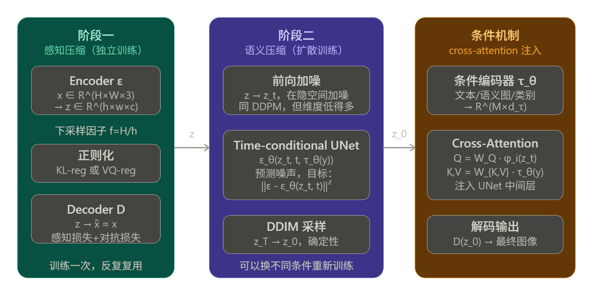
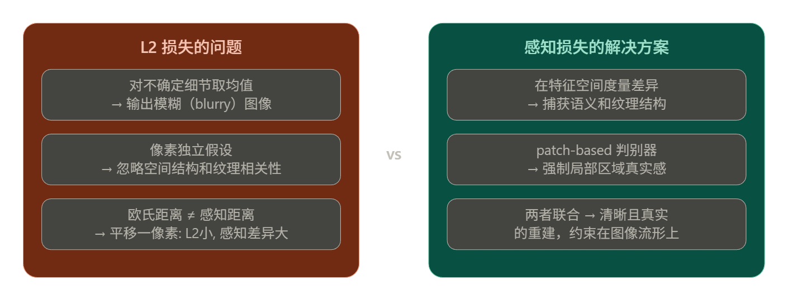
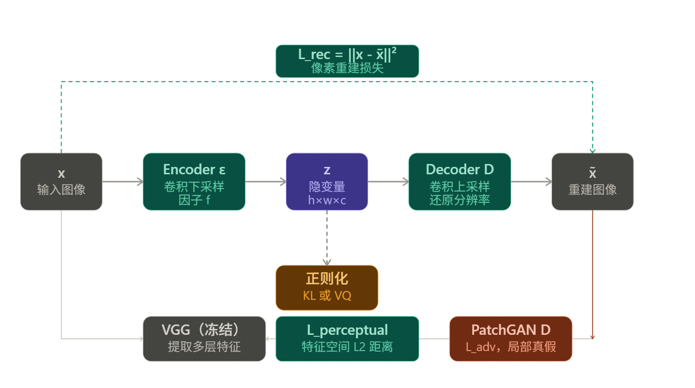
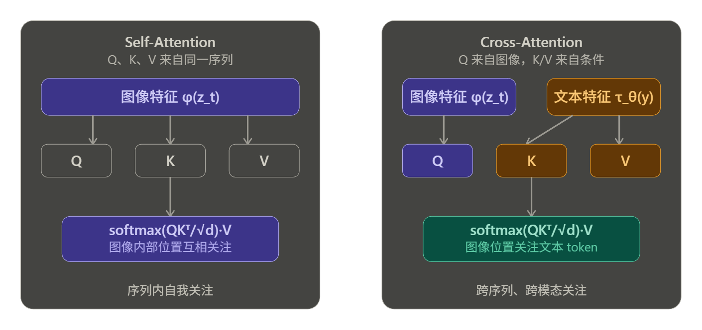
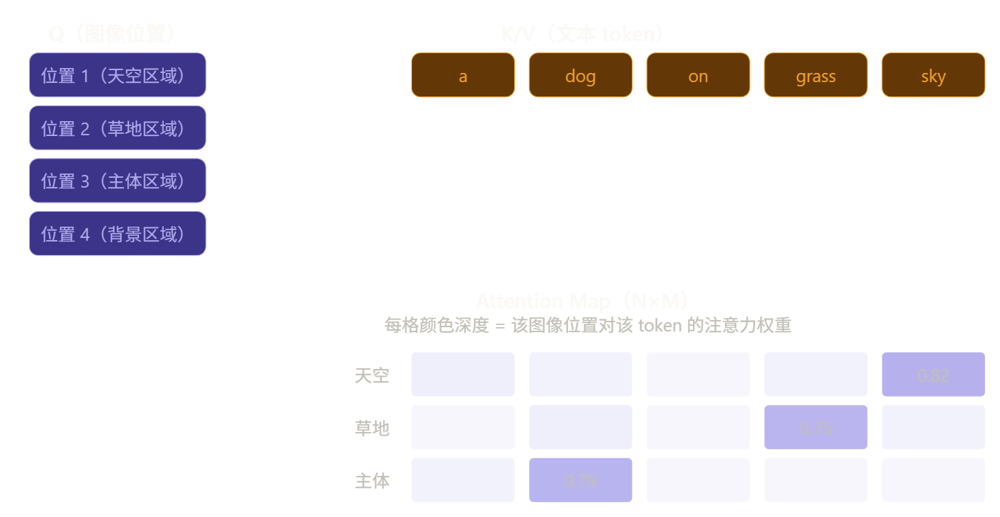
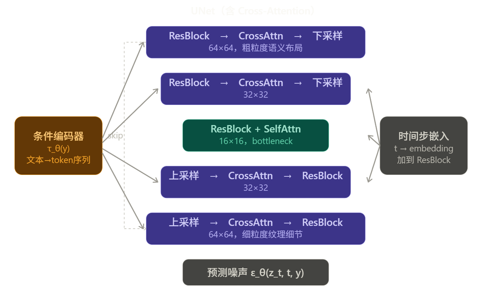
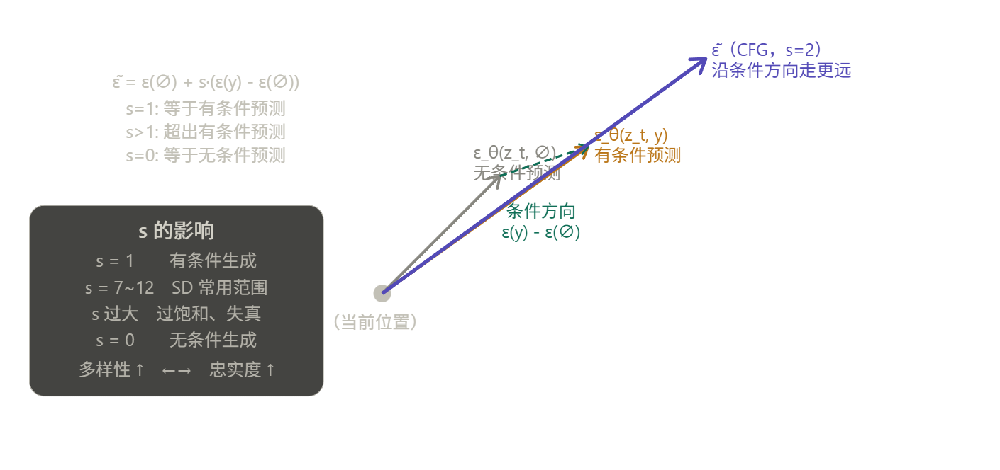
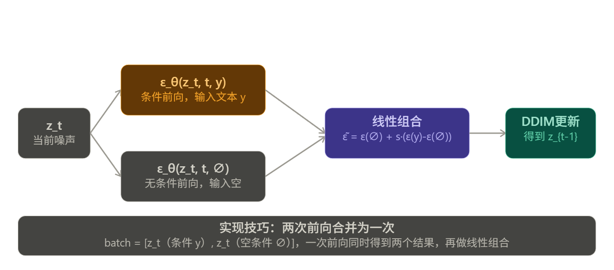

---
tags:
  - 扩散模型	
---

# LDM

LDM 的核心思路非常清晰，整篇论文围绕一个核心问题展开：像素空间的扩散模型为什么贵，以及如何在不损失质量的前提下把计算量降下来。

------

## 根本动机

论文 Figure 2 提出了一个关键观察：对于任何基于似然的模型，学习过程可以分成两个阶段：

- **感知压缩（Perceptual Compression）**：去除人眼不敏感的高频细节，这部分信息量大但语义价值低
- **语义压缩（Semantic Compression）**：学习数据的真正语义和概念组合，这才是生成模型的核心任务

DDPM 在像素空间把这两件事混在一起做，导致大量计算浪费在第一阶段。LDM 的解决方案是：**用 autoencoder 专门做感知压缩，扩散模型只做语义压缩。**

------

## 整体架构

LDM 由三个相对独立的部分组成，理解它们的边界非常重要。

## 阶段一：感知压缩

Encoder $\mathcal{E}$ 把图像 $x \in \mathbb{R}^{H \times W \times 3}$ 压缩到 $z \in \mathbb{R}^{h \times w \times c}$，下采样因子 $f = H/h$。

**训练目标**是三项损失的组合：

$$\mathcal{L}_{AE} = \mathcal{L}_{rec}(x, \hat{x}) + \mathcal{L}_{perceptual}(x, \hat{x}) + \mathcal{L}_{adv}$$

- $\mathcal{L}_{rec}$：像素重建损失（L1/L2）
- $\mathcal{L}_{perceptual}$：感知损失，用预训练网络的特征空间度量，避免糊化
- $\mathcal{L}_{adv}$：patch-based 判别器对抗损失，强制局部真实感

### 感知压缩的完整推导

先理解为什么不能只用 L2 损失。这是整个设计的出发点。

------

#### 纯像素损失的根本缺陷

假设用标准 VAE 的重建损失：

$$\mathcal{L}_{rec} = | x - \hat{x} |^2$$

L2 损失对每个像素独立惩罚，等价于假设像素之间**条件独立**。这带来一个严重问题：当模型对某个细节不确定时（比如头发丝的走向），最优策略是输出**所有可能结果的均值**，即糊化。

更深层的原因是：自然图像的分布 $p(x)$ 高度集中在一个低维流形上，L2 度量的是欧氏距离，而人眼感知的相似性是沿流形的距离。两张图像在 L2 意义上很近，感知上可能完全不同（比如整体平移一个像素）；反之亦然。

#### 感知损失

感知损失（Perceptual Loss，来自 Zhang et al. 2018，即 LPIPS）的核心思想是：**用预训练网络的中间特征作为度量空间**。

设 $\phi^{(l)}$ 为预训练网络（VGG）第 $l$ 层的特征提取函数，则：

$$\mathcal{L}_{perceptual} = \sum_{l} \frac{1}{C_l H_l W_l} \left| \phi^{(l)}(x) - \phi^{(l)}(\hat{x}) \right|^2$$

其中 $C_l, H_l, W_l$ 是第 $l$ 层特征图的通道数、高、宽，用于归一化。

**为什么这样有效**：VGG 在 ImageNet 上训练，其特征层已经学会了对人类视觉系统重要的结构——边缘、纹理、物体部件。在这个空间里距离近，意味着感知上相似。浅层特征捕获低级纹理，深层特征捕获高级语义，多层加权覆盖了整个感知层次。

------

#### 对抗损失

仅有感知损失还不够，它仍然可能产生感知上合理但不够锐利的输出。LDM 引入 patch-based 判别器（来自 PatchGAN / VQGAN），对图像的**局部小块**判断真假，而不是对整张图。

判别器 $D_{patch}$ 输出一个特征图，每个位置对应原图一个感受野区域的真假得分。对抗损失：

$$\mathcal{L}_{adv} = \mathbb{E}_{x}[\log D_{patch}(x)] + \mathbb{E}_{\hat{x}}[\log(1 - D_{patch}(\hat{x}))]$$

patch-based 的优势是：强制每个局部区域都要真实，而不是整体均值意义上的合理。这直接解决了模糊问题——模糊的 patch 很容易被判别器识别为假。

------

#### 完整训练目标

三项损失联合训练 encoder $\mathcal{E}$ 和 decoder $\mathcal{D}$：

$$\mathcal{L}_{AE} = \mathcal{L}_{rec}(x, \mathcal{D}(\mathcal{E}(x))) + \lambda_{p} \cdot \mathcal{L}_{perceptual}(x, \hat{x}) + \lambda_{adv} \cdot \mathcal{L}_{adv}(\hat{x})$$

加上正则化项（KL 或 VQ），完整目标为：

$$\mathcal{L}_{total} = \mathcal{L}_{AE} + \mathcal{L}_{reg}$$

#### 两种正则化

**KL-reg（连续隐空间）**

对隐变量 $z = \mathcal{E}(x)$ 施加轻微 KL 惩罚：

$$\mathcal{L}_{KL} = D_{KL}(q_\phi(z|x) || \mathcal{N}(0, I))$$

encoder 输出均值 $\mu$ 和方差 $\sigma^2$，通过重参数技巧采样 $z = \mu + \sigma \odot \epsilon$。KL 权重故意设得很小（"轻微惩罚"），目的不是让 $z$ 严格服从标准正态，只是防止隐空间任意膨胀（variance collapse 或 posterior collapse）。

**VQ-reg（离散隐空间）**

在 decoder 内部嵌入向量量化层，把连续隐变量 $z$ 映射到最近的 codebook 向量 $z_q$：

$$z_q = \arg\min_{e_k \in \mathcal{C}} |z - e_k|$$

梯度通过 straight-through estimator 回传。VQ 的正则化效果来自量化本身——codebook 的容量有限，强迫 encoder 学习紧凑的离散表示。

**论文为何最终选 VQ-reg 做主要实验**：实验发现 VQ-reg 的 LDM 样本质量更高。直觉上，量化引入的信息瓶颈去除了更多感知上无关的细节，让扩散模型在更干净的隐空间里工作。

------

#### 压缩比 $f$ 对重建质量的影响

这是第一阶段最关键的超参数选择。论文 Figure 1 直接对比了不同 $f$ 的重建质量（PSNR 和 R-FID）：

| 方法        | $f$  | PSNR | R-FID |
| ----------- | ---- | ---- | ----- |
| LDM（ours） | 4    | 27.4 | 0.58  |
| DALL-E      | 8    | 22.8 | 32.01 |
| VQGAN       | 16   | 19.9 | 4.98  |

$f=4$ 时 PSNR 比 DALL-E（$f=8$）高 4.6 dB，R-FID 低两个数量级。**这说明 LDM 的核心贡献之一是：不需要激进压缩也能让扩散模型在隐空间高效工作**，因为 UNet 的卷积归纳偏置天然适合处理具有空间结构的隐变量。

------

#### 和后续阶段的接口

第一阶段训练完成后，encoder $\mathcal{E}$ 和 decoder $\mathcal{D}$ **冻结权重**，只作为固定的特征提取器和图像解码器使用。扩散模型完全在 $z$ 空间中操作，从未看到像素。这个设计有一个重要含义：

**同一个 autoencoder 可以支持多个不同的扩散模型**——文生图模型、超分模型、补全模型可以共享同一个 $\mathcal{E}$ 和 $\mathcal{D}$，只需重新训练扩散部分。这是 Stable Diffusion 生态里各种 LoRA、ControlNet 能够快速发展的基础条件之一。

>[!note]
>
>加上感知损失和GAN对抗损失之后，显存开销是不是很大？
>
>因为VGG是一个已经预训练完成的特征提取网络，所以冻结参数，把中间值的l2存下来加到损失就行了，不需要在VGG上额外做计算图。然后GAN本身交替训练两个网络确实有比较大的开销，但是因为这里是局部Patch的GAN所以GAN网络体积比较小，总的来说可以接受。
>
>补充一个细节让这个图景更完整：**VGG 的梯度截断位置**。
>
>`no_grad` 包住的是 VGG 的前向计算，但损失函数 $\| \phi^{(l)}(x) - \phi^{(l)}(\hat{x}) \|^2 $ 里，$\hat{x} $ 是 VAE 输出的，这个 $\hat{x} $ 本身是有计算图的。所以梯度流向是：
>
>$$\mathcal{L}_{perceptual} \xrightarrow{\text{对 } \hat{x} \text{ 求导}} \hat{x} \xrightarrow{\text{正常反传}} \text{decoder} \rightarrow \text{encoder}$$
>
>VGG 内部没有梯度，但它充当了一个**固定的非线性变换**，把像素空间的差异映射到特征空间，然后这个特征空间里的 L2 距离对 $\hat{x} $ 的梯度正常流回 VAE。这是感知损失有效的关键——VGG 的非线性变换决定了"什么样的差异值得惩罚"，VAE 的梯度沿着这个方向更新。
>
>GAN 那边也类似，第一阶段更新 VAE 时，$\hat{x} $ 送入 PatchGAN 得到评分，梯度从评分流回 $\hat{x} $ 再流回 VAE，PatchGAN 自身参数此时冻结不更新。
>
>所以两个损失的共同模式是：**外部网络定义了一个固定的评判标准，梯度通过 $\hat{x} $ 这个接口流回 VAE** ，外部网络本身只是提供了一个更好的损失曲面形状。

------

## 阶段二：隐空间扩散

LDM在隐空间上做扩散的过程和DDPM，DDIM没有本质不同

LDM 在隐空间上做的扩散，训练目标和 DDPM 的形式完全一样，采样用 DDIM，唯一的区别是操作对象从像素 $x$ 换成了隐变量 $z$：

$$\mathcal{L}_{DDPM} = \mathbb{E}_{x, \epsilon, t}\left[ | \epsilon - \epsilon_\theta(x_t, t) |^2 \right]$$

$$\mathcal{L}_{LDM} = \mathbb{E}_{\mathcal{E}(x), \epsilon, t}\left[ | \epsilon - \epsilon_\theta(z_t, t) |^2 \right]$$

两个公式除了输入从 $x_t$ 换成 $z_t$，形式完全相同。加噪方式也一样：

$$z_t = \sqrt{\bar{\alpha}_t}, z_0 + \sqrt{1 - \bar{\alpha}_t}, \epsilon, \quad \epsilon \sim \mathcal{N}(0, I)$$

其中 $z_0 = \mathcal{E}(x)$ 是 encoder 的输出，训练时直接计算，不需要梯度回传到 encoder（因为 encoder 已经冻结）。

------

**LDM 真正的贡献**

不是扩散过程本身，而是**在哪个空间做扩散**这个设计决策带来的三个好处。

**第一：计算量的压缩是二次方级别的**

UNet 里的 self-attention 计算复杂度是 $O((HW)^2)$，对序列长度是二次方。从像素空间 $256 \times 256$ 到隐空间 $64 \times 64$（$f=4$），序列长度从 65536 缩小到 4096，attention 的计算量变成原来的 $\frac{1}{16}$。这是 LDM 训练快得多的根本原因。

**第二：隐空间的信噪比更好**

像素空间里大量 bit 对应人眼不可感知的高频细节，扩散模型必须浪费容量去建模这些无意义的信息。隐空间经过感知压缩，保留的都是语义相关的结构，扩散模型可以把全部容量用在真正重要的地方。

**第三：backbone 的归纳偏置匹配**

$z \in \mathbb{R}^{h \times w \times c}$ 保留了空间结构，UNet 的卷积层天然适合处理有空间相关性的数据。如果先把图像压成一维向量再做扩散（早期一些工作的做法），就丧失了卷积的归纳偏置优势。

> [!note]
>
> 一个需要注意的工程细节
>
> 隐空间的数值范围需要校准。不同的 autoencoder 输出的 $z$ 可能有不同的方差，如果方差过大，加噪调度（noise schedule）就不匹配了——原来为单位方差设计的 $\bar{\alpha}_t$ 序列在方差很大的 $z$ 上会表现异常。
>
> LDM 的处理方式是对 $z$ 按通道做标准化，使其接近单位方差，然后再喂给扩散模型。SD 系列在实现中也有这个 scaling factor，SD 1.x 里是 $0.18215$：
>
> $$z_{scaled} = 0.18215 \times \mathcal{E}(x)$$
>
> 这个数字是从训练数据上统计 encoder 输出方差得到的，不是拍脑袋的超参数。

所以 LDM 的隐空间扩散部分可以用一句话概括：**DDPM 的训练目标 + DDIM 的采样 + encoder 冻结后的 $z$ 作为输入**，核心创新不在扩散过程本身，而在于把扩散过程迁移到一个更合适的表示空间。

------

## 阶段三：cross-attention 条件机制

先建立直觉：cross-attention 解决的问题是**如何让扩散模型在去噪时"参考"一段外部信息**。没有条件机制时，UNet 只能做无条件生成；有了 cross-attention，文本、语义图、类别标签都可以自然地注入进来。

最直觉的条件注入方式是**拼接（concatenation）**：把条件信息和 $z_t$ 直接在通道维度拼起来。这对空间对齐的条件有效，比如超分辨率里把低分辨率图像和噪声隐变量拼接，两者有明确的空间对应关系。

但对文本条件这就不行了。文本是一个变长的 token 序列，和图像的空间位置没有任何直接对应关系，强行拼接没有意义。需要一种能够**跨模态、跨序列长度**建立依赖关系的机制，这正是 attention 的强项。

------

### Self-Attention 和 Cross-Attention 的区别

先理解 self-attention，再看 cross-attention 多了什么。

Self-attention 里 Q、K、V 全部来自同一个序列 $X$：

$$Q = W_Q X, \quad K = W_K X, \quad V = W_V X$$

每个位置都在问"序列里哪些其他位置和我相关"，是序列内部的自我关注。

Cross-attention 里 Q 来自一个序列，K 和 V 来自另一个序列：

$$Q = W_Q \phi_i(z_t), \quad K = W_K \tau_\theta(y), \quad V = W_V \tau_\theta(y)$$

$\phi_i(z_t)$ 是 UNet 第 $i$ 层的图像特征，$\tau_\theta(y)$ 是条件编码器的输出。图像特征提问（Q），文本特征回答（K 和 V）。每个图像位置都在问"文本里哪些 token 和我最相关"。

### Attention 的计算过程

具体展开计算，设图像特征序列长度为 $N$（$h \times w$ 个空间位置 flatten），文本 token 数为 $M$：

$$\text{Attention}(Q, K, V) = \text{softmax}!\left(\frac{QK^\top}{\sqrt{d}}\right) V$$

维度变化：

$$Q \in \mathbb{R}^{N \times d}, \quad K \in \mathbb{R}^{M \times d}, \quad V \in \mathbb{R}^{M \times d}$$

$$QK^\top \in \mathbb{R}^{N \times M} \quad \leftarrow \text{attention map，每个图像位置对每个文本 token 的相关度}$$

$$\text{softmax}(\cdot) \in \mathbb{R}^{N \times M} \quad \leftarrow \text{归一化后的注意力权重}$$

$$\text{output} \in \mathbb{R}^{N \times d} \quad \leftarrow \text{加权求和，每个图像位置得到一个条件感知的向量}$$

attention map 的第 $(i, j)$ 个元素表示**图像第 $i$ 个位置对文本第 $j$ 个 token 的关注程度**。这个矩阵是可视化的，实际上就是我们在 SD 生成图片时能看到的"哪个词控制了图像哪个区域"的来源。

### 注入在 UNet 的哪里

Cross-attention 不是在 UNet 外部做一次，而是**插入到 UNet 每个分辨率层的 ResBlock 之后**，形成 Spatial Transformer 结构：

$$\text{输出} = \text{CrossAttn}(\text{LayerNorm}(\phi_i(z_t)),\ \tau_\theta(y)) + \phi_i(z_t)$$

残差连接保证即使 cross-attention 权重接近零，信息也能正常流过。在 UNet 的每个分辨率都注入，意味着条件信息在粗粒度（语义布局）和细粒度（纹理细节）上都有影响。

### 条件编码器 τ_θ 是什么

$\tau_\theta$ 的具体结构取决于条件类型，论文里针对不同任务用了不同的编码器：

- 文生图：BERT tokenizer + Transformer encoder，输出 $M \times d_\tau$ 的 token 序列
- 类别条件：简单的 embedding 层，类别标签 → 一个向量
- 语义图：另一个卷积网络，把语义分割图编码成特征

这个设计的优雅之处在于**对条件类型完全开放**，只要 $\tau_\theta$ 能输出 $M \times d_\tau$ 形状的序列，任何模态都可以插进来。后来的 ControlNet 就是利用这个接口，把深度图、边缘图等额外条件注入进去的。

------

### 训练目标的完整形式

加入条件后训练目标变成：

$$\mathcal{L}_{LDM} = \mathbb{E}_{\mathcal{E}(x), y, \epsilon, t}\left[ | \epsilon - \epsilon_\theta(z_t, t, \tau_\theta(y)) |^2 \right]$$

$\tau_\theta$ 和 $\epsilon_\theta$ 联合优化，条件编码器的梯度通过 cross-attention 的 K、V 矩阵反传回来。注意 autoencoder 的 $\mathcal{E}$ 仍然冻结，只有扩散模型和条件编码器在这个阶段训练。

------

## Classifier-Free Guidance（CFG）

先建立动机：有了 cross-attention 之后，模型能生成和文本相关的图像，但"相关"的程度往往不够强。生成的图像可能符合文本语义，但不够精确，细节上偏离描述。CFG 解决的就是**如何在推理时增强条件的影响力**。

------

###  Classifier Guidance 

CFG 的前身是 **Classifier Guidance**（Dhariwal & Nichol 2021），理解它有助于看清 CFG 的动机。

Classifier Guidance 的思路是：训练一个额外的噪声分类器 $p_\phi(y | x_t)$，在每个去噪步骤里，用分类器对条件 $y$ 的梯度来修正去噪方向：

$$\tilde{\epsilon}*\theta(x_t, t, y) = \epsilon*\theta(x_t, t) - s \cdot \nabla_{x_t} \log p_\phi(y | x_t)$$

$s$ 是 guidance scale，越大条件影响越强。

**问题**：需要额外训练一个在噪声数据上工作的分类器，工程复杂；而且分类器的梯度质量直接影响生成质量，容易引入伪影。

------

### CFG 的核心思想

CFG 完全不需要额外的分类器，只用**同一个扩散模型的两次前向**来构造 guidance。

关键观察来自贝叶斯公式。对条件生成分布的 score 做分解：

$$\nabla_{x_t} \log p(x_t | y) = \nabla_{x_t} \log p(x_t) + \nabla_{x_t} \log p(y | x_t)$$

后验 = 先验 + 似然梯度。Classifier Guidance 直接估计第二项，CFG 则把两项都用扩散模型来估计：

$$\tilde{\epsilon}_\theta(z_t, t, y) = \underbrace{\epsilon_\theta(z_t, t, \varnothing)}_{\text{无条件预测}} + s \cdot \underbrace{\left(\epsilon_\theta(z_t, t, y) - \epsilon_\theta(z_t, t, \varnothing)\right)}_{\text{条件方向}}$$

其中 $\varnothing$ 表示空条件（null condition）。这个公式的含义非常直观：

$$\tilde{\epsilon} = \text{无条件预测} + s \times (\text{有条件} - \text{无条件})$$

$s > 1$ 时，沿着"条件和无条件的差异方向"走得更远，相当于放大了条件的影响。

### 训练时怎么做

CFG 的训练非常简单，只需要在原有训练流程里随机丢弃条件：

训练时以概率 $p_{uncond}$（通常 10%~20%）把条件 $y$ 替换成空条件 $\varnothing$（一般是全零向量或空字符串的 embedding），其余时候正常用 $y$ 训练：

$$\mathcal{L}_{CFG} = \mathbb{E}_{\mathcal{E}(x), y, \epsilon, t}\left[ || \epsilon - \epsilon_\theta(z_t, t, c) ||^2 \right]$$

$$c = \begin{cases} \varnothing & \text{以概率 } p_{uncond} \\ y & \text{以概率 } 1 - p_{uncond} \end{cases}$$

这样**同一个网络**既学会了有条件去噪，也学会了无条件去噪，推理时直接做两次前向即可，不需要任何额外模型。

------

### 推理时的完整流程

每个去噪步骤里，模型做**两次前向传播**：

$$\tilde{\epsilon} = \epsilon_\theta(z_t, t, \varnothing) + s \cdot \left(\epsilon_\theta(z_t, t, y) - \epsilon_\theta(z_t, t, \varnothing)\right)$$

然后用 $\tilde{\epsilon}$ 替代原本的 $\epsilon_\theta$ 代入 DDIM 的更新公式做去噪。

实际实现里，两次前向通常**合并成一次**：把有条件和无条件的输入拼成 batch size 为 2 的 batch，一次前向同时得到两个结果，再做线性组合。这样推理开销是无 CFG 时的 2 倍，但通常认为值得。

### CFG 的本质是什么

从信息论角度看，CFG 做的事情是**锐化条件分布**。

无条件模型学的是 $p(x)$，有条件模型学的是 $p(x|y)$。CFG 实际上在采样一个更尖锐的分布：

$$\tilde{p}(x|y) \propto p(x|y)^s \cdot p(x)^{1-s}$$

$s > 1$ 时，这个分布比 $p(x|y)$ 更集中在高概率区域，多样性下降，但对条件的忠实度上升。这就是 $s$ 控制"多样性和忠实度之间的 tradeoff"的数学根据。

CFG 只在推理时起作用，训练时只是随机 dropout 条件，对训练目标没有任何改动。这是它如此简洁有效的原因——用训练时的一个小技巧换来了推理时对条件强度的完整控制权。

