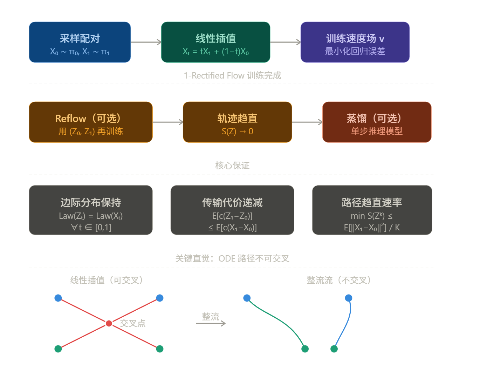
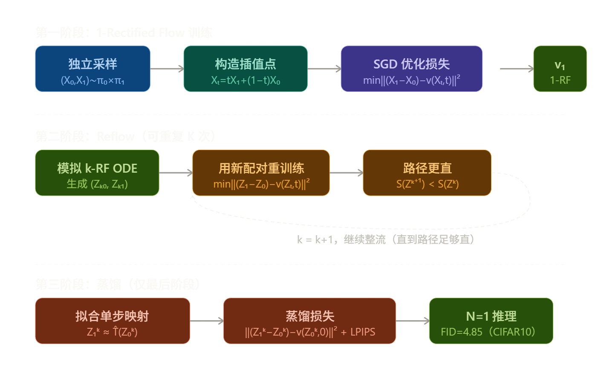
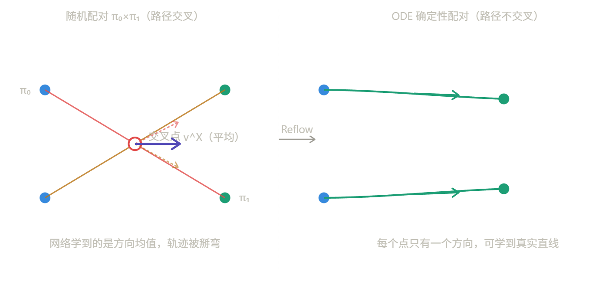
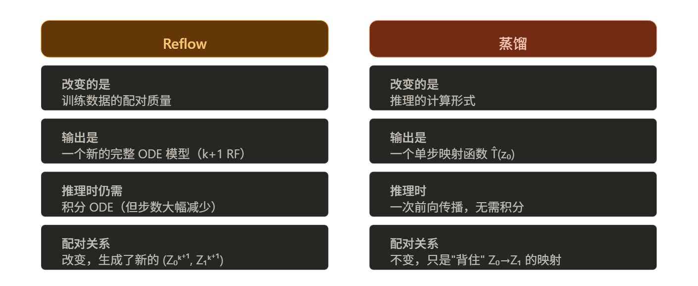

---
tags:
  - 流匹配
  - 蒸馏
---

# **Rectified Flow 修正流**

> [!INFO] 文档信息
>
> 创建时间：2026-3-24 | 更新时间：2026-3-24
> 
> 本文基于**[Flow Straight and Fast: Learning to Generate and Transfer Data with Rectified Flow](https://arxiv.org/abs/2209.03003)** 做笔记

## 核心思想

Rectified Flow 要解决的是**分布传输问题**：给定两个分布 π₀ 和 π₁ 的样本，找到一个从 π₀ 到 π₁ 的映射。它的关键洞察是：**让 ODE 的轨迹尽量沿直线行进**。

直线路径之所以特殊，有两个原因：

1. 理论上是两点之间最短路径，传输代价最低
2. 计算上可以被单步精确模拟，极大降低推理开销

传统扩散模型（DDPM、Score-based models）走弯曲轨迹，需要数百甚至数千步推理步骤。Rectified Flow 把这个问题从根本上改变了。

先用一张图展示整体流程：

## 训练目标（损失函数）

核心是一个极其简单的**最小二乘回归**问题：

$$\min_v \int_0^1 \mathbb{E}\left[|(X_1 - X_0) - v(X_t, t)|^2\right] dt, \quad X_t = tX_1 + (1-t)X_0$$

这个损失的含义是：让神经网络 $v$ 学会在每个时间步 $t$、每个中间点 $X_t$ 处，预测从 $X_0$ 到 $X_1$ 的方向向量 $X_1 - X_0$。

最优解（精确时）是条件期望：

$$v^X(x, t) = \mathbb{E}[X_1 - X_0 \mid X_t = x]$$

即：在位置 $x$ 处，聚合所有经过此处的直线路径方向的加权平均。这正是 ODE 在推理时"不需要看未来"的关键——它用均值代替了非因果信息。

> [!note]
>
> Lipman 的 Flow Matching 和 Rectified Flow 的训练损失在形式上几乎等价——都是让网络 $v$ 回归插值路径的切向量。Lipman 的表述是 Conditional Flow Matching（CFM）：
>
> 
> $$
> \mathcal{L}_{CFM} = \mathbb{E}_{t, p(x_1), p_t(x|x_1)} \|v_t(x) - u_t(x|x_1)\|^2
> $$
> 
>
> 其中条件向量场 $u_t(x|x_1) $ 在选择线性插值时退化为 $x_1 - x_0 $，和 Rectified Flow 的目标完全一致。两者的关键共同洞察是： **不需要扩散模型的 SDE 推导，可以直接用回归目标训练 ODE**。

## 完整训练流程

训练分三个阶段（后两步可选但重要）：

**第一阶段：1-Rectified Flow**

给定独立采样的 $(X_0, X_1) \sim \pi_0 \times \pi_1$，用 SGD/Adam 优化上面的损失函数，得到速度网络 $v_\theta$。推理时从 $Z_0 \sim \pi_0$ 出发，用 Euler 法积分 ODE。

**第二阶段：Reflow（整流）**

把第一步训练好的 ODE 跑一遍，生成新的配对 $(Z_0^1, Z_1^1)$，用这批数据重新训练——得到 2-Rectified Flow。理论保证：每次 Reflow，路径的"弯曲度" $S(Z)$ 单调减小，以 $O(1/K)$ 速率趋近于零。实践上只需 1-2 步 Reflow 就能让轨迹近似直线。

**第三阶段：蒸馏（最后一步）**

如果目标是极致快速的单步推理，可以把 $k$-Rectified Flow 的配对 $(Z_0^k, Z_1^k)$ 蒸馏成一个单步模型 $\hat{T}(z_0) \approx z_0 + v(z_0, 0)$。注意蒸馏只在**最后阶段**使用，中间过程用 Reflow。

第一阶段和Lipman的Flow Matching训练过程完全一致，直接跳过

Reflow 和蒸馏是 Rectified Flow 真正独特的贡献，而且这两个阶段的**目的完全不同**，不能混为一谈。

------

## Reflow

Reflow 解决的核心问题是：**为什么 1-Rectified Flow 的轨迹还是弯的？**

根本原因在于初始配对。独立采样 $(X_0, X_1) \sim \pi_0 \times \pi_1$ 意味着不同的路径 $X_0^{(i)} \to X_1^{(i)}$ 会在空间中交叉。由于 ODE 的解必须唯一（不能在同一位置有两个不同方向），网络在交叉点处只能学到一个**方向的平均值**：

$$v^X(x, t) = \mathbb{E}[X_1 - X_0 \mid X_t = x]$$

这个平均值本身就不对应任何一条真实直线，于是整流后的轨迹在交叉区域就被"掰弯"了。

**Reflow 的操作就一件事**：把"随机配对"换成"ODE 确定性配对"。

具体步骤：

1. 用训练好的 1-RF，从大量 $Z_0 \sim \pi_0$ 出发跑 ODE，记录终点 $Z_1$
2. 用这批新配对 $(Z_0, Z_1)$ **重新执行完全相同的 Flow Matching 训练流程**
3. 得到 2-Rectified Flow

ODE 的解是唯一的，所以不同路径不再交叉。当一个点 $x$ 只有唯一的路径经过时，条件期望 $\mathbb{E}[Z_1 - Z_0 \mid Z_t = x]$ 就退化为一个确定值而非平均值，网络能够精确拟合真实方向，轨迹自然变直。

论文给出了严格的收敛速率（Theorem 3.7）：

$$\min_{k \leq K} S(Z^k) \leq \frac{\mathbb{E}[|X_1 - X_0|^2]}{K}$$

实践中一次 Reflow 就够了——2-RF 已经近乎直线，3-RF 改善很有限，而且多次 Reflow 会累积 ODE 模拟误差。

> [!note]
>
> 论文里明确说的是生成 400 万对 $(Z_0, Z_1)$ 用于 Reflow，用的是标准 Euler 多步法。如果只用一步 Euler，第一阶段的轨迹还不够直，单步采样的 $Z_1$ 误差很大，用这种低质量配对去训第二阶段反而会污染数据。

------

## 蒸馏

蒸馏的目标完全不同：Reflow 是为了"让轨迹直"，蒸馏是为了"让推理只需一步"。

直线流的特性是：如果路径完全是直线，那么 $Z_1 = Z_0 + v(Z_0, 0)$ 精确成立——单步 Euler 就是精确解。蒸馏就是把这个关系直接"背下来"：

$$\hat{T}(z_0) \approx z_1, \quad \text{损失} = |(Z_1^k - Z_0^k) - v(Z_0^k, 0)|^2$$

注意这里只用 $t=0$ 处的预测，相当于把 ODE 的整条轨迹压缩成一个输入输出映射。对于单步生成（$k=1$），论文把 L2 损失换成 LPIPS（感知相似度损失），实验效果更好。

**Reflow 和蒸馏的本质区别**在于它们改变的是什么：一个关键的论文原话值得注意：**蒸馏只应在最后阶段使用**。如果对蒸馏后的模型再做 Reflow，是没有意义的——蒸馏产物是一个单步映射，不是 ODE，无法继续"整流"。正确顺序永远是先把流整直（Reflow），再压缩成单步（蒸馏）。

用一句话总结：**Reflow 提升质量上限，蒸馏压缩推理成本**。

两者针对的是完全不同的瓶颈——Reflow 解决的是"路径弯曲导致多步才能得到好结果"，蒸馏解决的是"即使路径直了，积分 ODE 仍然需要多次网络调用"。这也是为什么论文在 CIFAR10 上的最终方案是"2-Rectified Flow + 蒸馏"而不是单用其中一个。

## 与扩散模型的本质区别

Rectified Flow 和 DDPM/DDIM 的差异可以用一句话概括：**扩散模型用随机过程（SDE）间接推导出 ODE，而 Rectified Flow 直接在 ODE 上训练**，避免了所有随机过程的推导包袱。

论文将 VP-ODE、sub-VP ODE（即 DDIM 的连续极限）统一进非线性整流流框架，指出它们实际上是用了弯曲的插值路径 $X_t = \alpha_t X_1 + \beta_t \xi$，其中 $\alpha_t$ 是指数衰减的形式——这导致了两个问题：路径不可直化（Reflow 无法改善），以及速度非均匀（大量更新集中在 $t \approx 0.5$ 附近）。Rectified Flow 简单地取 $\alpha_t = t, \beta_t = 1-t$，两个问题都消失了。

在实验结果上，2-Rectified Flow + 蒸馏在 CIFAR10 单步生成达到 FID=4.85，多样性（recall=0.51）超过了所有 GAN 方法，而 VP-ODE/sub-VP-ODE 在单步生成时 FID 超过 400。这正是直线路径带来的推理效率优势。

