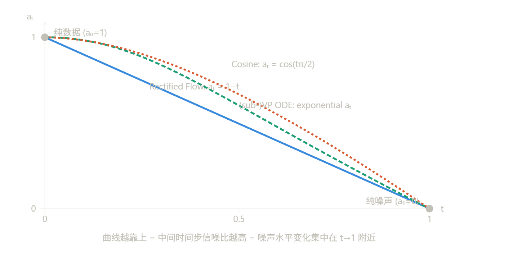
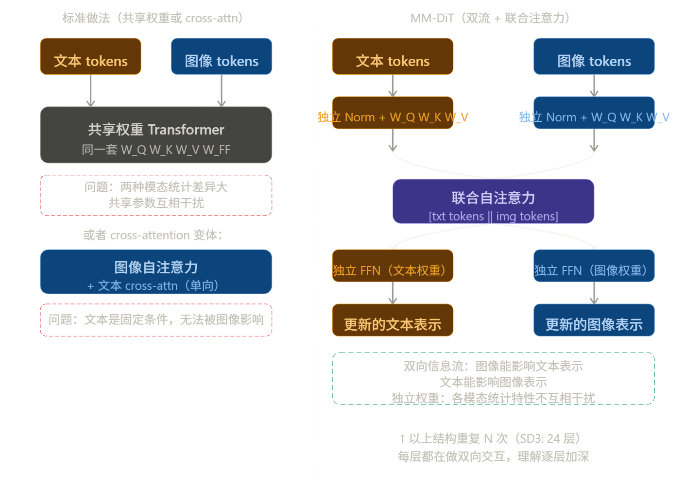

---
tags:
  - 流匹配
  - 蒸馏
---

# Stable Diffusion 3

> [!INFO] 文档信息
>
> 创建时间：2025-11-29 | 更新时间：2026-3-24
>
> 本文基于**[Scaling Rectified Flow Transformers for High-Resolution Image Synthesis](https://arxiv.org/abs/2403.03206)** 做笔记

这篇就是 **Stable Diffusion 3** 的技术报告，作者是 Stability AI 的团队（Robin Rombach 等人，就是做 LDM/SD 的那批人）。论文本身有两个相互独立的贡献，一个关于训练，一个关于架构。

------

## 贡献一：时间步采样

原始 Rectified Flow 训练时对 $t$ 做均匀采样 $t \sim \text{Uniform}[0,1]$，但这其实不合理。

问题在于：Rectified Flow 的线性插值 $z_t = t \cdot x_0 + (1-t) \cdot \epsilon$ 导致不同 $t$ 处的信噪比（SNR）分布高度不均匀。靠近 $t=0$（接近纯数据）和 $t=1$（接近纯噪声）的区域，梯度信号很弱，对学习贡献极小，但均匀采样仍然在这些区域浪费了大量计算。对感知质量最重要的是中间区域——噪声和信号混合的地方，恰好是人眼最敏感的频率尺度。

论文提出了 **Logit-Normal 时间步采样**，把均匀分布换成：

$$t \sim \text{Logit-Normal}(\mu, \sigma^2), \quad t = \sigma(m), \quad m \sim \mathcal{N}(\mu, \sigma^2)$$

效果是把训练时间步的采样密度集中偏移到感知上最重要的中间区域，$t=0.5$ 附近被过采样，两端被欠采样。论文还测试了几个变体（Mode Sampling with Heavy Tails、CosMap），结论是 Logit-Normal 在大规模实验中效果最稳定。

这个改动很小，但效果显著——本质是把"对所有时间步平等对待"改成"对感知重要的时间步多训练"。

------

## 贡献二：MM-DiT 架构

这是论文更重要的贡献，也是 SD3 和 FLUX 区别于之前所有模型的核心。

之前的文生图模型（包括 SD1/2、SDXL）处理文本的方式是：文本编码器输出一个固定的表示，通过 cross-attention 单向注入到图像 token 的处理流中。文本只能影响图像，图像不能影响文本表示。

MM-DiT（Multimodal Diffusion Transformer）的设计是给图像 token 和文本 token 各自维护**独立的权重流**，但在 attention 层让两个流的 token **拼接在一起做自注意力**：

```
图像 tokens: [img₁, img₂, ..., imgₙ]  ← 独立的 MLP/norm 权重
文本 tokens: [txt₁, txt₂, ..., txtₘ]  ← 独立的 MLP/norm 权重
                    ↓
          拼接后做 joint attention
          [img₁...imgₙ, txt₁...txtₘ]
                    ↓
          各自分流，继续各自的权重处理
```

这让信息流变成双向的——图像 token 可以"看到"文本 token，文本 token 也可以"看到"图像 token，并在整个网络深度上反复交互。结果是文本理解能力、排版准确性（typography）都大幅提升，这正是 SD3 相比 SDXL 最明显的改进点。

两个流用独立权重而非共享权重，是因为图像和文本的统计特性差异太大，强行共享参数会互相干扰。

------

**和原始 Rectified Flow 论文的关系**

SD3 这篇没有用到 Reflow 和蒸馏——那两个阶段在大规模文生图训练里计算成本太高，工程上不现实。它保留的是 Rectified Flow 的训练目标（Flow Matching），然后在上面做了两件事：修了时间步采样的缺陷，换掉了 U-Net 架构。所以与其说是"对 Rectified Flow 的改进"，不如说是"把 Rectified Flow 训练框架工程化落地到大规模文生图"。

定位上更接近技术报告——它描述的是"我们怎么把 Rectified Flow 做成一个真正能用的大规模文生图系统"，而不是提出一个新的理论框架。

整体思路可以用一句话概括：**系统性地排查了之前所有设计决策，逐一替换成更好的版本，然后把它们组合起来 scale up**。

------

## 整体思路

报告的结构本质上是一个分层的消融实验，从小到大依次验证每个组件：

**第一层**：在小规模实验里比较不同的 flow formulation（Rectified Flow vs EDM vs Cosine vs Linear），确认 RF + Logit-Normal 采样是最优组合。

**第二层**：在中等规模验证架构选择，比较 U-Net、UViT、DiT、MM-DiT，确认 MM-DiT 最好。

**第三层**：确定好基础组件之后，做 scaling study，验证模型大小从小到大（0.6B 到 8B）loss 是否平滑下降，以及 validation loss 是否和人类评估强相关。

这个思路继承自 DeepMind/OpenAI 的 scaling law 传统——先证明你的系统是可以预测地 scale 的，再花大计算量训最大的模型。

------

## 第一层消融

### 什么是 Flow Formulation

Flow formulation 指的是**如何定义从数据 $x_0 $ 到噪声 $\epsilon$ 的前向插值路径**，也就是选择 $a_t$ 和 $b_t$：

$$z_t = a_t x_0 + b_t \epsilon, \quad \epsilon \sim \mathcal{N}(0, I)$$

不同的 $(a_t, b_t)$ 选择就是不同的 formulation。边界条件固定：$t=0$ 时是纯数据（$a_0=1, b_0=0$），$t=1$ 时是纯噪声（$a_1=0, b_1=1$）。中间怎么走是可以自由选择的。

这个选择直接决定了**训练目标的形式**，以及**不同时间步的信噪比（SNR）分布**——哪些时间步"难"，哪些"简单"，计算资源怎么被分配。



报告对比了四种 formulation：

**Rectified Flow**：$a_t = 1-t,\ b_t = t$，线性插值，速度均匀，这就是原始论文的选择。

**EDM**：Karras et al. 2022 提出的 formulation，$a_t = 1,\ b_t = \sigma(t)$，噪声水平用一个特定的 $\sigma$ 曲线控制，本质上是 VE（variance-exploding）类型的路径。

**Cosine**：$a_t = \cos(t\pi/2),\ b_t = \sin(t\pi/2)$，保持 $a_t^2 + b_t^2 = 1$，是 improved DDPM 里引入的，噪声加得比较"温和"。

**LDM-Linear**：就是原始 Stable Diffusion 用的，VP 类型的线性 $\beta$ schedule，继承自 DDPM。

------

**关键问题：均匀采样 $t$ 为什么不够**

这四种 formulation 的核心差异不只是路径形状，更重要的是**各个时间步的 SNR 分布**。SNR 定义为 $a_t^2 / b_t^2$，代表在时间步 $t$ 处信号相对于噪声的强度。

对于 Rectified Flow 的线性插值，$t$ 均匀分布时，SNR 的分布其实是高度不均匀的——大量时间步落在"几乎全是噪声"或"几乎全是数据"的区域，这两个区域对于学习有效的速度场贡献极小。真正困难、信息量最大的区域是 SNR 处于中间值附近，对应感知上最关键的频率（全局结构已经确定，细节还在调整的阶段）。

均匀采样 $t$ 等价于对 SNR 做了一个隐式的非均匀采样，而这个非均匀性对不同 formulation 的影响不一样——这就是为什么直接比较四种 formulation 不公平，必须同时考虑时间步采样策略。

------

### Logit-Normal 采样

报告的核心观察是：不管用哪种 formulation，都可以通过改变 $t$ 的采样分布来重新分配训练计算量。Logit-Normal 的做法是：

$$m \sim \mathcal{N}(\mu, \sigma^2), \quad t = \text{sigmoid}(m) = \frac{1}{1+e^{-m}}$$

sigmoid 函数天然把实数轴上的正态分布映射到 $(0,1)$ 区间，并且在 $t=0.5$ 附近密度最高，两端密度低。调整 $\mu$ 和 $\sigma$ 可以控制峰值位置和扩散程度。

效果是：把训练时间步的密度**集中偏移到感知最敏感的中间区域**，让网络在这些时间步上见到更多样本、获得更强的梯度信号。

结论是：Rectified Flow + Logit-Normal 采样在大规模实验中稳定优于其他三种 formulation（包括用了各自最优采样策略的版本）。这就奠定了第一层的结论，然后第二层才在这个基础上比较架构。

------

### 什么是 SNR 

在插值路径 $z_t = a_t x_0 + b_t \epsilon$ 里，任意时间步 $t$ 处的状态由两部分叠加而成：数据信号 $a_t x_0$ 和噪声 $b_t \epsilon$。SNR 就是这两部分能量的比值：

$$\text{SNR}(t) = \frac{a_t^2}{b_t^2}$$

对 Rectified Flow 的线性路径 $a_t = 1-t,\ b_t = t$：

$$\text{SNR}(t) = \frac{(1-t)^2}{t^2}$$

$t=0$ 时 SNR $\to \infty$（纯数据），$t=1$ 时 SNR $= 0$（纯噪声），$t=0.5$ 时 SNR $= 1$（信号和噪声能量相等）。

------

**为什么中间时间步信息量最大**

现在来回答核心问题。

**极端情况先想清楚：**

在 $t \approx 0$（SNR 极高）时，$z_t \approx x_0$，几乎就是原始图像加了一点点噪声。此时网络的任务是预测 $v = x_1 - x_0 = \epsilon - x_0$，但 $z_t$ 本身已经把答案几乎直接告诉你了——信号太强，噪声扰动太弱，梯度信号极小，每次训练几乎学不到什么新东西。

在 $t \approx 1$（SNR 极低）时，$z_t \approx \epsilon$，几乎是纯噪声，数据信息几乎完全消失。网络输入和目标之间的关系极度模糊，训练信号同样很弱。

在 $t \approx 0.5$（SNR $\approx 1$）时，信号和噪声势均力敌。此时：

- $z_t$ 里还保留足够的数据信息，让网络能"感知"到应该往哪个方向走
- 但噪声又足够大，让这个判断非平凡——网络必须真正理解数据结构才能给出正确的速度方向

这个区域对应图像感知上的**中频信息**：全局布局已经确定，但边缘、纹理、细节还需要被恢复。人眼对这个频段最敏感，生成质量的好坏主要取决于网络在这个区域学得好不好。

------

**信息量的形式化理解**

可以用 Fisher 信息量来精确表述这个直觉。在时间步 $t$ 处，训练损失对参数的梯度方差大致正比于：

$$\text{gradient variance} \propto \frac{\text{SNR}(t)}{(1 + \text{SNR}(t))^2}$$

这个函数在 SNR $= 1$（即 $t = 0.5$）时取到最大值，两端趋近于零。

画出来就是一个倒 U 形——均匀采样 $t$ 时，大量训练步浪费在梯度接近零的两端，只有中间一小段区域在真正有效地更新参数。Logit-Normal 采样的作用就是把采样密度集中推向这个有效区域。

---

## 第二层消融

第二层消融是在确定了"Rectified Flow + Logit-Normal 采样"是最优训练配方之后，在这个基础上比较**不同的架构选择**。核心问题是：对于文生图任务，怎么让图像 token 和文本 token 交互最有效？

------

### 三种架构的演进脉络

报告比较了三种主要架构，理解它们最好按演进顺序来看。

**UViT / DiT：文本作为额外 token 拼接**

DiT（Peebles & Xie 2023）本来是为类别条件生成设计的，把图像 patch 展开成 token 序列，用标准 Transformer 处理，时间步和类别标签通过 adaLN（adaptive layer norm）注入。用于文生图时，最直接的改法是把文本 token 和图像 token 拼接在一起做自注意力——图像 token 能看到文本，文本 token 也能看到图像。

但问题是，文本和图像的统计特性差异很大，共用同一套权重（同一个 QKV 矩阵、同一个 FFN）意味着网络必须用同一组参数同时处理两种截然不同的模态。文本 token 的分布和图像 patch 的分布相差甚远，强行共享参数会让两个模态互相干扰，参数利用效率很低。

**MM-DiT：双流独立权重 + 联合注意力**

SD3 的核心架构贡献就是把这个问题解决了。MM-DiT 给图像和文本各自维护一套独立的权重，但在 attention 计算时把两个流的 token 拼在一起：核心设计逻辑是：**在 attention 层合流（让两个模态互相看到对方），在其他地方分流（各自用独立权重处理自己的模态）**。

合流发生在 attention 的 QKV 计算之后——文本的 Q/K/V 和图像的 Q/K/V 拼接在一起做 softmax，这样每个图像 token 可以 attend to 所有文本 token，每个文本 token 也可以 attend to 所有图像 token。这是真正的双向交互。

分流发生在 norm、projection 和 FFN——文本有自己的一套权重，图像有自己的一套权重，互不共享。这样每个模态的参数可以专门适配自己的统计特性，不会被另一个模态"污染"。



---

### 联合自注意力

联合自注意力就是字面意义上的拼接——把文本的 Q/K/V 和图像的 Q/K/V 在 sequence 维度上直接 cat，然后做一个大的 softmax。伪代码大概是：

```python
# 各自用独立权重投影
Q_txt, K_txt, V_txt = W_Q_txt(txt), W_K_txt(txt), W_V_txt(txt)
Q_img, K_img, V_img = W_Q_img(img), W_K_img(img), W_V_img(img)

# 在 sequence 维度拼接
Q = cat([Q_txt, Q_img], dim=seq)   # shape: (B, txt_len + img_len, d)
K = cat([K_txt, K_img], dim=seq)
V = cat([V_txt, V_img], dim=seq)

# 标准自注意力
out = softmax(Q @ K.T / sqrt(d)) @ V

# 拆回各自的 token
out_txt, out_img = out.split([txt_len, img_len], dim=seq)

# 各自用独立权重继续处理
txt = txt + W_O_txt(out_txt)
img = img + W_O_img(out_img)
```

然后 FFN、LayerNorm、输出投影全都是各自独立的权重，只有 attention 计算那一步是合在一起的。

------

**消融实验怎么比的**

报告在固定训练配方（RF + Logit-Normal）的条件下，用相同的数据和计算预算训练三种架构：

**UViT**：文本 token 和图像 token 拼接，全部共享权重，skip connection 连接浅层和深层。

**DiT + cross-attention**：图像 token 做自注意力，文本通过 cross-attention 单向注入，类似 SDXL 的做法。

**MM-DiT**：双流独立权重 + 联合自注意力，如上所述。

评估指标用的是 validation loss，以及 GenEval（文本-图像对齐评测）和人类偏好打分。结论是 MM-DiT 在相同参数量下 validation loss 更低，且这个 loss 差异和生成质量的差异强相关——文本理解、排版、空间关系这些维度提升最明显。

---

**参数量控制**

这个问题是消融实验有效性的关键，报告确实做了控制。具体策略是**固定总参数量，通过调整隐藏维度 $d$ 和层数来匹配**。

不同架构的参数量构成差异很大，这里是问题所在：

MM-DiT 因为有两套独立权重，在相同隐藏维度下参数量天然比单流 DiT 多——大约多出文本流那套权重的量。如果直接用相同维度比较，MM-DiT 参数量更大，赢了也没有说服力。

报告的做法是给 DiT 和 UViT 用更大的隐藏维度 $d$，让总参数量对齐，然后在相同 FLOP 预算下训练相同步数。这样比较的是"同等计算资源下哪种结构学得更好"。

结论是：即使参数量对齐之后，MM-DiT 的 validation loss 仍然更低。这说明优势来自**结构本身的归纳偏置**（双向信息流 + 模态专用权重），而不是参数量更多带来的容量优势。

> [!note]
>
> 文本 token 的序列长度远小于图像 token——比如文本 77 个 token，图像在 64×64 的 latent 下有 4096 个 patch token。拼接之后的 attention 矩阵是 $(77 + 4096)^2$ 大小，计算量主要还是被图像 token 主导。文本 token 数量相对很少，双流带来的额外参数量其实相当有限，这也是为什么这个设计在工程上可行——代价不大，收益却很明显。

------

**为什么双向交互这么重要**

用一个具体例子来理解：生成"一只红色的猫坐在蓝色的箱子上"。

单向 cross-attention 的情况下，文本编码器在图像生成开始之前就把文本压缩成了固定的向量，整个生成过程中文本表示不会变——无论图像生成到哪个阶段，文本都是同一个静态条件。

MM-DiT 的情况下，文本 token 的表示在每一层都会被当前的图像 token 状态影响。当图像某个区域已经生成了猫的形状，对应位置的图像 token 会通过 attention 影响文本 token 的表示，让"红色"这个属性在接下来的层里更强烈地关联到猫的位置而不是箱子的位置。属性和物体的绑定（attribute binding）问题在文生图里一直是难点，双向交互从机制上给了模型解决这个问题的能力。

---

## 第三层消融

第三层不是在比较"哪种设计更好"，而是在回答一个不同的问题：**这个系统能不能可预测地 scale？**

这是工业界在决定是否值得投入大规模训练计算之前必须回答的问题。如果 scaling 行为不可预测——比如 loss 在某个尺度突然停止下降，或者 loss 下降和生成质量不相关——那花大量计算训最大模型就是赌博。

------

具体验证了两件事

**第一：validation loss 随模型大小平滑下降**

报告训练了一系列不同参数量的 MM-DiT 模型（从几百 M 到 8B），在相同数据和训练步数下画出 loss 曲线。结论是 loss 随参数量的增加呈现出平滑的幂律下降，没有出现异常的平台期或突变，符合 Chinchilla 式的 scaling law 预期。

这个结论的含义是：如果你想要更低的 loss，继续加参数就行，不需要重新设计架构。

**第二：validation loss 和生成质量强相关**

这是更重要的验证。Loss 下降不代表图片好看——这在扩散模型领域一直是个问题，很多工作发现 loss 和 FID 或人类偏好的相关性很弱。

报告系统地测量了不同规模模型的 validation loss，同时用 GenEval（文本对齐）、T2I-CompBench（组合推理）和人类偏好打分评估生成质量，发现两者之间有很强的正相关。loss 每下降一定幅度，各项评测指标都稳定提升。

这个结论的含义是：validation loss 可以作为可靠的代理指标，不需要每次都跑昂贵的人类评估来判断模型是否在进步。

------

**这一层的工程意义**

前两层消融确定了"用什么"，第三层确定了"值得投入多少"。有了可预测的 scaling 曲线，团队可以在训练 8B 模型之前就用小模型的 loss 外推出大模型的预期表现，从而做出是否继续 scale 的决策——这是大规模训练里非常实际的工程需求，也是这篇报告能说服人的地方。

---

## 工程细节

**文本编码器的组合**：SD3 同时使用了三个文本编码器——CLIP ViT-L、OpenCLIP ViT-bigG、T5-XXL，把它们的输出拼接起来送入模型。CLIP 系列负责语义对齐，T5 负责处理复杂的长文本描述和排版指令。之前的 SD 系列只用 CLIP，T5 的加入是文字生成能力大幅提升的关键原因之一。

**VAE 的升级**：潜空间从 SD1/2 的 4 通道升级到 16 通道。这个改动直接提升了高分辨率图像的细节还原能力，因为更多通道意味着 VAE 能编码更多高频信息，而不是在压缩时丢掉细节。

**高分辨率微调的工程问题**：预训练在 256px 进行，然后微调到 1024px 及多宽高比。这里有两个具体的技术处理——QK-Normalization（在 attention 的 Q 和 K 上加 RMSNorm，防止高分辨率下 attention logit 数值爆炸）；以及针对分辨率的时间步偏移（高分辨率图像包含更多低频结构，需要在更高的噪声水平下训练才能学到全局布局，所以把时间步分布整体向高噪声端偏移）。

**数据处理**：用重新标注的合成 caption 替换原始 alt-text，训练了一个专门的图像描述模型来生成高质量的文本标注。这个方向其实是从 DALL-E 3 的技术报告学来的，但 SD3 做了大规模的系统性验证。

------

所以整体来看，这篇报告的创新密度在架构（MM-DiT）和训练配方（Logit-Normal）上最高，其余的更多是工程最佳实践的系统化整理。它的价值不在于某个单点突破，而在于证明了"Rectified Flow + 正确的工程决策"可以在 8B 参数规模上超过 DALL-E 3，把这套训练范式确立为新的工业标准。

