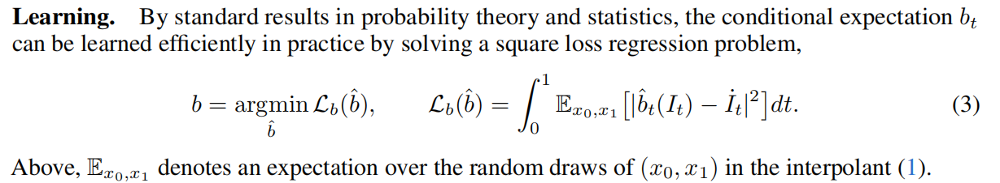
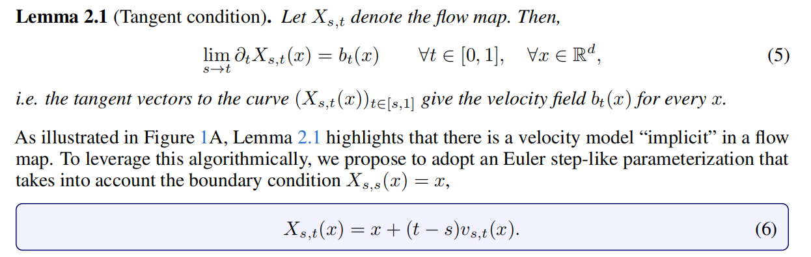

---
tags:
  - 蒸馏
  - 一致性模型

---

# **Learnig Flow Map via Self Distillation**

> [!info]
>
> 创建时间：2025-12-20 | 更新时间：2025-12-20
>
> 本文基于**[How to build a consistency model: Learning flow maps via self-distillation](https://arxiv.org/abs/2505.18825)** 做笔记

配图来自[Aligning Your Flow](https://arxiv.org/pdf/2506.14603)	

## 引言

传统的一致性模型学习的是，给定任意一个时间步 t ，以及对应隐状态 $z_t$ ，学习一个**流映射（Flow Map）**将他映射到0时刻的状态。其约束为，从不同的时间步开始映射，最后的结果应该是一样的，都是同一个干净图片，或者说x0。对应的损失就是不同时刻预测结果的MSE，还有一个预测结果和真实数据分布的回归损失，防止模型只学习到了0映射之类的无效映射，满足预测结果一样，但是图片无意义。

在Aligning Your Flow，以及轨迹一致性蒸馏，Mean Flow等文章中都意识到，规定映射的终点定死为 t = 0 时刻是有问题的，Aligning Your Flow 中直接从数学上证明了这样训练的模型，本身存在缺陷，只适合单步或者两步采样，多步采样的质量反而会下降。所以大家都选择了修改流映射的终点为自定义的一个时间步。引用本文的符号，我们规定Flow Map
$$
X_{s,t}(x_s) = x_t
$$
也就是输入两个时间步 s,t 和 s 时刻对应的隐状态 $x_s$ ，流映射能够给出对应 t 时刻的隐状态 $x_t$ （可以参考上图，注意上图是从 t 映射到 s ），并且施加了比一致性模型更强的约束，也就是不仅映射到 0 时刻的结果是一样，任意给定一个 t ，映射到t时刻的结果都是一样的。这个直观上也好理解，流已经确定的情况下，在没有离散化采样误差的情况下，t 时刻的隐状态就应该是确定的，从在此之前的任意时刻开始映射到 t ，结果都不应该改变。

基于这个想法，不同论文提出了不同的训练目标，对应本文提到的三个数学上等价的损失。

-  Meanflow 学习一个平均速度场，$v_{s,t}$ 对应 s 时刻到 t 时刻的平均速度，实现一步去噪，其实就是 s 到 t 的映射，约束为 s 等于 t 的时候变为瞬时速度
- TCD 轨迹一致性蒸馏，约束为 $\partial_{s}X_{s,t}(\cdot)$ 映射结果与 s 无关，不管从同一个流哪个时刻的隐状态开始映射，结果只和目标时刻有关
- Progressive 渐进式蒸馏，$X_{s,t}(x_s) = X_{u,t}(X_{s,u}(x_s))$ 约束为一步去噪和多步去噪结果一致。

## 主要贡献

提出了一种通用的自蒸馏框架，将不同学习目标的流映射统一起来

## 数学推导

首先约定文中的符号，$I_t,b_t$ 分别表示 t 时刻概率分布采样和流的速度场

然后给出了一个 $\mathcal{L}_b$ 回归项，其实就是条件流匹配的损失，given $x_0,x_1$ 得到条件速度场，通过聚合条件速度场得到边缘速度场

> [!note]
>
> 作者似乎是认为，在真实数据充分的时候，使用这个作为回归项就可以计算，没必要使用教师模型（来进行分数匹配等操作），但是我觉得这还是有问题的。
>
> 一方面，实际中我们有时没法获取到真正的数据，而一个训练好的教师模型本身就是一种资产，这在Dream Diffusion中已经讨论过，可以认为教师的生成分布近似学习到了真实的数据分布，可以通过教师采样来获得数据。这个回归项本身是绕不开真实数据的获取的。
>
> 另一方面，这样训练需要多次前向采样，而且反向传播的时候要构建巨大的计算图，这在计算难度和显存开销上都是大大高于用教师模型直接估计边缘速度场的

然后给出了全文关键的 **流映射（Flow Map）**定义

 

也就是之前提到的，给定时间步 s,t 和s 时刻隐状态 $x_s$ 可以映射到目标时间步 $x_t$

这里给出了在这个约束下，平均速度和瞬时速度场的关系，但是写的很恶心啊

> [!note]
>
> 首先注意，这个 x 指的都是 $x_s$ ，即 s 时刻的起始隐状态，那么左边指的是，这个点映射到 t 时刻后，对于 t 求偏导，那么很好理解，就是 $\dot x_t$ ，t 时刻的瞬时速度。而右边 这个 $b_t$ 的 t 都不算个参数，实际求的是 $b_t(x_s) = \dot x_s$ 也就是 s 时刻的瞬时速度。这个符号混用给我二心坏了

下面定义了一个平均速度 $v_{s,t}$ 表示从 s 时刻到 t 时刻平均速度，这个到没什么疑问

然后给出了一个约束，即 s 趋向于 t 的时候，瞬时速度和平均速度相等，这也比较好理解

## **三个等价条件**

这篇文章的关键在于，他为这种流映射提出了三个等价的条件

### **拉格朗日条件**

条件一，对应Mean Flow的约束。就是当我们在训练这个平均速度场的时候，我们必须满足当两个时间步相等的时候，平均速度和这个地方给出的边际速度场一致

---

### **欧拉条件**

这篇论文中的公式 (9) 其实是流体力学和输运理论中非常经典的**“输运方程”（Transport Equation）**或者叫**“平流方程”（Advection Equation）**。对应轨迹一致性蒸馏的约束。

推导它的核心逻辑在于理解 **Flow Map $X_{s,t}(x)$ 的“守恒性”**。

- $x$ 是 $s$ 时刻的位置。
- $X_{s,t}(x)$ 是从 $s$ 时刻的位置 $x$ 出发，顺着流场走到 $t$ 时刻的位置（即“终点”）。
- $v_{s,s}(x)$ （或者简写为 $v_s(x)$）是 $s$ 时刻在位置 $x$ 的瞬时速度。
- 核心思想：终点不变

想象你是一个粒子，你在时间 $s$ 处于位置 $x$。

如果你顺着流场移动了一点点时间 $\Delta s$，到达了新的时间 $s + \Delta s$ 和新的位置 $x + \Delta x$。

但是，无论你是在 $s$ 时刻还是在 $s+\Delta s$ 时刻，你最终在 $t$ 时刻到达的“终点”应该是同一个（假设 $t$ 是固定的）。

也就是说，**沿着粒子的轨迹，$X_{s,t}(x)$ 的值是不随 $s$ 变化的常数。**

这意味着 $X_{s,t}(x(s))$ 对时间 $s$ 的**全导数（Total Derivative）**为 0：

$$\frac{d}{ds} X_{s,t}(x(s)) = 0$$

根据链式法则（Chain Rule），我们可以把这个全导数拆开：

$$\underbrace{\frac{\partial X_{s,t}(x)}{\partial s}}_{\text{偏导项}} + \underbrace{\nabla_x X_{s,t}(x) \cdot \frac{dx}{ds}}_{\text{对位置的导数 } \times \text{ 速度}} = 0$$

- 第一项 $\partial_s X_{s,t}(x)$：这就是公式里的第一项。
- 第二项里的 $\frac{dx}{ds}$：这就是粒子在 $s$ 时刻的速度，即 $v_{s,s}(x)$。

代入后得到：

$$\partial_s X_{s,t}(x) + \nabla X_{s,t}(x) v_{s,s}(x) = 0$$

这就是公式 (9)。

---

## 半群条件

对应渐进式蒸馏的约束，这个也比较好理解，就是一步映射和选一个中间点映射两次，结果是相同的

---

### 损失函数

于是我们可以得到Self Distillation的损失函数，包含一个回归项和三个等价条件之一的损失函数