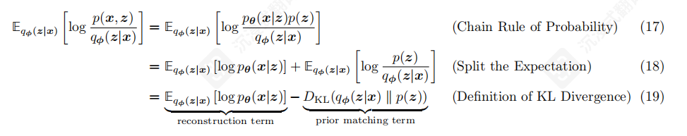
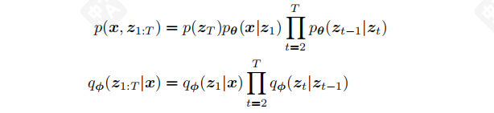
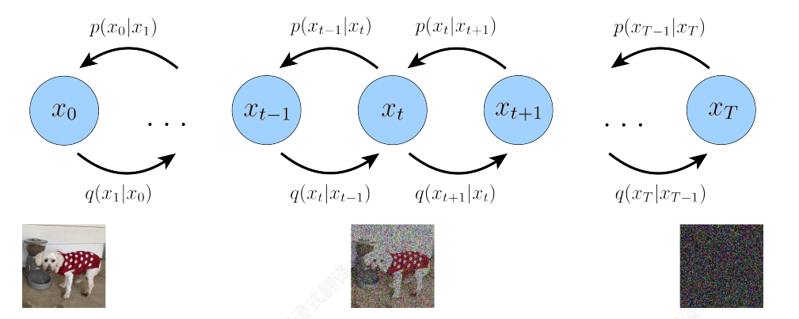
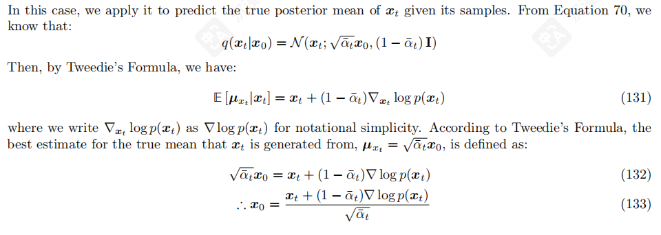

---
tags:
  - 扩散模型
  - ELBO
  - VAE
---

# [Diffusion] Understanding Diffusion Models: A Unified Perspective

> [!INFO] 文档信息
>
> 创建时间：2025-12-4 | 更新时间：2025-12-8
>
> 本文基于**[Understanding Diffusion Models: A Unified Perspective](https://arxiv.org/abs/2208.11970v1)** 做笔记

## **主要贡献**

这篇论文从编码器，解码器的统一视角分析了ELBO,VAE,Diffusion Model。将Diffusion前向扩散和反向去噪的过程也定义为编码器和解码器，Diffusion Model本身就变成了一个层层嵌套的VAE

## **洞穴寓言**

对于许多模态，我们可以将我们观察到的数据视为由一个相关的未观察到的**潜在**变量表示或生成，我们可以用随机变量 **z**来表示。表达这个想法的最佳直觉是通过柏拉图的洞穴寓言。在寓言中，一群人被锁在洞穴里一生，只能看到投射在他们面前的墙上的二维阴影，这些阴影是由未看到的三维对象在火前经过时产生的。对于这样的人来说，他们所观察到的一切实际上是由他们永远无法感知的更高维度的抽象概念决定的。

类似地，我们在现实世界中遇到的物体也可能作为某些高层表示的函数而生成的；例如，这些表示可能封装颜色、大小、形状等抽象属性。那么，我们所观察到的可以解释为这些抽象概念的三个维度投影或实例化，

就像洞穴里的人所观察到的实际上是三维物体的二维投影一样。虽然洞穴里的人永远无法看到（甚至完全理解）隐藏的物体，但他们仍然可以推理并推断出关于它们的信息；以类似的方式，我们可以近似描述我们观察到的数据的潜在表示。

尽管柏拉图的洞穴寓言说明了潜变量的思想，即它们是潜在的不可观测的表示，决定了观察结果，但这个类比的一个注意事项是，在生成建模中，我们通常寻求**学习低维潜表示，而不是高维表示**。这是因为如果没有强有力的先验分布，试图学习比观察更高的维度的表示是一项徒劳的努力。另一方面，学习低维潜变量也可以被视为一种压缩形式，并且有可能揭示描述观察结果的语义上有意义的结构。

## **ELBO**

**E**vidence **L**ower **Bo**und (ELBO) 证据下界是一个用于学习潜在变量后验分布的等价项。

首先，我们希望学习一个 p(x) ，是对真实数据分布的一个最大化似然，然后建模一个联合分布 p(x,z) 表示我们观察到低维特征以及其潜在变量，即高维表示的联合分布。于是我们可以通过这个联合分布来**边缘化**得出潜在变量z
$$
p(x) = \int p(x, z) \, dz
$$
使用概率链式法则，得到
$$
p(x) = \frac{p(x, z)}{p(z|x)}
$$
想要计算和最大化p(x) 是困难的，要么涉及积分，但是潜在变量的分布是不可知的，要不涉及后验分布，或者说是从x到潜在变量z的编码器 p(z|x) ，于是我们可以引入ELBO来等价计算

形式上，ELBO写作

$$
\mathbb{E}_{q_\phi(z|x)} \left[ \log \frac{p(x, z)}{q_\phi(z|x)} \right]
$$

其中 $q_{\phi}$ 是我们设定的近似后验分布 

 观察这个推导过程，是将最大似然放入潜在变量z的分布中计算，然后引入一个我们设定的近似后验分布 $q_{\phi}$ ,分出了一个非负的KL散度项和ELBO项。这非常合理，因为我们希望我们设定的近似后验分布尽可能接近我们无法访问的真实后验分布。而这等价于最小化二者KL散度。

注意p(x)与参数 $\phi$ 无关，也就是说右边二者之和为定值。所以最大化右侧的ELBO就等价于最小化KL散度。因此，ELBO可以作为学习如何完美建模真实潜在变量后验分布的等价项。

那么我们为什么要学习潜在变量的后验分布呢？

观察这个图，我们就可以意识到，这个后验分布其实是从低维分布x到潜在变量z的编码器。相对的，x的后验分布就是从潜在变量z到低维变量x的解码器。这样对于低维变量先编码再解码的过程就叫做**变分自编码器（VAE）**，因为我们引入了一个近似分布q来代替真实的后验分布，所以这种方法被成为变分的。

## **VAE**

进一步分析ELBO项，我们可以将他拆分为重建项和先验匹配项

前者是从我们的变分分布中重建的似然，后者是我们的变分分布和潜变量分布的KL散度，鼓励模型的变分分布是学习一个真实的分布而不是塌缩成狄拉克函数。

VAE的一个关键特征是ELBO如何联合优化参数 **φ** 和 **θ**。VAE的编码器通常被选择为建模具有对角协方差

的多元高斯分布，而先验通常被选择为标准多元高斯分布：

然后，ELBO的KL散度项可以解析计算，重建项可以使用蒙特卡洛估计来近似。然后，我们的目标函数可以重写

为：

> [!note]
>
> 
>
> 这段说的是直接随机采样的话没法微分，把采样过程等价写作关于均值和方差的函数，才能微分。

## **HVAE**

Hierarchical Variational Autoencoder (HVAE) 分层变分自编码器，也叫递归变分自动编码器，顾名思义就是把VAE分层叠加，就是把潜在变量解释为更深一层的潜在潜在变量。。。

在HVAE中，我们主要关注Markovian HVAE (MHVAE) 马尔科夫链的情况，主要是为了之后的Diffusion来准备。马尔可夫的意思就是这一层潜在变量之后的状态仅跟这一层潜变量有关，和上一层以及之前的都无关。

所以我们就可以把总的编码器看作每个编码器相乘，总的解码器看成每个解码器相乘（因为他们是独立的？）

得到HVAE的联合分布和后验分布表示为：

ELBO项也变为：

也就是把潜变量的地方换成多层的潜变量而已。

> [!note]
>
> 将刚才的联合分布和联合后验分布带入
>
> 
>
> 这么写可以看到是把每层的编码器解码器对齐了，等会推Diffusion的时候会用到

## **Variational Diffusion Models**

### **ELBO in Diffusion**

终于来到了欢乐的Diffusion时间

做一些符号滥用，我们把潜在变量 $z_{1:T}$ 写作 $x_{1:T}$ 

那么联合分布写作：

>[!note]
>
>变分编码器
>
>
>
>Diffusion前向扩散公式
>
>

熟知扩散模型的加噪过程（不熟知的自己查查，之后再补这个笔记ovo），发现他和我们的变分编码器其实是同一个模式

Diffusion的前向扩散示意图：

对于Diffusion的ELBO，我们有两种解释，先看编码器和解码器错开的：

这个公式推导看着很恐怖，其实就是上一张最后的联合分布，但是把编码器和解码器错开来计算KL散度。43到44用了一下马尔可夫的性质。

可以看到分成了三项，第一项是重建的似然，可以跟之前一样训练。

第二个是最后一个VAE的先验匹配，不用管，因为没有参数训练，而且T够大的时候二者都为高斯分布，所以这一项实际上是0

最后一项是解码器和编码器的KL散度，也就是说我们希望前一项加噪和后一项去噪的过程相同。我也不知道为啥要这么干，而且这样有一个缺点就是计算KL散度的时候用了三层隐状态，方差比较大。

因此，来到了我们熟悉的经典Diffusion

> [!note]
>
> 
>
> 利用马尔可夫的性质，可以把转换重写为以上形式。上下同乘 $q(x_0)$ 就能发现是两个后验的转换。实际上不加x0这一项也能推公式，感觉是和之后的跳跃的推导联系起来。

于是我们可以重新对ELBO进行推导

这一部分就是改写之后把解码器编码器对齐，然后把 given $x_{t-1}$ 的后验转化为 given $x_t$ 的后验

代入相消之后我们得到三个项

第一项是重建项，通过蒙特卡洛进行计算和优化

第二项是先验匹配，同样无法训练且按假设为0

第三项就是后验分布和我们变分的后验分布的KL散度，这样一看优化目标就非常明确，就是让我们的近似后验分布接近真实的后验分布。

主要优化的还是第三项，这样最小化ELBO等价于优化KL散度之和

### **最小化KL散度**

> [!note]
>
> 
>
> 先引入一下Diffusion的一步加噪。指的是通过重参数化，Diffusion的前向扩散公式有一个很好的性质，就是可以把多步加噪整合为一步加噪。

去噪过程推导：

这个不是很用管，结论就是去噪过程也是符合高斯分布的，而且可以用参数来表示均值与方差。

于是我们就得到了真实的后验分布，可以用神经网络的近似分布拟合他。还有一个问题就是，这个真实后验是包含参数 $x_0$的，也就是包含去噪结果的干净图像，这个是我们不知道的。

所以让我们的近似后验分布和他的KL散度接近，就是让两个高斯分布的均值和方差分别相等。这里我们直接设置两者方差相等。因为这个方差是我们调度器参数决定的，不包含任何要训练的参数。那么让均值相等，其中 $x_t$ 是给定隐状态，所以我们只要预测 $x_0$ 就行。

因此，优化VDM归结为学习一个神经网络，以从任意噪声化的原始真实图像版本中预测原始真实图像。

> [!TIP] JIT   
>
> 最近刷视频经常看到什么吹JIT推翻了现在的扩散模型啊，推翻重来啊，意识到直接预测原始图像而不是预测每一步去噪的噪声才是正解。实际上这是非常简单第一直觉的想法，大家又不是没这么做过，只能说这么做效果不好，才改为预测噪声。他们做出来只能说工程上成功了，或者说有什么新的trick，反正并非什么推翻DIffusion的开山之作。
>

###  **三种等价解释**

三种等价预测，即直接预测原始图片，预测噪声和预测分数。预测原始图片的推导刚刚已经给出，根据Diffusion的一步加噪，我们不难得出预测加噪的噪声和预测原始图片只要稍作变换即可

一步加噪的公式：

对应均值的推导：

相应优化问题变为：

另一种等价解释是预测分数，即似然函数对x求梯度

> [!note]
>
> 引理：
>
> Tweedie 公式给出了给定变量z下，其均值和似然分数的关系
>
> 

代入我们的加噪的均值，我们可以得到初始图片和分数的关系

其实从这里和一步加噪的公式对比，也可以得到分数和噪声其实只差了常数倍

总之预测三者都是相等的，但是经验上预测分数和噪声效果会好

> TODO: 这篇论文后面还包括了一些Score-Based 生成模型，但是看的不是很懂

