---
tags:
  - 扩散模型
  - ELBO
  - VAE
---

# ELBO,VAE,Diffusion

> [!INFO] 文档信息
>
> 创建时间：2025-12-4 | 更新时间：2026-3-22
>
> 原文链接**[Understanding Diffusion Models: A Unified Perspective](https://arxiv.org/abs/2208.11970v1)** 

论文的逻辑是一条清晰的"从简单到复杂"的推进链：

**ELBO → VAE → Hierarchical VAE → Variational Diffusion Model → Score-based Model → Guidance**

每一步都是对上一步的自然延伸。扩散模型在这个视角下，其实就是一个加了三个特殊约束的分层 VAE，而不是凭空冒出来的新东西。

## 主要内容

**ELBO 与 VAE**：从最基础的变分推断出发，推导 Evidence Lower Bound，再引出 VAE 的编码器/解码器结构和重参数化技巧。这是整篇论文的地基。

**Hierarchical VAE**：把 VAE 堆叠成多层，引入马尔科夫假设，得到 MHVAE。这是扩散模型的直接前身。

**Variational Diffusion Models**：在 MHVAE 上加三条约束——潜变量维度等于数据维度、编码器固定为线性高斯、最终分布收敛到标准高斯——就得到了扩散模型。论文随后导出了三种等价的训练目标：预测 x₀、预测噪声 ε、预测 score function。

**Score-based Models**：解释 score function 的几何含义（数据空间中指向高概率方向的向量场），以及 Langevin dynamics 采样，并与 VDM 建立显式对应。

**Guidance**：介绍 Classifier Guidance 和 Classifier-Free Guidance，说明如何在生成时引入条件控制。

## **洞穴寓言**

对于许多模态，我们可以将我们观察到的数据视为由一个相关的未观察到的**潜在**变量表示或生成，我们可以用随机变量 **z**来表示。表达这个想法的最佳直觉是通过柏拉图的洞穴寓言。在寓言中，一群人被锁在洞穴里一生，只能看到投射在他们面前的墙上的二维阴影，这些阴影是由未看到的三维对象在火前经过时产生的。对于这样的人来说，他们所观察到的一切实际上是由他们永远无法感知的更高维度的抽象概念决定的。

类似地，我们在现实世界中遇到的物体也可能作为某些高层表示的函数而生成的；例如，这些表示可能封装颜色、大小、形状等抽象属性。那么，我们所观察到的可以解释为这些抽象概念的三个维度投影或实例化，

就像洞穴里的人所观察到的实际上是三维物体的二维投影一样。虽然洞穴里的人永远无法看到（甚至完全理解）隐藏的物体，但他们仍然可以推理并推断出关于它们的信息；以类似的方式，我们可以近似描述我们观察到的数据的潜在表示。

尽管柏拉图的洞穴寓言说明了潜变量的思想，即它们是潜在的不可观测的表示，决定了观察结果，但这个类比的一个注意事项是，在生成建模中，我们通常寻求**学习低维潜表示，而不是高维表示**。这是因为如果没有强有力的先验分布，试图学习比观察更高的维度的表示是一项徒劳的努力。另一方面，学习低维潜变量也可以被视为一种压缩形式，并且有可能揭示描述观察结果的语义上有意义的结构。

## **ELBO**

我们从最基础的问题出发，一步步建立直觉，再引入数学。

### 为什么需要 ELBO？

生成模型的核心目标是：**学习数据的分布 p(x)**，这样就能从中采样出新数据。

最直接的方法是最大化**似然函数**：给定训练数据，调整模型参数使 p(x) 尽可能大。但问题是，我们假设数据背后有一个隐变量 z（比如图片背后有"风格""内容"等抽象概念），于是：

$$p(x) = \int p(x, z), dz$$

这个积分在高维空间里**完全无法计算**——z 的可能取值是无限的。

ELBO 就是为了解决这个问题而生的：**用一个可计算的下界来代替无法直接优化的 p(x)**。

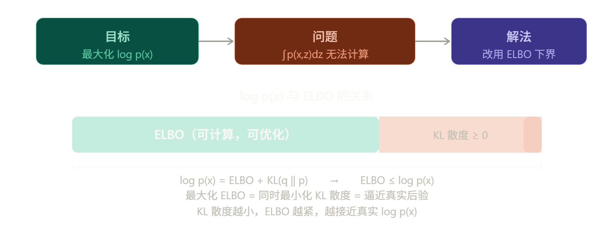

### 引入近似后验

既然真实后验 p(z|x) 无法计算，我们就**用一个可以调节的分布 q(z|x) 来近似它**。

可以把 q(z|x) 理解为：给定观测到的 x，猜测隐变量 z 的分布。我们希望这个"猜测"尽量接近真实的 p(z|x)。

------

### 完整的数学推导

现在来推导 ELBO。出发点只有一行：

$$\log p(x)$$

**第一步**：乘以 1（恒等变换）
$$
\log p(x) = \log p(x) \cdot \int q(z|x)dz = \int q(z|x) \log p(x)dz = \mathbb{E}_{q(z|x)}[\log p(x)]
$$
**第二步**：用链式法则拆开 p(x)

因为 $p(x) = \frac{p(x,z)}{p(z|x)}$，代入：

$$= \mathbb{E}_{q(z|x)}\left[\log \frac{p(x,z)}{p(z|x)}\right]$$

**第三步**：乘以 1，凑出 q(z|x)
$$
= \mathbb{E}_{q(z|x)}\left[\log \frac{p(x,z)\cdot q(z|x)}{p(z|x)\cdot q(z|x)}\right]
$$
**第四步**：拆开期望

$$= \mathbb{E}_{q(z|x)}\left[\log \frac{p(x,z)}{q(z|x)}\right] + \mathbb{E}_{q(z|x)}\left[\log \frac{q(z|x)}{p(z|x)}\right]$$

**第五步**：认出 KL 散度

第二项正是 KL 散度的定义 $D_{KL}(q(z|x) \| p(z|x)) $，因此：

$$\boxed{\log p(x) = \underbrace{\mathbb{E}_{q(z|x)}\left[\log \frac{p(x,z)}{q(z|x)}\right]}_{\text{ELBO}} + \underbrace{D_{KL}(q(z|x) \| p(z|x))}_{\geq\, 0}}$$

由于 KL 散度永远 ≥ 0，所以 **ELBO ≤ log p(x)**，是一个真正的下界。

------

**ELBO 还可以进一步拆解**

用链式法则把 p(x,z) = p(x|z)·p(z) 代入 ELBO：

$$\text{ELBO} = \mathbb{E}_{q(z|x)}\left[\log \frac{p(x|z)\cdot p(z)}{q(z|x)}\right] = \underbrace{\mathbb{E}_{q(z|x)}[\log p(x|z)]}_{\text{重建项}} - \underbrace{D_{KL}(q(z|x) \| p(z))}_{\text{正则项}}$$

**为什么最大化 ELBO 有意义？**

回到这个等式：

$$\log p(x) = \text{ELBO} + D_{KL}(q(z|x) | p(z|x))$$

注意左边 $\log p(x)$ 对于参数 φ 来说是**常数**（它不依赖 q 的参数）。所以：

- 当我们最大化 ELBO 时，KL 项必然同步减小
- KL 减小意味着 q(z|x) 越来越接近真实后验 p(z|x)
- 这正是我们的目标：用 q 逼近无法直接计算的 p(z|x)

这是 ELBO 最精妙的地方——**优化一个可计算的下界，自动完成了对无法直接优化的后验的逼近**。

## **VAE**

ELBO 告诉我们需要两样东西：

- 一个 **q(z|x)**：给定 x，猜 z 的分布（编码器）
- 一个 **p(x|z)**：给定 z，还原 x（解码器）

VAE 的做法是：**用两个神经网络分别实现这两个分布**。

### 编码器的具体形式

VAE 选择让编码器输出一个**对角高斯分布**：

$$q_\phi(z|x) = \mathcal{N}(z;, \mu_\phi(x),, \sigma^2_\phi(x) I)$$

神经网络接收 x，输出两个向量：均值 $\mu_\phi(x)$ 和方差 $\sigma^2_\phi(x)$。这样 z 的分布就完全由这两个向量决定。

先验选择标准高斯：$p(z) = \mathcal{N}(0, I)$

------

### 重参数化

有了编码器输出的 μ 和 σ，我们需要**从 q(z|x) 中采样出 z**，再送进解码器。

但采样操作是随机的，**无法对它求导**，梯度无法反向传播到编码器。训练就卡住了。

任意高斯分布的采样，都可以改写成：

$$z \sim \mathcal{N}(\mu, \sigma^2 I) \quad\Longleftrightarrow\quad z = \mu_\phi(x) + \sigma_\phi(x) \odot \varepsilon, \quad \varepsilon \sim \mathcal{N}(0, I)$$

这样 z 就变成了 μ 和 σ 的**确定性函数**，梯度可以顺利流回编码器。

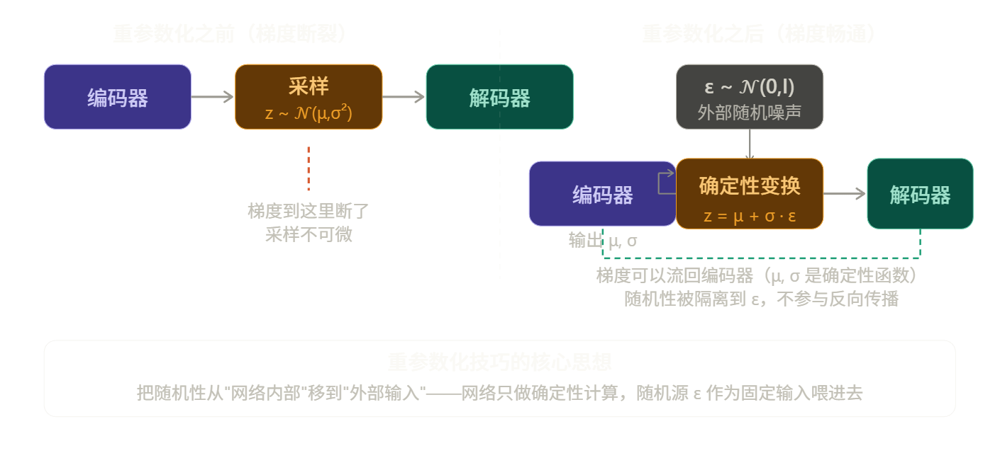

------

### 完整训练目标

把两项分别写清楚：

$$\mathcal{L}(\phi, \theta) = \underbrace{\mathbb{E}_{q\phi(z|x)}[\log p_\theta(x|z)]}_{\text{重建项}} - \underbrace{D_{KL}(q_\phi(z|x) || p(z))}_{\text{正则项}}$$

**重建项**：用 Monte Carlo 估计——采样一个 z，算解码器输出 x̂ 有多接近 x。

**正则项**：两个高斯的 KL 散度有解析公式，对于 $q = \mathcal{N}(\mu, \sigma^2 I)$，$p = \mathcal{N}(0, I)$：

$$D_{KL}(q | p) = \frac{1}{2}\sum_{j=1}^{d}\left(\mu_j^2 + \sigma_j^2 - \ln\sigma_j^2 - 1\right)$$

不需要采样，可以直接计算，非常高效。

------

### VAE 的完整训练流程

把所有环节串起来，VAE 的一次训练步骤是：

**前向**：x → 编码器 → (μ, σ) → 采样 ε，计算 z = μ + σ⊙ε → 解码器 → x̂

**损失**：

- 重建损失：x̂ 与 x 的差距（均方误差或交叉熵）
- KL 损失：$\frac{1}{2}\sum(\mu^2 + \sigma^2 - \ln\sigma^2 - 1)$，直接解析计算

**反向**：梯度通过解码器 → z → μ 和 σ → 编码器，全程可导

**生成时**：直接从 $\mathcal{N}(0,I)$ 采样 z，送进解码器，得到新图像。

---

### VAE 不是"无损编码"

普通自编码器（AE）的目标是无损重建——尽可能把 x 压缩成 z 再还原回来。

VAE 的目标不同：它通过 KL 正则项**主动牺牲了一部分重建精度**，换来一个结构良好的隐空间。

这个区别至关重要：

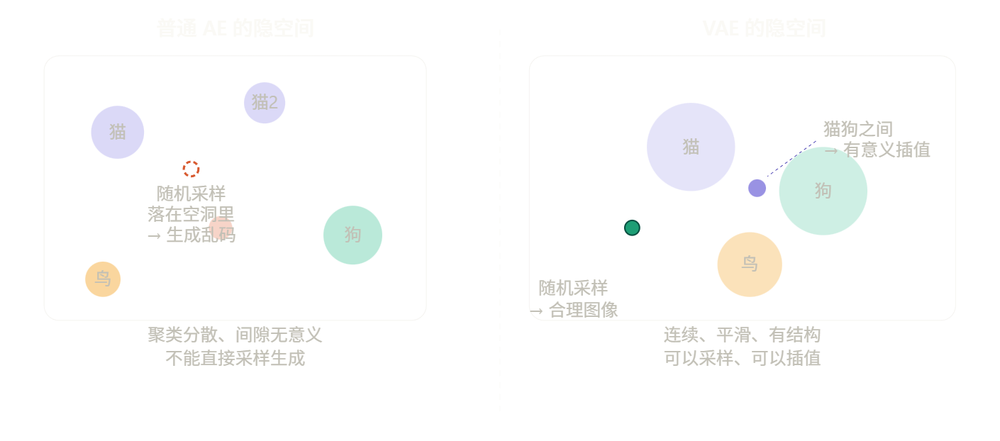

### VAE 的作用

**1. 生成新数据**

训练完后，不需要任何输入，直接从先验 $\mathcal{N}(0,I)$ 采样 z，送进解码器，就能生成全新的、从未出现过的数据。这是 VAE 作为生成模型的核心价值。

**2. 隐空间插值与编辑**

因为隐空间是连续的，两个点之间的中点也对应有意义的图像。比如取"猫"的 z₁ 和"狗"的 z₂，计算 $z = 0.5z_1 + 0.5z_2$，解码出来会是介于猫和狗之间的图像。这让 VAE 成为图像编辑、风格迁移的工具。

**3. 学习压缩表示**

编码器学到的 z 是对 x 的高度压缩摘要，可以作为下游任务（分类、检索、异常检测）的特征。

------

### VAE 的固有缺陷

正是因为 KL 正则项的存在，VAE 的重建图像往往**模糊**。

原因很直接：编码器输出的是一个分布而非一个点，解码器拿到的 z 每次都不一样，为了对所有可能的 z 都重建得不太差，解码器会取"平均"——这个平均表现在图像上就是模糊。

这个缺陷直接催生了更强大的模型：

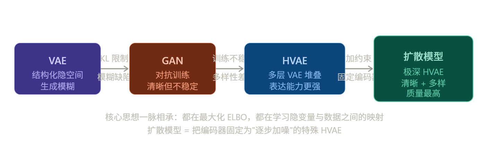

> VAE 是一个用 ELBO 作为训练目标、以结构化隐空间为核心产物的生成模型。它的价值不在于无损重建，而在于学到一个**可采样、可插值、有语义结构**的隐空间。代价是生成图像偏模糊。

这个"模糊"问题，正是扩散模型想要解决的——它把 VAE 的思路推广到"无穷多层"，每层只做一点点去噪，最终生成极高质量的图像。

## **HVAE**

### 为什么需要 HVAE？

VAE 只有一层隐变量 z。现实中的数据往往有**多层抽象结构**：

比如一张人脸图像，背后可能同时存在"性别""年龄""表情""光照"等不同层次的隐变量，单层 z 很难同时捕捉所有这些结构。

HVAE 的想法很自然：**把多个 VAE 串联起来，每一层的隐变量由上一层生成**。

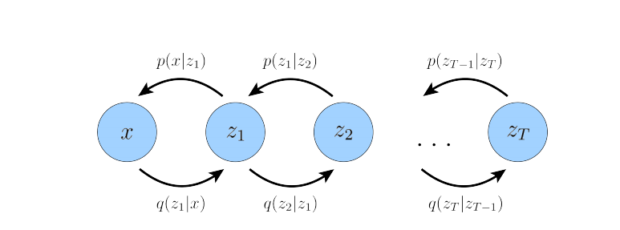

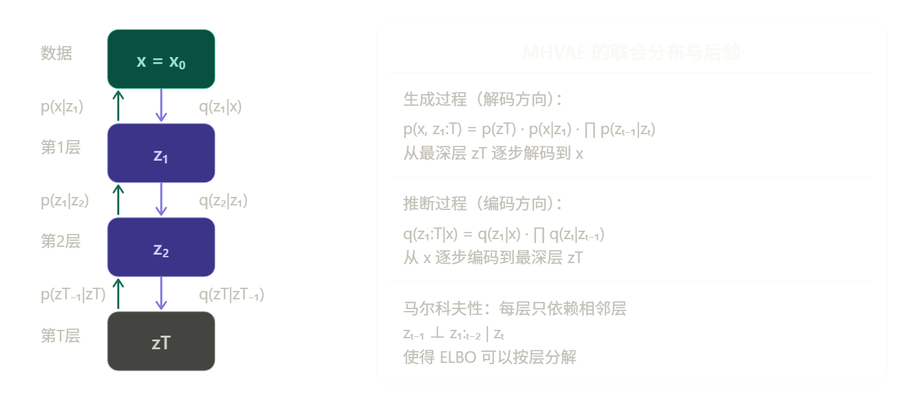

### HVAE 的 ELBO 推导

和 VAE 完全一样的出发点：

$$\log p(x) \geq \mathbb{E}*{q(z*{1:T}|x)}\left[\log \frac{p(x, z_{1:T})}{q(z_{1:T}|x)}\right] = \text{ELBO}$$

把联合分布和后验代入展开：

$$= \mathbb{E}_{q}\left[\log \frac{p(z_T)\cdot p(x|z_1)\cdot \prod_{t=2}^{T}p(z_{t-1}|z_t)}{q(z_1|x)\cdot \prod_{t=2}^{T}q(z_t|z_{t-1})}\right]$$

整理后得到三项：

$$\text{ELBO} = \underbrace{\mathbb{E}[\log p(x|z_1)]}_{\text{① 重建项}} - \underbrace{\mathbb{E}[D_{KL}(q(z_T|z_{T-1}) | p(z_T))]}_{\text{② 先验匹配项}} - \underbrace{\sum_{t=2}^{T}\mathbb{E}[D_{KL}(q(z_t|z_{t-1}) | p(z_{t-1}|z_t))]}_{\text{③ 一致性项}}$$

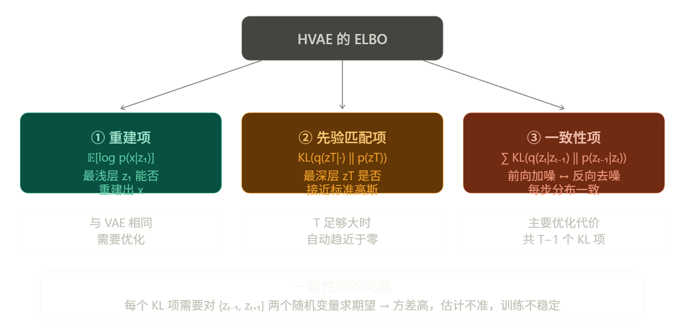

### 更聪明的 ELBO 推导：引入 x₀ 条件

上面的推导有个问题：③ 一致性项中每个 KL 需要对两个随机变量取期望，**方差很高，训练不稳定**。

论文给出了一个更聪明的做法：利用马尔科夫性，把 $q(z_t|z_{t-1})$ 改写为 $q(z_t|z_{t-1}, x_0)$（多加的 x₀ 不影响结果，因为马尔科夫性保证 $z_t \perp x_0 | z_{t-1}$），然后用贝叶斯定理翻转方向：

$$q(z_t | z_{t-1}, x_0) = \frac{q(z_{t-1}|z_t, x_0)\cdot q(z_t|x_0)}{q(z_{t-1}|x_0)}$$

这个翻转让分子分母大量项可以消掉，最终得到一个**方差更低**的新 ELBO：

$$\text{ELBO} = \underbrace{\mathbb{E}[\log p(x|z_1)]}_{\text{① 重建项}} - \underbrace{D_{KL}(q(z_T|x_0)|p(z_T))}_{\text{② 先验匹配（≈0）}} - \underbrace{\sum_{t=2}^{T}\mathbb{E}_{q(z_t|x_0)}\left[D_{KL}(q(z_{t-1}|z_t, x_0)|p_\theta(z_{t-1}|z_t))\right]}_{\text{③ 去噪匹配项}}$$

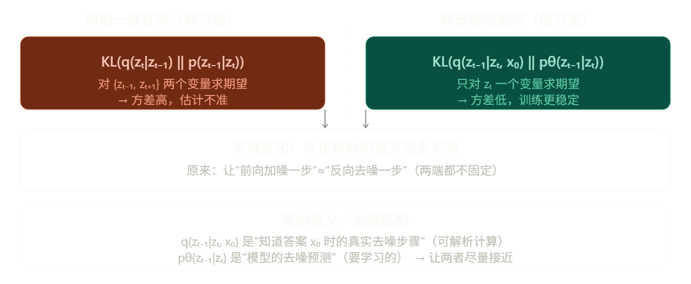

具体推导：

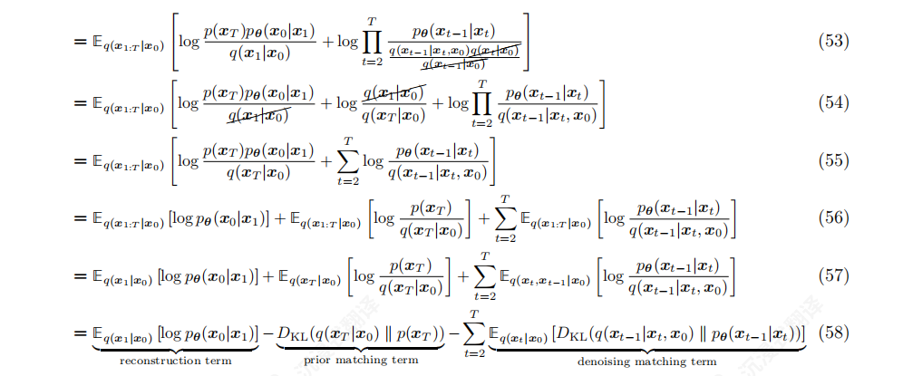

### 从 HVAE 到扩散模型

现在来到论文最精彩的地方。HVAE 还是一个通用框架，编码器 $q(z_t|z_{t-1}) $ 是可以自由设计的神经网络。扩散模型就是在 HVAE 上加了**三个约束**，把这个自由度锁死：

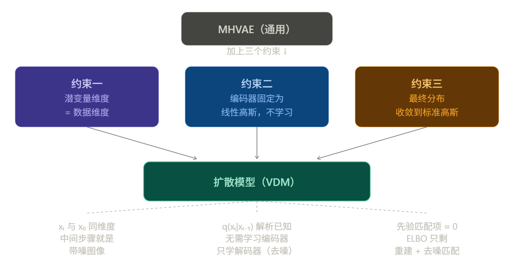

约束二最关键——编码器固定为线性高斯：

$$q(x_t|x_{t-1}) = \mathcal{N}(x_t;, \sqrt{\alpha_t},x_{t-1},, (1-\alpha_t)I)$$

这个形式的好处是可以直接推出跨步公式（就是我们之前讲的 $x_t = \sqrt{\bar\alpha_t},x_0 + \sqrt{1-\bar\alpha_t},\epsilon$），从而使 $q(z_{t-1}|z_t, x_0)$ 也有解析形式。

把这些代入 ELBO，③ 去噪匹配项就变成了：

$$\sum_{t=2}^T \mathbb{E}\Big[D_{KL}\big(\underbrace{q(x_{t-1}|x_t,x_0)}*{\text{真实去噪，解析已知}} ;|; \underbrace{p*\theta(x_{t-1}|x_t)}_{\text{神经网络去噪}}\big)\Big]$$

两个都是高斯，KL 化简后就是**均值之差的平方**，最终等价于让网络预测噪声 ε——这就是扩散模型的训练目标。

------

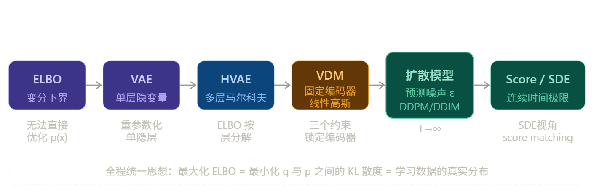

> [!note]
>
> HVAE 是 VAE 的自然推广——把单层隐变量堆叠成马尔科夫链，ELBO 随之分解为逐层的去噪匹配项。扩散模型就是把编码器固定为"逐步加高斯噪声"这个特殊选择的 HVAE，从而把训练目标化简为一个极其简洁的噪声预测问题。

## **Variational Diffusion Models**

>[!note]
>
>HVAE到diffusion的关键点就是把编码器设置为diffusion的前向加噪过程。和原本编码器是给出均值和方差，然后通过重参数化采样不同，diffusion的编码器就是维度不变的情况下线性加噪。

### 两种编码器的本质区别

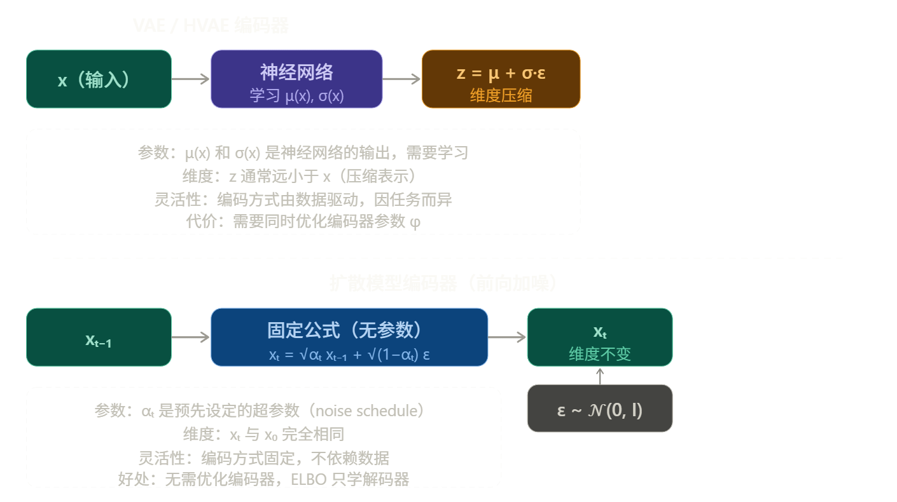

这个设计带来了三个深刻的后果

**后果一：编码器不再需要学习**

VAE 的编码器参数 φ 需要梯度更新。扩散模型的前向过程完全由 noise schedule ${\alpha_t}$ 决定，这是提前设计好的，不是学出来的。训练时整个优化只针对解码器（去噪网络）$\theta$。

**后果二：KL 散度有了解析形式**

HVAE 中 $q(z_{t-1}|z_t, x_0)$ 很难计算，因为编码器是任意神经网络。扩散模型中前向过程是线性高斯，所以 $q(x_{t-1}|x_t, x_0)$ 是一个解析可知的高斯分布（上一节推导过的 $\tilde\mu_t$，$\tilde\beta_t$）。这使得 ELBO 中每一个 KL 项都能精确计算。

**后果三：重参数化变得更简单**

VAE 需要网络输出 μ 和 σ，再做重参数化采样。扩散模型直接用封闭公式：

$$x_t = \sqrt{\bar\alpha_t},x_0 + \sqrt{1-\bar\alpha_t},\varepsilon, \quad \varepsilon \sim \mathcal{N}(0,I)$$

任意步骤的 $x_t$ 都能从 $x_0$ 一步采样出来，不需要逐步迭代。这既是重参数化，也是训练时可以随机选取时间步的基础。

>[!note]
>
>固定编码器带来了训练简洁性，但论文在结尾也指出了一个遗憾：
>
>> 扩散模型的中间隐变量 $x_t$ 只是带噪版本的 $x_0$，没有任何语义压缩——和 VAE 学到的结构化隐空间完全不同。
>
>这就是为什么后来出现了 **Latent Diffusion Model（LDM）**，也就是 Stable Diffusion 的核心思路：先用一个 VAE 把图像压缩到小的隐空间，再在隐空间上跑扩散过程——把两者的优点结合起来。

------

### 回顾出发点

我们已经有了改进版的 HVAE ELBO：

$$\text{ELBO} = \underbrace{\mathbb{E}[\log p(x_0|x_1)]}_{\text{① 重建项}} - \underbrace{D_{KL}(q(x_T|x_0)|p(x_T))}_{\text{② 先验匹配（≈0）}} - \underbrace{\sum_{t=2}^{T}\mathbb{E}_{q(x_t|x_0)}\Big[D_{KL}\big(q(x_{t-1}|x_t,x_0)|p_\theta(x_{t-1}|x_t)\big)\Big]}_{\text{③ 去噪匹配项}}$$

现在把扩散模型的三个约束代进来，逐项分析会发生什么。

------

### 三项逐一分析

**② 先验匹配项直接消失**

约束三保证了 T 足够大时 $q(x_T|x_0) \approx \mathcal{N}(0,I) = p(x_T)$，两个分布几乎完全相同，KL 散度趋近于零。这一项不需要优化，直接忽略。

**① 重建项相对次要**

$\mathbb{E}[\log p(x_0|x_1)]$ 只涉及最后一步，在 T 很大时贡献很小。论文把它并入③ 处理（令 $t=1$ 时特殊处理），实践中通常直接忽略。

**③ 去噪匹配项是核心**

整个训练目标就压缩成了：

$$\mathcal{L} \approx \sum_{t=2}^{T}\mathbb{E}_{q(x_t|x_0)}\Big[D_{KL}\big(\underbrace{q(x_{t-1}|x_t,x_0)}_{\text{真实去噪，解析已知}} \;\Big\|\; \underbrace{p_\theta(x_{t-1}|x_t)}_{\text{网络去噪，需要学}}\big)\Big]$$

------

**把 q(x_{t-1}|x_t, x_0) 算出来**

这是关键计算。用贝叶斯定理：

$$q(x_{t-1}|x_t, x_0) = \frac{q(x_t|x_{t-1})\cdot q(x_{t-1}|x_0)}{q(x_t|x_0)}$$

三个因子都是高斯，代入展开（论文第12页的完整推导）：

- $q(x_t|x_{t-1}) = \mathcal{N}(\sqrt{\alpha_t},x_{t-1},,(1-\alpha_t)I)$
- $q(x_{t-1}|x_0) = \mathcal{N}(\sqrt{\bar\alpha_{t-1}},x_0,,(1-\bar\alpha_{t-1})I)$
- $q(x_t|x_0) = \mathcal{N}(\sqrt{\bar\alpha_t},x_0,,(1-\bar\alpha_t)I)$

三个高斯相乘相除，配方后得到：
$$
\boxed{q(x_{t-1}|x_t,x_0) = \mathcal{N}\!\left(x_{t-1};\; \tilde\mu_t(x_t,x_0),\; \tilde\beta_t I\right)}
$$
其中：

$$\tilde\mu_t = \frac{\sqrt{\alpha_t}(1-\bar\alpha_{t-1})}{1-\bar\alpha_t}x_t + \frac{\sqrt{\bar\alpha_{t-1}}(1-\alpha_t)}{1-\bar\alpha_t}x_0 \qquad \tilde\beta_t = \frac{1-\bar\alpha_{t-1}}{1-\bar\alpha_t}(1-\alpha_t)$$

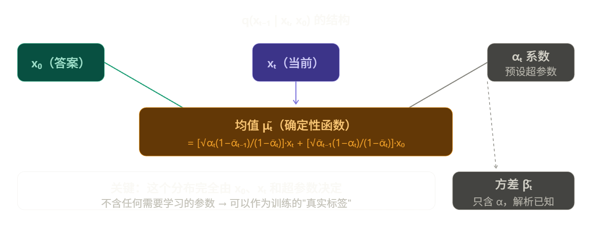

**KL 散度化简**

现在 $q(x_{t-1}|x_t,x_0)$ 和 $p_\theta(x_{t-1}|x_t)$ 都是高斯，且我们可以让两者方差相同（都取 $\tilde\beta_t$）。

两个等方差高斯的 KL 散度只剩均值差：

$$D_{KL}(q|p_\theta) = \frac{1}{2\tilde\beta_t}|\tilde\mu_t - \mu_\theta(x_t,t)|^2$$

所以整个训练目标就变成：**让网络预测的均值 $\mu_\theta$ 尽量接近真实均值 $\tilde\mu_t$**。

------

### 三种等价的参数化方式

这里是论文"Three Equivalent Interpretations"的核心。$\tilde\mu_t$ 里含有 $x_0$，而 $x_0$ 在推理时是未知的——但可以用三种不同的方式来表达它，每种方式对应一种训练目标。

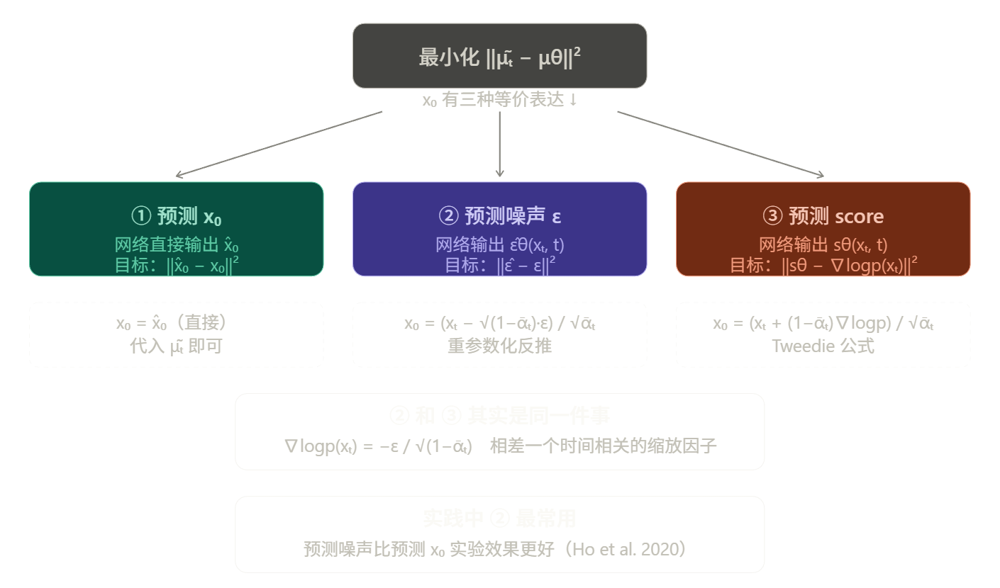

从加噪公式出发：
$$
x_t = \sqrt{\bar\alpha_t}\,x_0 + \sqrt{1-\bar\alpha_t}\,\varepsilon
$$
这是一个关于 $x_0 $ 和 $\varepsilon $ 的线性方程，知道 $x_t $ 和其中一个，就能推出另一个：
$$
x_0 = \frac{x_t - \sqrt{1-\bar\alpha_t}\,\varepsilon}{\sqrt{\bar\alpha_t}} \qquad \varepsilon = \frac{x_t - \sqrt{\bar\alpha_t}\,x_0}{\sqrt{1-\bar\alpha_t}}
$$
score function 也通过 Tweedie 公式与 $\varepsilon $ 挂钩：
$$
\nabla\log p(x_t) = -\frac{\varepsilon}{\sqrt{1-\bar\alpha_t}}
$$
所以三种预测目标只差一个依赖 $t $ 的缩放因子， **优化任何一个本质上是在优化同一件事**。

### 推导"预测噪声"目标的具体过程

选择方式②，把 $x_0 = \frac{x_t - \sqrt{1-\bar\alpha_t},\epsilon}{\sqrt{\bar\alpha_t}}$ 代入 $\tilde\mu_t$：

$$\tilde\mu_t = \frac{\sqrt{\alpha_t}(1-\bar\alpha_{t-1})}{1-\bar\alpha_t}x_t + \frac{\sqrt{\bar\alpha_{t-1}}(1-\alpha_t)}{1-\bar\alpha_t} \cdot \frac{x_t - \sqrt{1-\bar\alpha_t},\epsilon}{\sqrt{\bar\alpha_t}}$$

化简（论文第15页逐步展开）：

$$\tilde\mu_t = \frac{1}{\sqrt{\alpha_t}}\left(x_t - \frac{1-\alpha_t}{\sqrt{1-\bar\alpha_t}},\epsilon\right)$$

因此让 $\mu_\theta$ 匹配这个形式，网络只需要预测 $\epsilon$：

$$\mu_\theta(x_t, t) = \frac{1}{\sqrt{\alpha_t}}\left(x_t - \frac{1-\alpha_t}{\sqrt{1-\bar\alpha_t}},\hat\epsilon_\theta(x_t,t)\right)$$

代入 KL 目标，常数系数提出后，训练目标化简为：

$$\boxed{\mathcal{L} = \mathbb{E}_{x_0,\,\epsilon,\,t}\left[\|\epsilon - \hat\epsilon_\theta(\underbrace{\sqrt{\bar\alpha_t}\,x_0 + \sqrt{1-\bar\alpha_t}\,\epsilon}_{x_t},\; t)\|^2\right]}$$

这就是 DDPM 论文里那个极其简洁的训练目标。

------

**整个 VDM 推导的逻辑链**

从 ELBO 出发，到最终训练目标，每一步都有明确的来源：

$$\underbrace{\log p(x)}_{\text{无法直接优化}} \geq \underbrace{\text{ELBO}}_{\text{三项之和}} \xrightarrow{\text{约束①②③}} \underbrace{\sum_t D_{KL}(q(x_{t-1}|x_t,x_0)\|p_\theta)}_{\text{去噪匹配}} \xrightarrow{\text{两高斯 KL}} \underbrace{\|\tilde\mu_t - \mu_\theta\|^2}_{\text{均值之差}} \xrightarrow{\text{代入重参数化}} \underbrace{\|\epsilon - \hat\epsilon_\theta(x_t,t)\|^2}_{\text{最终训练目标}}$$

每一个箭头都不是"拍脑袋"，而是严格的数学推导。这条链路就是论文的核心贡献——把扩散模型从一个直觉上合理的"加噪再去噪"过程，变成了有严格概率论基础的生成模型。

## Score-Based 视角

### 什么是 Score Function？

先建立直觉。我们有一个数据分布 p(x)，比如"所有真实图像的分布"。

Score function 的定义是：

$$s(x) = \nabla_x \log p(x)$$

注意这个梯度是**对 x 求的，不是对模型参数求的**。它的含义是：在数据空间的每一个点 x，指向"概率密度增加最快"的方向。

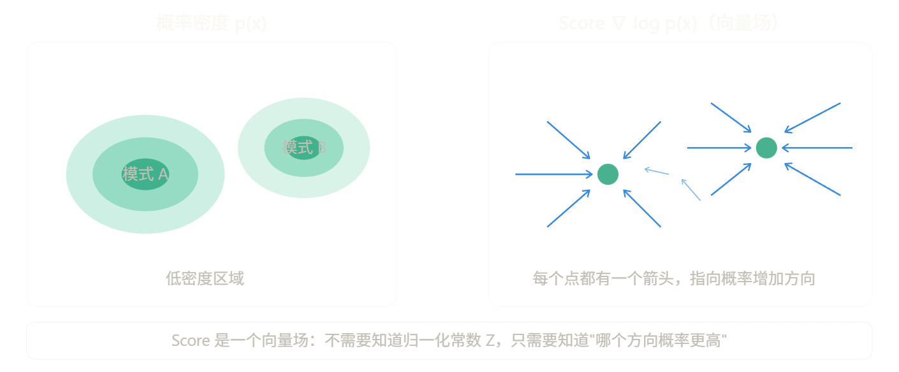

### 为什么 Score 很有价值

学习概率分布 p(x) 通常需要计算归一化常数：

$$p(x) = \frac{e^{-f(x)}}{Z}, \quad Z = \int e^{-f(x)}dx$$

在高维空间（比如图像）中，Z 的计算是**完全无法处理的**。

但 score 绕开了这个问题：

$$\nabla_x \log p(x) = \nabla_x \log \frac{e^{-f(x)}}{Z} = \nabla_x(-f(x)) - \underbrace{\nabla_x \log Z}_{=,0} = -\nabla_x f(x)$$

Z 对 x 求导等于零，**归一化常数直接消掉了**。所以可以用神经网络直接学 score，完全不需要处理归一化。

------

### Langevin Dynamics 采样

Score 告诉我们每个点"往哪走概率更高"。顺着这个方向走，就能到达高概率区域（真实数据）。这个采样过程叫 **Langevin Dynamics**：
$$
x_{i+1} = x_i + c\,\nabla_x \log p(x_i) + \sqrt{2c}\,\varepsilon, \quad \varepsilon \sim \mathcal{N}(0,I)
$$
第二项随机噪声 $\sqrt{2c}\varepsilon$ 非常关键——没有它，从同一个起点出发永远到同一个模式；有了它，采样可以覆盖多个模式，保证多样性。

------

### 原始 Score Matching 的问题与加噪的解法

原始问题：

我们想训练一个网络 $s_\theta(x) \approx \nabla_x \log p(x)$，训练目标是最小化 Fisher 散度：

$$\mathcal{L} = \mathbb{E}_{p(x)}\left[|s_\theta(x) - \nabla_x \log p(x)|^2\right]$$

但这个目标有一个根本困难：**我们不知道真实的 $\nabla_x \log p(x)$ 是什么**（如果知道，就不需要学了）。

幸好有 Score Matching 技巧（Hyvärinen 2005）可以绕开这个问题，把目标改写成不需要真实 score 的形式。但即使解决了这个计算问题，还有三个更深层的问题。

**问题一：低维流形**

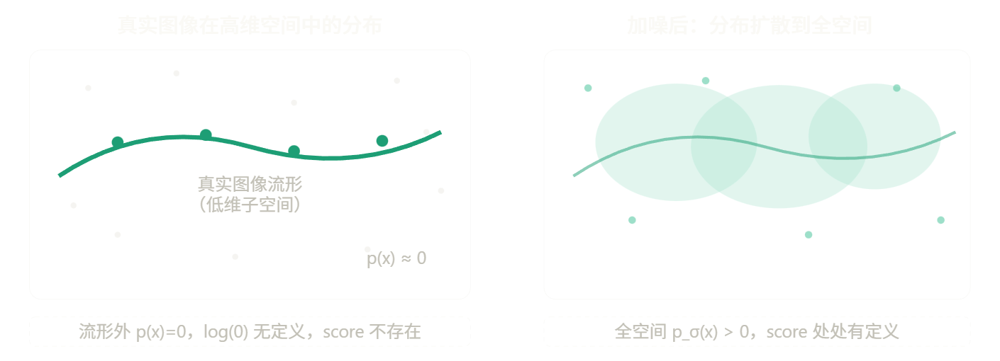

真实图像（比如 256×256 的图)存在于 $256\times256 = 65536$ 维空间，但所有"有意义的图像"只占其中一个极低维的子流形。流形之外的点概率为零，$\log 0$ 无定义，score 根本不存在。

加噪声之后，带噪分布 $p_\sigma(x) = \int p(x_0)\mathcal{N}(x; x_0, \sigma^2 I)dx_0$ 的支撑扩展到整个空间，score 在每个点都有定义了。

------

**问题二：低密度区域的训练信号太弱**

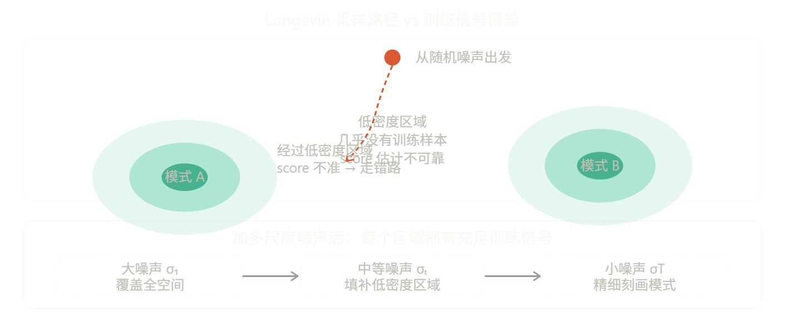

训练目标 $\mathbb{E}_{p(x)}[\cdots]$ 是对 $p(x)$ 求期望——这意味着**网络只在有训练数据的地方得到学习信号**。低密度区域样本极少，score 估计几乎是随机的。

但 Langevin 采样偏偏要从随机噪声（低密度区域）出发，整个初期路径上的 score 全是垃圾，最终样本质量很差。

加大噪声 $\sigma$，把原始分布"泡大"，低密度区域也有了充足的样本——但这又带来新问题：噪声太大，细节全没了。

解法：**用一组从大到小的噪声级别** $\sigma_1 > \sigma_2 > \cdots > \sigma_T$，从大噪声开始（保证全局覆盖），逐步退火到小噪声（保证细节精度）。这就是 Annealed Langevin Dynamics。

------

**问题三：混合分布的权重消失**

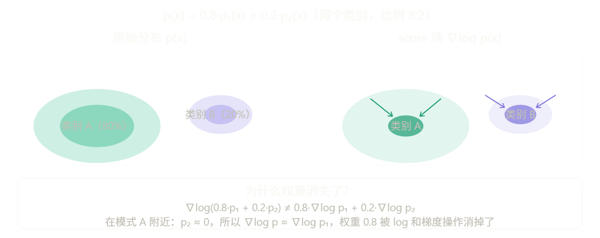

这个问题最微妙。设 $p(x) = 0.8\,p_1(x) + 0.2\,p_2(x) $，在模式 A 附近，$p_2(x) \approx 0$，所以：
$$
\nabla \log p(x) \approx \nabla \log(0.8\,p_1(x)) = \nabla \log p_1(x)
$$
权重 0.8 进了 log 之后变成常数，求导后直接消失了。结果就是：**从靠近 A 的任意初始点出发，Langevin 采样永远只能到 A，永远不知道 B 的存在**，更不知道 B 只占 20%。

加噪声如何解决？加了噪声之后，两个模式被"泡大"——即使在 A 附近，带噪分布里 B 的贡献也不可忽略了：

$$p_\sigma(x) = 0.8\int p_1(x_0)\mathcal{N}(x;x_0,\sigma^2 I)dx_0 + 0.2\int p_2(x_0)\mathcal{N}(x;x_0,\sigma^2 I)dx_0$$

噪声把两个模式的"势力范围"扩大，它们开始重叠，权重信息被保留在了这个带噪分布的结构里。用足够大的 $\sigma$，任意位置都能感受到 B 的存在，Langevin 采样才能按正确比例访问两个模式。

------

### 三个问题的统一解法

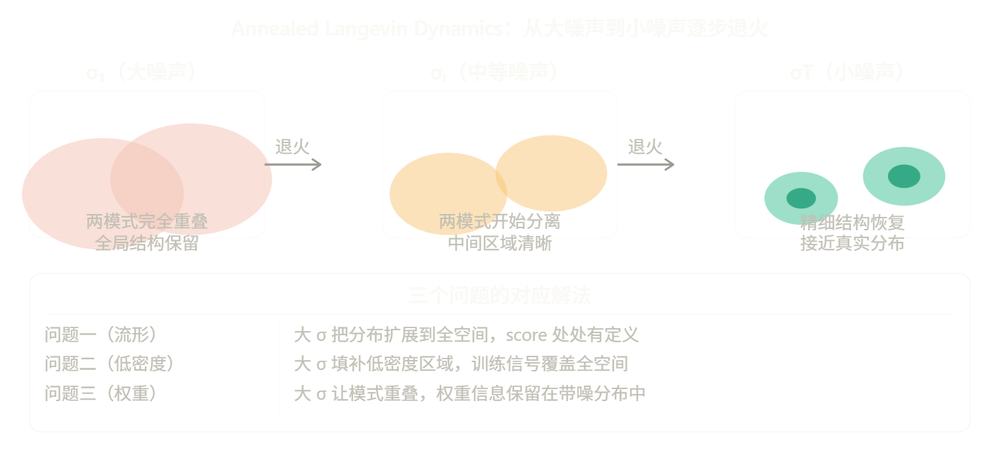

现在可以看清楚，Langevin Dynamics 和加噪 Score Matching 是天然配套的：

- **Score Matching + 多尺度噪声**解决了"在哪里都能学到可靠的 score"的问题
- **Annealed Langevin Dynamics**利用这些 score，从大噪声到小噪声逐步采样，保证既能探索全局、又能恢复细节

这两件事合在一起，就是 Score-based Generative Model 的完整框架——而扩散模型把这套框架和 HVAE 的 ELBO 推导统一了起来，得到了同一个训练目标 $|\epsilon - \hat\epsilon_\theta|^2$。

理解了这些，Guidance 部分就相对容易了——它是在 score 视角下，通过修改采样时用的 score 来注入条件控制。

## Guidance

Guidance 是把扩散模型从"无条件生成"变成"可控生成"的关键机制，也是 Stable Diffusion、DALL-E 2 等实用系统的核心

到目前为止我们学的扩散模型只能生成 $p(x)$——从训练数据分布里随机采样，没有任何控制。

实际应用需要的是**条件生成**：给定一个条件 $y$（比如文字描述"一只橙色的猫"），生成满足这个条件的图像，也就是从 $p(x|y)$ 采样。

最朴素的做法是：直接在训练时把 $y$ 也喂给网络，学 $p_\theta(x_{t-1}|x_t, y)$。但这有一个问题——模型可能学会**忽略 $y$**，因为不管 $y$ 是什么，只要去噪做得好，损失就能降低。

Guidance 就是为了解决这个问题：**在采样阶段强制让模型更"听话"地遵从条件 $y$**。

------

### 从 Score 视角理解条件生成

用 score 视角来思考 $p(x|y)$，用贝叶斯定理展开：

$$p(x_t|y) = \frac{p(x_t)\cdot p(y|x_t)}{p(y)}$$

两边取 log 再对 $x_t$ 求梯度：

$$\nabla_{x_t}\log p(x_t|y) = \nabla_{x_t}\log p(x_t) + \nabla_{x_t}\log p(y|x_t) - \underbrace{\nabla_{x_t}\log p(y)}_{=,0}$$

$$\boxed{\nabla_{x_t}\log p(x_t|y) = \underbrace{\nabla_{x_t}\log p(x_t)}_{\text{无条件 score}} + \underbrace{\nabla_{x_t}\log p(y|x_t)}_{\text{分类器梯度}}}$$

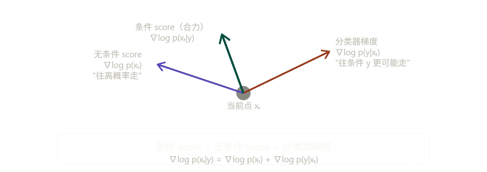

这个分解有非常直观的几何含义：条件 score 是两个力的合力——一个力把你推向高概率区域，另一个力把你推向"让 $y$ 更可能成立"的区域。

------

### Classifier Guidance

有了上面的分解，Classifier Guidance 的做法很自然：

**训练时**：训练一个普通的无条件扩散模型，同时训练一个**能处理带噪图像**的分类器 $p_\phi(y|x_t)$。

**采样时**：把两个 score 加起来，并加一个强度系数 $\gamma$：

$$\nabla_{x_t}\log p(x_t|y) = \nabla_{x_t}\log p(x_t) + \gamma,\nabla_{x_t}\log p_\phi(y|x_t)$$

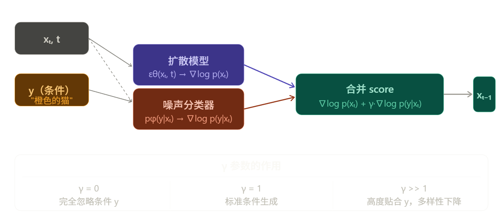

这个方案有一个实践上的硬伤：**分类器必须能处理任意噪声级别的带噪图像** $x_t$。普通的预训练分类器只能处理干净图像，必须专门重新训练一个，代价很高。

------

### Classifier-Free Guidance

Ho & Salimans 2022 的关键洞察是：**能不能绕过分类器，只用扩散模型自身来实现 Guidance？**

从上面 Classifier Guidance 的公式出发，把 $\nabla\log p(y|x_t)$ 用贝叶斯反转：

$$\nabla_{x_t}\log p(y|x_t) = \nabla_{x_t}\log p(x_t|y) - \nabla_{x_t}\log p(x_t)$$

代入 Classifier Guidance 公式：

$$\nabla_{x_t}\log p(x_t|y) = \nabla_{x_t}\log p(x_t) + \gamma\left(\nabla_{x_t}\log p(x_t|y) - \nabla_{x_t}\log p(x_t)\right)$$

整理：

$$= (1-\gamma),\underbrace{\nabla_{x_t}\log p(x_t)}_{\text{无条件 score}} + \gamma,\underbrace{\nabla_{x_t}\log p(x_t|y)}_{\text{条件 score}}$$

$$\boxed{\nabla_{x_t}\log p(x_t|y) = \underbrace{(1-\gamma)\nabla\log p(x_t)}_{\text{无条件方向}} + \underbrace{\gamma\nabla\log p(x_t|y)}_{\text{条件方向}}}$$

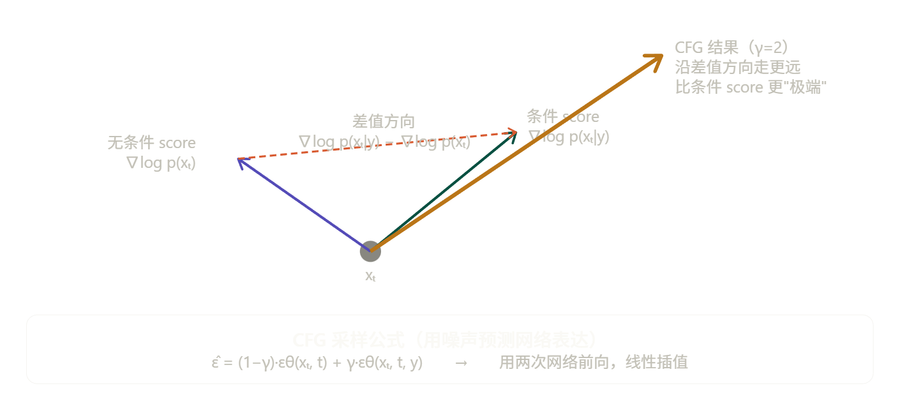

这个公式有一个非常直觉的几何解读：**CFG 是在"无条件方向"和"条件方向"之间做外插**。$\gamma > 1$ 时，不仅走向条件方向，而且走得比"自然的条件 score"更远——用力过猛，生成更符合条件但多样性更低的图像。

------

### CFG 如何训练？

CFG 最巧妙的地方是**只需要一个网络**。训练时随机把条件 $y$ 替换成空（用零向量或特殊 token），让网络同时学会有条件和无条件两种预测：

$$\varepsilon_\theta(x_t, t, y) \quad\text{和}\quad \varepsilon_\theta(x_t, t, \varnothing)$$

推理时调用两次同一个网络，线性组合结果：

$$\hat\varepsilon = \varepsilon_\theta(x_t, t, \varnothing) + \gamma\left(\varepsilon_\theta(x_t, t, y) - \varepsilon_\theta(x_t, t, \varnothing)\right)$$

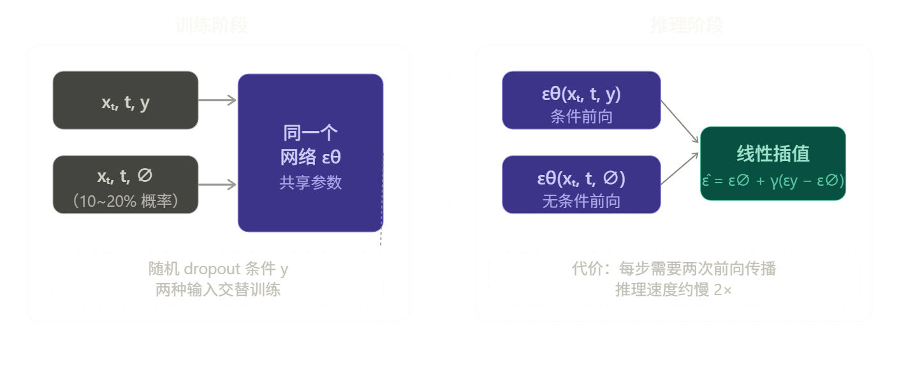

### 两种 Guidance 的对比总结

|              | Classifier Guidance | Classifier-Free Guidance |
| ------------ | ------------------- | ------------------------ |
| 需要额外模型 | 是（噪声分类器）    | 否                       |
| 训练代价     | 高（两个模型）      | 低（一个模型）           |
| 推理代价     | 两次前向            | 两次前向                 |
| 灵活性       | 低（分类器固定）    | 高（γ 可实时调整）       |
| 实际使用     | 较少                | 主流（SD、DALL-E 2）     |

------

至此，论文的全部内容都走完了：

$$\underbrace{\text{ELBO}}_{\text{优化框架}} \rightarrow \underbrace{\text{VAE}}_{\text{单层实现}} \rightarrow \underbrace{\text{HVAE}}_{\text{多层推广}} \xrightarrow{\text{三个约束}} \underbrace{\text{VDM}}_{\text{固定编码器}} \xrightarrow{\text{等价性}} \underbrace{\text{Score Matching}}_{\text{梯度场视角}} \xrightarrow{\text{条件控制}} \underbrace{\text{Guidance}}_{\text{实用生成}}$$

每一步都不是跳跃，而是对上一步自然的延伸。扩散模型在这条主线上，既有严格的概率论基础（ELBO），又有物理直觉（Langevin），又有实用的控制机制（CFG）——这是它成为当前生成模型主流的根本原因。
