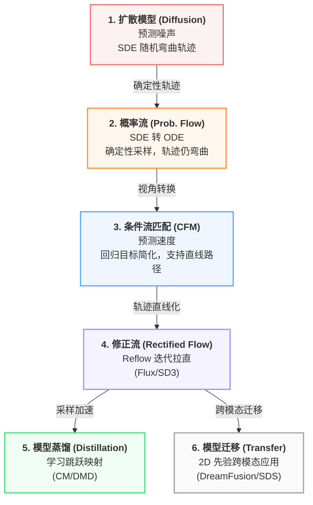

# 从扩散模型到流匹配

### 扩散模型

- **核心逻辑**：模仿物理世界中的扩散现象。通过向数据（$x_0$）不断注入高斯噪声，直到其变成纯噪声（$x_T$），再让神经网络学习这个过程的逆变换。
- **演进意义**：打破了 GAN 训练不稳定的僵局。
- **训练目标**：**去噪 (Denoising)**。模型本质上是在预测“噪声 $\epsilon$”，或者说是学习分数的引力场。
- **痛点**：采样过程是随机的（SDE），且轨迹弯曲，导致采样步数极多。

### 概率流

- **核心逻辑**：宋佳（Yang Song）等人证明，每一个随机扩散过程都对应一个唯一的确定性轨迹（ODE）。
- **演进意义**：实现了**确定性采样**。这意味着同一个噪声点对应唯一的生成图像，且支持“反演（Inversion）”。
- **关键转换**：将 SDE 的随机行走简化为 ODE 的平滑曲线。
- **痛点**：轨迹依旧是弯曲的，且物理量（Score）在数值上不直观，难以直接优化。

###  条件流匹配

- **核心逻辑**：不再从扩散公式里推导 ODE，而是直接定义一个**速度场（Vector Field）**。
- **演进意义**：提出了**条件期望**的训练技巧，解决了边际场难以观测的数学难题。
- **核心公式**：$L_{CFM} = \mathbb{E} \| v_\theta(x_t, t) - u_t(x|x_1) \|^2$。
- **突破**：这让训练生成模型变成了一个简单的“线性回归”问题。

### 修正流

- **核心逻辑**：在 CFM 的基础上，旗帜鲜明地提出了 **1-Rectified（直线插值）** 和 **Re-Flow（重流）**。
- **演进意义**：通过迭代拉直技术，将复杂的弯曲轨迹彻底变成**直线**。
- **工程贡献**：由于轨迹是直的，欧拉法单步采样的误差被降到最低，这直接催生了 **SD3** 和 **Flux** 的成功。

### 模型蒸馏

- **核心逻辑**：当模型学会了走直线后，下一步就是“跳跃”。
- **技术分路**：
  - **一致性模型 (CM/CTM)**：强迫模型学习轨迹上的点到终点的映射，追求 1 步成像。
  - **分布匹配 (DMD/VSD)**：利用 GAN 损失或分数对齐，不再死磕路径，只求结果分布的一致性。
- **演进意义**：将推理成本降低了两个数量级。

### 模型迁移

- **核心逻辑**：将已有的高性能 2D 生成能力迁移到 3D、视频或其他模态。
- **代表方案**：**DreamDiffusion (SDS)**。
- **演进意义**：利用流匹配/扩散模型的先验作为“老师”，去指导新领域的生成（如 3D 建模中的分数蒸馏）。这证明了流模型不仅是生成器，更是强大的**通用分布描述器**。

---

*最后更新：2026年3月*
