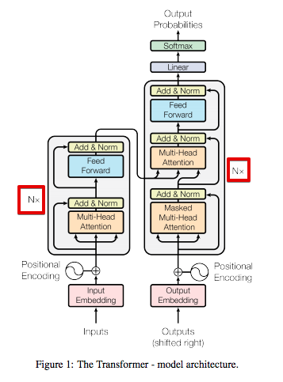

# Transformer

## 模型架构

transformer的左半部分是encoder（编码器），右半部分是decoder（解码器）

encoder每一层都有两个子层：

- 第一个子层是多头自注意力机制（multi-head self-attention mechanism）
- 第二个子层是全连接的前馈网络（feed forward network）

两个子层之间通过残差连接（residual connection），然后进行层归一化（layer normalization）

decoder每一层都有三个子层：

- 第一层是带掩码的多头自注意力机制（Masked multi-head self-attention mechanism）
- 第二层是全连接的前馈网络（feed forward network）
- 第三层是多头注意力机制，类似于在encoder的第一子层中实现的机制。

在decoder，这种多头注意力机制接收来自前一个decoder层的查询，以及来自encoder输出的键和值。这允许decoder处理输入序列中的所有单词

---

## 核心机制

### 自注意力机制 (Self-Attention)

这是transformer的核心机制，包含三个矩阵，对输入的词向量进行三次线性变换。

- **Query ($Q$)：** “我要找什么？”
- **Key ($K$)：** “我能提供什么？”
- **Value ($V$)：** “我实际的内容是什么？”

**数学本质：**

$$Attention(Q, K, V) = \text{softmax}\left(\frac{QK^T}{\sqrt{d_k}}\right)V$$

> **面试常考点：为什么除以 $\sqrt{d_k}$？**
>
> 答：为了防止 $QK^T$ 的点积过大，导致 Softmax 后的梯度变得极小（进入饱和区），从而引发梯度消失。

**1. 赋予语境含义**

在传统的 Embedding 中，每个词的向量是死的（静态的）。但在自注意力中，词的向量是**活的**。

**例子：** “他在银行（Bank）取钱” vs “他在河岸（Bank）散步”。

当处理第一个句子的 “Bank” 时，自注意力会给 “取钱” 分配很高的权重。通过加权求和，“Bank” 的向量里就会融入 “金融/钱” 的信息。也就是说，通过矩阵计算，每个词会自动去查询上下文的词语和当前词的关联程度，并且对当前词重新进行修饰。也就是说自注意力允许模型根据上下文，动态地重新表征（Re-representation）每一个词，使词向量具备语境感。

**2. 建立全局关联**

这是它打败 RNN（循环神经网络）的关键。RNN 像传声筒游戏，信息从句首传到句尾会逐渐模糊（梯度消失/信息遗忘）。而Self-Attention 的优势是无论两个词离得多远，计算复杂度都是 $O(1)$ 的直接连接。第 1 个词和第 1000 个词之间只需要一次点积就能建立联系。这使得模型能够理解非常复杂的长难句，准确找到代词（如“它”、“他”）指代的对象。

**3. 实现并行计算：工业化的基石**

虽然这看起来是计算特性，但也是其核心设计作用。与 RNN 的串行处理不同，自注意力允许模型同时观察序列中的所有位置，极大地提升了大规模预训练的效率。这是因为计算当前词的 $Q$ 与所有词的 $K$ 的点积互不依赖，我们可以把整个句子拼成矩阵一次性算完。

------

### 残差连接与层归一化

在 Transformer 的每个子层（无论是 Attention 还是 Feed-Forward）之后，你都会看到一个公式：

$$\text{Output} = \text{LayerNorm}(x + \text{Sublayer}(x))$$

这里的 $x + \dots$ 就是残差连接。它在面试中通常被视为**“让深层网络成为可能”**的核心技术。

**1. 解决梯度消失问题**

这是残差连接最核心的作用。Transformer 通常有很多层（比如 GPT-3 有 96 层）。在反向传播计算梯度时，梯度需要经过每一层的激活函数和矩阵乘法。如果层数太深，梯度在传播过程中会不断被相乘，导致指数级缩小，最后传到靠近输入的层时变成了 0，模型就学不动了。因为有了 $x + \text{f}(x)$，在求导时，这条路径的导数至少是 1 。

**2. 解决网络退化问题**

这是一个很深刻的理论点：**深层网络的性能不应该比浅层网络差。**

理论上，如果第 20 层已经学得够好了，第 21 层只需要做一个“恒等映射（Identity Mapping）”把信息原封不动传下去就行。但实际上，让神经网络去学习“原封不动”是非常难的。而在残差连接中，如果 $\text{f}(x)$ 的参数全部初始化为趋近于 0，那么 $x + \text{f}(x)$ 就自动变成了恒等映射。模型可以更轻松地选择“我不折腾了，直接传下去”。

**3. 保持原始信息的新鲜度**

在 Self-Attention 中，向量会被投影、加权、求和，这本质上是对信息的一次重组和过滤。有时候，这种过滤会丢掉一些重要的原始语义。而残差连接能把上一层的原始信息直接“拉”过来，强制叠加在处理后的信息上。这保证了模型在理解抽象语义的同时，不会忘记最初输入的词是什么。

**4. 配合 Layer Normalization (层归一化)**

在 Transformer 中，残差连接总是和 **LayerNorm** 结伴出现。

这里有一个面试进阶考点：**Pre-Norm vs Post-Norm**。

- **Post-Norm (原始 Transformer)：** $\text{LayerNorm}(x + \text{Sublayer}(x))$。
  - 优点：输出更稳定。
  - 缺点：训练初期很难收敛，通常需要 Warm-up（预热）学习率。
- **Pre-Norm (现在大模型的主流)：** $x + \text{Sublayer}(\text{LayerNorm}(x))$。
  - 优点：梯度更加稳定，更容易训练。

> [!tip] LN vs BN (Batch Norm) 
>
> 在大模型中，序列长度不一，BN 会受 Batch Size 影响且不稳定；LN 是在单个样本内部做归一化，更适合变长的文本数据。

------

### 位置编码 (Positional Encoding)

**痛点：** Attention 是并行的，对它来说“我爱你”和“你爱我”是一模一样的（失去了语序）。

**解决方案：** 给每个词向量注入一个关于“位置”的信号。

- **经典 Transformer：** 使用正余弦函数（Sinusoidal）。
- **现代 LLM (LLaMA/GLM)：** 使用 **RoPE (旋转位置编码)**。它通过旋转矩阵让模型理解词与词之间的**相对距离**。

---

## 数据流

#### 分词（Tokenization）

电脑看不懂中文或英文，得先变成数字。

- **输入：** `“大模型面试”`
- **分词器（Tokenizer）：** 将其切分为 Token。比如：`[“大”, “模型”, “面试”]`。
- **查表：** 每一个词在词表（Vocabulary）里都有一个唯一的索引 ID。比如：`[102, 45, 892]`。

#### 词嵌入（Embedding Lookup）

模型内部有一个巨大的矩阵，叫 **Embedding Matrix**（形状是 `词表大小 V × 维度 D`）。

- 程序会根据 ID 去这个矩阵里“查表”。比如 ID 为 102 的词，就取出矩阵的第 102 行。
- **结果：** 这一行就是一个长度为 $D$（如 4096）的向量。现在，文字已经变成了**初始向量**。

#### 位置编码

现在的向量虽然有了语义，但还没位置感。

- **操作：** 将第二步得到的“词向量”和“位置向量”相加（或是进行旋转变换，如 LLaMA 的 RoPE）。
- **结果：** 得到了**带有位置信息的输入向量**。

#### 逐层加工

这个向量现在进入了 Decoder 的 Block：

1. **Self-Attention：** 向量之间互相交换信息（“模型”这个词会去看“大”，理解成“大模型”）。
2. **MLP/FFN：** 对每个位置的向量进行非线性变换，提取深层特征。
3. **循环迭代：** 经过 32 层或更多层的加工，原本平凡的初始向量变成了包含丰富上下文信息的**高维特征向量**。

---

### 手算一遍 Shape

理解维度变换是掌握 Transformer 工业实现的第一步。我们假设：

- **$batch\_size$ (B)** = 2 （一次处理两个句子）
- **$seq\_len$ (L)** = 10 （每个句子 10 个词）
- **$d\_model$ (D)** = 512 （每个词的向量长度）
- **$num\_heads$ (H)** = 8 （8 个头）
- **$d\_head$ ($d_k$)** = $512 / 8 = 64$ （每个头分配到的维度）

---

**第一步：线性变换生成 $Q, K, V$**

输入矩阵 $X$ 的形状是 $(B, L, D)$。

通过三个权重矩阵 $W^Q, W^K, W^V$（形状均为 $D \times D$），我们得到：

- $Q, K, V$ 的形状仍然是 **$(B, L, D)$**。

 **第二步：分头 (Split Heads)**

为了让 8 个头并行，我们会对 $D$ 进行拆解。形状变为：

- **$(B, H, L, d_k)$** $\rightarrow$ 即 $(2, 8, 10, 64)$。

> *注：这一步只是 Reshape 和 Transpose，没有逻辑计算。*

**第三步：核心计算 $QK^T$ (Attention Score)**

这是最关键的矩阵乘法：

$$Score = Q \cdot K^T$$

- $Q$ 的形状：$(B, H, L, d_k)$
- $K^T$ 的形状：$(B, H, d_k, L)$
- **相乘后的形状：$(B, H, L, L)$** $\rightarrow$ 即 $(2, 8, 10, 10)$。

> **面试点：** 这个 $(10 \times 10)$ 的矩阵记录了句子中 10 个词**两两之间**的相关性分数。

**第四步：乘以 $V$ 得到输出**

- $Score$ 形状：$(B, H, L, L)$
- $V$ 形状：$(B, H, L, d_k)$
- **结果形状：$(B, H, L, d_k)$** $\rightarrow$ 即 $(2, 8, 10, 64)$。

**第五步：合并 (Concat) 与投影**

最后把 8 个头拼回来，回到 **$(B, L, D)$**。这和输入 $X$ 的形状一模一样，这也是为什么 Transformer 可以叠成几十层的原因。

---

## 架构权衡

**为什么有的模型只有单端？**

原始 Transformer 是为了**机器翻译**设计的，必须有 Encoder（读源语言）和 Decoder（写目标语言）。

但后来大家发现，如果只做特定的任务，不需要两边都开工：

**只有 Encoder (如 BERT) **

- **原理：** 它可以同时看到左边和右边的词，就像看一张完整的照片。
- **为什么不需要 Decoder？** 它的目标是给每个词生成一个极其精准的特征向量（Embedding）。
- **擅长：** 分类、情感分析、抽取答案。你给它一段话，它能“读懂”核心意思，但它不擅长“写长文章”。

**只有 Decoder (如 GPT/LLaMA) **

- **原理：** 它通过 Mask 强迫模型根据前面的词预测下一个词。
- **为什么不需要 Encoder？** **简洁高效：** 现代 LLM 发现，只要数据量够大，把“问题”和“答案”拼在一起当成一串文字丢给 Decoder 训练（In-context learning），效果比分开处理更好。
  - **Zero-shot 能力：** Decoder 这种逐词预测的逻辑更贴近人类说话方式。
- **擅长：** 聊天、写代码、创作。

**现状：** 在极大规模（千亿级）模型中，目前 **Decoder-only** 占据了绝对主流（比如 GPT-4, Llama 3），因为这种架构在推理缩放（Scaling Law）上表现最稳定。