# Transformer


## 1 模型架构

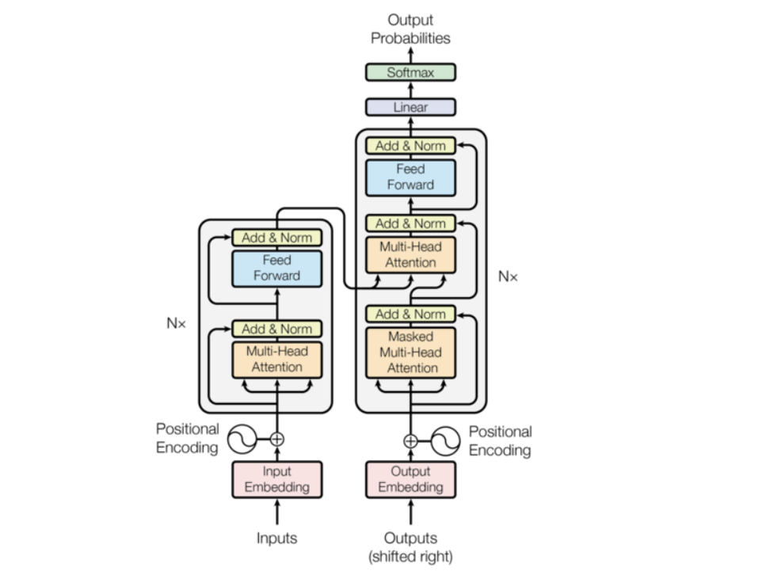


整体上，Transformer 是一个 **Encoder-Decoder** 的对称结构，左边读、右边写。下面逐层拆解每个组件。

------

### **Encoder**

Encoder 的每一层结构完全相同，由两个子层组成：

**子层一：Multi-Head Self-Attention**。Q、K、V 全部来自同一个序列（自己问自己）。它的任务是让每个 token 去感知整个句子里其他所有 token 的信息，重新给自己赋予语境含义。每一层做完之后，每个 token 的向量都已经"融合"了上下文。

**子层二：Feed-Forward Network（FFN）**。独立作用于每个位置的向量，做非线性变换。它不负责 token 之间的交流，专注于对单个向量做深度特征提取。

每个子层之后都有 `Add & Norm`，即残差连接加上层归一化，防止梯度消失。

经过 $N$ 层堆叠之后，Encoder 输出一组富含语义的向量序列，**这组向量的 K 和 V 会被送到 Decoder 的每一层**。

------

### Decoder

Decoder 每层比 Encoder 多一个子层，共三个：

**子层一：Masked Multi-Head Self-Attention**。和 Encoder 的 Self-Attention 几乎一样，关键区别是加了 **Causal Mask**——生成第 $t$ 个词时，只允许看到位置 $1$ 到 $t-1$ 的词，不能看未来。这保证了自回归（autoregressive）生成的合法性。

**子层二：Cross-Attention**。这是 Encoder 和 Decoder 唯一的连接点。Q 来自 Decoder 当前层，K 和 V 来自 Encoder 的最终输出。直觉上，Decoder 在问："我现在要生成这个词，应该重点参考输入序列里的哪些位置？" Cross-Attention 的重要性在文生图里会更突出——文字信息正是通过这里注入图像生成过程的。

**子层三：FFN**。同 Encoder，对每个位置做独立的特征变换。

最终，Decoder 的输出经过一个线性层和 Softmax，得到词表上的概率分布，采样出下一个 token，然后把这个 token 作为新的输入再喂回 Decoder——这个循环就是**自回归生成**。

------

**残差连接**

注意图中每个子层两侧的虚线——那是残差连接。无论信息经过 Attention 还是 FFN 如何变换，原始输入都会被直接加回来。这个设计让整个深层网络在反向传播时梯度始终有一条"高速公路"可以走，是堆叠几十层成为可能的根本原因。

---


## 2 核心机制

### 2.1 自注意力机制

好，Self-Attention 是整个 Transformer 的心脏，我们从直觉到数学到 Shape 完整走一遍。点击不同 token 可以看到它的注意力分布。"银行"这个词之所以能被理解为金融含义而非河岸，就是因为它对"取"和"钱"分配了很高的权重，通过加权求和把这两个 token 的语义融入了自己的向量里。

------

**Q、K、V矩阵**

每个 token 的向量 $x$ 经过三个独立的线性变换，变成三个新向量：

$$Q = xW^Q \qquad K = xW^K \qquad V = xW^V$$

三个矩阵 $W^Q, W^K, W^V$ 的参数是训练出来的。三个向量各有分工：

- **Q（Query）**：我这个 token，想去搜索什么信息？
- **K（Key）**：我这个 token，能被搜索到的标签是什么？
- **V（Value）**：如果你真的关注我，你能从我这里拿走的实际内容是什么？

一个类比：图书馆检索系统。Q 是你输入的搜索词，K 是每本书的书名标签，V 是书里的实际内容。搜索词和书名越匹配（点积越大），这本书的内容被加权进结果的比例就越高。

------

完整计算流程四步流程，每步都有明确的几何意义：

**① 线性变换**：把每个 token 的向量 $x$ 分别投影成 Q、K、V 三个方向。这一步给了模型学习"如何查询、如何被查询、如何提供内容"的自由度。

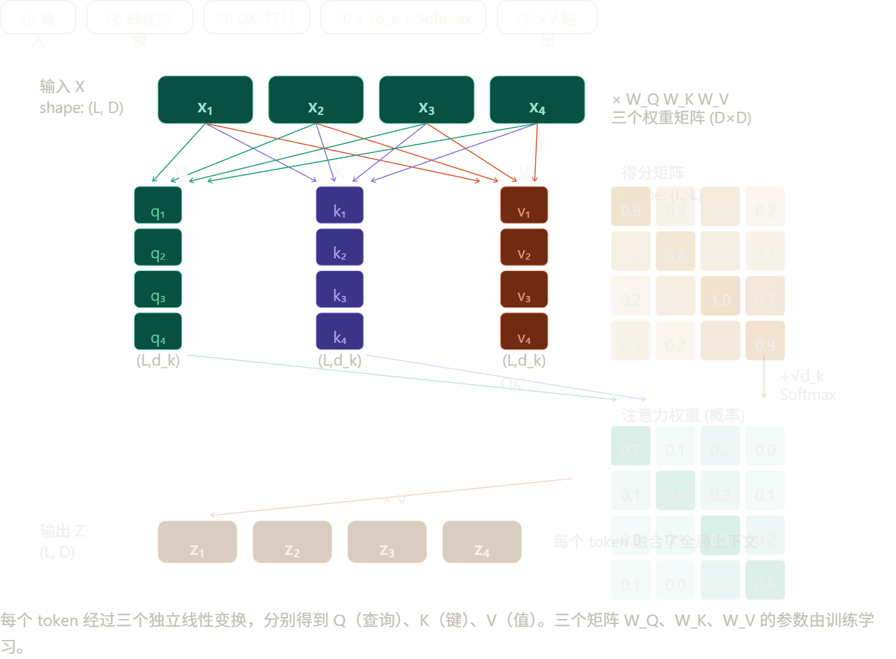

**② 点积打分**：$QK^T$ 让每一对 token 之间产生一个相似度分数，结果是一个 $L \times L$ 的矩阵——记录了句子里所有 token 两两之间的关联强度。除以 $\sqrt{d_k}$ 防止数值过大导致 Softmax 饱和。

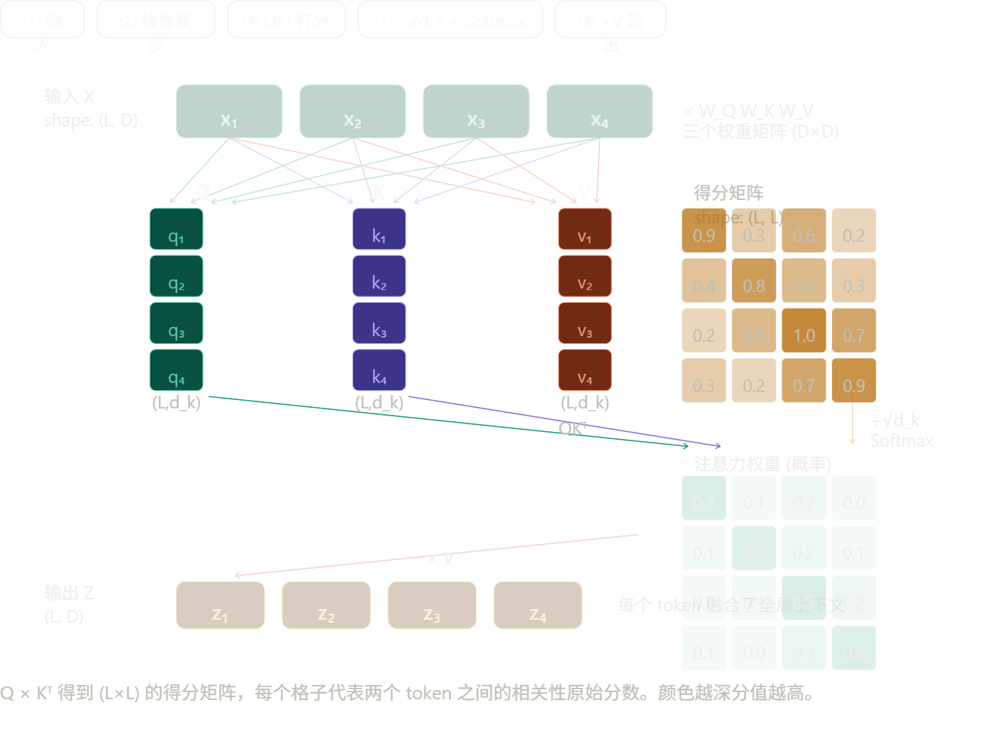

**③ Softmax 归一化**：把原始分数变成概率分布，所有位置的权重加和为 1。现在这个矩阵的每一行就是"当前 token 应该以多大比例关注其他每个 token"。

**④ 加权求和**：用这组权重对 V 做加权平均，得到最终输出。每个 token 的输出向量，本质上是整个句子所有 token 的语义内容按注意力权重混合后的结果。

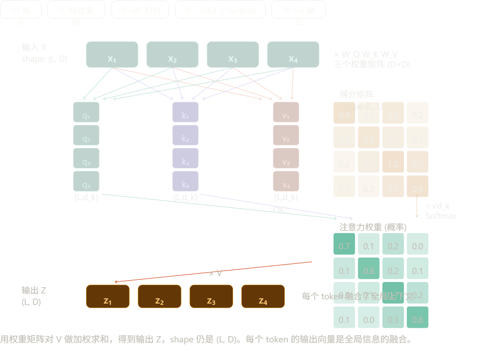

------

**Multi-Head：为什么要分多个头**

单头 Attention 每次只能学到一种关联模式。但语言里同时存在多种不同类型的关系——有的头学语法依存（主谓宾），有的头学指代关系（"他"→"张三"），有的头学局部搭配（"银行"→"取钱"）。多头的机制很简单：把 $D$ 维向量拆成 $H$ 份，每份 $d_k = D/H$ 维，每个头用自己独立的 $W^Q, W^K, W^V$ 在低维空间里做 Attention，最后把 $H$ 个头的结果拼接（Concat）起来，再过一个线性投影还原回 $D$ 维。

计算代价几乎不变（总参数量一样），但表达能力大幅提升——模型可以同时在多个子空间里学习不同类型的关联，而不是把所有信息压缩进一种关联模式。

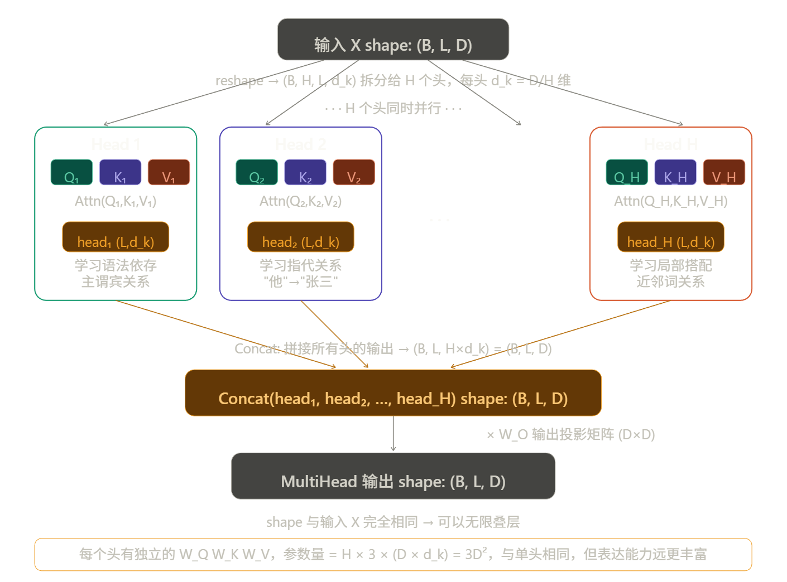

> [!note]
>
> reshape 只是把整体投影结果按维度切片，给每个头分配计算区域，本身并不强制差异。真正的差异来自独立参数 + 随机初始化，再由训练过程中的梯度压力把各头推向不同的特征方向。实际上已有研究（如 BERT 的注意力可视化实验）证实了这一点——不同头确实自发学到了语法依存、指代关系、局部搭配等不同类型的关联。

------

**Self-Attention 的三大优势**

与 RNN 相比，Self-Attention 做到了三件 RNN 做不到的事：

**1. 动态语境化**：同一个词在不同句子里的向量不一样。"银行"在"去银行取钱"和"坐在河岸边"里会被加权成完全不同的语义向量。

**2. 全局 $O(1)$ 连接**：任意两个 token 之间只需要一次点积就能建立关联，不管它们距离多远。RNN 要传递 1000 步才能让首尾词产生关联，信息会衰减。

**3. 完全并行**：整个 $QK^T$ 矩阵乘法一次性完成，不存在时序依赖，GPU 可以把所有位置同时算完。这是大规模预训练成为可能的工程基础。

代价只有一个：注意力矩阵是 $L \times L$ 的，序列越长，显存占用越大。这也是为什么处理长序列（比如高分辨率图像的 patch 序列）时需要 Flash Attention 等优化——这个细节在文生图里非常重要，后面会讲到。

---

### 2.2 前馈网络

前馈网络（FFN）是 Transformer 里存在感最低、但参数量最大的模块。先建立直觉，再看结构。

------

**直觉：Attention 和 FFN 的分工**

一个常被引用的比喻：**Attention 是路由器，FFN 是数据库。**

Attention 做的事是"哪些 token 应该互相交流"——它在 token 之间传递信息，让每个位置的向量融合上下文。但 Attention 本身并不做深度的特征变换，它的输出本质上还是输入向量的加权线性组合。

FFN 做的事是"交流完之后，每个 token 的向量应该变成什么"——它对每个位置独立做非线性变换，是模型存储和提取"知识"的地方。研究者通过实验发现，如果你强行修改 FFN 某些神经元的权重，模型对特定事实的记忆会随之改变（比如"北京是中国的首都"这类知识就存在 FFN 里）。

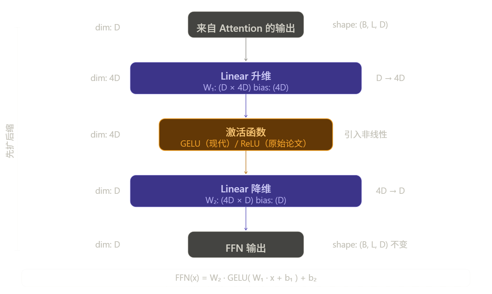

结构极简：两层线性变换，中间夹一个激活函数，输入输出维度都是 $D$，中间膨胀到 $4D$。

------

**为什么先扩维到 4D，再压回 D？**

这个"先扩后缩"的设计是有意为之的，原因有两个层次：

**非线性需要足够宽的空间才能发挥作用。** 激活函数（GELU/ReLU）对每个维度独立作用。如果只在 $D$ 维空间里做，可激活的神经元太少，表达能力有限。扩展到 $4D$ 后，有更多的"槽位"可以被选择性激活，模型可以同时检测更多种类的特征模式。

**4D 这个超参数是经验值，不是推导出来的。** 原始论文直接用了 4 倍，后来大量实验证明这个比例效果稳定。现代一些模型（如 LLaMA）用了不同的比例，但量级大致相同。

------

**FFN 是 Transformer 参数量的主体**

这一点很多人没意识到。以 $d_{model} = 512$ 为例：

- Attention 的参数：$4 \times D^2 = 4 \times 512^2 \approx 1M$（$W^Q, W^K, W^V, W^O$ 各一个）
- FFN 的参数：$2 \times D \times 4D = 8 \times 512^2 \approx 2M$

FFN 的参数是 Attention 的**两倍**。对于一个 32 层的模型，FFN 占全模型参数量约 **2/3**。GPT-3 的 1750 亿参数，大部分都在 FFN 里。

------

**一个关键细节：FFN 对每个 token 独立计算**

FFN 的每个 token 是完全独立处理的——$z_1$ 不会影响 $z_2$ 的计算，反之亦然。所有位置可以完全并行。

但有一点值得注意：虽然各 token 独立计算，它们用的是**同一套** $W_1, W_2$ 权重。这说明 FFN 学到的是"对任意向量做什么样的特征变换"，而不是"对第几个位置做什么"——位置无关的通用知识。

------

**GELU vs ReLU：为什么现代模型换掉了 ReLU**

原始 Transformer 论文用 ReLU，现代模型（BERT、GPT-2 之后）几乎全换成了 GELU。

ReLU 的问题在于它是硬截断：输入 $\leq 0$ 时输出恒为 0，梯度完全消失，这个神经元就"死掉"了。GELU 是软门控，接近 0 的输入会得到一个很小但不为零的输出，梯度更平滑，训练更稳定。

$$\text{ReLU}(x) = \max(0, x)$$  

$$\text{GELU}(x) = x \cdot \Phi(x) \quad \text{（}\Phi \text{ 是标准正态分布的 CDF）}$$

---

### 2.3 交叉注意力

交叉注意力和自注意力的计算公式完全相同，唯一的区别是 Q、K、V 的来源不同。先建立这个对比，再看它在文生图里的具体作用。

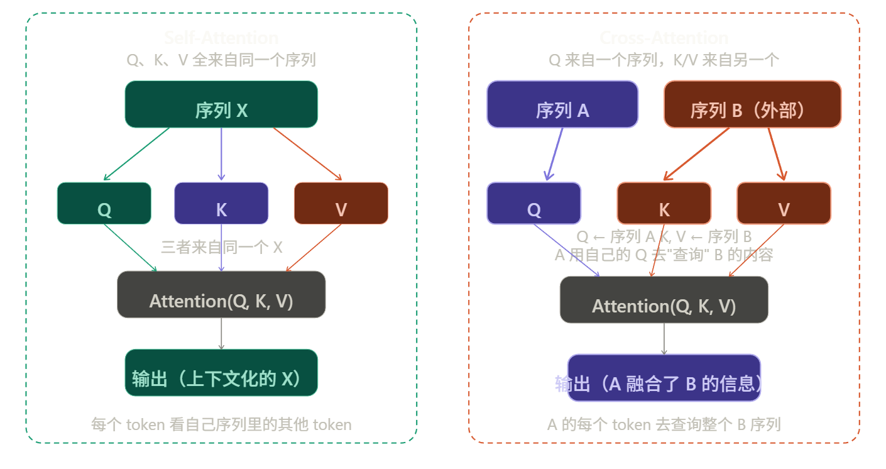

$$\text{CrossAttention}(Q, K, V) = \text{softmax}!\left(\frac{QK^T}{\sqrt{d_k}}\right)V$$

$$Q = X_A W^Q \quad K = X_B W^K \quad V = X_B W^V$$

序列 A 出 Q，序列 B 出 K 和 V。A 的每个 token 用自己的 Q 去和 B 的所有 K 做点积打分，再对 B 的 V 做加权求和。最终结果的 shape 和 A 一致，但每个向量里都融入了 B 的信息。

------

**在原始 Transformer（机器翻译）里的角色**

在 Encoder-Decoder 架构里，A 是解码器当前的状态，B 是编码器的输出。

直觉上就是：**Decoder 每生成一个词，都要回头问一遍 Encoder "我现在应该重点参考输入句子的哪个部分？"**

翻译"I love you"→"我爱你"时，生成"爱"这个字的时候，Cross-Attention 会让 Decoder 的 Q 重点关注 Encoder 输出里"love"对应的 K/V，权重最高，从而把"love"的语义拉进当前生成步骤。

------

### 文字注入图像的核心机制

这是 Cross-Attention 在现代最重要的应用场景。以 Stable Diffusion 为例：

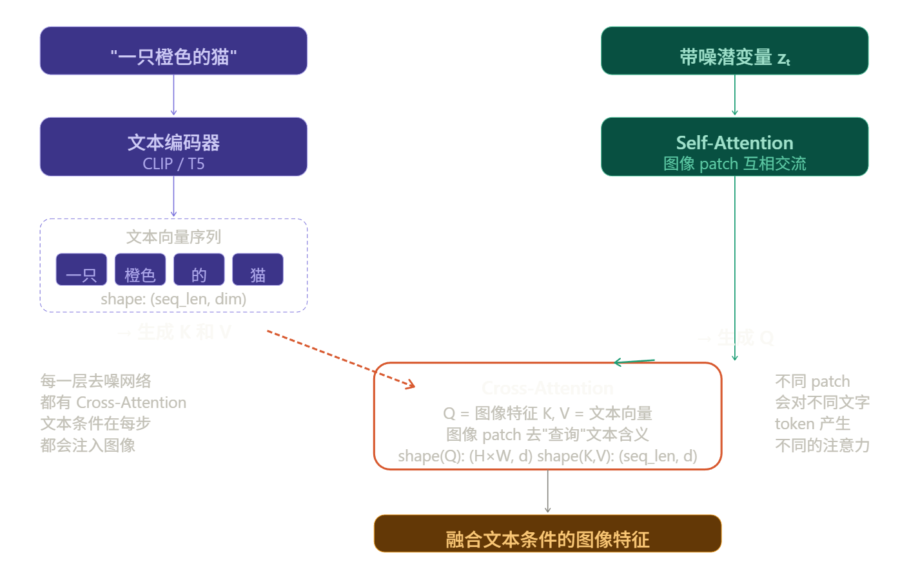

在 Stable Diffusion 的去噪网络（UNet/DiT）里：

**Q 来自图像的 patch 特征**——去噪过程中，每个图像区域的特征向量负责出 Q，问的是："我这个区域应该长什么样？"

**K 和 V 来自文本编码器的输出**——Prompt 经过 CLIP 或 T5 编码后，得到一个 token 向量序列，这个序列固定地作为 K 和 V 提供给所有去噪步骤。

于是，图像每个 patch 的 Q 去和所有文本 token 的 K 做点积打分，分数高的文本 token 的 V 就会被重点加权进来。"猫"这个区域的 patch 会对"猫"这个文字 token 分配高权重，"橙色"区域的 patch 会对"橙色"分配高权重——这就是文字"控制"图像内容的底层机制。

------

**一个维度细节值得关注**

Cross-Attention 里 Q 和 K/V 的序列长度可以**完全不同**，这是和 Self-Attention 的关键差异：

|                 | Q 的序列长度           | K/V 的序列长度         | 输出长度 |
| --------------- | ---------------------- | ---------------------- | -------- |
| Self-Attention  | $L$                    | $L$（同源）            | $L$      |
| Cross-Attention | $L_A$（图像 patch 数） | $L_B$（文本 token 数） | $L_A$    |

注意力矩阵的 shape 变成了 $(L_A \times L_B)$——图像里每个 patch 对每个文字 token 的关注程度。输出的 shape 跟着 Q 走，始终是 $(L_A, d)$，和图像特征序列保持一致。

这个不对称性正是 Cross-Attention 能"桥接两个不同模态"的几何基础——Q 和 K/V 可以来自完全不同长度、甚至不同模态的序列，最终输出只影响 Q 那一侧的表示。

------

### 2.4 残差连接与归一化

先看它们在整个 Block 里的位置，再逐个拆解。每个子层（Attention 或 FFN）结束后都有固定的两步：加残差，然后归一化。两件事独立解决两个不同的问题，分开讲。

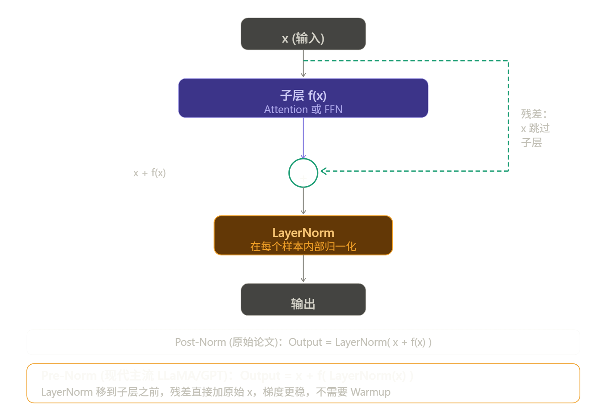

------

**残差连接**

核心公式就是那个加号：$\text{output} = x + f(x)$

**为什么这一个加号如此重要？**

反向传播时，梯度需要从输出端一路传回输入端。经过每一层都要乘以该层的导数。一旦某层的导数很小，梯度就会指数级缩小，传到浅层时趋近于零——这就是梯度消失，模型的前几层根本学不动。

有了残差连接，求导时多了一条路：

$$\frac{\partial \text{output}}{\partial x} = \frac{\partial f(x)}{\partial x} + 1$$

那个 $+1$ 就是高速公路。无论 $f(x)$ 的梯度多小，整条链路的梯度至少是 1，永远不会消失。这就是 ResNet 和 Transformer 能堆几十上百层的根本原因。

**第二个作用：恒等映射的自由**

如果某一层已经学得够好了，最优解是"什么都不改"。但让网络直接学出 $f(x) = x$ 很难。有了残差，只需要让 $f(x) \approx 0$——把参数都初始化趋近于零就行了，这比学恒等映射容易得多。所以深层网络加了残差之后，"多余的层"不会拖累性能，而是自动退化成透明通道。

------

**LayerNorm**

LayerNorm 解决的是另一个问题：**训练过程中向量的数值分布会漂移**，导致后续层的输入越来越难处理。

它的操作很简单——对每个样本的每个向量，在特征维度上做标准化：

$$\text{LayerNorm}(x) = \frac{x - \mu}{\sigma + \epsilon} \cdot \gamma + \beta$$

其中 $\mu$ 和 $\sigma$ 是这个向量自身所有维度的均值和标准差，$\gamma$ 和 $\beta$ 是可学习的缩放和平移参数。

**和 BatchNorm 的根本区别**是归一化的维度不同：BatchNorm 沿列方向归一化——跨所有样本，对同一个特征维度算均值和方差。这在 CV 里没问题，但文本序列长度不等，batch 里不同样本的同一个"位置"语义完全不同，而且 batch size 小时统计不稳，推理时单条样本 BN 直接失效。

LayerNorm 沿行方向归一化——在单个样本内，对它自己所有特征维度算均值和方差。完全不依赖其他样本，序列长短无所谓，推理和训练行为完全一致。这是 NLP 选 LN 的根本原因。

------

**Pre-Norm vs Post-Norm**

这两种变体的差异看起来很小，但训练行为差异显著。

**Post-Norm（原始论文）**

$$\text{output} = \text{LayerNorm}(x + f(x))$$

LayerNorm 在加完残差之后做。输出经过归一化，数值很稳定。但问题在于：梯度反传时要穿过 LayerNorm 再到残差分支，初始阶段梯度不稳，必须配合学习率 Warmup 才能收敛。

**Pre-Norm（现代主流）**

$$\text{output} = x + f(\text{LayerNorm}(x))$$

LayerNorm 在子层之前做，归一化后的输入进 Attention/FFN。残差直接加原始的 $x$，梯度回传时那条 $+1$ 的高速公路完全畅通，不经过任何 LayerNorm。训练更稳定，不需要 Warmup，更容易扩展到很深的网络。LLaMA、GPT-2 之后几乎所有大模型都用 Pre-Norm。


------

### 2.5 位置编码 (Positional Encoding)

**Sinusoidal 位置编码**

给每个位置 $pos$，构造一个和词向量同维度的位置向量，然后直接相加：

$$PE_{(pos,\ 2i)} = \sin!\left(\frac{pos}{10000^{2i/d}}\right) \qquad PE_{(pos,\ 2i+1)} = \cos!\left(\frac{pos}{10000^{2i/d}}\right)$$

偶数维度用 $\sin$，奇数维度用 $\cos$，分母 $10000^{2i/d}$ 让不同维度有不同的波长——低维度变化快（捕捉近距离关系），高维度变化慢（捕捉远距离关系）。

低维度（图顶部）变化很快，每隔几个位置就完成一个周期；高维度（图底部）变化极慢，几乎像一个渐变。不同位置的编码向量在这个高维空间里互不相同，且相邻位置的编码向量比远距离的更相似——这就把"距离"的概念编码进去了。

Sinusoidal 有一个优雅的性质：位置 $pos+k$ 的编码可以用 $pos$ 的编码线性表示出来，这意味着模型可以从相对位置差中学到模式，而不只是绝对位置。但它是固定的（不可学习），而且处理超出训练长度的序列时会退化。

------

**RoPE 旋转位置编码（现代 LLM 主流）**

RoPE 的思路完全不同。它不把位置信息加到词向量上，而是**在计算 Attention 时，把位置信息旋转进 Q 和 K 里**。

核心想法：让两个 token 之间的注意力分数，只依赖它们的**相对位置差** $m - n$，而不是各自的绝对位置。RoPE 把每对相邻维度 $(x_{2i}, x_{2i+1})$ 看作一个二维平面上的向量，对位置 $m$ 的 token 旋转角度 $m\theta_i$：

$$\begin{pmatrix} q'_{2i} \\ q'_{2i+1} \end{pmatrix} = \begin{pmatrix} \cos m\theta_i & -\sin m\theta_i \\ \sin m\theta_i & \cos m\theta_i \end{pmatrix} \begin{pmatrix} q_{2i} \\ q_{2i+1} \end{pmatrix}$$

旋转矩阵有一个数学性质：两个旋转向量的点积，只和它们的**旋转角之差**有关。所以 $q_m \cdot k_n$ 的结果只依赖 $m - n$，完全不依赖 $m$ 和 $n$ 各自是多少。这从根本上把"相对距离"编码进了注意力计算。

---

## 3 数据流

先看一下原文。原文的逻辑是对的，但有几处值得补充和修正：

**问题一**：位置编码的描述不够准确。Sinusoidal 是"相加"，但 RoPE 不是加位置向量，而是在 Attention 计算时旋转 Q 和 K，两者时机不同，不能并列写在同一步。

**问题二**：逐层加工只写了 Attention 和 FFN，漏掉了残差连接和 LayerNorm，而这两个是每个 Block 里实际发生的步骤。

**问题三**：整体是 Decoder-only 的视角（提到了 LLaMA），但没有写最后的输出步骤——逐层加工完之后还有 Linear + Softmax 产生概率分布，再采样出 token，这个自回归循环是生成模型的核心。

下面重写一版，保留原有风格，补全这几处：

------

## 数据流

以 Decoder-only 模型（如 LLaMA）生成一段文字为例，完整走一遍。

### 第一步：分词（Tokenization）

输入文本先被切分成 Token，每个 Token 在词表里有唯一的整数 ID。

- 输入：`"大模型面试"`
- 分词后：`["大", "模型", "面试"]`
- 查表得 ID：`[102, 45, 892]`

Token 不一定是整个词，现代分词器（BPE）会把低频词切成子词，比如 "Transformer" 可能被切成 `["Trans", "former"]`。

### 第二步：词嵌入（Embedding Lookup）

模型有一个可学习的 Embedding Matrix，shape 为 $(V \times D)$，$V$ 是词表大小，$D$ 是向量维度。

用 Token ID 作为行索引，取出对应的行向量。`[102, 45, 892]` 变成三个 $D$ 维向量，拼成矩阵后 shape 是 $(L \times D)$，$L$ 是序列长度。这是每个 token 的"初始语义向量"，此时还没有位置信息，也没有上下文。

### 第三步：注入位置信息

这一步因模型架构不同而不同，需要区分两种情况：

**Sinusoidal / 可学习位置编码**（BERT、原始 Transformer）：构造一个同 shape 的位置向量矩阵，直接与词向量**相加**，得到带位置信息的输入向量。操作在进入 Attention 之前一次性完成。

**RoPE**（LLaMA、Qwen 等现代模型）：不在这里相加，而是在每一层 Attention 计算时，把位置角度**旋转进 Q 和 K** 里。词向量本身不变，位置信息体现在 Attention 的打分过程中。

### 第四步：逐层加工（Transformer Block × N）

携带位置信息的向量矩阵进入 $N$ 个堆叠的 Block，每个 Block 内部的执行顺序如下（以 Pre-Norm 为例）：

```
x  →  LayerNorm  →  Self-Attention  →  + x（残差）
   →  LayerNorm  →  FFN             →  + x（残差）
```

具体来说：

1. **LayerNorm**：先对 $x$ 归一化，稳定数值范围。
2. **Self-Attention**：每个 token 的 Q 去和所有 token 的 K 打分，加权聚合 V，融合全局上下文。"模型"这个词会重点关注"大"，理解自己属于"大模型"这个语境。
3. **残差相加**：把 Attention 的输出加回原始 $x$，梯度高速公路保持畅通。
4. **LayerNorm + FFN + 残差**：再做一次归一化，经过两层线性变换提取深层特征，再加残差。

经过 32 层或更多层的迭代，初始的平凡向量逐渐融入越来越丰富的语义，最终每个位置都携带了全局上下文信息。

### 第五步：输出头（Linear + Softmax）

最后一个 Block 的输出向量经过一个线性层，把 $D$ 维向量映射回词表维度 $V$，再经过 Softmax 得到词表上的概率分布。

```
(L, D)  →  Linear(D → V)  →  Softmax  →  (L, V) 概率分布
```

取最后一个位置的概率分布，采样（或取 argmax）得到下一个 token，把它拼接到输入序列末尾，**重新走一遍第一步到第五步**——这个循环就是**自回归生成**，每次生成一个 token，直到遇到终止符为止。

------

整体的数据形状变化可以这样追踪：

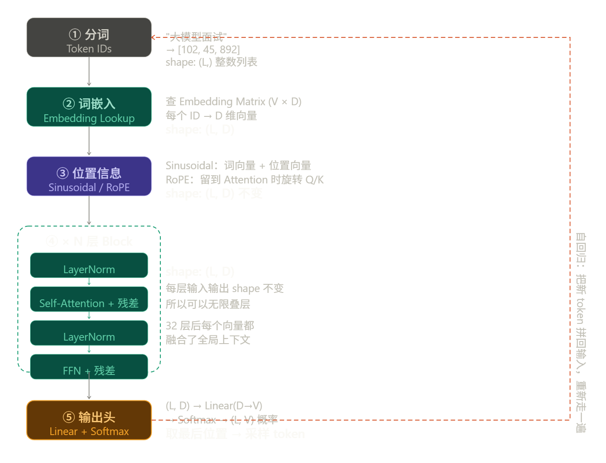

右边的红色虚线箭头是整个生成过程的灵魂——**自回归循环**。每次生成一个 token，拼到序列尾部，重新从第一步走到第五步，再生成下一个。生成 100 个 token 就要完整走 100 遍这条流水线。

原笔记的核心逻辑没有问题，主要补了三处：位置编码区分了 Sinusoidal 和 RoPE 的不同时机；Block 内部加入了 LayerNorm 和残差的位置；补全了输出头和自回归循环这个收尾步骤。

---

## 4 手算一遍 Shape

超参数设定：

| 符号  | 含义            | 值   |
| ----- | --------------- | ---- |
| $B$   | batch size      | 2    |
| $L$   | 序列长度        | 10   |
| $D$   | 模型维度        | 512  |
| $H$   | 注意力头数      | 8    |
| $d_k$ | 每头维度，$D/H$ | 64   |

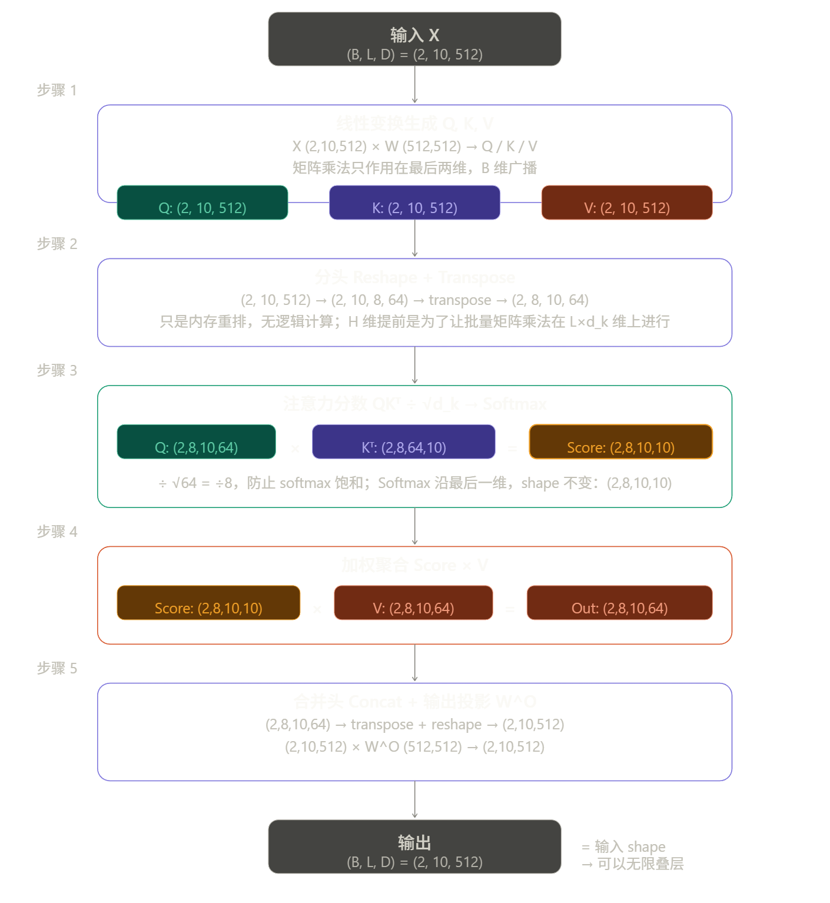

------

**步骤 1：线性变换生成 Q、K、V**

$$X\ (2,10,512) \times W^Q\ (512,512) \rightarrow Q\ (2,10,512)$$

$W^K, W^V$ 同理。矩阵乘法只作用在最后两维，$B$ 维自动广播。此时 Q、K、V 的 shape 和输入 $X$ 完全相同。

------

**步骤 2：分头 Reshape + Transpose**

$$Q\ (2,10,512) \xrightarrow{\text{reshape}} (2,10,8,64) \xrightarrow{\text{transpose}} (2,8,10,64)$$

把 512 维切成 8×64，再把 $H$ 维提到 $L$ 前面。这一步是纯内存重排，没有任何数值计算。把 $H$ 维提前的原因：后续的矩阵乘法需要在 $(L \times d_k)$ 这两个维度上进行，$B$ 和 $H$ 都作为"批次"维度广播。

------

**步骤 3：打分 $QK^T$，缩放，Softmax**

$$Q\ (2,8,10,64) \times K^T\ (2,8,64,10) = \text{Score}\ (2,8,10,10)$$

矩阵乘法只在最后两维发生：$(L, d_k) \times (d_k, L) = (L, L)$。前两维 $(B, H)$ 各自独立，互不干扰。

得到的 $(10 \times 10)$ 矩阵，每一行是一个 token 对所有 token 的相关性分数。

然后 $\div \sqrt{d_k} = \div 8$，防止点积数值过大导致 Softmax 饱和。再沿最后一维做 Softmax，shape 不变，仍是 $(2,8,10,10)$，但每行变成了概率分布，加和为 1。

------

**步骤 4：加权聚合 $\times V$**

$$\text{Score}\ (2,8,10,10) \times V\ (2,8,10,64) = \text{Out}\ (2,8,10,64)$$

$(L, L) \times (L, d_k) = (L, d_k)$，每个 token 得到一个融合了全局上下文的新向量。

------

**步骤 5：合并头 + 输出投影 $W^O$**

$$\text{Out}\ (2,8,10,64) \xrightarrow{\text{transpose+reshape}} (2,10,512) \times W^O\ (512,512) \rightarrow (2,10,512)$$

先把 $(B,H,L,d_k)$ 转置回 $(B,L,H,d_k)$，再 reshape 成 $(B,L,D)$。此时 $H \times d_k = 8 \times 64 = 512 = D$，各头的信息被拼接在一起。最后过 $W^O$ 做线性混合，让各头之间的信息可以互相作用。

------

**最终 shape 汇总：**

| 步骤   | 操作                            | 输出 shape          |
| ------ | ------------------------------- | ------------------- |
| 输入   | —                               | $(2,\ 10,\ 512)$    |
| 步骤 1 | $\times\ W^{Q/K/V}$             | $(2,\ 10,\ 512)$    |
| 步骤 2 | Reshape + Transpose             | $(2,\ 8,\ 10,\ 64)$ |
| 步骤 3 | $QK^T \div\sqrt{d_k}$ + Softmax | $(2,\ 8,\ 10,\ 10)$ |
| 步骤 4 | $\times\ V$                     | $(2,\ 8,\ 10,\ 64)$ |
| 步骤 5 | Concat + $\times\ W^O$          | $(2,\ 10,\ 512)$    |

输入和输出 shape 完全一致，这就是 Transformer 能叠几十层的几何原因——每一层都是"吃进 $(B,L,D)$，吐出 $(B,L,D)$"的黑箱，可以无限串联。


---

## 5 架构权衡

原始 Transformer 是为机器翻译设计的完整 Encoder-Decoder 结构。后来研究者发现，根据任务性质只保留一侧往往效果更好、成本更低。目前主流的三种变体各有不同的注意力模式，这是它们能力差异的根本来源。

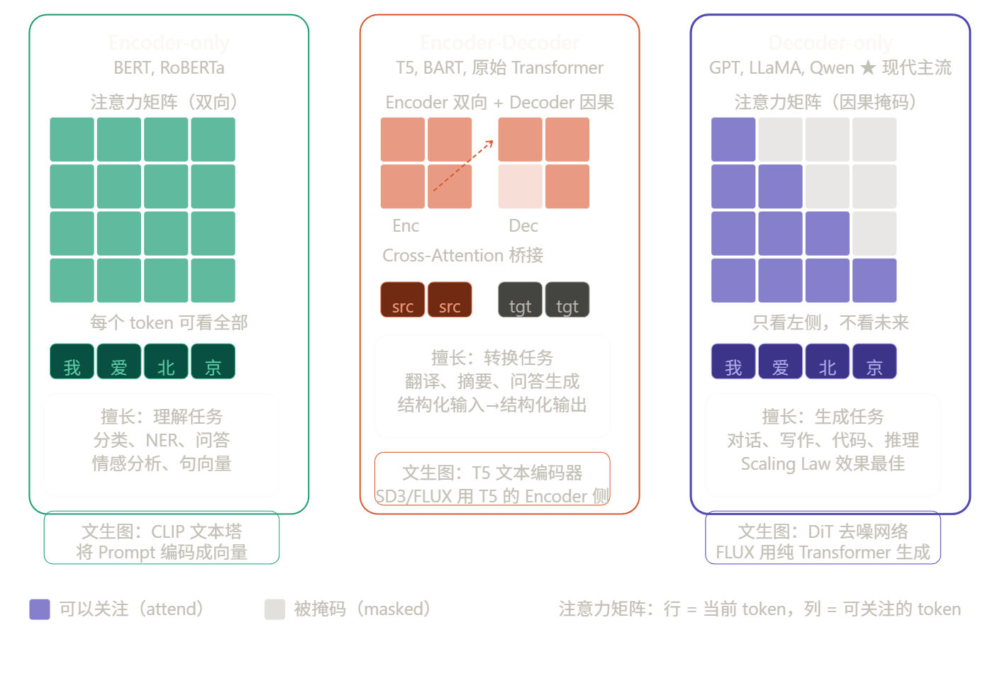

三种架构的本质差异就是注意力矩阵的形状：Encoder-only 是完整的实心矩阵（双向），Decoder-only 是下三角矩阵（因果掩码），Encoder-Decoder 是两者的组合。

------

## 三种架构详解

**Encoder-only（BERT 系）**

每个 token 的注意力可以同时看到左边和右边，这叫"双向注意力"。因为能看到完整上下文，每个位置的向量表征非常精准。但正因为能看到未来，它无法自回归生成——你不能一边生成第 5 个词，一边让它看到第 6 个词。所以它不适合做生成任务，擅长的是理解类任务：分类、NER、相似度计算、抽取式问答。

在文生图里，CLIP 的文本塔就是一个 Encoder-only 结构，把 Prompt 编码成向量序列，作为 Cross-Attention 的 K 和 V。

**Encoder-Decoder（T5、BART）**

两侧分工明确：Encoder 用双向注意力读懂输入，Decoder 用因果掩码逐步生成输出，两者之间靠 Cross-Attention 桥接。这个设计最适合"输入和输出是两个不同序列"的任务，比如翻译（源语言→目标语言）、摘要（长文→短文）。

在文生图里，FLUX 和 SD3 使用的 T5-XXL 就是 Encoder-Decoder 架构，但只用它的 Encoder 侧来提取文本特征，Decoder 侧丢弃不用。T5 的 Encoder 对复杂语义的理解能力比 CLIP 更强，所以新一代文生图模型用 T5 替代或补充 CLIP。

**Decoder-only（GPT、LLaMA、Qwen）**

只有一个带因果掩码的自注意力，每个 token 只能看到它左边的所有 token。训练目标是预测下一个词，推理时逐步自回归生成。

**为什么它在 Scaling Law 上最好？** 原因有两个：一是结构简单，参数利用率最高，同等参数量下计算效率更好；二是自回归训练目标（预测下一个 token）和任何形式的生成任务天然对齐，只需要把问题和答案拼成一个序列就能训练，不需要为每类任务设计不同的目标函数。数据越多、参数越大，它涌现出的能力越强。这是 GPT-4、LLaMA 3 全面转向 Decoder-only 的根本原因。

------

## 三种架构的选择原则

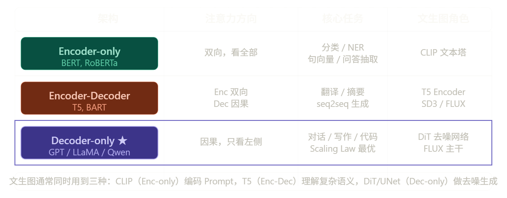

最后一行是文生图的关键视角：现代文生图系统（FLUX、SD3）往往同时用到三种架构。CLIP 的 Encoder-only 负责把 Prompt 快速映射成视觉-语义对齐的向量；T5 的 Encoder 侧负责理解复杂的长句子语义；DiT 的 Decoder-only 风格主干负责在潜空间里逐步去噪生成图像，三者通过 Cross-Attention 组合在一起。

------

## 后续需要了解的基础组件

要理解文生图，Transformer 之后还需要掌握这三个独立的模块：

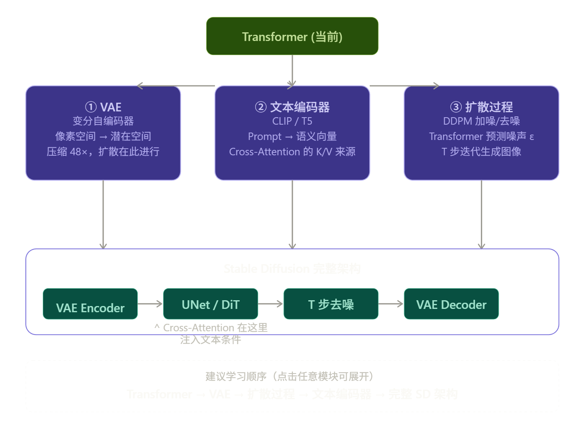

三个模块各自独立，但最终在 Stable Diffusion 里汇合，简单说明各自的核心学习重点：

**① VAE（变分自编码器）**——重点是"为什么要压缩"而不是"怎么实现压缩"。关键直觉：直接在 $512\times512$ 像素上跑扩散，Attention 的 $O(L^2)$ 会让计算量爆炸。VAE 把图像编码成 $64\times64\times4$ 的潜空间（latent space），体积缩小 48 倍，所有的扩散和去噪都在这个压缩空间里进行，最后再 decode 回像素。学习重点是 Encoder/Decoder 结构和 KL 散度正则项的直觉。

**② 文本编码器（CLIP / T5）**——重点是理解"它输出的是什么"，而不是"它内部怎么训练"。输出是一个形状为 `[seq_len, dim]` 的向量序列，每个位置对应一个 token 的语义向量。这个序列直接作为 Cross-Attention 的 K 和 V，告诉图像生成网络"你应该往什么方向生成"。SDXL 同时使用 CLIP 和 OpenCLIP 两个编码器，理解它们的拼接方式也是一个考点。

**③ 扩散过程（DDPM）**——重点是"Transformer/UNet 在整个流程里的位置"。前向过程（加噪）是数学上固定的，一步可以算出任意时刻 $t$ 的带噪图像。反向过程（去噪）才是神经网络负责的部分——网络的输入是带噪的潜变量 $z_t$ 和时间步 $t$，输出是对噪声 $\epsilon$ 的预测，然后用这个预测把噪声一步步去掉。Cross-Attention 就嵌在这个去噪网络的每一层里。

掌握这三块之后，Stable Diffusion 的整体架构就能完整串起来了。之后 ControlNet、LoRA 之类的进阶话题也都是在这个基础上加条件或者修改参数的方式，学起来会容易很多。