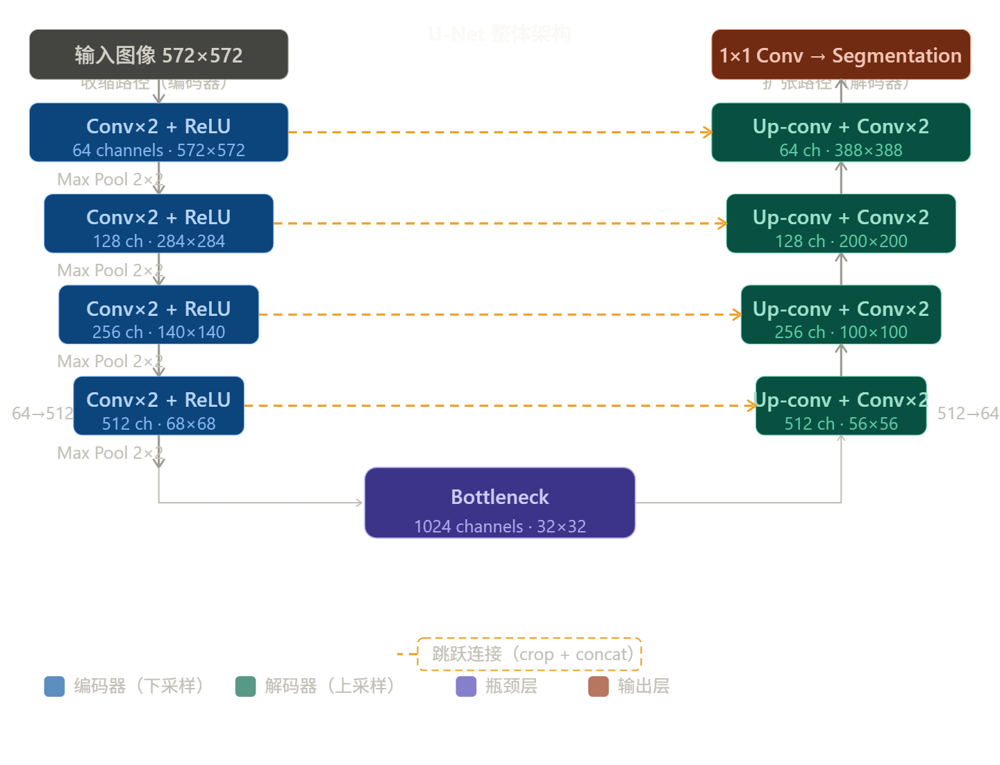
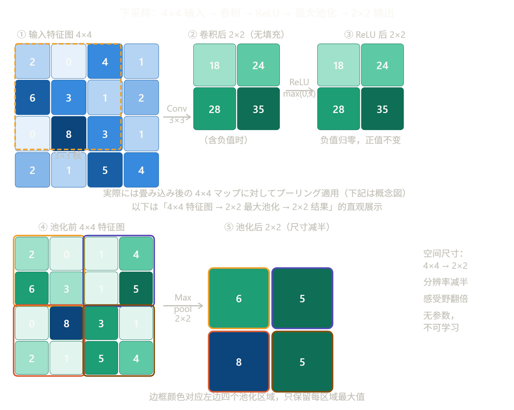
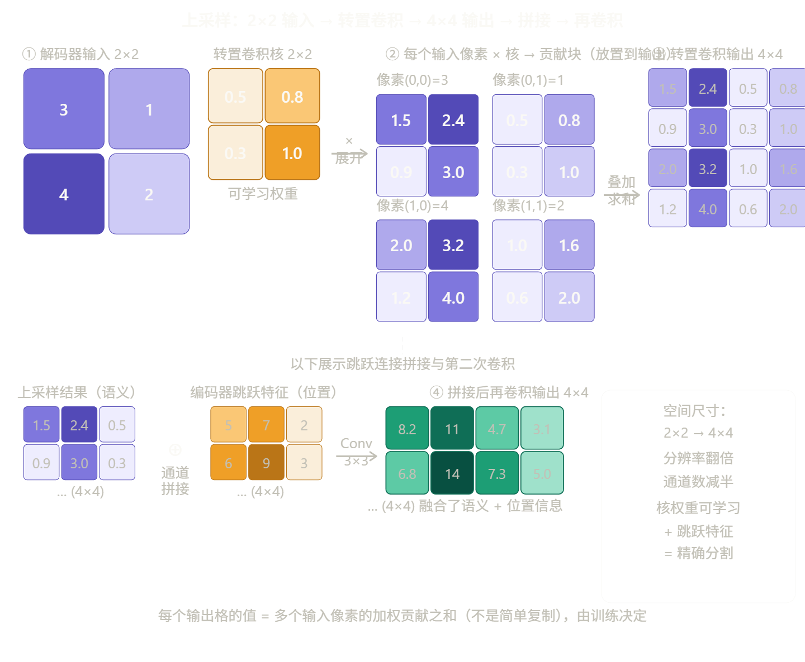

# U-Net

## 论文背景

论文发表于 2015 年，要解决的核心问题是**医学图像的语义分割**——不仅要识别图像里有什么，还要精确标注每一个像素属于哪一类。

当时面临两大困难：一是医学数据极度稀缺，标注一张病理图像需要专业医生耗费大量时间；二是已有方法（如滑动窗口卷积网络）速度慢、定位和上下文难以兼顾。U-Net 就是为了同时解决这两个问题而生的。

------

## 整体架构

U-Net 最大的特点是其对称的"U形"结构，由**收缩路径（Contracting Path）**和**扩张路径（Expanding Path）**组成，并通过**跳跃连接（Skip Connections）**将两者相连。

## 收缩路径

收缩路径就是经典的卷积神经网络结构，共进行 4 次下采样，每一层的操作固定为：

**两次 3×3 卷积 + ReLU → 2×2 最大池化（步长 2）**

每次下采样后，特征图的空间尺寸减半，通道数加倍（64 → 128 → 256 → 512）。这一过程让网络不断扩大感受野，捕获越来越抽象的语义信息。

瓶颈层（Bottleneck）在最底部，通道数达到 1024，空间分辨率最低（32×32），是整个网络语义压缩最强的地方。

------

## 扩张路径

解码器是 U-Net 最重要的创新之一。它的每一步操作为：

**2×2 上卷积（Up-conv）→ 与编码器特征拼接（concat）→ 两次 3×3 卷积 + ReLU**

上卷积（转置卷积）将特征图的空间尺寸翻倍，通道数减半。最终，1×1 卷积将 64 通道特征映射到目标类别数量，输出像素级分割图。

------

## 跳跃连接

这是 U-Net 最核心的设计，也是它优于普通编码器-解码器的根本原因。跳跃连接的逻辑很直观：编码器在下采样时会逐渐丢失空间细节（边缘、纹理、位置信息），但这些细节对于像素级分割至关重要。U-Net 把对应层编码器的特征图裁剪后直接拼接到解码器的对应位置，相当于给解码器"附上一张参考地图"，让它知道每个语义特征精确在哪里。

注意论文中这里用的是**裁剪再拼接（crop + concat）**，因为无填充卷积导致特征图边缘有损失，需要先裁剪到相同尺寸再拼接。

------

## 贡献与影响

U-Net 的贡献不限于医学影像。它在**扩散模型（Diffusion Models）**中被广泛采用：Stable Diffusion、DALL-E 2 等都将 U-Net 作为去噪网络的骨干，并在跳跃连接处加入 Cross-Attention 来融合文本条件。U-Net 的核心思想——**多尺度特征的编解码加跳跃连接**——至今仍是图像生成领域最重要的架构范式之一。

