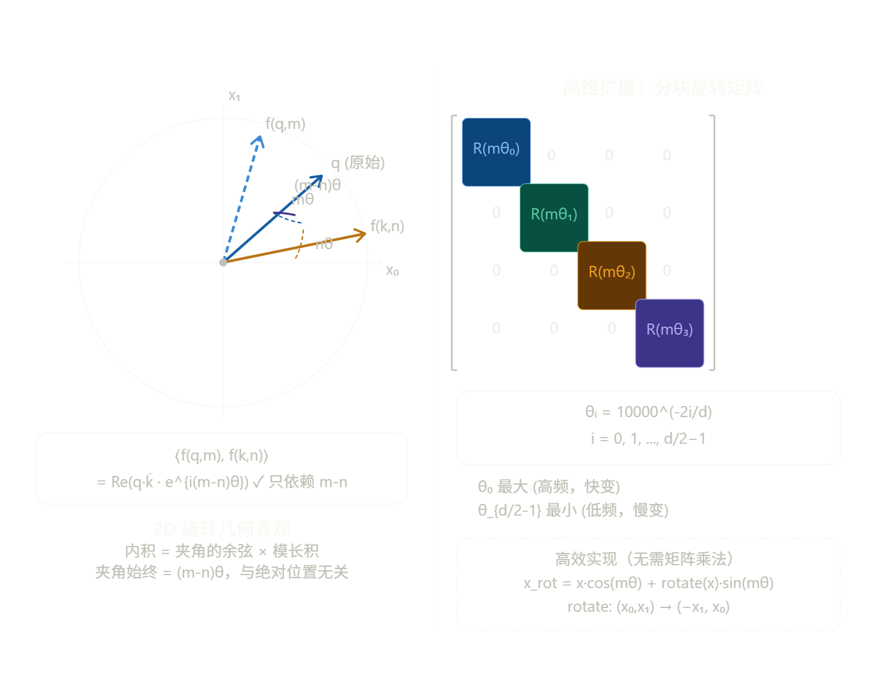
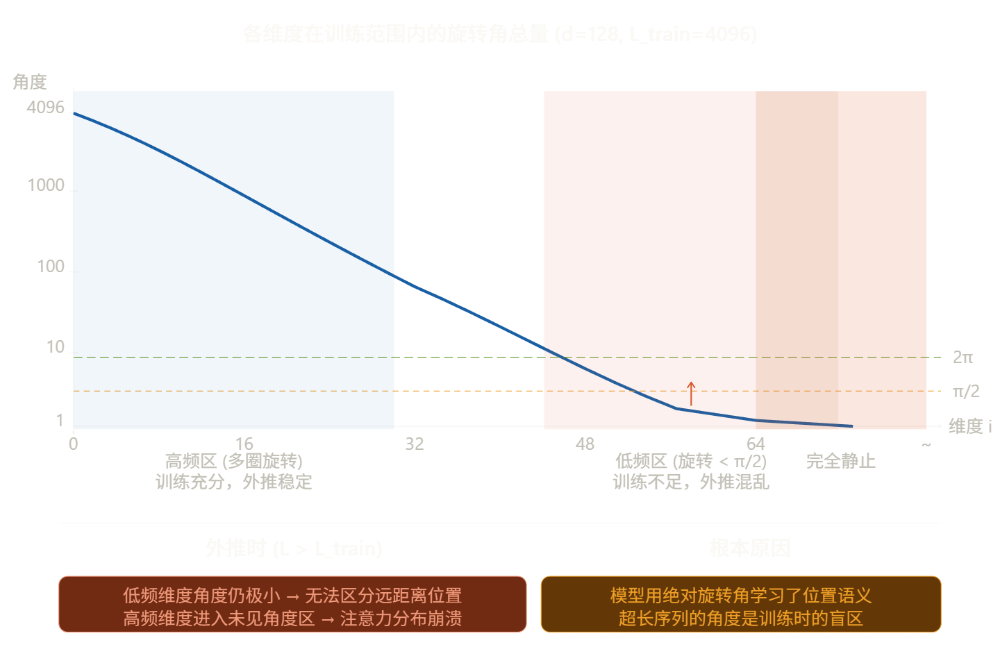

# 位置编码

## Sinusoidal

Sinusoidal 位置编码是 Transformer 论文《Attention is All You Need》中提出的经典方案。理解它的关键在于：**如何用确定性的数学函数，在不引入额外参数的情况下，让模型感知到序列的顺序和距离。**

------

### 核心公式推导

对于位置索引 $pos$ 和维度索引 $i$（$i \in [0, d_{model}/2)$），其编码向量 $PE$ 的每个分量定义如下：

$$PE_{(pos, 2i)} = \sin\left(\frac{pos}{10000^{2i/d_{model}}}\right)$$

$$PE_{(pos, 2i+1)} = \cos\left(\frac{pos}{10000^{2i/d_{model}}}\right)$$

**公式拆解：**

- **波长：** 分母 $10000^{2i/d_{model}}$ 决定了正弦波的周期。随着维度 $i$ 的增加，分母变大，频率降低，波长变长。
- **几何级数：** 波长构成一个从 $2\pi$ 到 $10000 \cdot 2\pi$ 的几何级数，这意味着低维度捕捉**局部细微变化**，高维度捕捉**全局长程关系**。

------

**为什么相邻位置更相似？**

这是一个直观但深刻的问题。由于 $\sin$ 和 $\cos$ 是连续函数，当 $pos$ 发生微小变化时，对应的函数值也只会发生微小变化。

1. **欧几里得距离：** 如果两个位置 $pos_1$ 和 $pos_2$ 很接近，那么在所有维度上，$PE$ 的值都会非常接近。
2. **L-2 Norm 的稳定性：** 在 $d_{model}$ 维度足够高的情况下，这种连续性保证了相邻位置向量在空间中的“欧氏距离”较短。
3. **点积感知：** Transformer 依赖点积（Dot Product）计算注意力。相邻位置的向量点积通常较大，这符合自然语言的规律：**邻近的词往往具有更强的语义关联。**

------

### 相对位置的线性表示

这是 Sinusoidal 方案最精妙的地方。作者希望模型能够学习到**相对位置**，即 $pos$ 和 $pos+k$ 之间的关系。

基于三角函数公式：

$$\sin(A+B) = \sin A \cos B + \cos A \sin B$$

$$\cos(A+B) = \cos A \cos B - \sin A \sin B$$

对于任何固定的偏移量 $k$，位置 $pos+k$ 的编码可以表示为位置 $pos$ 的线性变换：

$$\begin{pmatrix} PE_{(pos+k, 2i)} \\ PE_{(pos+k, 2i+1)} \end{pmatrix} = \begin{pmatrix} \cos(\Delta_i) & \sin(\Delta_i) \\ -\sin(\Delta_i) & \cos(\Delta_i) \end{pmatrix} \begin{pmatrix} PE_{(pos, 2i)} \\ PE_{(pos, 2i+1)} \end{pmatrix}$$

其中 $\Delta_i$ 是与 $k$ 相关的常数。

**这意味着：** 模型只需要通过一套线性权重，就能从 $pos$ 的信息中推导出 $pos+k$ 的信息，从而获得感知“距离”的能力。

------

### 局限性

虽然 Sinusoidal 理论上可以处理无限长的序列，但实际上它存在**外推性（Extrapolation）**瓶颈：

- **高频消失：** 对于极长的序列（例如 $pos > 10000$），公式中的分母变得非常大，导致几乎所有维度的 $\sin/\cos$ 都处于非常缓慢变化的区间（接近线性）。
- **分辨率损失：** 当 $pos$ 远超训练时的最大长度时，模型在注意力机制中无法区分极其遥远的两个位置，因为它们的编码在向量空间中变得过于密集，甚至出现严重的数值重叠。
- **注意力稀疏性失效：** 随着距离增加，点积本应平滑衰减，但在超长序列下，这种衰减规律会因为超出函数周期而失效，导致模型产生错乱。

------

Sinusoidal 方案虽然在目前的 LLM 中（如 Llama）被 RoPE 取代，但它留下了两个极其重要的遗产：

**维度与频率的对应关系：** 启发了后来的多尺度位置表示。

**旋转思想的萌芽：** RoPE 本质上就是把 Sinusoidal 的这种线性变换直接融合进了 Attention 的点积运算中。

---

## 可学习位置编码

在 Sinusoidal 方案提出后，NLP 领域经历了一段探索期，BERT（Bidirectional Encoder Representations from Transformers）选择了另一条道路：**可学习位置编码（Learned Positional Encoding）**。

这种方法的核心思想非常直接：**既然模型要学习词的含义（Word Embedding），为什么不让模型自己学习每个位置的含义呢？**

------

### 位置即 Embedding

可学习位置编码不再使用确定性的三角函数计算，而是将**位置（Position Index）**本身视为一个需要被 Embedding 的特征。

**具体步骤：**

1. **预定义最大长度：** 开发者必须首先确定模型能处理的最大序列长度（Max Sequence Length），例如 BERT 是 512，GPT-2 是 1024。
2. **创建查找表：** 在模型中初始化一个巨大的二维矩阵 $\mathbf{PE} \in \mathbb{R}^{Max\_Len \times d_{model}}$。这个矩阵的每一行对应一个特定的位置。
3. **查找与求和：** 当输入一个句子（例如 10 个词）时，模型会：
   - 查出这 10 个词的 Word Embeddings：$\mathbf{E} = [e_0, e_1, ..., e_9]$。
   - 查出对应的前 10 个位置编码：$\mathbf{P} = [p_0, p_1, ..., p_9]$。
   - 将它们直接相加，作为 Transformer 的最终输入：$\mathbf{X} = \mathbf{E} + \mathbf{P} = [e_0+p_0, e_1+p_1, ..., e_9+p_9]$。

**关键点：**

- 这个位置矩阵 $\mathbf{PE}$ 中的所有数值最初都是随机初始化的（例如使用服从高斯分布的小随机数）。
- 在模型训练（Pre-training）过程中，$\mathbf{PE}$ 就像模型的权重一样，通过反向传播算法不断更新。
- **训练完成后，这些位置向量就被“固定”下来**。位置 0 的向量会形成某种特定的激活模式，用来表达“这是句子的开始”，位置 5 会形成另一种模式。

------

### BERT 方案的优缺点

BERT 选择这种方案，既有其合理性，也留下了隐患。

**优点：**

1. **实现极其简单：** 它的逻辑与 Word Embedding 完全一致，不需要设计复杂的数学公式。
2. **高度灵活：** 模型可以完全根据数据的分布，自由地调整每个位置的向量表示，理论上能够学到最适合当前任务的位置关系。

**缺点：**

1. **绝对位置感知，缺乏相对位置感：** 可学习位置编码本质上学到的是**“我在哪里”**（例如：“我是第 10 个词”），而不是**“我和你离多远”**。虽然模型可以通过多层 Self-Attention 学习到距离，但位置向量本身没有显式的距离约束。
2. **最大的痛点：外推性为零：**
   - 如果在预训练时，最大的位置编码是 511，那么在推理时，模型遇到第 513 个词，完全**没有任何对应的向量**可以提供。
   - 你不能通过线性插值或外推来虚构一个向量，因为这些向量是训练出来的特定模式，虚构的向量在语义上对模型来说毫无意义。
   - **这就意味着：模型的最大推理长度被锁死在预训练时的最大长度上，没有任何扩展余地。**

## RoPE

### 目标

标准 Attention 的内积 $\langle q_m, k_n \rangle$ 完全不知道位置信息。我们希望设计一个函数 $f$，满足：

$$\langle f(q, m),\ f(k, n) \rangle = g(q, k, m-n)$$

右边只依赖**相对距离** $m-n$，与绝对位置 $m, n$ 无关。这不是工程上的权宜之计，而是一个严格的数学约束，RoPE 的全部推导都从这里出发。

------

### 2D 情形的完整推导

先在二维空间里找满足上述约束的 $f$。把 2D 向量写成复数：$q = q_0 + iq_1$，两个复数的内积等于实部的点积，即：

$$\langle q, k \rangle = \text{Re}(q \cdot \bar{k})$$

于是我们把问题转化为：找复数函数 $f(x, m)$，使得：

$$\text{Re}(f(q,m) \cdot \overline{f(k,n)}) = g(q, k, m-n)$$

**猜测形式**：令 $f(x, m) = x \cdot e^{im\theta}$，即把向量旋转 $m\theta$ 角。验证：

$$f(q,m) \cdot \overline{f(k,n)} = q e^{im\theta} \cdot \overline{k e^{in\theta}} = q\bar{k} \cdot e^{i(m-n)\theta}$$

取实部：

$$\text{Re}(q\bar{k} \cdot e^{i(m-n)\theta}) = |q||k|\cos(\angle(q,k) + (m-n)\theta)$$

右边只依赖 $m-n$，✓ 约束满足。

写回矩阵形式，复数乘 $e^{im\theta}$ 等价于左乘旋转矩阵：

$$f(x, m) = \begin{pmatrix} \cos m\theta & -\sin m\theta \\ \sin m\theta & \cos m\theta \end{pmatrix} \begin{pmatrix} x_0 \ x_1 \end{pmatrix}$$

### 高维扩展与频率选择

把 $d$ 维向量按相邻两维分成 $d/2$ 组，每组独立旋转，整体旋转矩阵是块对角结构：

$$\mathbf{R}(m) = \text{blockdiag}\bigl(R(m\theta_0),\ R(m\theta_1),\ \ldots,\ R(m\theta_{d/2-1})\bigr)$$

频率的设计沿用 Sinusoidal 的思路：

$$\theta_i = 10000^{-2i/d}, \quad i = 0, 1, \ldots, \frac{d}{2}-1$$

频率从 $\theta_0 = 1$（最高频）指数衰减到 $\theta_{d/2-1} = 10000^{-1} \approx 10^{-4}$（最低频）。这个设计保证了**每个维度对的旋转速率覆盖不同的距离尺度**——高频维度区分近距离，低频维度区分远距离，与 Sinusoidal 的多尺度时钟思路一脉相承，但现在嵌入在旋转操作里。

**高效实现**不需要真的构造并乘以 $d\times d$ 的矩阵。利用旋转公式展开：

$$[f(x,m)]*{2i} = x*{2i}\cos(m\theta_i) - x_{2i+1}\sin(m\theta_i)$$ $$[f(x,m)]*{2i+1} = x*{2i}\sin(m\theta_i) + x_{2i+1}\cos(m\theta_i)$$

等价写法：先把奇数位取反得到 $x' = (-x_1, x_0, -x_3, x_2, \ldots)$，然后：

$$f(x, m) = x \odot \cos(m\boldsymbol{\theta}) + x' \odot \sin(m\boldsymbol{\theta})$$

只需两次逐元素乘法，复杂度 $O(d)$，非常高效。

------

### 三个数学性质

**性质 1：内积只依赖相对位置**

将 Attention 的 QK 内积展开，对每个子空间 $i$ 单独计算：

$$\langle f(q,m), f(k,n) \rangle = \sum_{i=0}^{d/2-1} \text{Re}\bigl(f(q,m)*{(i)} \cdot \overline{f(k,n)*{(i)}}\bigr)$$

对第 $i$ 个子空间，利用复数旋转：

$$\text{Re}\bigl(q_{(i)} e^{im\theta_i} \cdot \overline{k_{(i)} e^{in\theta_i}}\bigr) = \text{Re}\bigl(q_{(i)}\bar{k}_{(i)} \cdot e^{i(m-n)\theta_i}\bigr)$$

整个内积变成：

$$\langle f(q,m), f(k,n) \rangle = \sum_{i=0}^{d/2-1} \text{Re}\bigl(q_{(i)}\bar{k}_{(i)} \cdot e^{i(m-n)\theta_i}\bigr)$$

右边只含 $m-n$，**相对位置性质得证**。

**性质 2：长程衰减（远距离注意力自然降低）**

固定 $q, k$，考察内积随相对距离 $r = m-n$ 的变化。每一项 $\text{Re}(q_{(i)}\bar{k}*{(i)} \cdot e^{ir\theta_i})$ 是一个振幅为 $|q*{(i)}||k_{(i)}|$、频率为 $\theta_i$ 的余弦函数。把所有子空间叠加：

$$\langle f(q,m), f(k,n)\rangle = \sum_{i} |q_{(i)}||k_{(i)}| \cos\bigl(r\theta_i + \phi_i\bigr)$$

其中 $\phi_i = \angle(q_{(i)}) - \angle(k_{(i)})$ 是各子空间的相位差。当 $r$ 增大时，不同频率的余弦项**相位各异地振荡**，求和趋于相消，期望值趋近于零。这不是单调衰减，而是统计意义上的衰减——相距越远，随机 $q,k$ 的平均注意力越低，符合语言模型的先验。

**性质 3：旋转不变的范数**

旋转是等距变换，$|f(x, m)| = |x|$，向量范数不随位置变化。这保证了引入 RoPE 不会改变 Attention 的数值尺度，训练稳定。

------

### 外推为什么会失败？

核心矛盾在于：RoPE 的数学保证是**相对位置**，但训练过程中模型通过梯度下降实际学习的是**特定角度范围下的注意力模式**。位置 512 和位置 1024 的差异，是通过它们旋转角之差来表达的——如果从未见过更大的角度，模型就没有能力处理。

------

**YaRN：从 NTK 理论出发的修复**

### 位置插值（PI）的问题

最朴素的想法是**线性压缩**：把位置 $m$ 替换为 $m' = m \cdot L_{\text{train}} / L_{\text{target}}$，使所有位置的旋转角都落回训练范围。但这等比压缩了所有频率，包括高频维度——原来用于区分相邻 token 的高频旋转被"压平"了，**近距离分辨率严重下降**。

### NTK-aware 插值

YaRN 的理论基础来自**神经正切核（NTK）**的视角：把位置编码看作一个连续信号，旋转角 $m\theta_i$ 是位置 $m$ 在第 $i$ 个频率分量上的"采样"。为了支持更长上下文 $s = L_{\text{target}} / L_{\text{train}}$ 倍，需要把基频做整体缩放：

$$\theta_i' = 10000'^{-2i/d}, \quad 10000' = 10000 \cdot s^{d/(d-2)}$$

这相当于把整个频率谱向低频方向平移，使得原来低频维度也能在新长度下有足够的旋转区分度，同时高频维度损失相对较小。

### YaRN 的分段策略

YaRN 更进一步，按每个维度的波长 $\lambda_i = 2\pi / \theta_i$ 与上下文长度的关系，分三段处理：

$$\theta_i^{\text{YaRN}} = \begin{cases} \theta_i & \text{若 } \lambda_i < \alpha \cdot L_{\text{train}} \quad \text{（高频，保留）} \\ \theta_i / s & \text{若 } \lambda_i > \beta \cdot L_{\text{train}} \quad \text{（低频，缩放）} \\ \text{线性插值} & \text{（中间过渡）} \end{cases}$$

YaRN 还引入了一个**注意力温度系数** $\sqrt{t}$：因为低频维度被缩放后旋转变慢，QK 内积的方差会下降，softmax 分布趋于平坦。用 $\sqrt{t}$ 对注意力分数整体缩放，补偿这一能量变化，实测效果显著。

------

**LongRoPE：每层独立搜索缩放因子**

LongRoPE 的出发点是：YaRN 的分段阈值 $\alpha, \beta$ 是手动设定的全局超参，但不同 Transformer 层对位置信息的依赖模式是不同的——浅层更关注局部，深层更关注全局。

LongRoPE 用**进化算法（EA）**对每个注意力层、每个频率维度单独搜索最优缩放因子 $\lambda_i^{(l)}$，使得困惑度最小，然后在极少量微调（甚至不微调）下就能将上下文扩展到 2M token。关键发现是：

1. 不同层确实需要不同的缩放策略，统一的 YaRN 参数是次优的
2. 通过两阶段搜索（先扩展到目标长度，再恢复短上下文性能），可以同时保留短文本和长文本的能力
3. 这一思路在 Phi-3 等模型中得到验证

---

**为什么只旋转 Q 和 K，不旋转 V？** 因为位置关系体现在注意力权重里（由 QK 内积决定），V 只是被加权求和的内容，旋转它没有意义。

**为什么基底选 10000，不是其他数？** 这是一个工程选择——10000 使得最低频维度的波长约为 $2\pi \times 10000 \approx 63000$ 个位置，远超常见训练长度，保证低频维度在训练范围内变化平滑。更大的基底意味着更长的波长，YaRN 的 NTK 方法本质上就是**调大这个基底**。

**RoPE 和 Sinusoidal 的本质区别？** Sinusoidal 把位置信息加到向量上（绝对位置，加法），而 RoPE 把位置信息乘进旋转矩阵（通过内积展现相对位置，乘法）。加法残留了绝对位置信息，导致外推时分布偏移；旋转则是等距变换，只影响角度关系。

**实际代码中 `cos_cached / sin_cached` 是什么？** 模型初始化时预计算好所有位置的 $\cos(m\theta_i)$ 和 $\sin(m\theta_i)$，存成形状为 `(max_len, d/2)` 的缓存矩阵，前向传播时直接查表，不需要每次重新计算三角函数。
