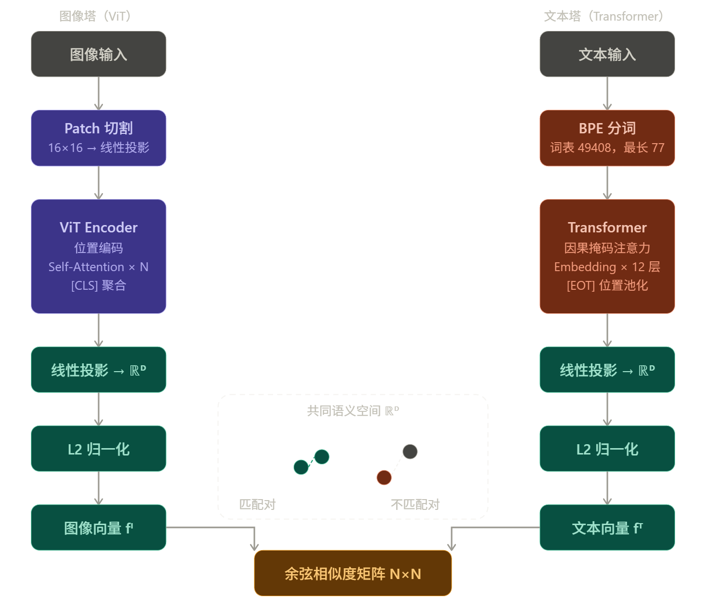
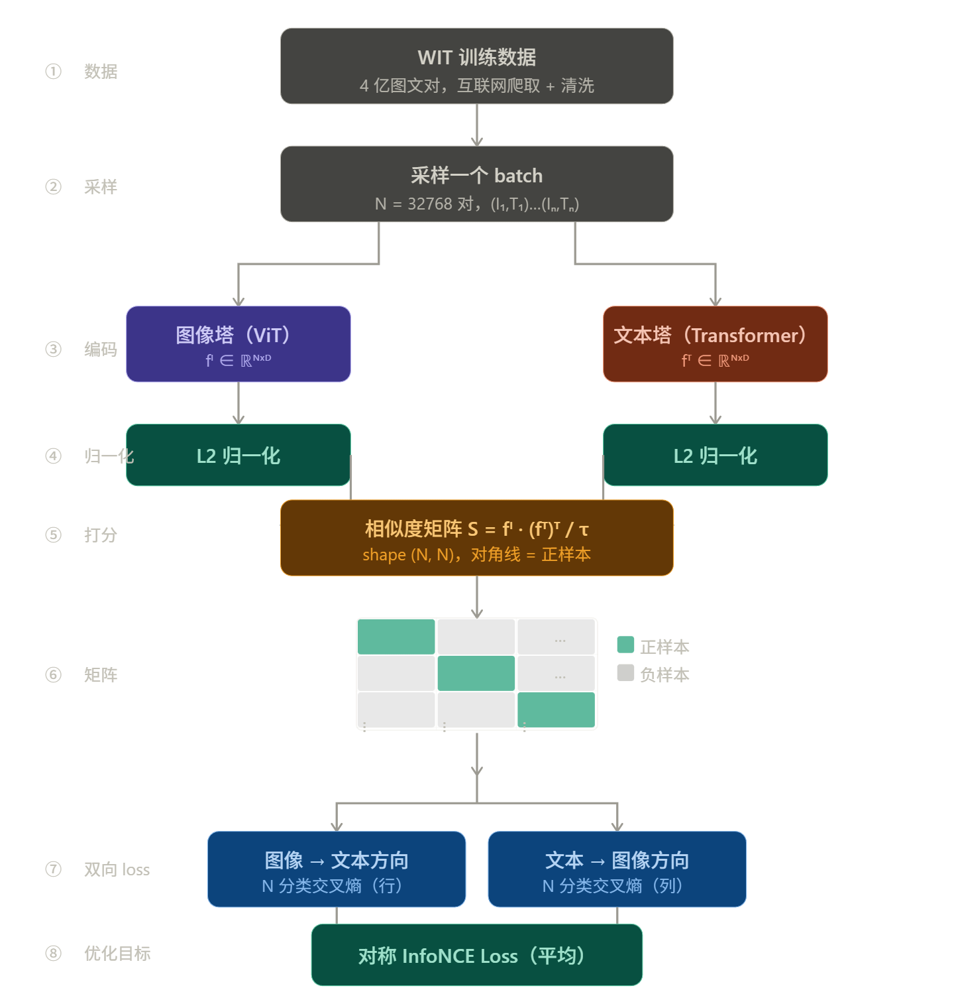

# 文本编码器（CLIP / T5）

## 1 概览

文本编码器在文生图系统里扮演的角色是**翻译官**：把人类写的 Prompt 翻译成向量语言，让图像生成网络能"听懂"文字描述。

从功能上看，它的输入是一段文本，输出是一个形状为 `[seq_len, dim]` 的向量矩阵。这个矩阵里的每一行是一个 token 的语义向量，整个矩阵会作为 Cross-Attention 的 K 和 V，告诉图像生成网络"每个区域应该长什么样"。

不同文生图系统使用的文本编码器有所不同，但核心问题只有一个：**如何把一串 token 压缩成对图像生成有用的语义向量？**

------

## 2 CLIP

### 2.1 背景

在 CLIP 之前，图文联合表示的主流方案是**监督预训练**：先在 ImageNet 上训练图像分类器，再用对应的文字标签做对齐。这个方案有两个根本缺陷：一是类别是固定的，无法描述"一只穿着宇航服坐在月球上的猫"这类开放概念；二是标注数据规模有限，上限很低。

CLIP（Contrastive Language-Image Pre-training，OpenAI 2021）的核心洞察是：**互联网上已经有海量的图文对**——每一张新闻图片配的说明文字、每一条带图的社交媒体帖子，都是天然的监督信号。只需要让图像向量和对应文字向量在空间里靠近，让不匹配的远离，模型就能学到开放世界的视觉-语言对齐。

这个思路来自**对比学习（Contrastive Learning）**，关键在于把监督信号从"类别标签"换成了"图文配对关系"，数据量从百万量级直接跳到了**4 亿图文对**（WIT 数据集，从互联网爬取并过滤）。

------

### 2.2 双塔结构

CLIP 是一个**双塔（Dual Encoder）**模型，两个编码器独立运行，只在最后的相似度计算阶段汇合。



两个塔的输出向量维度相同（$D$），都经过 L2 归一化，这样点积就等于余弦相似度，值域在 $[-1, 1]$ 之间。

#### 图像塔：ViT

原始论文同时测试了 ResNet 和 ViT，最终 ViT 方案效果更好，后续工作普遍采用 ViT。

ViT（Vision Transformer）的处理流程：

1. 把图像切成固定大小的 patch（如 $16\times16$ 像素）
2. 每个 patch 展平后经过线性投影变成向量
3. 加上位置编码和一个特殊的 `[CLS]` token
4. 送入标准 Transformer Encoder 堆叠
5. 取 `[CLS]` 位置的输出向量作为整张图像的表示

#### 文本塔：Transformer Encoder

文本塔是一个标准的 **Transformer Encoder-only** 架构，结构和 GPT 相近（但用的是因果掩码还是双向注意力取决于实现版本——OpenAI 原版 CLIP 的文本塔实际上用的是**因果掩码**，即类似 GPT 的单向注意力，而不是 BERT 式的双向注意力）。

> [!note]
>
> 这是一个容易搞错的细节。OpenAI 原版 CLIP 文本塔用的是因果掩码（Causal Mask），每个 token 只能看到它左边的内容。这和 BERT 的双向注意力不同。之所以不影响效果，是因为 CLIP 文本塔的训练目标是产出 `[EOS]` 位置的 pooled 向量来代表整句语义，因果掩码下 `[EOS]` 位置天然能汇聚整个序列的信息（它是最后一个 token，能看到所有之前的内容）。

文本塔的关键参数：

- 输入最大长度：**77 个 token**（BPE 分词，词表大小 49408）
- 文本头尾分别加 `[SOT]`（Start of Text）和 `[EOT]`（End of Text）特殊 token
- 输出取 `[EOT]` 位置的向量作为整句的**池化表示（pooled representation）**
- 最后过一个线性投影层，把维度对齐到图像塔的输出维度 $D$

| 模型   | 层数 | 维度 | 注意力头 | 输出维度 $D$ |
| ------ | ---- | ---- | -------- | ------------ |
| CLIP-B | 12   | 512  | 8        | 512          |
| CLIP-L | 12   | 768  | 12       | 768          |

> [!note]
>
> 77 token 的限制来自原始实现中固定大小的位置编码矩阵（shape `[77, dim]`）。这不是 Transformer 架构本身的限制，而是实现时的一个选择。在文生图工程实践中这个限制必须牢记：超出 77 个 token 的 Prompt 会被直接截断，后面的描述完全失效。这也是为什么提示词工程的第一条建议通常是"把最重要的关键词放在前面"。

------

### 2.3 训练目标与 InfoNCE Loss

#### 对比学习的核心思路

一个 batch 里有 $N$ 个图文对：$(I_1, T_1), (I_2, T_2), \ldots, (I_N, T_N)$。

经过两个编码器，得到 $N$ 个图像向量和 $N$ 个文本向量，计算所有两两组合的余弦相似度，构成一个 $N \times N$ 的矩阵：

$$S_{ij} = \frac{f_I(I_i) \cdot f_T(T_j)}{|f_I(I_i)| \cdot |f_T(T_j)|}$$

其中对角线 $S_{ii}$ 是正样本（图文匹配），非对角线 $S_{ij}\ (i \neq j)$ 是负样本（图文不匹配）。

训练目标是让这个矩阵"尽可能接近单位矩阵"——对角线接近 1，非对角线接近 0。

#### InfoNCE Loss 的推导

CLIP 用的损失函数是 **对称的 InfoNCE（Symmetric Cross-Entropy Loss）**。

先看单方向——以第 $i$ 张图像为查询，在 $N$ 个文本里找到正样本：

$$\mathcal{L}_{\text{I} \to \text{T}}^{(i)} = -\log \frac{\exp(S_{ii} / \tau)}{\sum_{j=1}^{N} \exp(S_{ij} / \tau)}$$

这就是一个 $N$ 分类的交叉熵：分子是正样本的得分，分母是所有 $N$ 个候选（含正样本）的得分之和。模型需要在 $N$ 个文本里把正确的那个排到最高。

同理，以第 $i$ 个文本为查询，在 $N$ 张图像里找正样本：

$$\mathcal{L}_{\text{T} \to \text{I}}^{(i)} = -\log \frac{\exp(S_{ii} / \tau)}{\sum_{j=1}^{N} \exp(S_{ji} / \tau)}$$

最终损失取两个方向的平均：

$$\mathcal{L} = \frac{1}{2N} \sum_{i=1}^{N} \left( \mathcal{L}_{\text{I} \to \text{T}}^{(i)} + \mathcal{L}_{\text{T} \to \text{I}}^{(i)} \right)$$

**对称性的意义**：单向损失只优化"给定图像找文本"，双向损失同时优化"给定文本找图像"。两个方向的梯度信号叠加，让两个塔的向量空间对齐更充分。

#### 温度系数 $\tau$ 的作用

$\tau$（温度，Temperature）是一个可学习的标量，初始化为 $\log(1/0.07) \approx 2.66$，对应 $\tau \approx 0.07$。

$\tau$ 控制相似度分布的"尖锐程度"：

- $\tau$ 小（如 0.07）：softmax 分布非常尖锐，正样本要以压倒性优势高于负样本，梯度信号强，但训练不稳定
- $\tau$ 大（如 1.0）：softmax 分布平缓，对排名差异不敏感，训练稳定但对齐效果差

CLIP 让 $\tau$ 可学习，并加了一个下限 $\tau \geq 0.01$ 防止训练崩溃。实验证明可学习 $\tau$ 比固定值效果更好。

#### 大 batch size 的重要性

InfoNCE Loss 有一个关键性质：**batch 越大，每个正样本面对的负样本越多，学到的对齐越精细**。

从信息论角度：$N$ 个负样本意味着模型需要在 $N$ 个候选里正确区分，batch 越大，任务越难，学到的向量空间越有区分度。

CLIP 原始训练用了 **32768 的 batch size**（$N = 32768$），每对正样本同时面对 32767 个负样本。这个规模在当时是工程挑战，需要在多机多卡上同步 batch，梯度通信的开销很大。这也是 CLIP 只有大公司才能复现的原因之一。

------

### 2.4 完整训练流程



训练完成后，两个塔的参数固定。推理时只需要单独调用任意一个塔：

- **图像检索**：把所有候选图像过图像塔，得到向量库；查询文本过文本塔，用最近邻搜索找最匹配的图像
- **零样本分类**：把类别名称包装成文本（"a photo of a dog"），过文本塔得到类别向量；测试图像过图像塔，取相似度最高的类别

------

### 2.5 在文生图里的用法：从 pooled 到 token 序列

CLIP 原始设计里，图像塔和文本塔各自输出一个**单一向量**（pooled representation），用来计算图文相似度。但文生图对 CLIP 的使用方式有所不同。

**原始 CLIP 的输出：**

- 图像塔输出：`[CLS]` 位置的向量，shape `[D]`（单一全局向量）
- 文本塔输出：`[EOT]` 位置的向量，shape `[D]`（单一全局向量）

**文生图里的改造用法：**

| 用法                   | 取哪个输出               | Shape     | 用途                              |
| ---------------------- | ------------------------ | --------- | --------------------------------- |
| Pooled 向量            | `[EOT]` 位置单一向量     | `[D]`     | 全局语义条件（AdaLN、时间步融合） |
| Token 序列（全部位置） | 所有 77 个位置的输出向量 | `[77, D]` | Cross-Attention 的 K 和 V         |

早期版本（SD 1.x、2.x）直接取全部 77 个 token 的输出向量序列作为 K/V，这样图像的每个 patch 可以选择性地关注不同的文字 token，而不是只依赖一个全局向量。这是文生图里对 CLIP 最核心的改造。

**两种输出的语义区别**也值得关注：pooled 向量经过了对比训练的直接优化，在视觉-语义对齐空间里是"精华"；token 序列里每个位置的向量包含了更细粒度的 token 级语义，但没有被对比目标直接优化，是从语言建模侧学到的"副产品"。文生图同时利用两者，正是为了兼顾全局对齐和细节控制。

------

### 2.6 CLIP 的局限性

CLIP 的对比训练目标让它在图文匹配上效果很好，但带来了几个固有局限：

**属性绑定失败**：描述"一只红色的猫和一只蓝色的狗"，CLIP 会正确识别出"红色""猫""蓝色""狗"四个概念，但经常搞错颜色和动物之间的绑定关系。根本原因是对比训练的 loss 是全局相似度——只要两个向量"总体"够近就行，不要求精确理解词与词之间的语法结构。

**否定语义弱**："没有帽子的人"和"有帽子的人"，CLIP 文本向量的差异很小。对比训练数据里"没有 X 的图像"搭配"没有 X"的文字描述极少，模型没有学到否定的语义。

**长文本退化**：77 token 的硬限制加上对比训练目标的全局池化，超过 20-30 个有效 token 之后，额外的描述对向量的影响越来越小，几乎不起作用。

**数量和空间关系**："三个苹果"和"两个苹果"在 CLIP 的向量空间里差异极小，"左边的苹果"和"右边的苹果"同理。这类细粒度的空间和数量推理在对比训练里几乎没有监督信号。

这些局限的共同根源是：**对比目标优化的是全局对齐，不是精细语义理解**。这就是为什么 T5 这类用语言建模目标训练的编码器能弥补 CLIP 的短板。

------

## 3 T5：序列到序列的语言理解

### 3.1 T5 是什么

T5（Text-to-Text Transfer Transformer）是 Google 在 2019 年提出的一个通用语言模型框架。它的核心思想是**把所有 NLP 任务统一成文本到文本的格式**：翻译、摘要、问答……全部输入文本、输出文本。

T5 采用完整的 **Encoder-Decoder 结构**（和原始 Transformer 一样）。在文生图里，只用它的 **Encoder 侧**，Decoder 侧直接丢弃。

T5-XXL 是 T5 系列里最大的公开版本：

- 约 **110 亿参数**（仅 Encoder 侧约 48 亿）
- 文本向量维度 **4096**（是 CLIP 的 5 倍多）
- 最大输入长度 **512 个 token**（是 CLIP 的 7 倍）

### 3.2 T5 vs CLIP 文本塔：能力差异的根本原因

两者结构相近（都是 Transformer Encoder），但训练数据和目标完全不同，决定了它们的能力边界：

| 维度         | CLIP 文本塔                      | T5-XXL Encoder               |
| ------------ | -------------------------------- | ---------------------------- |
| 训练目标     | 图文对比（拉近匹配图文对的向量） | 文本去噪（预测被遮掩的片段） |
| 训练数据     | 4 亿图文对                       | 750 GB 纯文本（C4 等）       |
| 输出向量维度 | 768（CLIP-L）/ 1024（CLIP-G）    | 4096                         |
| 最大序列长度 | 77 token（硬限制）               | 512 token                    |
| 擅长         | 视觉-语言对齐、短 Prompt         | 复杂语义、长句、逻辑关系     |
| 不擅长       | 长文本、属性绑定、否定逻辑       | 图像语义空间中的视觉对齐     |

T5 的训练数据是纯文本，学到的是人类语言的内在结构——语法、逻辑、因果、时序。但它从未见过图像，所以向量空间里没有天然的视觉对齐。CLIP 恰好相反：视觉对齐很好，但语言理解深度有限。

这就是为什么现代文生图系统（FLUX、SD3）同时使用两者。

------

## 4 多编码器方案：SDXL、SD3、FLUX

### 4.1 SDXL：双 CLIP 拼接

SDXL 使用两个 CLIP 编码器，同时运行并把输出拼接在一起：

- **CLIP-L**（OpenAI 原版 CLIP，文本维度 768）
- **OpenCLIP-G**（规模更大的 CLIP，文本维度 1280）

两者的输出在特征维度上直接拼接，得到 `[77, 2048]` 的文本表示。

拼接逻辑：同一个 Prompt 经过两个独立的编码器，得到两套不同视角的语义向量，然后在 `dim` 维度 concat：

```
CLIP-L   输出:  [77, 768]
OpenCLIP-G 输出: [77, 1280]
拼接后:          [77, 2048]
```

SDXL 还引入了一个额外的 conditioning：把两个 CLIP 的 pooled 向量（即 `[EOS]` 位置的单一向量）也输入给去噪网络，作为全局语义的补充条件。

### 4.2 SD3 / FLUX：T5-XXL + CLIP 双轨

SD3 和 FLUX 的文本编码方案迈出了更大一步：**同时使用 T5-XXL 和 CLIP**，让两者各司其职。

以 FLUX.1 为例，文本处理流程如下：

```
Prompt
  ├── CLIP-L  →  [77, 768]   →  pooled 向量（全局条件）
  └── T5-XXL  →  [seq, 4096] →  token 序列（Cross-Attention K/V）
```

T5 的 token 序列负责提供细粒度的语义指引，通过 Cross-Attention 注入图像生成过程；CLIP 的 pooled 向量作为全局语义的 "总结"，通过 AdaLN 或其他条件注入方式影响整体生成方向。

SD3 的 MM-DiT（Multimodal Diffusion Transformer）进一步把文字 token 和图像 token 放进同一个注意力层里双向互看，打破了"文字只能作为 K/V、图像只能作为 Q"的单向约束——这是架构层面的升级，不只是换了更好的编码器。

### 4.3 为什么不直接只用 T5

既然 T5 理解语言更好，为什么不直接去掉 CLIP？

原因在于**视觉空间对齐**。CLIP 的训练天然把文本向量和图像向量拉到了同一个几何空间。文生图模型的去噪网络在预训练阶段通常用 CLIP 的文本向量做 Cross-Attention，学到的"语义空间"是 CLIP 式的。完全换掉 CLIP 需要重新对齐整个生成模型，成本极高。

保留 CLIP 提供视觉对齐的锚点，用 T5 补充语言理解深度，是目前工程上性价比最高的方案。

------

## 5 数据流与 Shape

以 SDXL 为例，完整追踪文本从 Prompt 到 Cross-Attention K/V 的 shape 变化：

```
输入 Prompt: "a photo of a cat sitting on a red chair"

步骤 1: 分词
  → token IDs: [49406, 320, 1125, 539, 264, 2368, 6610, 518, 320, 736, 3798, 49407, 0, ..., 0]
  → shape: [77]（不足 77 补 padding token 0）

步骤 2: CLIP-L 编码
  → Embedding Lookup: [77] → [77, 768]
  → 12 层 Transformer Encoder
  → 输出: [77, 768]

步骤 3: OpenCLIP-G 编码
  → 同上，24 层 Encoder
  → 输出: [77, 1280]

步骤 4: 拼接
  → Concat(dim=-1): [77, 768] + [77, 1280] → [77, 2048]

步骤 5: 作为 Cross-Attention 的 K/V
  → K = [77, 2048] × W^K → [77, d_k]
  → V = [77, 2048] × W^V → [77, d_v]

图像 patch 的 Q: [L_img, d_model]
注意力矩阵: [L_img, 77]  ← 每个图像 patch 对 77 个文字 token 的关注程度
```

注意 Cross-Attention 的非对称性：Q 来自图像（长度 $L_{img}$），K/V 来自文本（长度 77），输出 shape 跟着 Q 走，仍然是 `[L_img, d_model]`。这正是 Cross-Attention 能桥接两个不同长度序列的几何基础。

------

## 6 在文生图系统里的位置

```
Prompt
   │
   ▼
[文本编码器]
   ├── CLIP 文本塔  →  pooled 向量（全局方向）
   └── T5 Encoder  →  token 序列（精细语义）
              │
              ▼ K, V
         Cross-Attention
              ▲
              │ Q
         图像 patch 特征  ←  去噪网络（UNet / DiT）
```

文本编码器本身在推理时**参数是冻结的**——它只负责把 Prompt 翻译成向量，不参与去噪过程的梯度更新。这意味着文本理解能力完全由预训练质量决定，也是为什么换更强的文本编码器（从 CLIP 到 T5）能直接提升生成质量。

------

## 7 面试高频问题

**Q：CLIP 为什么适合文生图？T5 解决了 CLIP 的什么问题？**

CLIP 通过图文对比训练，让文字向量和图像向量活在同一个几何空间里，天然适合作为图像生成的语义引导。但 CLIP 的 77 token 限制和对比训练目标使它不擅长处理复杂的长文本语义。T5 用大规模纯文本预训练，对语法、逻辑和长句语义的理解更深，弥补了 CLIP 语言理解深度不足的问题。

**Q：SDXL 的双 CLIP 输出如何融合？**

两个 CLIP 编码器的 token 序列在特征维度（`dim`）上直接拼接，从 `[77, 768]` 和 `[77, 1280]` 得到 `[77, 2048]`。拼接后的序列作为 Cross-Attention 的 K/V，同时 pooled 向量通过额外的条件注入通道影响全局生成。

**Q：文本编码器的输出 shape 是什么，它怎么进入去噪网络？**

文本编码器输出 `[seq_len, dim]` 的 token 向量序列。这个序列经过两个线性变换分别得到 K 和 V，图像 patch 特征经过线性变换得到 Q，三者进入 Cross-Attention。注意力矩阵 shape 为 `[L_img, seq_len]`，记录了每个图像区域对每个文字 token 的关注程度。输出 shape 跟着 Q 走，仍为 `[L_img, d_model]`。

**Q：为什么 SD3 / FLUX 同时保留 CLIP 和 T5，不直接只用 T5？**

CLIP 提供视觉-语义对齐的锚点，去噪网络在预训练阶段已经学会在 CLIP 的语义空间里生成图像。完全换掉 CLIP 需要重新对齐整个生成模型，成本极高。T5 补充语言理解深度，CLIP 保持视觉对齐，两者分工协作是目前工程上性价比最高的方案。