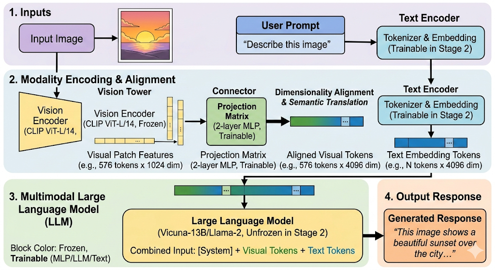

# 对齐技术

------

## CLIP

**CLIP (Contrastive Language-Image Pretraining)**  是多模态领域的开山之作。它的核心逻辑极简：**不需要你告诉我图片里有什么，我只需要让“图片向量”和“对应的描述向量”在空间里无限接近。**CLIP 的伟大之处在于：它打破了传统视觉模型只能识别“固定类别”（比如 ImageNet 的 1000 类）的限制，让模型拥有了**“零样本学习”（Zero-shot Learning）**的能力。

------

### 双塔 模式

CLIP 由两个独立的“塔”组成：

- **Vision Encoder (视觉塔)：** 可以是 **ViT**或 ResNet。它负责把图片 $I$ 变成向量 $E_i$。
- **Text Encoder (文本塔)：** 一个标准的 **Transformer Decoder-only** 架构（类似 GPT）。它负责把文字描述 $T$ 变成向量 $E_t$。

**关键点：** 这两个向量的原始维度可能不同（比如视觉 768 维，文本 512 维），所以 CLIP 在两个塔后面各加了一个**线性投影层 **，把它们映射到同一个**共享多模态空间**（比如统一变成 512 维）。

------

### 对比学习 

CLIP 不像传统模型那样去做“分类任务”（比如问：这张图是猫吗？），它做的是**“连连看”**。

**矩阵对齐逻辑**

假设一个训练 Batch 里有 $N$ 个图像-文本对 $(I, T)$：

1. **特征提取：** 得到 $N$ 个图像向量 $v_1, v_2, ..., v_n$ 和 $N$ 个文本向量 $l_1, l_2, ..., l_n$。
2. **计算相似度：** 将这些向量两两计算点积（余弦相似度），生成一个 $N \times N$ 的矩阵。
3. **损失函数 (InfoNCE)：**
   - **对角线（正样本）：** $v_i$ 和 $l_i$ 是对应的，相似度应该尽可能**大**。
   - **非对角线（负样本）：** $v_i$ 和 $l_{j \neq i}$ 是乱配的，相似度应该尽可能**小**。


**具体损失函数：**

假设一个 Batch 中有 $N$ 对图文对。对于每一张图像 $I_i$ 和每一段文本 $T_j$，我们先提取它们的特征向量并进行 **$L_2$ 归一化**，然后计算它们的余弦相似度：

$$s_{i,j} = \text{cos\_sim}(v_i, l_j) = v_i \cdot l_j$$

CLIP 的总损失 $L$ 由两个方向的分类损失组成：

**方向 A：图像找文本**

对于第 $i$ 张图片，我们要从 $N$ 个文本中准确找出对应的那个。这是一个 $N$ 分类问题：

$$L_{i2t}^{(i)} = -\log \frac{\exp(s_{i,i} / \tau)}{\sum_{j=1}^{N} \exp(s_{i,j} / \tau)}$$

**方向 B：文本找图像**

同理，对于第 $i$ 段文本，我们要从 $N$ 张图片中找出对应的那张：

$$L_{t2i}^{(i)} = -\log \frac{\exp(s_{i,i} / \tau)}{\sum_{j=1}^{N} \exp(s_{j,i} / \tau)}$$

最终的损失是这两个方向的平均值，作用于整个 Batch：

$$L = \frac{1}{2N} \sum_{i=1}^{N} (L_{i2t}^{(i)} + L_{t2i}^{(i)})$$


**伪代码：**

```python
# 1. 提取特征并归一化
image_features = vision_encoder(images)  # [N, D]
text_features = text_encoder(texts)      # [N, D]
image_features /= image_features.norm(dim=-1, keepdim=True)
text_features /= text_features.norm(dim=-1, keepdim=True)

# 2. 计算相似度矩阵 (N x N)
# 对角线上的元素就是正样本对的相似度
logit_scale = logit_scale_param.exp() # 这里的 logit_scale 就是 1/tau
logits_per_image = logit_scale * image_features @ text_features.t()
logits_per_text = logits_per_image.t()

# 3. 生成标签 (0, 1, 2, ..., N-1)
# 因为正样本都在对角线上，所以标签就是行索引
labels = torch.arange(N)

# 4. 对称交叉熵
loss_i = cross_entropy(logits_per_image, labels)
loss_t = cross_entropy(logits_per_text, labels)
total_loss = (loss_i + loss_t) / 2
```

------

**为什么 CLIP 这么强？**

**A. 海量数据的力量 (4 亿对图文)**

CLIP 证明了：与其花钱请专家给图片打精准标签（比如“这是一种短毛异国猫”），不如直接从互联网上抓取现成的图片和它们的 Alt-text（网页描述）。虽然数据脏，但量大管饱，模型能学到极强的泛化能力。

**B. 零样本推理 (Zero-shot Inference)**

这是 CLIP 最神奇的地方。

- **传统模型：** 如果训练集里没见过“考拉”，它永远认不出考拉。
- **CLIP：** 你只需要把类别写成句子（比如 `"A photo of a koala"`），扔进文本塔提取特征，然后看哪个图片的特征跟它最接近。
- **结果：** CLIP 即使没专门学过某个分类任务，表现也能吊打很多有监督模型。

---

**Q：CLIP 的损失函数里为什么要加一个可学习的参数 $\tau$ (Temperature)？**

**回答：** 这个 $\tau$ 是用来缩放点积数值的。因为点积可能非常大，导致 Softmax 后的分布太“尖锐”（过于自信），或者太平滑（学不动）。通过让模型自己学习 $\tau$，它可以自动调整对比学习的“难度”，让训练更稳定。

**Q：CLIP 存在什么短板？**

**空间感知弱：** 它能认出图中“有猫”和“有桌子”，但很难分清“猫在桌子下面”还是“桌子在猫下面”（位置关系不敏感）。

**细粒度分类差：** 比如区分不同型号的飞机，CLIP 表现一般，因为它学的是互联网上的宽泛语义。

------


## BLIP

在 CLIP 之后，大家发现互联网上的图文对太乱了。BLIP 提出了两个天才的想法：

**1. 统一的架构 (MED)**

BLIP 破天荒地在一个模型里集成了三种功能：

1. **对比学习 (ITC)：** 像 CLIP 一样把图文拉近。
2. **图文匹配 (ITM)：** 二分类任务，判断图文是否真的匹配（更精细）。
3. **图像字幕生成 (LM)：** 给图写话。

**2. CapFilt (Captioning and Filtering) —— 数据清洗大师**

这是 BLIP 最核心的贡献。

- **Captioner：** 给网上的“脏数据”重新写一段高质量的描述。
- **Filter：** 把那些描述跟图片完全对不上的数据直接踢走。
- **结果：** 用干净的数据练出来的模型，性能直接起飞。


## BLIP-2

这是目前多模态大模型（VLM）最主流的范式。它的核心矛盾是：**视觉特征是连续的向量，而 LLM 只能读懂离散的 Token。**

BLIP-2 不再像 CLIP 那样直接把整个图像向量丢给 LLM，而是设计了一个名为 **Q-Former (Querying Transformer)** 的轻量级中介。

---

### **Q-Former 的工作流程**

**1. 招聘 32 个“万能记者”（Learned Queries）**

Q-Former 内部预设了 32 个向量（Query），你可以把它们看作 32 个**待命的记者**。

- 在刚开始时，这些记者是“白纸一张”，什么都不知道。
- 他们的任务是：**去视觉现场（Image Feature）采访，然后回来向老板（LLM）汇报。**


**2. 采访过程：交叉注意力（Cross-Attention）**

当一张图片（比如“海滩上的金毛犬”）通过 ViT 处理后，产生了 257 个视觉特征向量（像一堆凌乱的像素描述）。

这 32 个记者（Query）带着自己的“采访本”进入视觉空间。

- 记者 A 可能对“生物”敏感，他盯着金毛犬的特征看；

- 记者 B 对“环境”敏感，他盯着沙滩和海浪看；
- 记者 C 负责看“颜色”，发现阳光是金色的。

这就是 **Cross-Attention**。Query 主动去查询（Query）视觉特征里的 Key 和 Value。


**3. 自注意力（Self-Attention）**

采访回来后，这 32 个记者坐在一起开会。

- **互相校对：** 记者 A 说：“我看到了狗。” 记者 B 说：“我看到了水。”
- **去重与整合：** 他们通过 **Self-Attention** 互相交换信息。如果大家都看到了“金色”，他们会达成共识，确保汇报给 LLM 的 32 条信息既全面又不重复。
- **加入文本背景：** 如果此时有提示词（如“这只狗在干什么？”），记者们还会一边看图，一边参考这个提示词，让提取的特征更有针对性。


**4. 汇报工作：交给 LLM**

最后，这 32 个记者把整理好的“采访简报”（32 个特征向量）递给 LLM。

对 LLM 来说，它根本不知道有图片存在。它只看到输入序列里突然多了 32 个“新单词”。奇迹发生，经过训练，LLM 发现只要看到这 32 个特定的向量，它就能准确地说出：“画面里有一只金毛在海边跑步。”

------

### BLIP-2 的两阶段训练

BLIP-2 之所以强，是因为它分两步走，既省钱又高效：

**视觉与文本对齐（为了让 Q-Former 懂图）**

- **目标：** 让那 32 个可学习的 Query 能提取出有意义的视觉特征。
- **做法：** 冻结视觉 Encoder（比如 CLIP-ViT），只练 Q-Former。通过对比学习、图文匹配和生成任务，让 Query 能够精准捕捉图片内容。

**视觉与 LLM 对齐（为了让 LLM 懂图）**

- **目标：** 把 Q-Former 提取的特征映射到 LLM 的词向量空间。
- **做法：** **双重冻结**。冻结视觉 Encoder，同时**冻结 LLM**（如 Vicuna 或 Flan-T5）。
- **操作：** 只训练 Q-Former 后面的一层线性层（Linear Projection）。让 LLM 觉得这 32 个视觉向量就是一串某种奇怪“外语”的单词，LLM 只需要学会把这串“外语”翻译成人类语言即可。

------

**为什么 BLIP-2 比 CLIP 更有前瞻性？**

1. **极度省钱：** 你不需要微调昂贵的 LLM（比如 70B 的 Llama），只需要练一个超小的 Q-Former。
2. **特征压缩：** 无论原图多大，传给 LLM 的永远只有 32 个 Token。这极大节省了 LLM 推理时的 KV Cache 压力。
3. **架构解耦：** 视觉 Encoder 和 LLM 都可以像换零件一样随时升级，而不需要重练整个系统。

---

> [!note] Q-Former 里的 Self-Attention 是怎么处理信息的？
>
> “Q-Former 的 Self-Attention 具有**双向可见性**。Query Tokens 可以看到彼此，也可以通过 Cross-Attention 看到图像特征。
>
> 在第一阶段训练中，我们会使用不同的 **Mask 策略**：
>
> - 在做对比学习时，Query 只能看到图，看不到文；
>
> - 在做字幕生成时，Query 必须通过因果掩码（Causal Mask）来预测下一个词。
>
>   这种灵活的 Mask 机制是 Q-Former 能够同时兼顾‘特征提取’和‘语义理解’的关键。”

---

### 为什么只需要32token

这是一个非常深刻的直觉问题。按理说，一张 $1024 \times 1024$ 的高清图包含百万级像素，压缩到 32 个向量（Token），压缩率达到了几万倍。

为什么这 32 个 Token 够用？核心在于：**“像素”不等于“语义”**，而 LLM 只需要**语义**。

我们可以从以下三个维度来拆解这个“奇迹”：

------

**1. 图像的“冗余性” (Information Redundancy)**

图像信息的分布是极度不均匀的。

- **低级信息（海量）：** 蓝天背景下的几万个蓝色像素点，虽然占了图片的 80%，但对“理解图片”来说，一句话就能概括：“背景是蓝天”。
- **高级信息（稀缺）：** 蓝天中那只飞过的“老鹰”，虽然只占了几百个像素，却是整张图的灵魂。
- **Q-Former 的作用：** 它通过 **Cross-Attention** 自动过滤掉那些重复、无意义的背景像素（低频信息），只捕捉那些具有结构化意义的特征（高频语义）。这 32 个 Token 存的不是像素值，而是**“语义索引”**。

------

**2. 什么是“语义瓶颈” (Semantic Bottleneck)？**

这是多模态研究中的一个重要概念。

- 如果你向一个盲人描述一张照片，你通常不会说：“左上角第 10 像素是 R120, G150...”。你会说：“草地上有一只金毛在玩球。”
- **32 个 Token 的容量：** 一个 Token 通常是 768 维或 1024 维。这 32 个高维向量组合起来的**表达空间**其实是巨大的，足以容纳几十个复杂的物体及其关系（主语、谓语、宾语、环境）。
- **结论：** 32 个 Token 已经足以写出一篇几百字的详细描述了。对于 LLM 来说，它只需要知道“有什么”，而不需要知道“每个像素的具体数值”。

------

**3. “可学习查询”的本质：职能分工**

这 32 个 Token（Learned Queries）在训练过程中会自发形成**“职能分工”**：

- **Token 1-5** 可能会进化成专门捕捉“物体的类别和形状”；
- **Token 6-10** 专门捕捉“颜色和纹理”；
- **Token 11-15** 专门负责“空间位置关系”（比如 A 在 B 的左边）；
- **Token 16-32** 负责“全局氛围和背景”。

当模型足够聪明时，这 32 个“职位”几乎能覆盖人类语言中描述一张图所需的所有维度。

------

**4. 极端情况：如果 32 个真的不够怎么办？**

现在的研究（如 **LLaVA-Next** 或 **Gemini**）确实发现 32 个 Token 在处理极其复杂的场景（比如一张写满字的收据，或者一张密密麻麻的电路图）时会力不从心。

目前的对策有：

1. **动态 Token：** 根据图片复杂度，允许模型使用 144 个甚至 576 个 Token（如 LLaVA）。
2. **切片技术 (AnyRes)：** 把大图切成 4 块，每块分配 32 个 Token，再加上一个全局缩略图的 32 个 Token。
3. **视觉特征直接注入：** 放弃过度压缩，保留更多的视觉细节，但这会带来极大的计算成本。


**总结**

- **BLIP** = 视觉 Encoder + 文本 Decoder + 数据清洗。
- **BLIP-2** = 冻结的视觉 Encoder + **Q-Former** + 冻结的 LLM。


## LLaVA

LLaVA 的出现（2023年）标志着多模态大模型进入了 **“简单架构 + 质量数据”** 的新时代。它不再追求复杂的 Q-Former 压缩，而是直接把视觉特征“翻译”给 LLM。




**1. LLaVA 的极简架构：一个“连接器”搞定一切**

LLaVA 的架构非常直观，由三部分组成：

1. **Vision Tower (视觉塔)：** 预训练好的 **CLIP ViT-L/14**。它负责把图片切成 Patch 并输出特征向量（通常是 256 个或 576 个）。
2. **LLM (大语言模型)：** 比如 **Vicuna** (基于 Llama 微调的开源模型)。
3. **Projection Matrix (投影层/连接器)：** 这是一个简单的 **MLP（多层感知机）**。

**核心逻辑：** LLaVA 不做信息压缩。它把 CLIP 输出的每一个 Patch 向量，通过这个 MLP 矩阵，“平移”到 LLM 的词向量空间里。

- **结果：** 对 LLM 来说，它看到的不是 32 个精华，而是 **256 个甚至更多**的视觉 Token。虽然啰嗦，但细节保留得非常完整。


**2. 两阶段训练**

LLaVA 成功的真正秘诀不在于架构，而在于它如何训练这个投影层。

**第一阶段：特征对齐 (Feature Alignment)**

- **目标：** 让 MLP 学会怎么把视觉向量“翻译”成 LLM 能听懂的词。
- **做法：** 冻结 CLIP，冻结 LLM。只训练中间那个小小的 MLP。
- **数据：** 使用简单的“图-文”对（如：图片 + “这张图里有什么？” + 简短回答）。

**第二阶段：端到端微调 (Visual Instruction Tuning)**

- **这是 LLaVA 的灵魂：** 作者意识到，只是对齐特征是不够的，模型需要学会像人类一样对话。
- **做法：** 保持 CLIP 冻结，但**解冻 LLM**。让 LLM 跟着视觉信息一起进化。
- **数据：** 这是最天才的地方。作者利用 **GPT-4** 模拟了大量复杂的对话数据（比如：让 GPT-4 根据图片的文字描述，编造出人类可能会问的逻辑推理、常识性问题）。


**3. 视觉指令微调 (Visual Instruction Tuning)**

**“为什么 LLaVA 表现得比之前的模型更有‘人味’？**

因为 LLaVA 首次引入了大规模的**视觉指令微调**。它不是简单地让模型做‘名词填空’，而是通过 GPT-4 生成了包含：**多轮对话、详细描述、复杂推理**的高质量数据集。这让 LLM 不仅学会了识别物体，还学会了如何结合视觉上下文进行逻辑推导（例如：‘根据图中人物的穿着，判断他们是在参加婚礼还是葬礼？’）。


**4. LLaVA 的后续演进 (LLaVA-1.5 / LLaVA-Next)**

为了解决“视觉 Token 太多”和“分辨率低”的问题，LLaVA 也在进化：

- **LLaVA-1.5：** 发现把 MLP 换成两层，性能还能升，并加入了更多学术任务数据。
- **AnyRes (高清技术)：** 把大图切成几块分别处理，最后拼在一起，解决了 CLIP 只能看 $224 \times 224$ 或 $336 \times 336$ 小图的痛点。

------

 **LLaVA 的核心思想是：** 不要过度干预视觉特征，给 LLM 足够的“视野”（更多的 Token），然后用高质量的对话数据把 LLM 喂饱。


| **特性**       | **BLIP-2 (Q-Former)**     | **LLaVA (MLP Adapter)**   |
| -------------- | ------------------------- | ------------------------- |
| **压缩率**     | 极高（固定 32 个 Token）  | 低（保留几百个 Token）    |
| **计算成本**   | 推理快，KV Cache 占用小   | 视觉 Token 多，LLM 压力大 |
| **细节理解**   | 容易丢失小物体/细节       | **细节捕捉能力强**        |
| **架构复杂度** | 复杂，需要特殊设计的 Mask | **极其简单，易于实现**    |


------

## 正负采样与噪声处理

在多模态对齐（如 **CLIP**）和指令微调（如 **LLaVA**）的语境下，**正负采样**决定了模型能不能“分得清”，而**噪声处理**决定了模型会不会“学歪了”。

你可以把这想象成教一个孩子认动物：正负采样是给他看“猫”和“非猫”的对比，噪声处理是把书里印错的标签撕掉。

------

**1. 正负采样 (Positive & Negative Sampling)**

在对比学习（Contrastive Learning）中，模型的目标是让匹配的图文对靠拢，不匹配的拉远。

**正采样 (Positive Sampling)**

- **定义：** 原始数据集中成对出现的图片和描述。
- **例子：** 一张“金毛寻回犬”的照片 + 文本 `"一只金毛在草地上跑"`。
- **目标：** 最大化它们的向量点积（余弦相似度）。

**负采样 (Negative Sampling)** 

- **定义：** 将当前的图片与同一个 Batch 里的**其他**文本配对。
- **例子：** 还是那张“金毛”的照片，配上文本 `"一辆红色的法拉利"` 或 `"一个正在切菜的厨师"`。
- **为什么需要负采样？** 如果没有负样本，模型会产生**“特征坍缩”**——它发现只要输出一串全为 1 的向量，相似度永远是满分。负样本强迫模型去寻找能区分不同物体的特征。
- **难负样本 (Hard Negatives)：** 如果负样本太简单（如金毛 vs 飞机），模型学不到东西。难负样本是那些长得很像但不是一个东西的样本（如金毛 vs 拉布拉多）。模型必须观察得非常细微，才能把它们推开。

------

**2. 噪声处理 (Noise Handling)**

多模态面临的最大问题是：**互联网上的数据极度不干净。** 

1. **图文不符：** 图片是“奶茶”，文字是“今天心情真好”。
2. **描述太泛：** 图片是“波音 747”，文字是“大飞机”。
3. **错误标注：** 图片是“哈士奇”，文字是“狼”。

**如何处理？(三种主流手段):**

**A. 过滤法 (Filtering - 代表：BLIP)**

- **做法：** 训练一个小的“评估模型”（Filter）。如果图文匹配得分低于阈值，直接扔掉。
- **效果：** 宁缺毋滥，保证喂给大模型的数据都是高质量的。

**B. 软标签/动量蒸馏 (Soft Labels - 代表：ALBEF)**

- **原理：** 不要非黑即白地告诉模型“这俩一定配”或“一定不配”。
- **做法：** 利用一个不断更新的“老师模型”（Momentum Encoder）给出一个相似度概率（比如 0.7 匹配）。即使文字写错了，如果老师模型觉得图片和文字有一定相关性，也不会强行让模型把它们推开。

**C. 重新生成 (Captioning - 代表：BLIP-2 / LLaVA)**

- **做法：** 既然原始文字脏，那就用一个已经练得不错的模型（Captioner）给图片**重新写**一段描述。
  - **LLaVA 的做法：** 甚至不看原始文字，直接让 GPT-4 根据图片的 Ground Truth 标签（如物体框）来**脑补**对话，彻底杜绝了互联网垃圾文本的噪声。

> [!question]- 增加 Batch Size 对正负采样有什么影响？
>
> “增加 Batch Size 会显著增加**负样本的数量**。在 CLIP 这种对比学习中，负样本越多，模型遇到的‘难负样本’概率就越大，这会迫使模型学习到更精细、更具辨别性的视觉特征。这也是为什么 CLIP 的 Batch Size 开到了 3万多，因为更多的负样本直接等同于更高的性能。”

------

**总结一下：**

- **正负采样**是为了解决“怎么学”的问题（推拉机制）。
- **噪声处理**是为了解决“学什么”的问题（数据质量）。