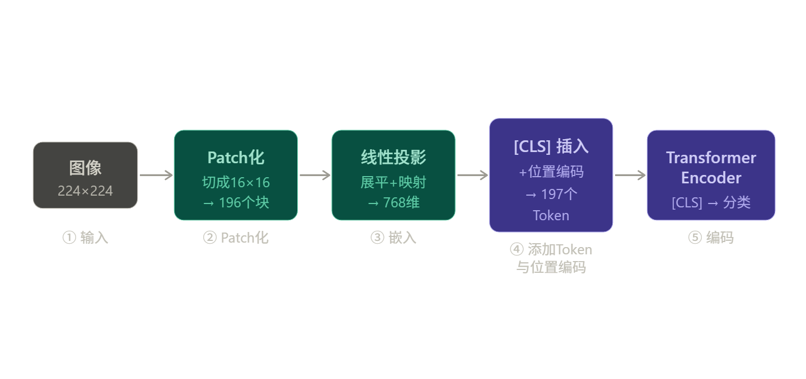

# 视觉表征基础

------

## ViT（Vision Transformer）

Transformer 本质上只能处理**序列（Sequence）**。ViT 的核心贡献在于：它找到了一种不破坏图像空间结构、又能将图像转换为序列的方法。

**第一步：Patch 化（Patch Partition）**

假设图像大小是 $224 \times 224$。ViT 不会逐像素读取（序列太长，Attention 无法处理）。它把图像切成固定大小的方块（Patch），比如 $16 \times 16$，这样一张图就变成了 $14 \times 14 = 196$ 个小方块。

**第二步：线性投影（Linear Projection）**

每个 $16 \times 16 \times 3$（RGB 三通道）的小方块被展平为一个长向量，再通过一个可学习的线性层映射到固定维度（比如 768 维）。这就像 NLP 里的 Word Embedding——每个 Patch 现在就是一个"视觉单词"。

**第三步：插入 `[CLS]` Token 并添加位置编码**

这一步包含两个操作，缺一不可：

- **`[CLS]` Token：** 模仿 BERT，在 196 个 Patch 向量最前面拼接一个**可学习的向量**（与模型参数一起训练）。由于 Self-Attention 是全局互动的，这个 Token 会在多层计算中不断聚合其他 196 个 Patch 的特征。最终，我们只需取 `[CLS]` 对应的输出向量，便能代表整张图的语义。
- **位置编码（Position Embedding）：** Transformer 把输入视为一个无序集合——不加位置信息，模型无从区分"第一行最后一个 Patch"和"第二行第一个 Patch"，即便它们在空间上相邻。ViT 为每个 Token 加上可学习的 2D 位置编码，显式地赋予模型**空间拓扑信息**，帮助其理解物体的几何形状和相对位置关系。

> **为什么需要 2D 而非 1D 位置编码？** 若只用 1D 编码（1, 2, 3...197），模型难以学到"行列相邻"的空间关系。2D 位置编码（或正交的横纵坐标编码）能让模型显式感知 Patch 的行列位置。

**第四步：Transformer Encoder**

接下来与标准 Transformer Encoder 完全一致，由以下模块堆叠而成：

- **多头自注意力（Multi-Head Self-Attention）：** 让每个 Patch 与其他所有 Patch 互动（例如，猫的耳朵 Patch 会关注猫的身体 Patch）。
- **层归一化（LayerNorm）** 与**残差连接（Residual Connection）。**
- **前馈网络（MLP）。**

经过多层 Encoder 后，取 `[CLS]` 位置的输出向量用于下游任务（分类、检测等）。

------

> **为什么 ViT 在大规模数据下才强于 CNN？**
>
> CNN 内置了"平移不变性"和"局部相关性"的先验假设——即使在小数据集上也能快速收敛。ViT 没有任何针对图像的先验假设，必须通过海量数据从头学习空间关系；但一旦数据充足，它能捕捉到比卷积更复杂的全局依赖。

------

## MAE（Masked Autoencoders）

MAE 建立在 ViT 的基础上，是一种视觉领域的**自监督预训练方法**。它的核心思想可以用一句话概括：将图像的大部分遮住，然后让模型把它还原。

**核心设计：视觉版"完形填空"**

在 NLP 中，BERT 通过遮盖一部分词来迫使模型理解语言规律。MAE 将这个思路引入视觉：遮住绝大多数 Patch，只让模型看到一小部分，然后要求它重建整张图的像素。

**为什么要遮盖 75%？BERT 才遮 15%。**

这是 MAE 最核心的设计问题，背后有明确的理由：

图像和语言的信息密度根本不同。语言中每个词都携带高度压缩的语义，遮掉一个词，周围的线索有限。图像则高度冗余——相邻像素极度相似，遮掉一小块，模型只需简单插值就能"作弊"猜出来，完全不需要理解语义。只有遮掉绝大部分，才能迫使模型去理解物体的结构、形状和全局概念（比如："这里有半只耳朵，被遮住的地方应该有另外半只"），而不是简单地做插值。

**非对称架构：效率的来源**

MAE 的另一个关键设计是 Encoder 和 Decoder 的不对称：

Encoder 很重（参数多、层数深），但只处理 25% 的可见 Patch；Decoder 很轻，负责在全部 196 个位置上重建像素，但训练完就丢弃。这种不对称设计使预训练的计算量大幅下降，使得用极大的 ViT 做预训练变得可行。

**重建像素，学到特征**

训练目标是让 Decoder 的输出像素与原图的 MSE（均方误差）最小化。但为了完成这个任务，Encoder 必须从稀疏的可见块中提取足够丰富的高层特征——这才是预训练真正的目的。训练完成后，Decoder 被丢弃，只保留 Encoder 的权重用于下游任务。

**局限性**

值得一提的是，重建像素本身包含大量低频纹理信息，与高层语义理解之间存在一定 gap。这也是后续工作（如 BEiT、dBOT）转而用离散视觉 Token 而非原始像素作为重建目标的动机——但 MAE 证明了自监督预训练在视觉领域的巨大威力，其 Encoder 权重至今仍是多模态模型（图像理解、目标检测）的常用初始化参数。

---

> TODO: 
>
> **特征金字塔 (Feature Pyramid)：** 如何同时处理不同大小的物体？
>
> **数据增强 (Data Augmentation)：** 为什么翻转、裁剪、变色对视觉表征这么重要？
>
> **视觉 Token 的演进：** 除了 Patch 化，还有没有更高级的方法？（如 **Perceiver Resampler**，常用于把几百个视觉 Token 压缩成几十个）。

------

