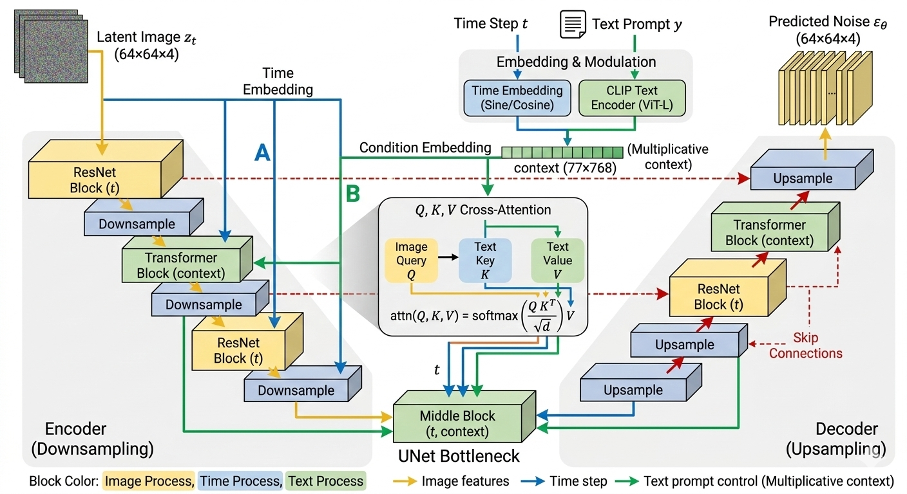
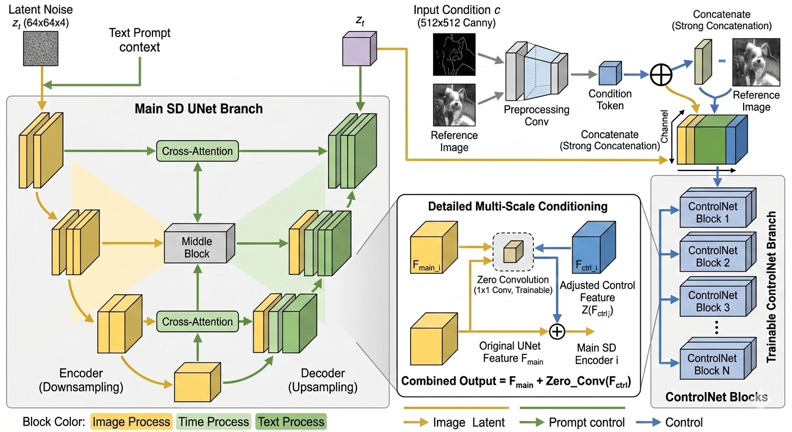
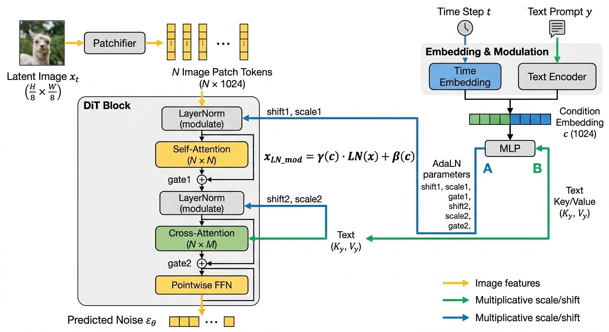

# 生成架构


## Stable Diffusion V1/V2

SD 架构并不复杂，它由三个看似独立但配合完美的模块组成：

**A. VAE (变分自编码器) —— 降维压缩**

- **痛点：** 直接在 $512 \times 512$ 的像素空间上做扩散，计算量大到爆炸。
- **方案：** VAE 的 Encoder 把图片压缩到一个极小的“潜空间”（Latent Space，比如 $64 \times 64$）。所有的扩散和去噪都在这个小空间里完成，最后用 Decoder 把结果“放大”回像素。
- **比喻：** 先把高清图压成“缩略图”来处理，处理完了再还原。

**B. CLIP Text Encoder —— 语义对齐**

- **创新：** SD 并没有训练自己的文本理解模型，而是直接“白嫖”了 **CLIP** 的文本分支。
- **意义：** 因为 CLIP 已经把“狗”的文字向量和“狗”的图片向量对齐了。SD 借用 CLIP 的文字向量，就能精准地告诉图像模型：“嘿，现在我们要往‘狗’的方向去噪”。

**C. UNet (去噪骨架) —— 条件注入**

- **作用：** 它是生成的主体。它通过 **Cross-Attention（交叉注意力）** 接收来自 CLIP 的文本指令。

---

### 条件注入

SD 1.5 的核心骨架是 **UNet**，它采用的是一种**“三位一体”的条件注入方式**。与 DiT 这种“每一层都全局重塑”的思路不同，SD 1.5 的注入更像是在一个精密的管道系统中，通过不同的“接口”泵入信息。

------

**三种注入路径**

在 UNet 的去噪过程中，条件 $C$（主要指经过 CLIP 提取的文本特征）通过以下三个位置施加影响力：

**A. 核心路径：Cross-Attention (交叉注意力)**

这是最重要的一环。文本信息作为 **Key ($K$)** 和 **Value ($V$)**，图像特征作为 **Query ($Q$)**。

$$Attention(Q, K, V) = \text{softmax}\left(\frac{QK^T}{\sqrt{d}}\right)V$$

图像的每个像素点（$Q$）都会去询问文本向量（$K$）：“我这个位置应该对应哪个单词？”然后把对应的语义（$V$）吸收到自己的特征里。

**B. 辅助路径：Time Embedding (时间步注入)**

扩散模型必须知道现在是第几步（$t$）。SD 1.5 将 $t$ 转换成正弦位置编码，然后通过 **Add (加法)** 的方式注入到 ResNet Block 中。

告诉模型现在是该画轮廓（$t$ 很大）还是该填细节（$t$ 很小）。

**C. 全局路径：Concatenation (拼接，主要用于图生图/Inpainting)**

如果你是在做局部重绘，Mask 后的图片会直接在 **Channel（通道）** 维度上和噪声拼接在一起。

------

**SD 1.5 整体数据流图**

我们可以把整个推理过程想象成一个**“特征漏斗”**：

1. **文本编码**：用户输入 Prompt → **CLIP Text Encoder** → 得到 $77 \times 768$ 的 Tensor（称为 `context`）。
2. **噪声初始化**：随机生成一个 $64 \times 64 \times 4$ 的隐空间噪声 $z_t$。
3. **UNet 循环去噪**：
   - $z_t$ 进入 UNet 的 **Encoder (下采样)**。
   - 在每个 ResBlock 中，加入 **Time Embedding**。
   - 在每个 Transformer Block 中，通过 **Cross-Attention** 吸收 `context`。
   - 经过中间层（Mid-Block），进入 **Decoder (上采样)**，通过 **Skip Connection** 补回细节。
4. **预测噪声**：输出预测出的噪声 $\epsilon_\theta$，用它更新 $z_t$ 得到 $z_{t-1}$。
5. **VAE 解码**：循环结束后的 $z_0$ 通过 **VAE Decoder** 还原成 $512 \times 512$ 的图片。



------

**核心注入逻辑的伪代码实现**

为了让你看清 $Q, K, V$ 是怎么工作的，这里展示 UNet 中 **Cross-Attention 层** 的简化逻辑：

```python
import torch
import torch.nn as nn

class CrossAttention(nn.Module):
    def __init__(self, query_dim, context_dim, heads=8):
        super().__init__()
        self.to_q = nn.Linear(query_dim, query_dim, bias=False)
        # 注意：K和V是来自文本(context)，维度可能与图像不同
        self.to_k = nn.Linear(context_dim, query_dim, bias=False)
        self.to_v = nn.Linear(context_dim, query_dim, bias=False)
        self.scale = (query_dim // heads) ** -0.5

    def forward(self, x, context=None):
        # x: 图像特征 [Batch, Height*Width, Channels]
        # context: 文本特征 [Batch, 77, 768] (来自CLIP)
        
        q = self.to_q(x) 
        k = self.to_k(context) # 注入条件
        v = self.to_v(context) # 注入条件

        # 计算注意力得分
        sim = torch.einsum('b i d, b j d -> b i j', q, k) * self.scale
        attn = sim.softmax(dim=-1)

        # 将文本权重加权到图像特征上
        out = torch.einsum('b i j, b j d -> b i d', attn, v)
        return out

class UNetResBlock(nn.Module):
    def forward(self, x, time_emb):
        # 时间步注入通常是简单的加法或 Scale-Shift
        # time_emb 来自 MLP(Sine_Cosine_Encoding(t))
        return x + self.mlp_time(time_emb)
```

---

### ControlNet

controlNet 的核心是：保持原本预训练的Unet冻结，复制一份Unet的Encoder用于生成修改

------

**ControlNet 的核心架构设计（克隆与锁定）**

ControlNet 的天才之处在于它解决了**“如何在不破坏模型原有生成能力（Catastrophic Forgetting）的情况下，增加强力的空间控制（线稿/姿态）”**这一难题。

它采用了一种**“主干-分支”**的结构：

- **主干分支：Frozen Stable Diffusion Block（锁定副本）**
  - **做法：** 完整复制一份预训练好的 Stable Diffusion UNet 的 **Encoder（下采样）** 和 **Middle Block（中间块）**。
  - **状态：彻底冻结 (Locked)**。在训练过程中，它的权重绝不更新。
  - **作用：** 保证模型依然拥有强大的生成高质量图片、遵循文本 Prompt 的基础能力。
- **控制分支：Trainable ControlNet Block（可训练副本）**
  - **做法：** 复制出的这一份平行的 Encoder 结构是**可训练的**。
  - **状态：解冻 (Trainable)**。它负责接收额外的控制信号（如 Canny 边缘图、人体骨架图）。
  - **作用：** 学会如何从控制图中提取空间约束特征。

------

**ControlNet 详细数据流图**

我们可以把整个数据流想象成两条平行的河流，最终在一个个“水坝（零卷积）”处汇合：

**A. 条件预处理 (Condition Preprocessing)**

1. **输入：** 用户提供一张参考图（e.g., 一个模特的照片）。
2. **提取：** 通过 Canny 边缘检测器或 OpenPose 姿态估计算法，提取出**控制图 $C$**（e.g., 模特的姿态骨架图）。

**B. 双路Encoder运行 (Dual Encoder Run)**

1. **控制信号处理：** 控制图 $C$ 经过一个小型的卷积网络（ControlNet Preprocessor），处理成和隐空间噪声 $z_t$ 相同维度的 Tensor。

2. **并行下采样：**

   - **主干路径：** 隐空间噪声 $z_t$ 进入**冻结的 UNet Encoder**。
   - **控制路径：** 隐空间噪声 $z_t$ 和处理后的控制图特征图在通道维度上拼接在一起，进入可训练的 ControlNet Encoder。

3. **逐层控制（Multi-scale Conditioning）：**

   - ControlNet 的每一层（Block）都会产生一个特征向量 $F_{ctrl}^i$。

   - **零卷积（Zero Conv）**：$F_{ctrl}^i$ 经过一个**初始化为全 0 的 $1 \times 1$ 卷积层**（记为 $\mathcal{Z}_i$）。

   - **残差连接：** 原始 UNet 的对应层输出 $F_{main}^i$，加上通过零卷积调整后的控制特征：

     $$F_{merged}^i = F_{main}^i + \mathcal{Z}_i(F_{ctrl}^i)$$

   - 在训练初期，$\mathcal{Z}_i(F_{ctrl}^i) = 0$，模型完全听原始的 Prompt。随着训练的进行，零卷积的权重慢慢变大，控制信号开始发挥威力。

**C. 中间块与Decoder还原 (Middle & Decoder)**

1. **中间块：** 主干和控制分支的 Middel Block 输出也通过零卷积融合。
2. **Skip Connection 增强：** ControlNet 融合后的特征，通过 **Skip Connection（跳跃连接）** 直接送给 UNet 的 Decoder。
3. **去噪还原：** UNet Decoder（此时也被解冻训练）接收到融合了文本（Cross-Attention）和空间控制（ControlNet）的特征，精准预测噪声，更新隐空间噪声。

---

**可视化：ControlNet 流程与零卷积细节**

这张图左侧展示了主干分支（Frozen）和控制分支（Trainable）如何平行运行，并在每一层通过零卷积融合；右侧 inset 清晰地展示了**“主干特征 + $\mathcal{Z}(控制特征)$”**的数学本质。

**细节 1：初始输入的“强力拼接 (Strong Concatenation)”**

在图的右侧（ControlNet 分支）顶部，你可以清晰地看到一个**三路汇合点**。原本的输入图片（Reference Image，e.g., Canny 线稿）经过了一个专门的**预处理网络 (preprocessing Conv)**，被处理成和噪声 $z_t$（黄色箭头）相同的尺寸和通道数。

- 注意看那个**“拼接 (Concatenate)”**图标：噪声 $z_t$ 和预处理后的控制图特征，在 **Channel（通道）维度上强制拼接**，形成了一个厚度翻倍的新 Tensor。
- 这个厚厚的拼接 Tensor，才是 **Trainable ControlNet Branch** 的初始输入。

**细节 2：逐层融合的“残差相加 (Residual Addition)”**

在图的中心区域（融合区域），我们详细展示了从 Block 1 到 Block N 的融合细节。

- 主分支（Locked SD UNet Branch）每一层的输出 $F_{main}^i$ 并没有直接传给下一层。
- 控制分支（Trainable ControlNet Branch）每一层的输出 $F_{ctrl}^i$，先经过了一个专门的**“零卷积 (Zero Conv)”**图标（这个图标特别重要，初始化为 0）。
- **数学融合：** 原始特征 $F_{main}^i$ 与经过零卷积调整后的 $F_{ctrl}^i$ 在一个**“plus (+)”**图标处汇合，进行了 **Element-wise Addition（逐元素相加）**。
- **融合后的新特征 $F_{merged}^i$**，才继续向下传播给 Decoder。这完美体现了“Unet 每层最终的输出是由冻结的 Unet 和 ControlNet 残差之和组成的”这一特性。




## DiT 

它是生成式 AI 的分水岭：向上承接了 ViT (Vision Transformer) 的强大扩展性，向下开启了 Sora 和 Flux 的大模型时代。

我们可以从 **DiT 的三个核心支柱**开始拆解：

------

### 切片

在 UNet 中，图像是以像素特征图（Feature Map）的形式存在的；而在 DiT 中，图像被切成了“块”。

- **操作**：将 Latent 空间中 $32 \times 32 \times 4$ 的张量切成 $p \times p$ 的小块。
- **线性嵌入**：每个小块被拉平（Flatten）并通过一个线性层映射成一个 Token（向量）。
- **意义**：这让图像数据在格式上与 NLP 中的词向量完全对等，使得 Transformer 处理视觉信息变得像处理文字一样自然。

------

### 条件注入

这是 DiT 论文中最精华的部分。Transformer 需要知道当前是在哪一个“时间步 $t$”以及“什么标签 $c$”，DiT 比较了三种方案，最终 **adaLN-Zero** 胜出。

> [!note]
>
> 本质就是训练一个网络，把输入的条件（prompt，t等）转化成LayerNorm时的缩放参数和输出时的门控参数，用来指导self-attention, cross-attention, FFN

- **原理**：
  1. 将 $t$ 和 $c$ 合并，通过一个多层感知机（MLP）预测出 6 个回归参数：$\gamma_1, \beta_1, \alpha_1, \gamma_2, \beta_2, \alpha_2$。
  2. **$\gamma, \beta$** 用于 LayerNorm 的缩放和位移。
  3. **$\alpha$**（最重要的创新）是一个缩放因子，用于在残差连接（Residual Connection）之前对整个 Block 的输出进行缩放。
- **为什么叫 Zero？**：在初始化时，$\alpha$ 会被设为 0。这意味着在训练初期，每个 Transformer Block 表现得像恒等变换（Identity Map），这极大地稳定了大规模扩散模型的训练。

---

传统的条件注入（如 ResNet）多是**加法控制**：$x = x + \text{MLP}(condition)$。

而 DiT 证明了，**自适应归一化（Adaptive Layer Norm, AdaLN）** 这种**乘法控制**对扩散模型的去噪性能至关重要。

其核心公式可以表示为：

$$\text{AdaLN}(h, y) = \gamma(y) \cdot \text{LayerNorm}(h) + \beta(y)$$

- $h$：当前的隐层特征（Image Patches）。
- $y$：外部条件（时间步 $t$ 和 类别/文本 Embedding 的融合）。
- $\gamma(y), \beta(y)$：通过一个线性层从条件 $y$ 中预测出来的**缩放（Scale）**和**偏移（Shift）**参数。

**数学直觉：** 不同的 $t$（去噪阶段）和不同的文本，应该直接改变 Transformer Block 中神经元的**激活分布**。

------

**具体实现：AdaLN-Zero** 

DiT 论文提出了一种增强版实现，叫做 **AdaLN-Zero**。它在标准的 Transformer Block 上做了三处注入：

**A. 序列处理**

1. **输入：** 图像 Patch $x$。
2. **条件融合：** 将时间步 $t$ 和 标签 $c$ 相加，通过一个多层感知机（MLP）得到一个粗略的条件向量。

**B. 块内注入 (Inside the Block)**

在每一个 Transformer Block 开头，这个条件向量会分裂出 **6 个不同的回归参数**：

- $\gamma_1, \beta_1$：用于 Self-Attention 之前的 LayerNorm。
- $\alpha_1$：用于 Self-Attention 输出的缩放（Scaling）。
- $\gamma_2, \beta_2$：用于 FFN 之前的 LayerNorm。
- $\alpha_2$：用于 FFN 输出的缩放。

**C. “Zero” 初始化**

这是训练稳定的关键：**将预测 $\alpha$ 的线性层初始化为全 0。**

- **效果：** 在训练初期，整个 Residual Block 相当于一个恒等映射（Identity），因为 $\alpha=0$ 导致残差分支被暂时切断。
- **意义：** 极大地简化了深层 Transformer 在扩散初期的训练难度。

---

在原版的 DiT 论文中，作者为了证明 Transformer 也能做扩散，设计得比较克制（只用了 AdaLN 控制 Self-Attention 和 FFN，共 6 个参数）。但到了处理复杂文本（如 Prompt 极长）或视频生成时，6 个参数确实不够用了。

在像 **Flux** 或 **Stable Diffusion 3** 这种模型中，条件注入变得更加“激进”。

- **加法控制 (Shift/Scale for Cross-Attn)**：在图像 $Q$ 去查文本 $KV$ 之前，先用 AdaLN 对图像特征进行一次“语义预处理”。
- **门控控制 (Gate for Cross-Attn)**：模型可以动态决定：这一层我到底要多大程度上听 Prompt 的话？
  - *如果 Gate 趋近 0*：这一层完全忽略文本，只管维护图像自身的纹理。
  - *如果 Gate 很大*：这一层强力引入文本语义。

**甚至控制文本端 (Joint Attention)：**

在最新的 **MM-DiT (Multimodal DiT)** 架构中，图像 Token 和文本 Token 是平等的：

- 线性层不仅为**图像分支**生成 6 个参数。
- 还会为**文本分支**也生成 6 个参数。
- **逻辑：** 文本不应该是一成不变的。随着去噪的进行，图像的状态也会反过来影响文本的表示，形成一种“双向奔赴”。

**现在的模型（如 Sora 的变体）中，那个线性层（MLP）输出的向量维度可以非常大。它可以同时控制：**

1. **空间参数**：指导物体长什么样（Shape）。
2. **时间参数**：指导物体怎么动（Motion）。
3. **频率参数**：在某些模型中，AdaLN 甚至被用来调整特征图的高频和低频分量。



------

### **DiT 块的结构伪代码**

```python
class DiTBlock(nn.Module):
    def __init__(self, hidden_size, num_heads):
        # ... 初始化 ...
        # adaLN_modulation 负责从条件向量预测 6 个参数
        self.adaLN_modulation = nn.Sequential(
            nn.SiLU(),
            nn.Linear(hidden_size, 6 * hidden_size)
        )

    def forward(self, x, c):
        # c 是融合了时间步和文本的 Embedding
        # 1. 预测 scale, shift, gate 参数
        shift_msa, scale_msa, gate_msa, shift_mlp, scale_mlp, gate_mlp = \
            self.adaLN_modulation(c).chunk(6, dim=1)

        # 2. 注入 Attention 分支
        # 注意这里的 gate_msa 就是 alpha，初始化为 0
        x = x + gate_msa.unsqueeze(1) * self.attn(
            modulate(self.norm1(x), shift_msa, scale_msa)
        )

        # 3. 注入 FFN 分支
        x = x + gate_mlp.unsqueeze(1) * self.mlp(
            modulate(self.norm2(x), shift_mlp, scale_mlp)
        )
        return x

def modulate(x, shift, scale):
    # 实现乘法控制：(1 + scale) * x + shift
    return x * (1 + scale.unsqueeze(1)) + shift.unsqueeze(1)
```

------

### Scaling Law

DiT 证明了，只要增加 Transformer 的层数（Depth）或隐藏层维度（Width），生成的图像质量（FID）就会稳步提升。

- **DiT-XL/2**：表示使用了最高配置的架构（XL），且 Patch Size 为 2。
- **核心发现**：计算量（Gflops）越大，图像质量越好。这种**可预测的进步**是 UNet 架构难以提供的，也是后来大厂纷纷砸钱搞大模型的技术底气。

------


## SD3


## Flux


## SOra


