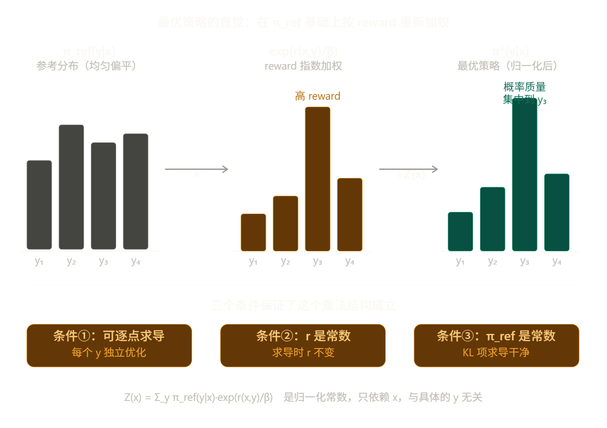
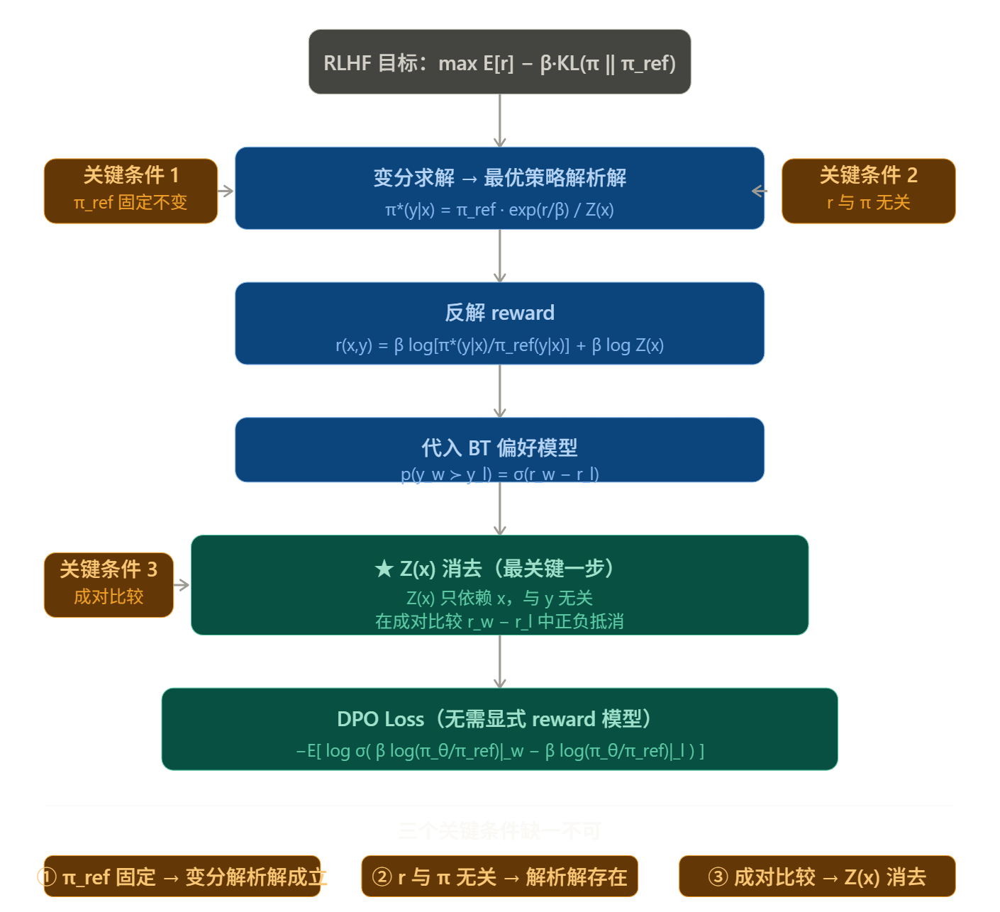

---
tags:
  - 后训练
  - DPO

---

# DPO

> [!INFO] 文档信息
>
> 创建时间：2026-3-13 | 更新时间：2026-3-24
>
> 论文链接 [Direct Preference Optimization: Your Language Model is Secretly a Reward Model](https://arxiv.org/abs/2305.18290)
>

## 核心思路

在 DPO 出现之前，学术界普遍认为要对齐人类偏好，必须经过以下流程：

1. **训练奖励模型 (Reward Model):** 给几万对 `(好回答, 坏回答)`，让一个模型学会打分。
2. **强化学习 (PPO):** 用这个打分模型作为“老师”，通过 PPO 算法不断调整大模型的参数。

**痛点：** PPO 极其难调，不仅吃显存，而且对超参数非常敏感，稍有不慎模型就会崩溃。

于是作者提出了一个大胆的猜想：**一个训练良好的大模型，其输出概率本身就隐藏了“奖励”信息。**

如果模型对回答 A 的概率远高于回答 B，那本质上就意味着模型认为 A 的“奖励值”更高。既然如此，为什么我们还要费劲去训练一个额外的奖励模型呢？

作者通过数学公式证明了**最优奖励函数（Optimal Reward Function）可以完全由模型输出概率的对数比来表达。**

简单来说，他们推导出了一个恒等式，将“奖励值”替换成了“模型概率”。这样一来：

- **过去：** 最小化（模型预测分数与人类打分的差异）。
- **现在：** 最大化（好答案相对于坏答案的胜出概率）。

> 这一步直接把**强化学习**降维打击成了**二分类交叉熵损失（Binary Cross Entropy Loss）**，就像我们训练图片分类器一样简单。

## 数学推导

------

### RLHF 的原始目标

RLHF 想做的事情是：在一个奖励模型 $r(x, y)$ 的指导下优化策略，同时不让策略跑得离参考模型太远：

$$\max_\pi \mathbb{E}*{x \sim \mathcal{D},, y \sim \pi(\cdot|x)}\left[r(x,y)\right] - \beta, \mathbb{D}*\text{KL}\left[\pi(\cdot|x) ,|, \pi_\text{ref}(\cdot|x)\right]$$

这个 KL 项的作用是防止策略"钻空子"——如果没有它，策略会找到一些 reward 很高但毫无意义的奇怪输出。

------

### 求解最优策略

**问题设置**

对于固定的输入 $x$，我们想找一个分布 $\pi(\cdot | x)$，使得下面的目标最大：

$$\mathcal{F}[\pi] = \sum_y \pi(y|x), r(x,y) - \beta \sum_y \pi(y|x) \log\frac{\pi(y|x)}{\pi_\text{ref}(y|x)}$$

同时满足归一化约束：$\sum_y \pi(y|x) = 1$。

注意这里的优化变量是**整个分布** $\pi(\cdot|x)$，也就是对每个可能的输出 $y$，我们要决定分配多少概率质量。

------

**用 Lagrange 乘数法求解**

加入归一化约束，构造 Lagrangian：

$$\mathcal{L}[\pi, \lambda] = \sum_y \pi(y|x)r(x,y) - \beta \sum_y \pi(y|x) \log\frac{\pi(y|x)}{\pi_\text{ref}(y|x)} - \lambda\left(\sum_y \pi(y|x) - 1\right)$$

**对每个特定的 $y$ 取偏导，令其为零：**

$$\frac{\partial \mathcal{L}}{\partial \pi(y|x)} = r(x,y) - \beta\left(\log\frac{\pi(y|x)}{\pi_\text{ref}(y|x)} + 1\right) - \lambda = 0$$

这里出现了三项。现在就是三个条件发挥作用的地方。

---

**条件①：优化变量是整个分布，可以逐点取变分**

上面对 $\pi(y|x)$ 求偏导，隐含的假设是：改变某个 $y$ 处的概率值，**不会直接影响目标函数里其他 $y'$ 处的项**。换句话说，$\pi(y|x)$ 和 $\pi(y'|x)$ 是独立的自由变量（归一化约束单独用 $\lambda$ 处理）。

如果优化变量是神经网络参数 $\theta$，那么改变 $\theta$ 会同时影响所有 $y$ 的概率，各 $y$ 之间通过参数耦合，就**不能逐点求导**，这个解析解就不存在了。

所以这个条件保证了：我们在做的是**函数空间上的优化**，而不是参数空间上的优化。

------

**条件②：reward 只是 $(x,y)$ 的函数，与策略无关**

对 $\pi(y|x)$ 求导时，$r(x,y)$ 那一项直接给出：

$$\frac{\partial}{\partial \pi(y|x)}\left[\pi(y|x)\cdot r(x,y)\right] = r(x,y)$$

这成立的前提是 $r(x,y)$ 是个**常数**，与 $\pi(y|x)$ 无关。

如果 $r$ 依赖于策略——比如 SAPO 里 advantage 是当前这批采样归一化的结果——那么求导时还会多出一项 $\frac{\partial r}{\partial \pi(y|x)}$，方程变成：

$$r(x,y) + \pi(y|x)\frac{\partial r}{\partial \pi(y|x)} - \beta\left(\log\frac{\pi(y|x)}{\pi_\text{ref}(y|x)} + 1\right) - \lambda = 0$$

这个方程对 $\pi(y|x)$ 不再有干净的解析解，因为左边两项都含有 $\pi(y|x)$，无法分离。

------

**条件③：$\pi_\text{ref}$ 固定不变**

KL 散度展开后，对 $\pi(y|x)$ 求导给出：

$$\frac{\partial}{\partial \pi(y|x)}\left[-\beta,\pi(y|x)\log\frac{\pi(y|x)}{\pi_\text{ref}(y|x)}\right] = -\beta\left(\log\frac{\pi(y|x)}{\pi_\text{ref}(y|x)} + 1\right)$$

这里用到了乘积法则：

$$\frac{\partial}{\partial \pi}\left[\pi \log\frac{\pi}{\pi_\text{ref}}\right] = \log\frac{\pi}{\pi_\text{ref}} + \pi \cdot \frac{1}{\pi} = \log\frac{\pi}{\pi_\text{ref}} + 1$$

这个计算成立的关键是：求导时 $\pi_\text{ref}(y|x)$ 是**常数**，所以 $\frac{\partial \pi_\text{ref}}{\partial \pi} = 0$。

如果 $\pi_\text{ref}$ 也依赖于 $\pi$（比如它就是 $\pi$ 本身的某个历史版本，且我们把这种依赖计入图中），那么求导时还需要考虑 $\pi_\text{ref}$ 对 $\pi$ 的导数，整个 KL 项的导数形式就变了，方程无法干净求解。

------

三个条件都满足，偏导数方程是：

$$r(x,y) - \beta\log\frac{\pi(y|x)}{\pi_\text{ref}(y|x)} - \beta - \lambda = 0$$

把含 $\pi(y|x)$ 的项移到一边：

$$\beta\log\frac{\pi(y|x)}{\pi_\text{ref}(y|x)} = r(x,y) - \beta - \lambda$$

两边除以 $\beta$，取指数：

$$\frac{\pi(y|x)}{\pi_\text{ref}(y|x)} = \exp\left(\frac{r(x,y) - \beta - \lambda}{\beta}\right) = \exp\left(\frac{r(x,y)}{\beta}\right)\cdot\exp\left(\frac{-\beta-\lambda}{\beta}\right)$$

后面那个因子不含 $y$，记作常数 $C$：

$$\pi^*(y|x) = C \cdot \pi_\text{ref}(y|x)\cdot\exp\left(\frac{r(x,y)}{\beta}\right)$$

最后用归一化条件 $\sum_y \pi^*(y|x) = 1$ 确定 $C$：

$$C = \frac{1}{\sum_y \pi_\text{ref}(y|x)\exp\left(\frac{r(x,y)}{\beta}\right)} = \frac{1}{Z(x)}$$

得到最终结果：

$$\boxed{\pi^*(y|x) = \frac{1}{Z(x)}\pi_\text{ref}(y|x)\exp\left(\frac{r(x,y)}{\beta}\right)}$$

------

**直觉理解**

直觉上，最优策略做的事情非常简单：**把 $\pi_\text{ref}$ 作为基底，按照 $\exp(r/\beta)$ 对每个 $y$ 重新加权，再归一化**。

- $\beta$ 大：$\exp(r/\beta)$ 接近 1，最优策略接近 $\pi_\text{ref}$，KL 惩罚主导
- $\beta$ 小：$\exp(r/\beta)$ 差异悬殊，最优策略几乎把所有质量压到 reward 最高的 $y$ 上，reward 主导

这个结构之所以这么干净，完全是因为三个条件保证了求导方程里每个 $y$ 之间互不干扰——方程对每个 $y$ 独立成立，于是解也对每个 $y$ 独立写出来，最后只需一个归一化常数 $Z(x)$ 收尾。

------

### 反解 reward

从上面的解析解，两边取对数，把 $r(x,y)$ 解出来：

$$r(x,y) = \beta\log\frac{\pi^*(y|x)}{\pi_\text{ref}(y|x)} + \beta\log Z(x)$$

这一步是**纯代数变换**，没有任何额外假设。它的意思是：如果我们知道最优策略长什么样，就可以反推出对应的 reward。

------

### 引入 Bradley-Terry 偏好模型

RLHF 的另一半是：我们没有直接的 reward 标注，只有人类的**成对偏好**数据 $y_w \succ y_l$。BT 模型假设：

$$p(y_w \succ y_l \mid x) = \sigma\left(r(x, y_w) - r(x, y_l)\right)$$

现在把第三步的 $r$ 代入：

$$p(y_w \succ y_l \mid x) = \sigma\left(\beta\log\frac{\pi^*(y_w|x)}{\pi_\text{ref}(y_w|x)} + \beta\log Z(x) - \beta\log\frac{\pi^*(y_l|x)}{\pi_\text{ref}(y_l|x)} - \beta\log Z(x)\right)$$

**关键时刻**：$\beta \log Z(x)$ 在两项里符号相反，直接消掉：

$$p(y_w \succ y_l \mid x) = \sigma\left(\beta\log\frac{\pi^*(y_w|x)}{\pi_\text{ref}(y_w|x)} - \beta\log\frac{\pi^*(y_l|x)}{\pi_\text{ref}(y_l|x)}\right)$$

$Z(x)$ 能消掉，是因为它**只依赖于 $x$，与 $y$ 无关**，在成对比较里自然抵消。这是整个推导里最关键的一步。

------

## DPO Loss

用参数化的 $\pi_\theta$ 替换 $\pi^*$，对偏好数据做最大似然估计，取负对数得到：

$$\boxed{\mathcal{L}*\text{DPO}(\theta) = -\mathbb{E}*{(x,y_w,y_l)}\left[\log\sigma!\left(\beta\log\frac{\pi_\theta(y_w|x)}{\pi_\text{ref}(y_w|x)} - \beta\log\frac{\pi_\theta(y_l|x)}{\pi_\text{ref}(y_l|x)}\right)\right]}$$

---

### 推导成立的关键点

三个关键条件展开说：

**条件①：$\pi_\text{ref}$ 固定不变** 变分求解的过程中，我们把 $\pi_\text{ref}$ 当作常数处理。如果参考点在训练中移动（比如 SAPO 里的 $\pi_{\theta_\text{old}}$），那么"最优策略"本身就是一个移动靶，解析解在下一步就失效了。

**条件②：reward 与策略无关** RLHF 假设 $r(x,y)$ 是人类偏好的固有属性，和当前策略是谁无关。这保证了变分法里对 $\pi$ 求导时，$r$ 是个常数，整个最优化问题是凸的，解析解才能干净地写出来。SAPO 的 advantage 是 group 内归一化的，依赖于当前这批采样，不满足这一条。

**条件③：成对比较让 $Z(x)$ 消去** 这是整个推导最精妙的地方。$Z(x)$ 是个关于 $x$ 的求和，根本无法计算（词表指数级大）。但因为 BT 模型用的是**差值** $r_w - r_l$，而 $Z(x)$ 对 $y_w$ 和 $y_l$ 完全相同，一减就没了。这个消去不是凑巧，而是成对比较结构的必然结果

