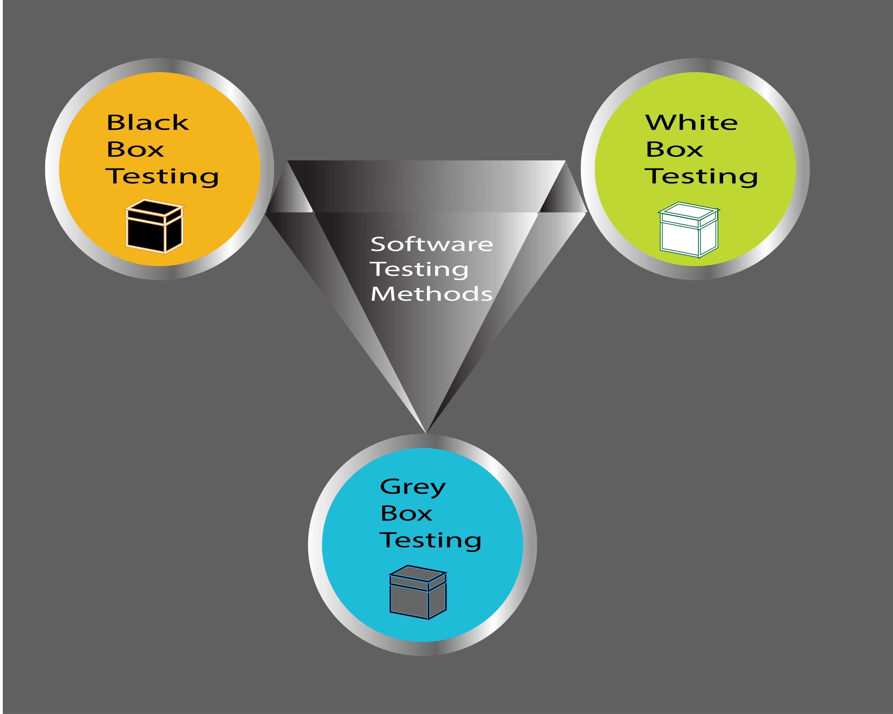

# 软件测试与质量保证

软工三大狗史课程之一，感觉是锻炼讲故事能力

## 引言

简单来说，**软件测试**和**质量保证（QA）**就像是“体检”与“养生”的关系。虽然大家经常把它们混为一谈，但它们在软件开发中扮演着不同的角色。

------

**软件测试 (Software Testing)** 

软件测试是**产品导向**的，属于“事后检验”。它的主要任务是运行软件，发现 Bug，确保软件的行为符合预期的功能。

- **核心逻辑：** 通过各种手段（点点点、写脚本）去攻击或使用软件，看看它会不会崩溃，或者结果对不对。
- **动作：** 编写测试用例、执行测试、提交 Bug 报告、回归测试（确认 Bug 修复了）。
- **例子：** “我点这个登录按钮，系统有没有报错？加载速度快不快？”

**质量保证 (Quality Assurance, QA)** 

QA 是**过程导向**的，属于“事前预防”。它的目标不是去找具体的 Bug，而是通过改善开发流程，确保“生产软件的方法”是正确的，从而降低出 Bug 的概率。

- **核心逻辑：** 只要流程是规范的、评审是严格的、工具是先进的，产出的产品质量自然就有保证。
- **动作：** 制定规范、流程审计（Audit）、代码评审（Code Review）、人员培训、选择合适的开发模型。
- **例子：** “我们在写代码之前，需求文档是否经过了三方评审？开发人员是否都做了单元测试？”

------

**两者的核心区别**

| **维度**       | **软件测试 (Testing/QC)**      | **质量保证 (QA)**        |
| -------------- | ------------------------------ | ------------------------ |
| **主要目标**   | **发现**缺陷                   | **预防**缺陷             |
| **关注对象**   | **产品**本身 (Product)         | **流程**和体系 (Process) |
| **执行阶段**   | 主要是开发中后期（代码写好后） | 贯穿整个软件生命周期     |
| **性质**       | 被动的、纠正性的               | 主动的、预防性的         |
| **一句话总结** | “这个东西做对了吗？”           | “我们做东西的方法对吗？” |

------

**它们是如何协作的？**

在实际工作中，它们是**包含关系**。

1. **QA（质量保证）** 是最大的圆圈，它涵盖了所有为了提高质量而做的管理活动。
2. **QC（质量控制，包含测试）** 是其中的一个环节，通过具体的检查手段来验证 QA 流程的效果。

如果你要开始学习：

- **初级阶段**：通常从“软件测试”入手，学习如何写测试用例、如何使用自动化工具。
- **高级阶段**：你会慢慢接触到“质量保证”，去思考如何通过改进团队的协作方式、自动化流水线（CI/CD）来全面提升软件质量。

## 课程安排

**系统级 (System Level)**

这是站在“用户”和“业务”的角度，观察整个软件系统的表现。

**功能性：质量保证基本框架 & 测试流程**

- **QA 框架：** 并不只是找 Bug，而是建立一套规则（比如代码怎么写、文档怎么存），确保开发过程不出乱子。
- **测试流程：** 规定了从需求分析、编写测试用例、执行测试到最后提交报告的标准化步骤。

**非功能性：自动化测试 & 非功能测试**

- **自动化测试：** 用脚本代替人工点点点，提高效率，尤其是回归测试（确保改了 A 没坏 B）。
- **非功能测试：** 关注系统“好不好用”，比如性能测试（系统能撑住一万人同时在线吗？）、安全性测试（会被黑客攻击吗？）。

**单元级 (Unit Level)**

这是站在“程序员”和“代码”的角度，深入到系统的零件内部。

**功能性：白盒测试 (White-Box Testing)**

- 测试人员可以看到源代码。就像修车时打开发动机盖，检查每一个齿轮和电路是否按逻辑运行。

**非功能性：评估 & 智能化系统测试方法论**

- **评估：** 对代码的质量进行打分（比如复杂度是否太高）。
- **智能化方法：** 利用 AI 或大数据手段来预测哪些代码块容易出错，或者自动生成复杂的测试数据。

------

### 核心概念对比

| **维度**   | **功能性 (Functional)**          | **非功能性 (Non-functional)**         |
| ---------- | -------------------------------- | ------------------------------------- |
| **关注点** | 软件**能做什么**？(What it does) | 软件**运行得如何**？(How it performs) |
| **例子**   | 点击“登录”能否进入主页           | 登录过程是否在 1 秒内完成             |

| **维度** | **系统级 (System)** | **单元级 (Unit)**      |
| -------- | ------------------- | ---------------------- |
| **视角** | 外部、黑盒、整体    | 内部、白盒、细节       |
| **目标** | 确保业务流程通畅    | 确保每一行代码逻辑正确 |

------

##  软件质量与保证的基本概念

觉得空洞是很正常的，因为基础理论往往比较抽象。为了让知识“落地”，我们需要看那些直接影响工作产出和职业判断的内容。

根据 PPT 的逻辑，最关键、最不空洞的部分其实是**缺陷引入的阶段性**、**McCall 模型的具体指标**以及 **QA 与测试的本质差异**。以下是深度解析：

------

 **为什么“提早测试”是金律？（缺陷代价）**

这是测试行业存在的根本原因。PPT 中有两组核心数据揭示了残酷的现实：

- **缺陷的源头**：大部分 Bug 并不是代码写错了。**50%** 的缺陷源于需求理解不足，**30%** 源于设计翻译错误，只有 **20%** 是真正的编码错误 1。
- **修复代价的爆炸式增长**：
  - 在**需求阶段**发现一个逻辑错误，改一下文档可能只需要 $5。
  - 在**编程阶段**发现，需要改代码，成本提升 2。
  - 如果到了**线上运行阶段（In service）**才发现，可能需要停服维护、数据回滚、公关处理，成本飙升至数百甚至数千美元 3。
  - **核心结论**：测试人员的价值在于“尽早介入”，在需求评审阶段揪出那 50% 的问题 4。

------

**McCall 质量模型：如何具体描述“好”？**

当你评价一个软件“质量好”时，不能只说“没 Bug”。PPT 提到的 McCall 模型给了你一套专业术语：

**最常用的指标**：

- **正确性 (Correctness)**：是否完全实现了需求文档里的每一项功能。
- **可靠性 (Reliability)**：系统能不能长时间稳定运行，不闪退、不崩溃。
- **易用性 (Usability)**：用户学习和操作这个软件需要费多大劲。

**容易被忽视但重要的指标**：

- **可测试性 (Testability)**：这个代码写得好不好测试？如果代码写得像一团乱麻，根本没法拆分测试，那它的质量评价就会降低 8。
- **效率 (Efficiency)**：完成同样的功能，你的程序是占了 10MB 内存还是 1GB 内存 

------

**QA 与测试：身份的本质区别**

在面试或工作中，区分这两个身份非常重要：

**测试 (Test) 是“执行者”**：

- 目标是**发现**缺陷。
- 它是**产品/交付物**导向的，也就是针对已经做出来的东西进行检查。

**质量保证 (QA) 是“监督者/建制派”**：

- 目标是**预防**缺陷 。
- 它是**过程/策略**导向的 13。QA 会问：“我们的开发流程对不对？是不是每个人都做了代码审查？为什么同一个地方总出 Bug？” 
- **关系**：QA 定义规则，测试在规则下执行验证

---

**评估 (Evaluation)：除了找 Bug 还能做什么？**

PPT 强调了 QA 包含“评估”这一重要环节，这比单纯的测试更专业：

**需求的评估**：用评分模型看需求逻辑是否闭环。

**设计的评估**：例如“容量规划”，在系统还没做出来前，评估当前的架构能不能支撑未来的用户量。

**代码的评估**：不运行程序，直接看代码有没有“代码异味（Code Smell）”或不规范的地方。

------

### 软件测试的分类

这一部分是软件测试中最核心的“工具箱”。PPT 从三个主要的维度对测试进行了分类，帮你理清在不同阶段、用什么手段去解决什么问题 

------

**按测试方法划分（你怎么看被测物？）**

这是最基础的分类，决定了你测试时的“视角” 。

- **黑盒测试 (Black-Box Testing)**：把程序看作一个黑盒子，完全不看内部代码，只关心**输入**和**输出** 3333。主要方法包括等价类划分、边界值分析等 。

- **白盒测试 (White-Box Testing)**：测试人员可以看见源代码，关注内部逻辑结构 5555。你会去检查语句覆盖、条件覆盖或路径覆盖，确保每一行代码都跑过。

- **灰盒测试 (Grey-Box Testing)**：介于两者之间，既关注接口的输入输出，也参考内部的设计逻辑。

  

- Shutterstock

------

**按测试粒度/阶段划分（你在什么时候测？）**

这是测试的“层级结构”，通常对应经典的 **V 模型** 。

- **单元测试 (Unit Test, UT)**：最小单位的测试，通常由开发人员编写，针对函数或模块。

- **集成测试 (Integration Test, IT)**：把不同的模块拼在一起，测试它们之间的接口是否通畅。

- **系统测试 (System Test, ST)**：把整个软件安装到真实环境里，测试整套业务流程。

- **验收测试 (Acceptance Test, AT)**：最后关卡，确认软件是否达到了客户最初要求的样子。

  

- 

------

**按软件评价标准划分（你关注什么品质？）**

除了功能对不对，还要看软件“强不强” 。

- **功能性测试 (Functional Test)**：验证功能是否按需求实现。
- **性能测试 (Performance Test)**：测试高并发下的响应速度和吞吐量。
- **安全性测试 (Security Test)**：检查是否存在漏洞、权限泄露等安全隐患。
- **高可用/恢复测试 (Recovery Test)**：测试系统崩溃后能不能快速自动恢复。

------

#### 两个特别重要的“状态”测试

在流程中，这两个词你以后会天天听到：

- **冒烟测试 (Smoke Test)**：在正式大规模测试前，先跑一下主流程。如果主流程都挂了，就直接退回版本，不再浪费时间。
- **回归测试 (Regression Test)**：当你修复了一个 Bug 或加了新功能后，把以前测过的内容再测一遍，确保没有“改好一个，改坏三个” 

------

**$\alpha$ 测试 vs $\beta$ 测试**

- **$\alpha$ 测试**：由开发团队内部在模拟环境下进行，覆盖面广，手段多（黑白盒都有）。
- **$\beta$ 测试**：把软件交给真实的最终用户，在真实环境下使用，主要关注功能好不好用（黑盒测试）。

------

### 软件开发与测试流程

在 PPT 中，这一块解决的核心问题是：什么时候、什么人、做什么事、产出什么？

------

流程不仅仅是步骤，它是一套**运行方式**和**产出物定义**。

- **消除混乱**：定义每个阶段的先后次序、角色分工。
- **质量可控**：通过定义“准入准出”标准（Entry/Exit Criteria），确保不把烂摊子甩给下一阶段。

#### V-Model

这是 PPT 中重点介绍的模型，它最伟大的地方在于**建立了开发与测试的对应关系**。

Shutterstock

**左侧：自顶向下的开发**（需求分析 -> 系统设计 -> 详细设计 -> 编码）。

**右侧：自底向上的测试验证**：

- **单元测试 (Unit Test)**：验证代码实现是否符合详细设计。
- **集成测试 (Integration Test)**：验证各模块拼接后是否符合概要设计。
- **系统测试 (System Test)**：验证整个系统是否符合功能规格说明。
- **验收测试 (Acceptance Test)**：验证系统是否真正满足客户的需求协议 (RFP) 。

---

#### **Test Life Cycle**

一个完整的测试流程包含以下具体步骤 ：

1. **计划阶段**：确定目标、估算人力、制定策略和进度计划 。

2. **设计阶段**：分析需求的可测性，编写测试用例，设计自动化脚本。

3. **执行阶段**：搭建环境，进行**冒烟测试**，然后正式执行测试用例并跟踪 Bug。

4. **总结阶段**：收集数据，分析覆盖率，编写测试报告，并提出过程改进建议。

   

#### 核心产出物

PPT 提到，文档化虽然是附加产出，但往往也是最重要的产出 ：

- **测试计划 (Test Plan)**：解决“测什么、谁来测、进度如何”的问题。

- **测试用例 (Test Case)**：解决“怎么测”的问题（输入、执行步骤、预期结果。

- **测试报告 (Test Report)**：解决“现在质量如何、处于什么位置、下一步怎么办”的问题。

  

**产出物的内在逻辑：可追溯性 (Traceability)**

这是一个非常专业的概念。PPT 用**金字塔模型**展示了：

- 每一个**测试用例**都应该能追溯到一个**需求点**。
- 如果需求变了，你能立刻知道哪些用例要改；如果某个用例失败了，你能立刻知道哪个业务功能受影响 。

------

### 敏捷开发

> [!note]
>
> 非常推荐大家看看这个视频 [我们都只是在假装着做Agile](https://www.bilibili.com/video/BV1N2tpztEP2?vd_source=cb431a1b7c21317a45f4c22eb43f0e59) 讲了敏捷开发的历史和问题

根据 PPT 的内容，敏捷（Agile）概念的提出是为了应对传统瀑布模型在反馈速度和适应性上的不足。敏捷开发强调迭代、协作和快速响应变化。

**敏捷开发（Agile）的核心思想**

敏捷不仅仅是一种开发方法，更是一系列价值观的集合。

- **短周期迭代**：将庞大的项目拆分成多个短小的周期进行交付。
- **协作与沟通**：强调跨部门协作、建立清晰的沟通渠道以及定期的团队会议。
- **文档简化**：提倡“最少文档（Minimal Documentation）”，将精力集中在可运行的软件上。

---

**Scrum：团队协作的框架**

Scrum 是敏捷中最流行的框架，它定义了团队如何高效协作。

- **角色与分工**：虽然 PPT 未详列所有角色，但强调了定义角色和分工在流程中的重要性。

- **Sprint（冲刺）**：通常为 2-4 周的一个固定周期。

- **核心动作**：

  - **Product Backlog**：待办事项清单（用户故事）

  - **Daily Scrum Meeting**：每 24 小时进行一次的站立会议，沟通进度和障碍 。

  - **Sprint Backlog**：本次冲刺要完成的任务清单 。

    Shutterstock

---

**XP (Extreme Programming, 极限编程)**

XP 是一套针对编程实践的敏捷方法论，旨在通过高频率的反馈提高质量。

**核心实践**：

- **Pair Programming（结对编程）**：两人一组写代码，互相审计。
- **Continuous Integration（持续集成）**：频繁地将代码合并到主干并进行自动化测试。
- **Refactoring（重构）**：在不改变外部行为的前提下优化代码结构。

---

**TDD (Test-Driven Development, 测试驱动开发)**

这是敏捷开发中极具颠覆性的测试实践：

- **先写测试，后写代码**：在实现功能之前，先编写针对该功能的自动化测试用例。
- **红-绿-重构循环**：
  1. 写一个失败的测试（红色） 。
  2. 编写最少的代码让测试通过（绿色）。
  3. 优化代码（重构）。
- **优势**：通过测试来指导设计，确保每一行代码都是为了满足需求而写，且生来就有测试覆盖。

------

> [!tip]
>
> 关于最前面b站视频指出的问题，gemini的回答
>
> 感觉这些想法太理想化了啊，比如这个daily standup 大家的工作又不是互通的，为啥要知道别人在干啥？而且语音而不是文字交流也是问题，然后这个配对编码，也很难实践，需要很强沟通能力，而且最重要的是，敏捷开发一个周期需要预估开发时间，这个是很难准确估计的
>
> 
>
> 这些痛点正是**敏捷开发在实际落地中经常变成“敏捷灾难”的原因**。
>
> PPT 中提到的这些方法论（Scrum、XP 等）确实提供了一个理想框架 1，但在现实开发中，它们必须经过大量的调整才能生效。
>
> 针对你提出的几个“理想化”疑点，我们可以结合 PPT 中提到的**过程改进（Process Improvement）**思路来深度解析：
>
> ------
>
> **关于 Daily Standup（站立会议）的“互不通”**
>
> 你说的没错，如果大家各做各的，开会就是浪费时间。但在敏捷的逻辑里：
>
> - **初衷**：不是为了“汇报工作”，而是为了**发现风险**比如，如果 A 发现某底层接口变了，而 B 刚好在调用，这种“互通”就能避免 B 白写一整天的代码。
> - **PPT 的改进建议**：建立清晰的沟通渠道和使用协作工具。如果项目分工完全解耦，确实不需要全员同步，很多团队会改成“小组同步”或者直接在看板上异步查看进度。
>
> **关于结对编程（Pair Programming）的门槛**
>
> 这种模式在 XP（极限编程）中被推崇，但确实极难推广 。
>
> - **现实难点**：正如你所说，它对沟通能力要求极高，且两名开发者如果水平差异过大，会变成“一人写，一人看手机”。
> - **折中方案**：PPT 提到了一些替代手段，比如**代码审查（Code Review）\**或\**静态测试** 。与其两个人坐在一起写，不如写完后让别人审查，这样既达到了质量保证（QA）的目的，又降低了沟通成本。
>
> **关于“开发时间预估不准”的痼疾**
>
> 这是软件工程最经典的问题。PPT 在测试流程部分专门提到了**测试估算（Test Estimation）**和**回溯（Backtracking）**的概念 
>
> **敏捷的应对方案**：
>
> - **短周期迭代**：与其预估一年的计划，不如只预估接下来 2 周（Sprint）的事情。周期越短，误差通常越小。
> - **反馈机制**：通过定期回顾与反思（Sprint Retrospective），根据上一周期的“实际速度”来调整下一周期的计划。
> - **质量评估模型**：PPT 提到使用**容量规划（Capacity Planning）**和基于数据的决策，试图通过数学模型和历史数据来让预估变得相对客观。
>
> ------
>
> 流程是为了解决问题，而不是制造问题
>
> PPT 在第 277 页问了一个核心问题：**“我们要流程干什么？”** 答案是：**“为了知道什么时候、什么人、做什么事；以及遇到问题怎么解决。”** 
>
> 如果某个流程（比如 Daily Standup）在你的团队里没解决问题反而制造了麻烦，那就属于 PPT 提到的**过程改进**范畴——你需要根据团队现状去**定义工作流** 
>
> ------
>
> 你会发现，测试人员在这个过程中扮演了“定海神针”的角色：
>
> 不管开发流程怎么乱、预估怎么不准，只要**测试准入准出标准（EC1/EC2）**卡死，烂代码就进不来，烂产品就出不去 