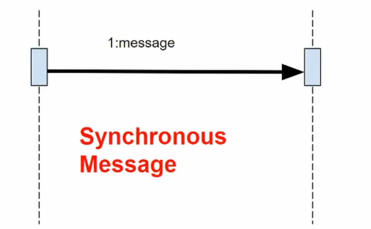
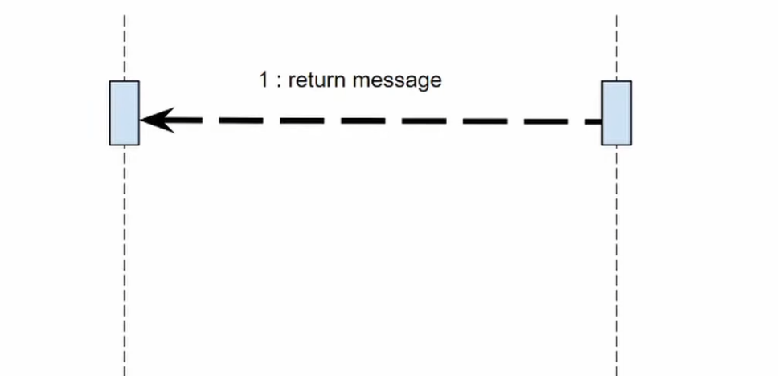
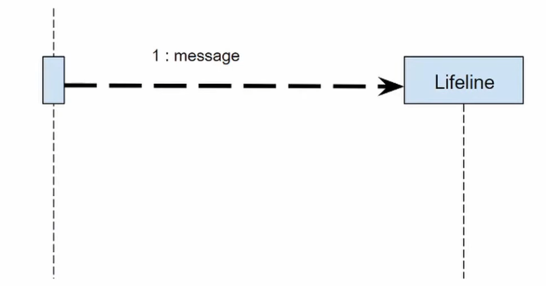

# UML 序列图

!!! info "文档信息"
    
    创建时间：2025-11-28
    
    可以查看 [UML Sequence Diagram Tutorial](https://www.youtube.com/watch?v=YcVugSF_fxM&list=PLJlDQmEdjHZYrtdwL0SHZseRSp_F0oOPN&index=12) 视频学习

## 术语对照表

| 中文 | 英文 |
|------|------|
| 序列图 | Sequence Diagram |
| 对象 | Object |
| 生命线 | Lifeline |
| 激活框 | Activation Box |
| 消息 | Message |
| 同步消息 | Synchronous Message |
| 异步消息 | Asynchronous Message |
| 返回消息 | Return Message |
| 自调用 | Self Message |
| 创建消息 | Create Message |
| 销毁消息 | Destroy Message |
| 组合片段 | Combined Fragment |
| 交互框架 | Interaction Frame |

## 1 目标

设计 UML 序列图往往出于以下的目标：

- **展示对象交互**：清晰地展示系统中对象之间的交互顺序和时序。
- **描述消息流**：明确对象之间如何通过消息进行通信。
- **理解系统行为**：帮助理解特定场景下系统的动态行为。
- **设计时序逻辑**：辅助设计和验证系统的时序逻辑和调用关系。
- **文档化交互过程**：为开发和维护提供清晰的交互文档。

## 2 组成

序列图主要由以下几个元素组成：

### 2.1 对象和生命线

- **对象（Object）**：
  - **定义**：表示参与交互的实体，可以是类的实例、参与者或系统组件。
  - **表示**：用**矩形框**表示，格式为 `对象名:类名`。
- **生命线（Lifeline）**：
  - **定义**：表示对象在时间序列中的存在。
  - **表示**：从对象框向下延伸的**垂直虚线**。

### 2.2 激活框

- **激活框（Activation Box）**：
  - **定义**：表示对象执行操作或处于活动状态的时间段。
  - **表示**：在生命线上用**细长的矩形**表示。

!!! example "生命线和激活框示例"

    当对象正在执行某个操作或处理某个消息时，在其生命线上显示一个激活框。激活框的高度表示执行的时长。
    

### 2.3 消息类型

- **同步消息（Synchronous Message）**：
  - **定义**：发送者发送消息后，必须等待接收者处理完毕并返回结果。
  - **表示**：用**实线箭头**（箭头为实心三角形）连接两个对象。
  - **特点**：阻塞调用，调用方需要等待响应。

!!! example "同步消息示例"

    典型的方法调用就是同步消息。例如，客户端调用服务器的某个方法，必须等待服务器返回结果才能继续执行。
    

- **异步消息（Asynchronous Message）**：
  - **定义**：发送者发送消息后，无需等待接收者处理完毕，可以继续执行。
  - **表示**：用**实线箭头**（箭头为开放式箭头）连接两个对象。
  - **特点**：非阻塞调用，调用方不需要等待响应。

!!! example "异步消息示例"

    例如发送电子邮件、触发事件通知等，发送方不需要等待接收方处理完成。

- **返回消息（Return Message）**：
  - **定义**：表示方法调用的返回值或响应。
  - **表示**：用**虚线箭头**连接，从被调用对象指向调用对象。
  - **特点**：通常可以省略，因为同步消息隐含了返回。

!!! example "返回消息示例"

    当需要明确显示返回值或返回的时机时，使用返回消息。
    

- **自调用（Self Message）**：
  - **定义**：对象调用自己的方法。
  - **表示**：从对象的生命线发出，再指向自己的**循环箭头**。

!!! example "自调用示例"

    对象内部调用自己的私有方法时，使用自调用表示。
    

- **创建消息（Create Message）**：
  - **定义**：表示创建一个新对象的消息。
  - **表示**：用**虚线箭头**指向被创建对象，箭头标注 `<<create>>`。
  - **特点**：被创建的对象位置略低于发送者。

!!! example "创建消息示例"

    当一个对象创建另一个对象的实例时使用，箭头指向新对象的对象框而不是生命线。
    

- **销毁消息（Destroy Message）**：
  - **定义**：表示对象被销毁或生命周期结束。
  - **表示**：在生命线末端用**"X"符号**表示。

!!! example "销毁消息示例"

    表示对象不再存在，通常在手动内存管理或显式销毁对象的场景中使用。
    

### 2.4 组合片段

- **组合片段（Combined Fragment）**：
  - **定义**：用于表示条件、循环等控制结构。
  - **常见类型**：
    - **alt（Alternative）**：条件分支，类似 if-else
    - **opt（Optional）**：可选执行，类似 if
    - **loop（Loop）**：循环执行
    - **par（Parallel）**：并行执行
    - **ref（Reference）**：引用另一个序列图
  - **表示**：用**矩形框**包围相关的消息，左上角标注类型。

!!! example "组合片段示例"

    **alt（条件分支）示例**：
    
    - 用于表示"如果...否则..."逻辑
    - 框内用水平虚线分隔不同的条件分支
    - 每个分支可以有一个条件表达式
    
    **loop（循环）示例**：
    
    - 用于表示重复执行的操作
    - 可以在框上标注循环条件，如 `loop [for each item]`
    
    **opt（可选）示例**：
    
    - 用于表示可能执行也可能不执行的操作
    - 类似于只有 if 没有 else 的情况
    
    

!!! example "完整示例"

    下面给出一个完整的Sequence Diagram示例：
    
    1. 用户发送搜索作者名字的**同步查询**到Search Page对象
    2. Search Page自调用检查查询是否合法
    3. 进入alt组合片段
    
    	1. 如果查询合法，那么向Catalog发送搜索请求，Catalog创建一个Search Result对象，最后返回结果到Search Result Page展示
    	2. 如果查询不合法，Search Page自调用显示错误信息
    	
    
## 3 绘制步骤

绘制序列图的一般步骤：

1. **识别参与者**：确定参与交互的所有对象和参与者
2. **确定交互场景**：明确要展示的具体用例或场景
3. **绘制对象**：在图的顶部绘制所有参与对象
4. **添加生命线**：为每个对象添加生命线
5. **绘制消息**：按时间顺序从上到下绘制消息
6. **添加激活框**：在对象处理消息期间添加激活框
7. **添加控制结构**：使用组合片段表示条件和循环
8. **标注说明**：为复杂的交互添加必要的注释

## 4 最佳实践

- **保持简洁**：一个序列图应该专注于一个特定的场景或用例
- **从左到右排列**：按照调用顺序将对象从左到右排列
- **时间从上到下**：消息的时间顺序从上到下
- **明确命名**：使用清晰的对象名和消息名
- **适度使用返回消息**：只在必要时显示返回消息，避免图表过于复杂
- **分解复杂交互**：对于复杂的交互，考虑使用 ref 引用其他序列图

## 5 应用场景

序列图常用于以下场景：

- **API 调用流程**：展示客户端和服务器之间的 API 调用顺序
- **业务流程**：描述业务逻辑的执行顺序
- **系统交互**：展示多个系统组件之间的协作
- **用例实现**：详细描述用例的具体实现过程
- **异常处理**：展示异常情况下的处理流程
- **并发场景**：描述多线程或并发执行的情况

!!! tip "提示"

    序列图是动态建模中最常用的 UML 图之一，特别适合用于理解和设计系统的交互行为。在实际开发中，序列图常用于设计评审、代码审查和技术文档编写。

